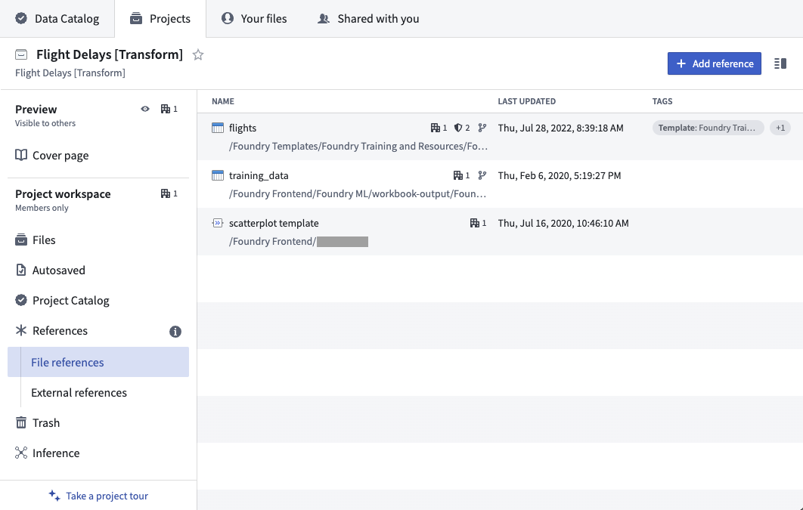
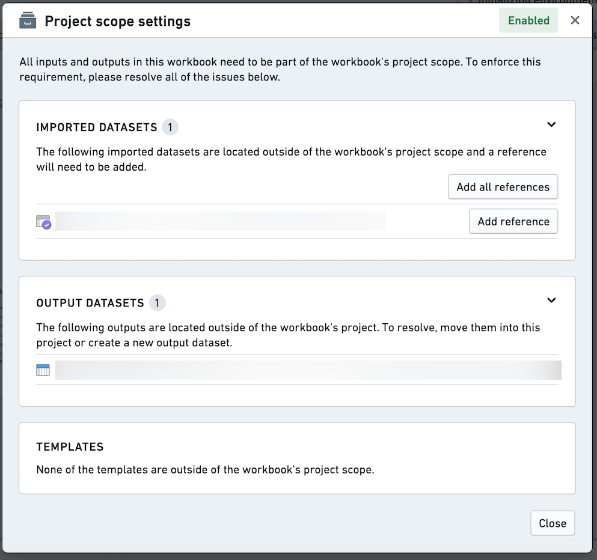
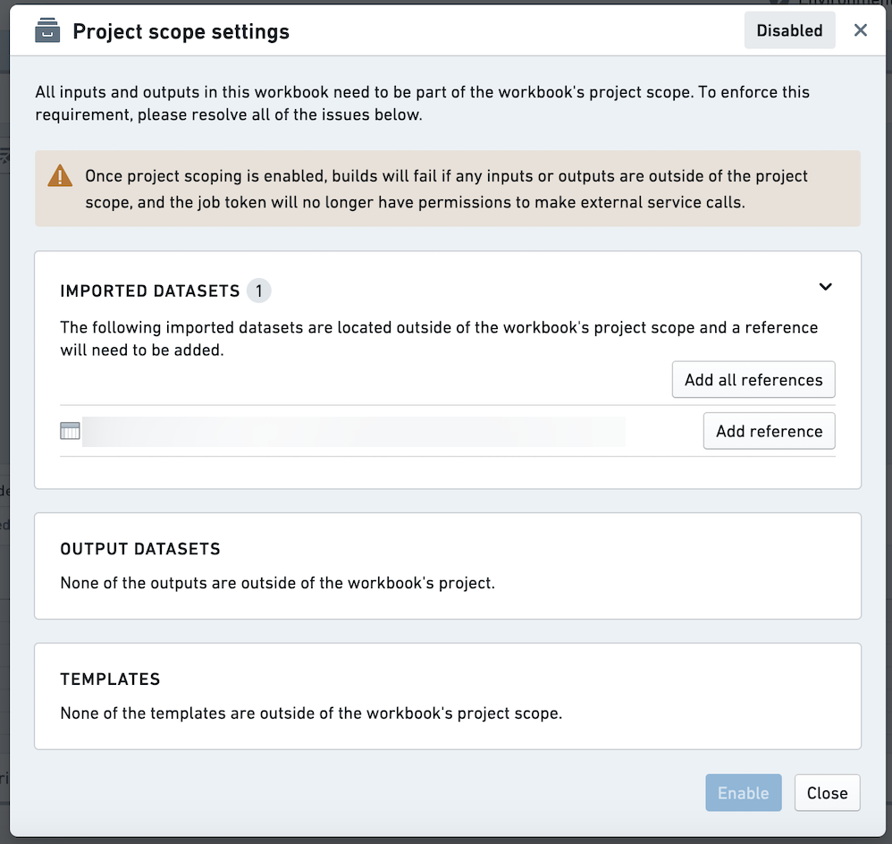

<!-- source: https://palantir.com/docs/foundry/code-workbook/project-references/ · mirrored 2026-08-26 from Palantir Foundry docs -->

# Project references

In Foundry, [Projects](/docs/foundry/compass/move-and-share-resources/) define both a conceptual boundary around related work, and a security boundary for applying and managing access. Using data across project boundaries must be treated with extra care.

## Referencing a resource

Project references provide a mechanism for users with higher permissions - typically the owners of a dataset or pipeline - to allow the discovery and use of data in other projects. They add an increased layer of scrutiny for moving data between projects by explicitly acknowledging when a dataset is imported into a project.

To reference a resource, go to the [Project navigation panel](/docs/foundry/compass/move-and-share-resources/) at the root level of the project. Click the **+Add** button to add a reference to a dataset or template. In the below image, the datasets `flights` and `training_data` and the Code Workbook template `scatterplot template` are added as references in the project. This means that Code Repositories and Code Workbooks in the project can use `flights` and `training_data` as an input, and the `scatterplot template` template can be used by Code Workbooks in the project.

* To reference a resource, you must have `compass:import-resource-from` on the resource (usually expanded from the Viewer role) and `compass:import-resource-to` on the destination project (usually expanded from the Editor role).
* These roles can be customized using Custom Roles.

## Project-scoped Workbooks

All new Code Workbooks are project scoped, meaning they respect project boundaries and use a token scoped to the project.

In a project-scoped workbook:

* All input datasets and templates must be in project scope: they must be in the same project as the workbook, or added as a reference in the project.
* All output datasets must be in the same project as the workbook.
* API calls to Foundry services using the job token will fail.

If there are any noncompliant inputs or outputs in a project-scoped workbook, those transforms will fail to build and their job specs will not update.

In a project-scoped workbook, noncompliant inputs and outputs will be listed in the project scope dialog. If you have the necessary permissions, you can add references to out-of-scope input datasets and templates from the dialog. Alternatively, you can use the Project Summary Panel at the root of the project.

In a project-scoped workbook, noncompliant inputs and outputs are also denoted with a red icon.

## Enabling project scoping on your workbook

For workbooks created prior to project scoping being enabled by default, you will be prompted to enable project scoping. The project scope dialog will list the non-compliant inputs and outputs on the selected branch. You must resolve these issues prior to enabling project scoping on the master branch. **If you do not enable project scoping, the workbook will continue to run with the user token as before. You will be able to continue to work normally, edit, and run builds in the workbook. You will still be able to reach Foundry APIs, use imported datasets that are out of project scope, etc.**

Project scoping can only be enabled on the master branch. Once you have enabled project scoping on the master branch, other branches may still have non-compliant inputs or outputs. These will be listed in the project scope dialog on those branches. Once you have enabled project scoping, there is no way to disable it through the UI.
