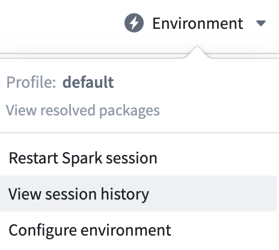
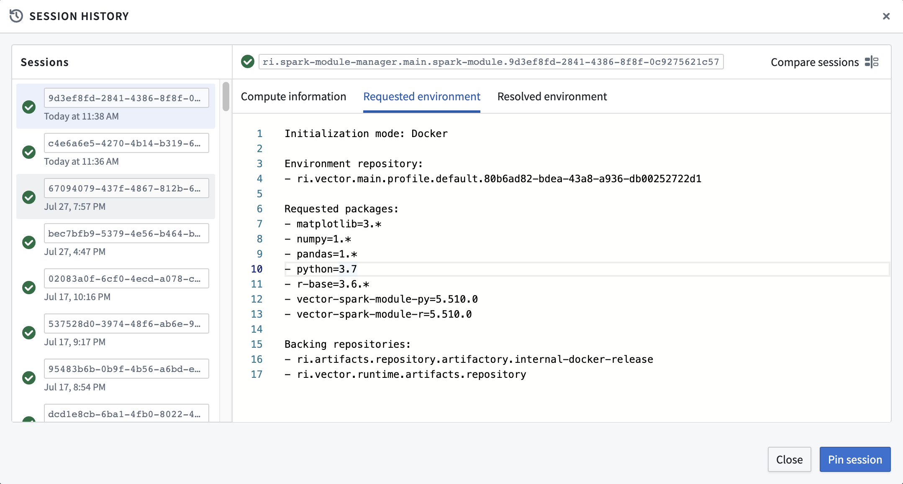
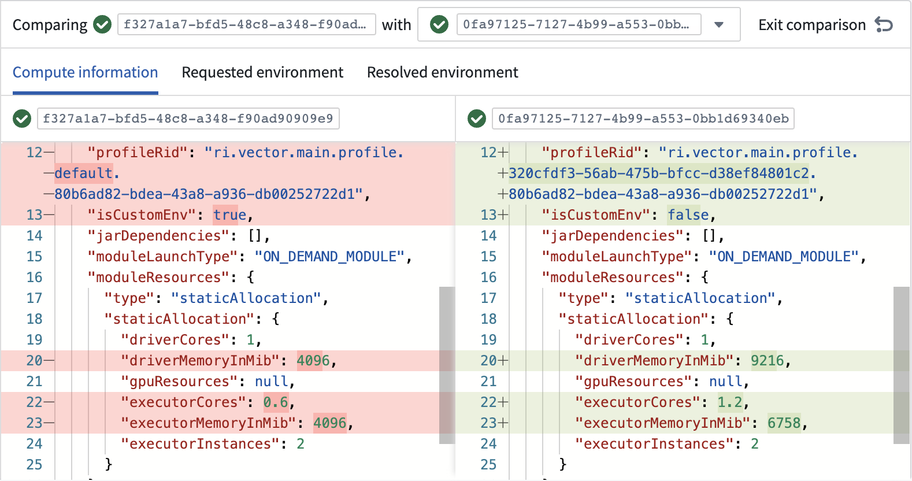
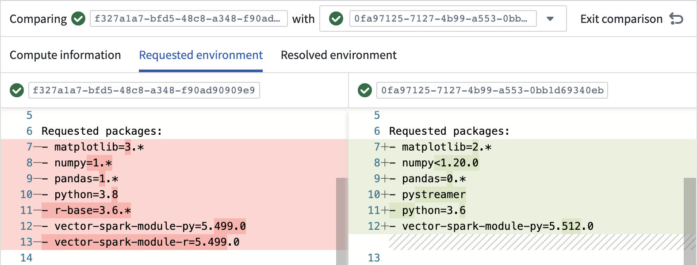
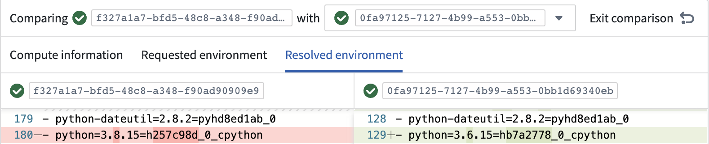

<!-- source: https://palantir.com/docs/foundry/code-workbook/session-history-pinning/ · mirrored 2026-08-26 from Palantir Foundry docs -->

# Session history and session pinning

## Sessions

When you initialize a Code Workbook environment within a Spark module, a series of metadata is attributed to the module. This metadata can be divided in two categories: the compute information and the environment information. A **session** is an instantiation of these settings as part of a Spark module lifecycle or, informally, “what was true about a given Spark module during its lifetime”.

The compute information includes details about the Spark settings attributed to the Spark module, as well as other relevant information such as jar dependencies, resource identifiers, and the type of module being launched. On the other hand, the environment information can be further broken down into two categories: the requested and resolved environments. A **requested environment** is a set of conda specifications, such as requesting `pandas=2.*` or `python<3.10`, while the **resolved environment** is a set of resolved packages that satisfy the constraints established by the requested environment. It is important to note that a requested environment is non-deterministic, while a resolved environment, by definition, is a permanent solution of a given requested environment. As a result, two identical requested environments may lead to different resolved environments. For example, requesting `python>=3.6` in 2017 would likely resolve to Python 3.6, while the same request today could lead to Python 3.10.

## Session history

Code Workbook provides information about all the recent sessions of a Workbook. To consult the session history of a Workbook, select the **Environment** dropdown of Code Workbook and select **View session history**.

The **Session history** window provides information through three different tabs: **Compute information**, **Requested environment**, and **Resolved environment**. The left pane provides the ID of the session as well as the timestamp at which the session was initialized. The icon to the left of the session ID will indicate whether it successfully initialized (green), failed (red), or other (blue). A blue session typically means that the session has not finished initializing and therefore reached neither failed or success states.

### Compute information

The **Compute information** tab offers information about the type of Spark module that was requested for a given session:

* **moduleAssignmentInfo:** General information about whether an environment was spun up by a specific user for interactive Workbook usage or by a background job, such as a scheduled build. For more information about the difference between an interactive and a build module, see [batch builds and interactive builds](/docs/foundry/code-workbook/environment-batch-interactive/).
* **moduleLaunchInfo:** Metadata about the properties assigned to the Spark module itself. This includes the following fields:
  * **sparkModuleRid:** The unique identifier of the Spark module. Given that there is a 1:1 mapping between a module and a session, you will notice that the `sparkModuleRid` and the `sessionId` will share the same unique identifier
  * **profileRid:** The unique identifier of the profile with which the Spark module was initialized.
  * **isCustomEnv:** Whether that session was initialized using a custom environment. Recall that a custom environment in Code Workbook is defined as any standard profile that was modified directly in the Environment configuration menu of the Code Workbook interface.
  * **jarDependencies:** A list of all jar dependencies manually added to the profile in [Control Panel](/docs/foundry/administration/configure-code-workbook-profiles/).
  * **moduleLaunchType:** Can either be `WARM_MODULE` or `ON_DEMAND_MODULE`. Indicates whether the session used an already initialized module from the warm module queue, or requested a fresh module to start its initialization process.
  * **moduleResources:** All the compute information tied to the module, including driver and executor memory, amount of executors, and more.

### Requested environment

The **Requested Environment** tab offers information about the desired environment settings before the start of its initialization:

* **Initialization Mode:** The type of Code Workbook initialization to be performed for that session. It can either be `solve`,  `file`, or `docker`. For more information on the types of initializations in Code Workbook, see documentation about [environment optimizations](/docs/foundry/code-workbook/environment-creation-overview/#environment-optimizations).
* **Environment repository:** The key under which the environment in question is stored. For non-custom environments, this will be the `profileRid` used for the session. For custom environments, this will be the `workbookRid` of the workbook in which the profile was customized.
* **Requested packages:** The list of requested packages submitted for the initialization process. This list will include both the packages specifically requested by the profile, as well as any additional packages automatically requested by Code Workbook for it to function.
* **Backing repositories:** The list of channels from which the installed packages were sourced.

### Resolved environment

The **Resolved Environment** tab offers information about the environment packages used as part of the initialization. This includes the time it took the initialize environment, as well as the packages and their versions that ultimately got installed onto the module. This information is particularly important, as the session rollback feature of Code Workbook borrows the resolved environment of a previous session rather than a requested environment.

## Compare sessions

It is often helpful to compare two given sessions to understand how a given environment may have changed. The **Session history** window allows you to compare your current session with any historical session. You can access the session history comparison tab by selecting **Compare sessions** at the top right of the session history window.

The session comparison menu will provide two windows next to each other. On the right, the information of the current session is displayed. On the left, any session from the **Sessions** list can be displayed for comparison. To switch the session to be compared on the left, select any session from the Sessions list. You can exit the comparison view at any time by selecting **Exit comparison** at the top right of the window. The left selected session will remain selected.

Sessions can be compared across all three available tabs. Comparing the **Compute information** of two sessions may be helpful in understanding changes in the memory available of the module. Comparing the **Requested environment** is helpful to understand what was manually changed between the environments of two given sessions, while comparing the **Resolved environment** may help understand the different versions installed between two sessions.

In the examples below, using the various tabs of session comparison reveals the following information about two sessions:

* A different profile was used.
* The profile was customized.
* Smaller memory settings were employed on the module.

* More recent package versions of Python and pandas were requested, amongst others.

* Different versions of Python ended up being installed on the environment.

## Session pinning

In certain cases, you may want to temporarily rollback to the exact same settings of a historical session. Code Workbook allows this behavior by providing the opportunity to pin a session. Pinning a session means initializing a brand new session and Spark module using the same metadata as a historical session to reproduce a seemingly identical environment. A pinned session will borrow the **resolved** information from a historical session to initialize a fresh module. This is particularly important, because using the same resolved environment guarantees the installed packages to be the same, while using the same requested environment does not. As a result, pinning a session simulates the effect of rolling back to a previously working environment. A select few pieces of metadata, such as the initialization mode, are not borrowed from the historical session.

### How to pin a session

To pin a session, navigate to the **Session history** window and select the session you want to pin. Then select **Pin session** at the bottom right of the panel. The current branch of the Workbook will have a pinned session override that will last up to for 24 hours. A banner will display the remaining time of the override, as well as an option to remove the pin. During that period, every subsequent interactive environment initialization will borrow the pinned session’s information. When the period expires or when the session is manually unpinned, the Workbook will revert back to using its currently configured environment.

:::callout{theme="neutral"}
Session pinning is designed for debugging purposes, and should not be relied on for long-term, production-ready pipelines. For that reason, a pinned session will only affect *interactive* environments. Builds executed outside of the Code Workbook interface, such as scheduled builds, will not be affected by the pinned session override. We recommend that you restrict session pinning to occasional troubleshooting and experimentation. Instead, use the [session history](#session-history) feature to understand the differences between various sessions, and edit the environment definition directly.
:::

## Restrictions of session pinning

Certain limitations apply when pinning a session. Pinned sessions do not last infinitely, not every session can be pinned, and not every initialization will be affected by a pinned session. Find below a list of restrictions to be mindful of when considering pinning a session:

* A session pin may last up to 24 hours. To extend this time further, you will need to re-pin the session. Re-pinning a session will cause a new module to be spun up and all local state on the module will be lost.
* A pinned session does not borrow all of the metadata from its attached historical session. Settings such as the initialization mode may differ.
* Only previously successful sessions can be pinned. Unfinished or unsuccessful sessions are disallowed. Additionally, Code Workbook may defensively prevent you from selecting a version for pinning due to incompatible versions, blacklisted package versions, API breaks, and so on. A red banner will inform you of sessions that cannot be pinned.
* Pinned sessions only affect interactive jobs - not build jobs.
* Only sessions using [Artifacts Profiles](/docs/foundry/administration/configure-code-workbook-profiles/#artifacts-profiles) can be pinned

For the reasons above, pinning a session is a debug feature that should not be relied on for long-term, production-ready pipelines.

## Troubleshooting environments using session history

The [session history](#session-history), [session comparison](#compare-sessions), and [session pinning](#session-pinning) features mentioned above can be instrumental in troubleshooting failing environments. Particularly, they help address failures of previously working environments. Follow these steps to remediate such cases:

1. Has the environment worked in the past?
   * If no, refer to the [Environment Troubleshooting Guide](/docs/foundry/code-workbook/environment-troubleshooting/).
   * If yes but it is now failing, proceed to the next step.

2. Using the [**Compare sessions**](#compare-sessions) feature, select the currently failed session with a previously succeeding and observe the differences in the environment.
   * If there are changes in the compute information details, the module settings may not contain sufficient memory for the module to correctly initialize.
   * If there are changes in the requested environment details, a manual breaking change was introduced to the environment which led to the failure.
   * If there are no changes in the requested environment details, but changes in the resolved environments that led to a failure, a new version of one of the packages used may contain a breaking change. These packages generally come from open source. You can investigate the issue in the faulty package directly or modify your environment to avoid requesting the package or version in question.
   * If there are no apparent changes in the environment or the steps above did not help, consult the [Environment Troubleshooting Guide](/docs/foundry/code-workbook/environment-troubleshooting/) or contact Palantir Support for further assistance.

3. (Optional) While troubleshooting during the previous step, use the [**Session pinning**](#session-pinning) feature to first ensure that the pinned version of the environment works, and to temporarily unblock the functionality of the Workbook while a more permanent solution is found.

4. After discovering the root cause of the environment failing, adjust your profile's settings accordingly to permanently remediate the situation.
