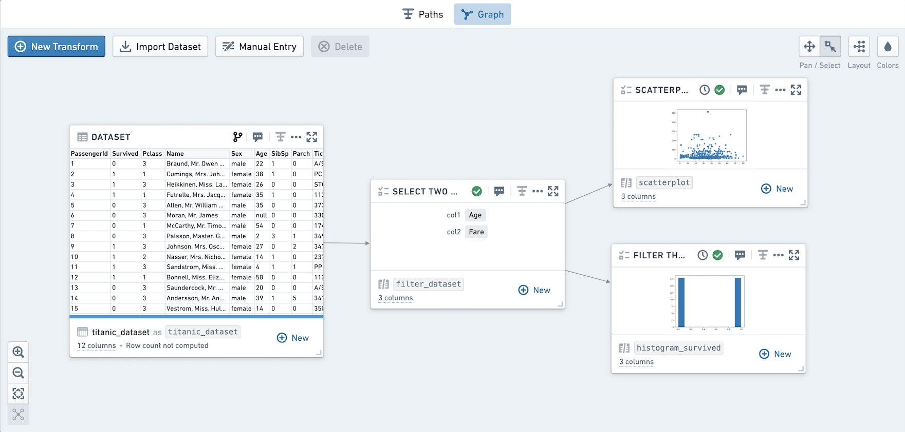
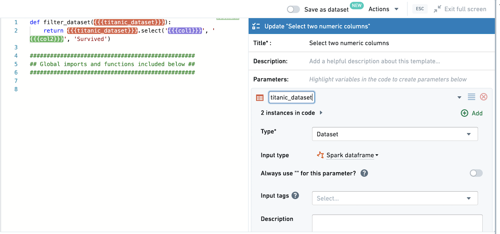
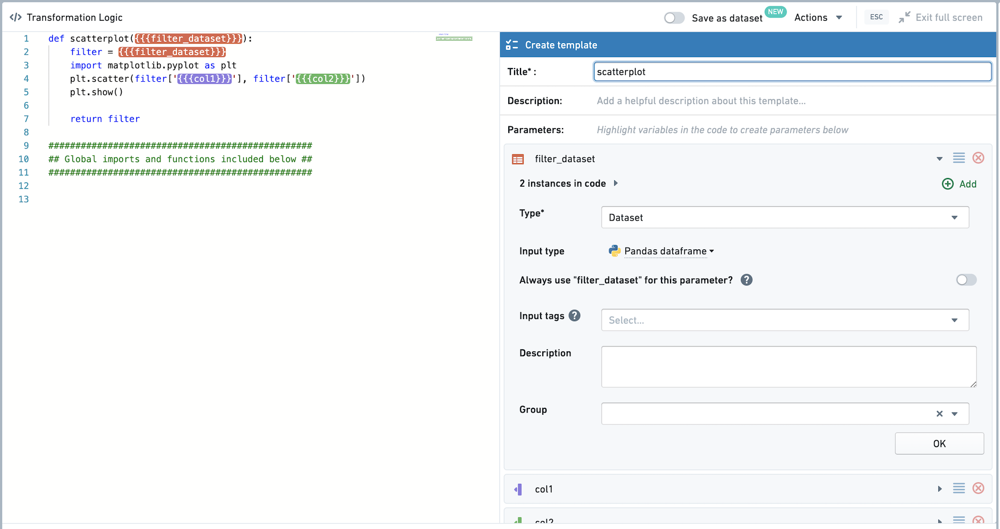
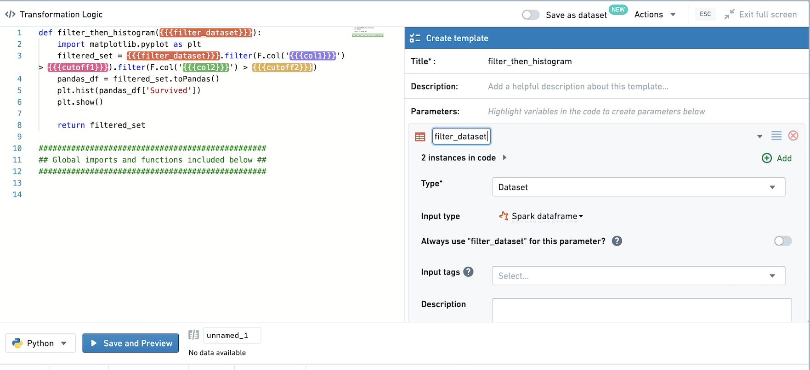
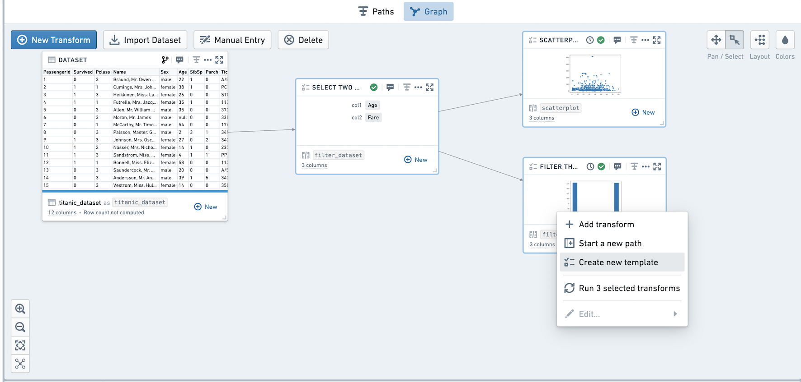
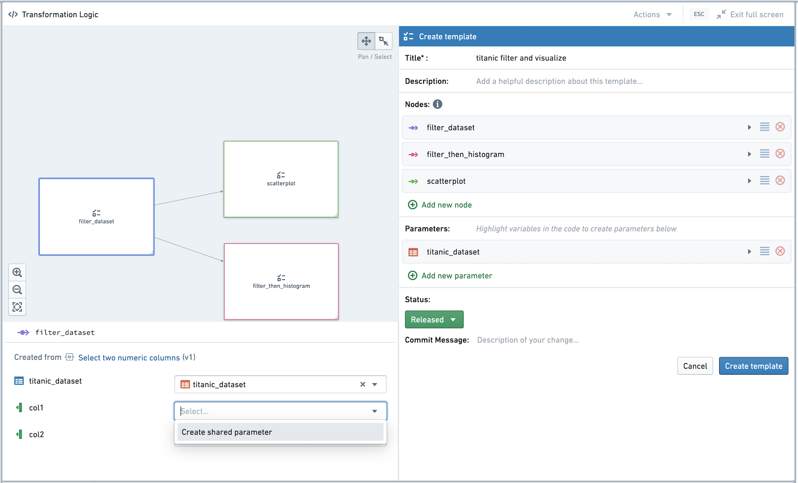
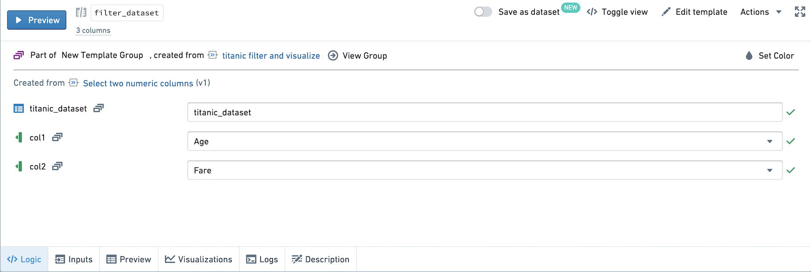
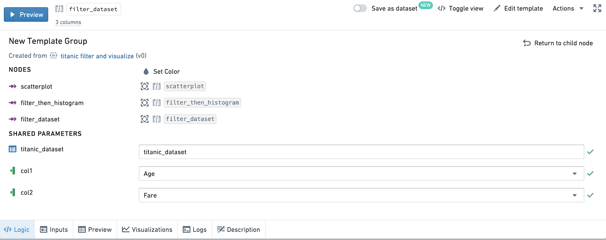
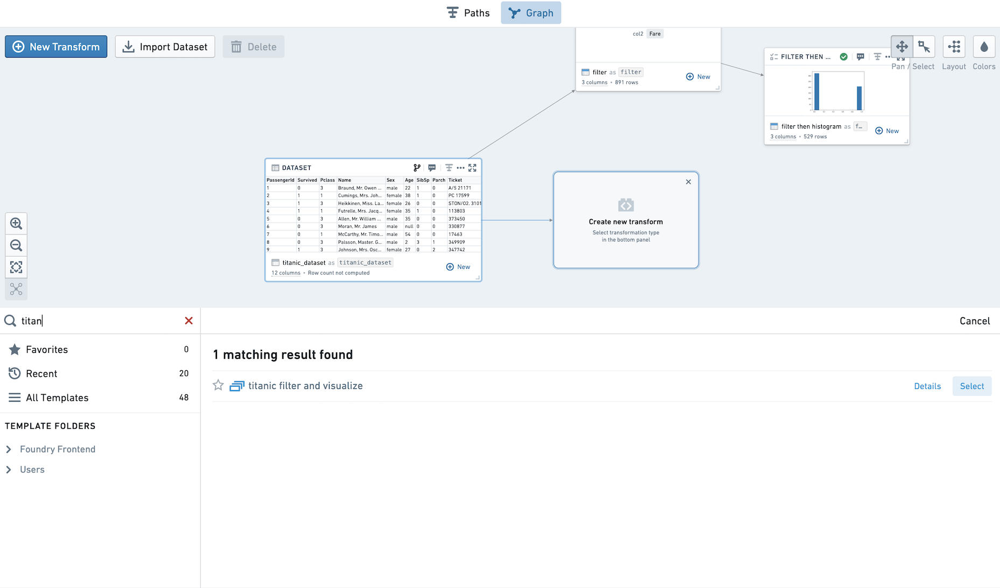
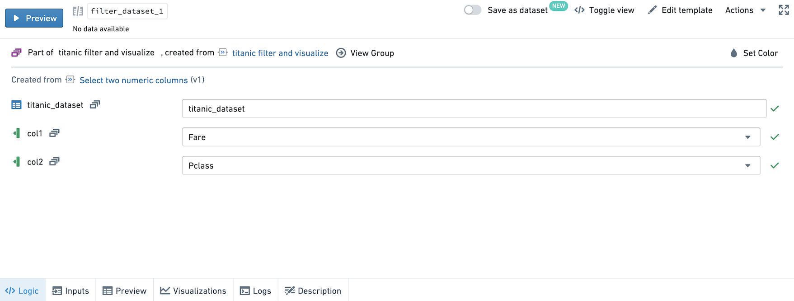

<!-- source: https://palantir.com/docs/foundry/code-workbook/templates-multi-node/ · mirrored 2026-08-26 from Palantir Foundry docs -->

# Multi-node templates

Code Workbook supports multi-node templates for templatized workflows. A template can be created from multiple other templates, and you can bind the values of parameters in these templates together.

The following example uses `titanic_dataset` to templatize a workflow selecting two numeric columns and plotting them in two graphs. The first graph is a scatterplot of the two numeric columns. The second plot is a histogram of whether or not the passengers survived, based on filtering on the numeric columns.

Here is a visual overview of the workflow we are templatizing:

## Creating Templates

First, create a template selecting two numeric columns from the input dataset, along with `Survived`. Title this template `Filter`.

Second, create a template plotting a scatterplot of the two numeric columns. Title this template `Scatterplot`. Note that the input dataset is set to be read in as a Pandas dataframe.

Finally, create a template that filters the input dataset based on the two numeric columns and two templatized inputs. Note that the input dataset is set to be read in as a Spark dataframe.

## Creating Multi-Node Templates

Select all three templates and right-click to open the menu, then select **Create new template**. You should now see the template editor.

We want to link the values of the `col1` parameters, and link the values of the `col2` parameters. First, click into the `Filter` template. Click into `col1`, and select **Create shared parameter** in the dropdown.

On the right-hand side, a new parameter titled `col1` has been created. Select `titanic_dataset` as the source dataset in the right-hand pane. Then, click into the two other templates and choose to link `col1` to the new `col1` Multi-Node Template parameter. Repeat for `col2`, and then save the multi-node template.

## Using Multi-Node Templates

The three templates we previously created are now part of a multi-node template.

Click into the `Filter` template. Next to the `col1` and `col2` parameters, there is an icon indicating this parameter value is controlled by the multi-node template parameter.

Select `View Group` at the top of the pane. You now see a view highlighting the nodes in the Multi-Node Template, and listing the shared parameters in the template. You can change the value of `col1` and `col2` in this view, and all instances in the three nodes will also be changed.

If you change the value of a shared parameter in the child node pane, the value will also be changed for all instances in the multi-node template.

Add a new instance of this template.

Analyze `Fare` and `PClass`. By selecting these two columns in the view for the child node, notice that you are setting the column values across the group.

Then, update the cutoff values in `Filter then histogram`. Run the templates to create the same graphs for a different set of numeric columns.
