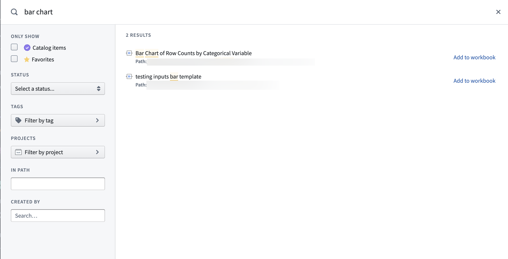
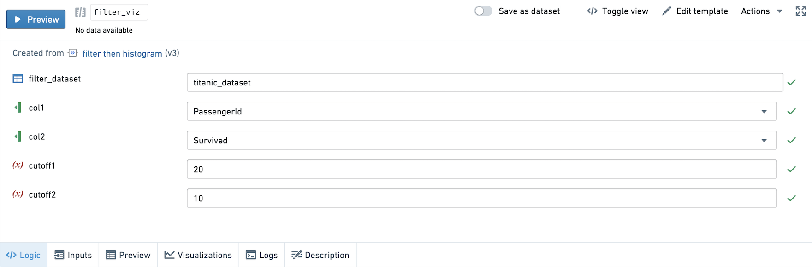
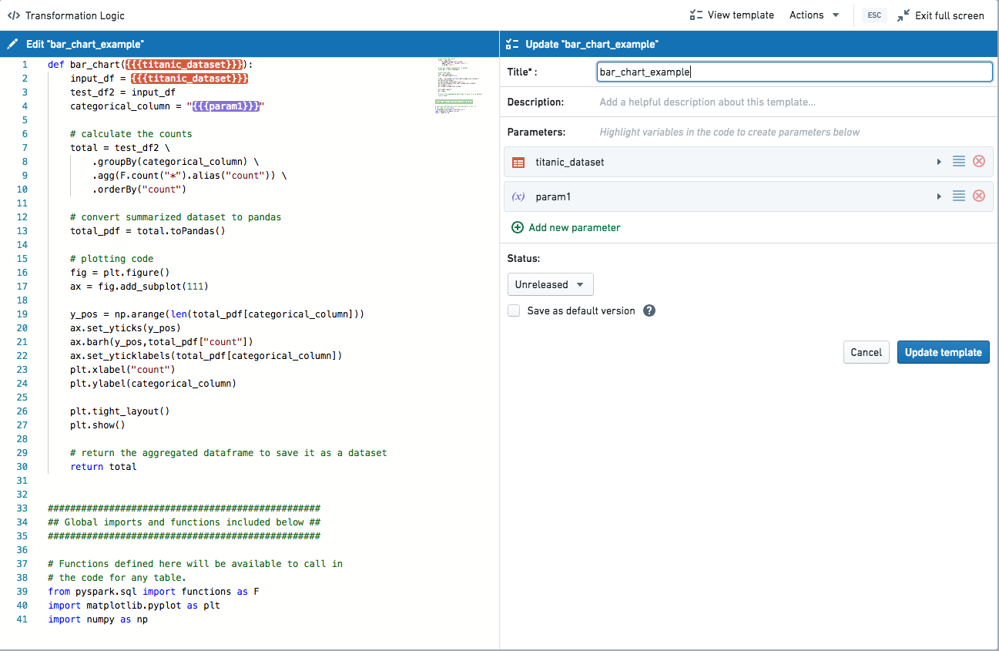
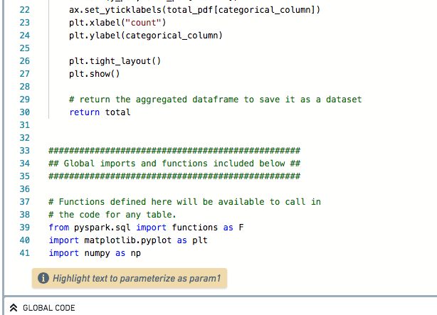

<!-- source: https://palantir.com/docs/foundry/code-workbook/templates-overview/ · mirrored 2026-08-26 from Palantir Foundry docs -->

# Templates

Code templates enable users with a range of technical experience to collaborate by abstracting code away behind a simple form-based interface. Values selected by users are substituted into a code template, which can then be run like any other transform in the Workbook.

Any transform that can be created with code, including Matplotlib or Plotly visualizations, can be created with code templates. To try using templates hands-on, follow the [Templates tutorial](/docs/foundry/code-workbook/templates-getting-started/).

## Search and discovery

All available templates can be found in the template browser. To open the template browser, click **+ New Transform** at the top left of the screen and select **Templates**, or select the **+** button on hover of an existing transform and select **Templates**.

The template browser displays recently used templates, and provides the ability to search based on keyword, template author, tags, and more.

## Using code templates

When a code template is selected on the graph, the user is presented with a simple form input on the bottom of the screen rather than a code editor. Parameters in the template code are rendered as inputs to be filled in by the user.

### Input types

* **Dataset:** The value for a dataset field must be a valid dataset in the current workbook. When a user clicks the dataset input field, they will be prompted to select an input dataset from the graph. Dataset inputs can also be configured to always map to the same input dataset; for example, a code template might always rely on a particular ontology dataset. For more, see the [Creating and editing templates](#creating-and-editing-templates) section below.
* **Column:** The user is prompted to select one or more columns from one of the input datasets. Column parameters can be configured to select a single column or a list of columns.
* **Text:** A text input field that allows users to enter free text values.
* **Number:** An input field that must be filled by a numerical value.
* **Select:** Allows users to choose from a pre-defined list of possible values.
* **Multiselect:** Allows users to choose any number of values from a pre-defined list of possible values.
* **Boolean:** A switch that lets users toggle a value between True and False.
* **List:** Allows users to enter any number of values, which are passed to the underlying code as a list of values.

Once the input fields have been filled, a template transform can be run in the same way as a code transform: by selecting the **Run** button, or by opening the context menu on the graph and selecting **Run**.

Use **Toggle View** to preview the underlying code generated by the template.

## Creating and editing templates

Any code transformation can be turned into a code template to allow the same transformation to be applied without re-writing any code. To create a code template or edit an existing one, select the **Create/Edit template** option on the code editor header.

Code templates are created by designating values within a code transformation as parameters, and adding metadata about what types of input a user should be allowed to enter. When you choose to create a template, you will be brought into a split-screen view in the Full Screen Editor. On the left-hand side of the screen, the code editor allows you to select pieces of code to parameterize. On the right-hand side of the screen, the template editor allows you to configure metadata about each parameter.

By default, when a new template is created, the inputs are converted into dataset-type parameters. These parameters can be edited to give more descriptive names and descriptions. The template itself should also be given a title and detailed description.

To create new parameters, select the **Add new parameter** option on either the template editor or the code editor. You will be prompted to highlight a portion of text to be substituted by the input value of the parameter. If you wish to add multiple instances of the same parameter, you can do so by selecting the **Add** button next to the list of instances in the code on the template editor.

Once a parameter has been added, you must select the parameter type: dataset, column, or variable. If **variable** is selected, you should also select a param type for that variable: text, number, select, multiselect, boolean, or list. Column inputs can optionally be configured to create a list of multiple columns, and datasets can be configured to use a specific input dataset by default. We recommend that you include descriptions for all parameters and default values for all variable-type parameters.

The global functions that are available in the Workbook where a template is first created will be automatically appended to the content of the template code so that it will be available in other Workbooks. Templates do not have access to global code in Workbooks where they are applied.

The version history of templates is saved, and new edits to a template are always saved as a new version of that template. Edits to a template do not automatically update instances of that template; each instance of the template will include a prompt to update to the latest version if they are using an outdated version of the template.

## Best practices

* Include default values whenever possible.
* Create detailed descriptions for templates and for template parameters.
* Find an organizational scheme that makes it easy for users to find the most relevant templates for their workflows. This likely means creating a dedicated public folder with high-quality, vetted templates. Templates may be grouped in folders by workflow. A default template folder can be configured.
