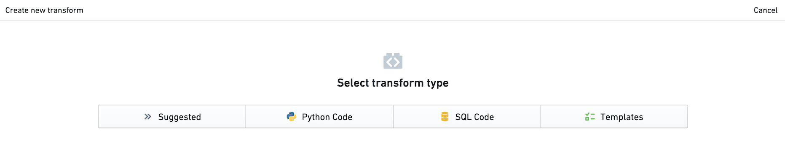
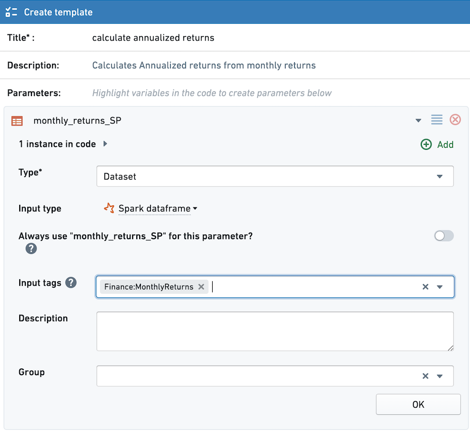
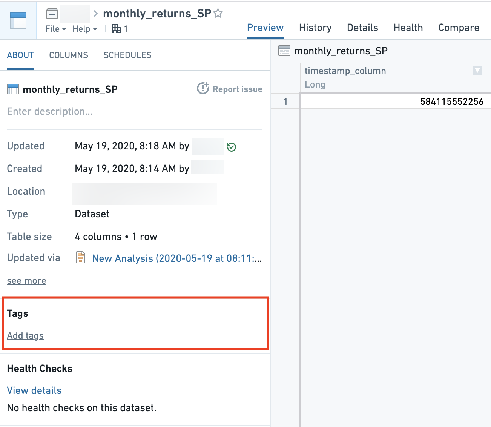
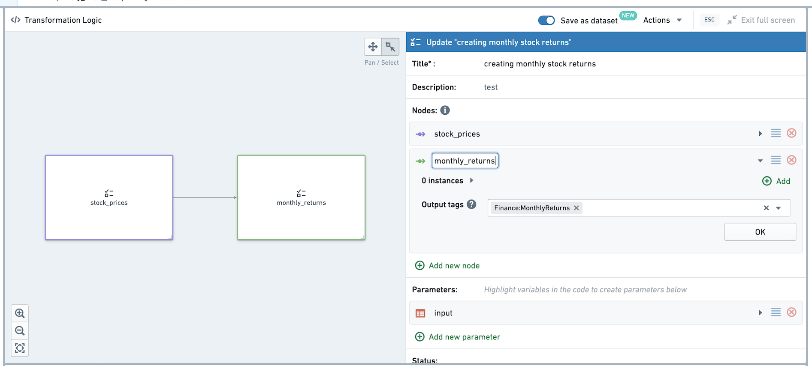

<!-- source: https://palantir.com/docs/foundry/code-workbook/templates-suggested/ · mirrored 2026-08-26 from Palantir Foundry docs -->

# Suggested templates

For groups of similar datasets, you may want to suggest templates to apply. For example, for a group of datasets containing monthly stock returns, you may want to suggest a template that calculates the annualized return. Suggested templates are shown in a separate button within the New Transform panel, making them more discoverable.

## Configuring input tags in a template

Below, we see a template that calculates annualized returns from monthly returns. For any dataset with the tag **Finance:MonthlyReturns**, this template will appear in the **Suggested** tab when the user creates a new transform with the dataset as a parent.

Configure the desired input tags in the **Input Tags** field when creating or editing a template. You can add multiple input tags.

## Adding tags to a dataset

One way to add input tags to a dataset is to open the dataset in Dataset-app. Note that because tags are tied to datasets, tags cannot be added to unpersisted transforms in Code Workbook. This means that Suggested Templates are not supported for unpersisted transforms.

## Configuring output tags in a multi-node template

Rather than adding tags manually from Dataset-app, you can configure output tags as part of a Multi-Node template.

Imagine a multi-node template with two nodes, where the output of the second node is a dataset with monthly stock returns. The goal is for this dataset to automatically add the **Finance:MonthlyReturns** tag, so templates with that input tag configured will appear under Suggested Templates.

While creating or editing the multi-node template, set the desired output tag under **Output tags**. When the multi-node template is applied, the output tag will immediately be added to a dataset created by the multi-node template.

