<!-- source: https://palantir.com/docs/foundry/code-workbook/transforms-overview/ · mirrored 2026-08-26 from Palantir Foundry docs -->

# Transforms

**Transforms** are pieces of logic that take one or more inputs and return a single output. Inputs and outputs can be Foundry datasets or models.

Code Workbook currently supports three types of transforms:

* **Code** transforms allow users to author arbitrary logic in their language of choice.
* **Template** transforms abstract away code behind a simple, form-based interface that can be reused between workbooks and users.
* **Manual entry** transforms allow users to input data into a node.

## Adding transforms

There are several ways to add new transforms in Code Workbook.

Use the **New Transform** button in the top-left of the graph, which will allow you to select the type of transform to add. For example, select **Python code** to add a new Python code node, or **Templates** to open the template browser.

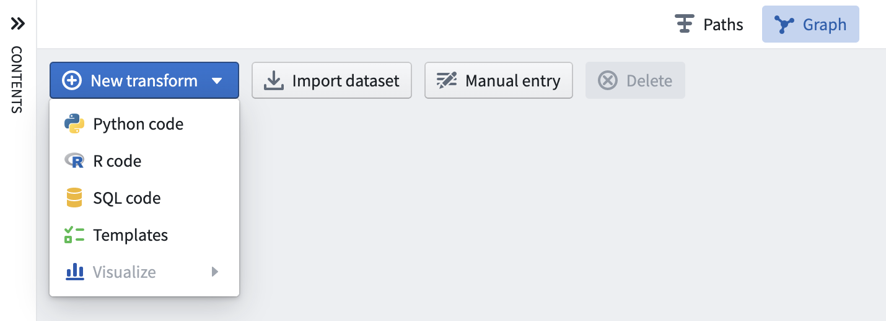

Alternately, hover over an existing transform on the graph and click on the blue **+** button that appears to open the selection dropdown. The newly created transform will be a child of the selected transforms.

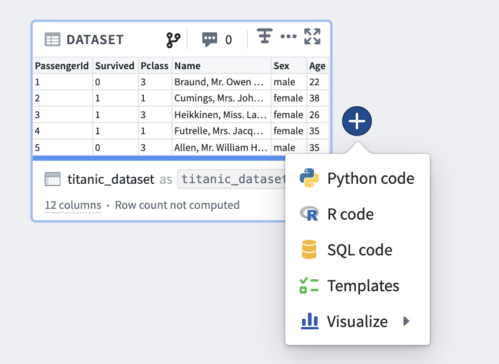

## Editing transforms

### Editing names

Transforms in Code Workbook can be saved as datasets. Read more about [data persistence](/docs/foundry/code-workbook/optional-data-persistence/).

Transforms that are not saved as datasets are identified by a workbook-specific alias that allows you to refer to the transform in code. For input datasets, and transforms that are saved as datasets, Code Workbook shows two different names for each dataset: the name of the underlying Foundry dataset, and a workbook-specific alias.

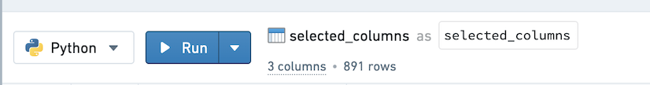

There are a few benefits to having aliases:

* You can refer to datasets in a way that is intuitive for the logic in your Workbook. For example, if you had two datasets called “Titanic” in different folders corresponding to different update frequencies, you could alias one of them as `titanic_historical`and the other as `titanic_daily_feed`.
* You can freely edit dataset aliases without changing the dataset names for anybody using the same datasets elsewhere in Foundry.
* You can change the alias of a dataset on a branch and merge this change across branches.

To edit the dataset name or its alias, click on the name in the logic panel, enter the new name, and use the Enter key when finish editing. If you change a dataset name or alias, you will be prompted to automatically update the other name if you wish.

### Adding inputs

Clicking on any transform opens the logic panel. To add input, click the **+** button in the top input bar, and then click the desired input.

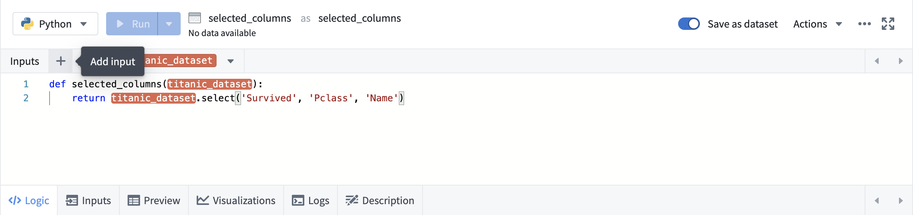

To add multiple inputs, use the button next to the **+**.

### Code

Code transforms appear as a code editor prepopulated with basic structure for the language you are using in the current Workbook. See the [Languages documentation](/docs/foundry/code-workbook/workbooks-languages/) for specific details about writing code in each language.

### Global code

The [Global code](/docs/foundry/code-workbook/workbooks-global-code/) pane allows you to define code that executes before each code transform in your Workbook. The Global Code pane can be used to define variables and functions that will be available throughout the transforms in your Workbook.

### Templates

For [Template transforms](/docs/foundry/code-workbook/templates-overview/), the logic panel displays a form to edit Template parameters.

* After clicking a dataset parameter, click any dataset in the graph to set it as the value for that parameter.
* Column parameters depend on the input dataset being specified. After it is specified, you can choose from a dropdown list of column names.
* For value parameters such as integers and strings, you can type in a custom value.

### Manual entry

Add a manual entry node by clicking the **Manual Entry** button on the graph.

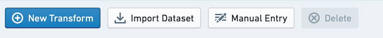

Enter data in the **Manual Entry** tab. Currently supported column types are Double, Integer, Boolean and String. **Only 500 rows are supported.**

Copy and paste to easily bring in data from other places.

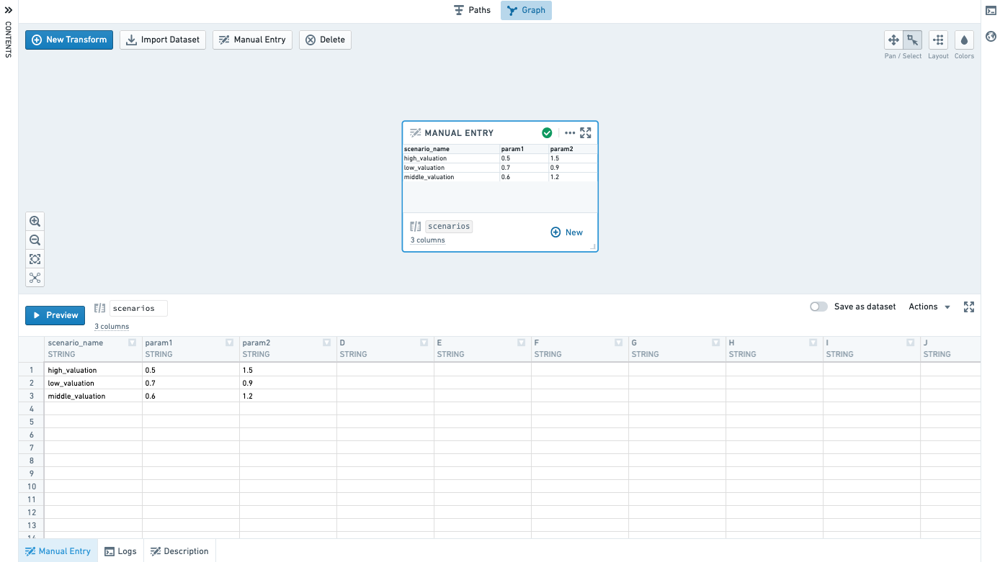

### Running transforms

Select **Run** in the bottom panel to execute the selected transform. To run all downstream transforms, select the arrow icon and choose **Run all downstream**.

Running a transform requires edit permissions on the workbook, as well as access to all of the [Markings](/docs/foundry/security/markings/) used by any dataset used by the workbook.

There are also several hotkeys available to quickly run code. Type `?` to view the list of hotkeys.

There are two ways to run many transforms at once:

* Select multiple datasets in the graph by using Ctrl + Click or Cmd + Click. Then right-click anywhere on the graph and select **Run N datasets** from the menu.
* Click the settings icon () in the top bar and select **Run all transforms**.

When transforms are running, any printed output is streamed to the Logs tab. This allows you to print output in the middle of your transform and see results while your transform is still running, which can be useful for debugging or timing your logic.

Once saved to a dataset, any sorting of the data that was applied in code may not be persisted. In other words, if you run a transform that sorts data, the data may not be sorted in that order when you view it as a dataset, though other operations in the transform will have been applied.

## Tabs

When working in the Graph or Full Screen Editor, use the bottom tabs on a node to navigate inputs and outputs of a transform.

### Inputs

Use the Inputs tab to view the inputs to your transform, add additional inputs, or change the input types.

:::callout{theme="warning" title="Warning"}
As with other Spark-based applications, Code Workbook does not by default maintain row order when reading datasets. Sort your data in code if your analysis requires a particular row order.
:::

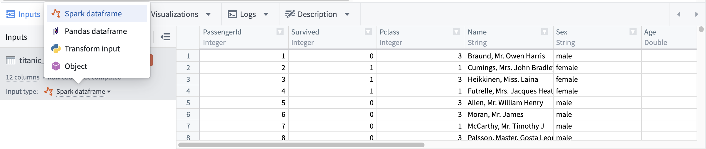

The following input types are available for each node language:

|Node language |Available input types |
|---           |---                   |
|Python        |Spark dataframe, Pandas dataframe, Python transform input, Object |
|SQL           |Spark dataframe    |
|R             |Spark dataframe, R transform input, R data.frame, Object |

When a new transform is added, its input transforms will default to an input type based on the new transform's language and each input transform type, as detailed below:

|Input transform type  |Downstream transform language    |Default input type    |Additional details    |
|---                   |---    |---    |---    |
|Import with no schema |Python    |Python transform input    | |
|                      |R    |R transform input    | |
|                      |SQL    |Spark dataframe    |While you can create a SQL node with an input transform with no schema, SQL nodes only support Spark dataframe inputs and will not be effective in analyzing inputs with no schema.  |
|Import with schema    |Python    |Spark dataframe    | |
|                      |R    |R data.frame    | |
|                      |SQL    |Spark dataframe    | |
|Import with custom file format, including models |Python    |Object    |See the [model training tutorial](/docs/foundry/model-integration/tutorial-intro/) for more information. Object input types in Code Workbook are custom file formats and are not related to ontology objects. |
|                      |R    |Object    |See the [model training tutorial](/docs/foundry/model-integration/tutorial-intro/) for more information. Object input types in Code Workbook are custom file formats and are not related to ontology objects. |
|                      |SQL    |Spark dataframe    |While you can create a SQL node with an input transform that is a custom file format, SQL nodes only support Spark dataframe inputs and will not be effective in analyzing custom file format inputs.  |
|Derived nodes    |N/A    |Input node's output type|If the output type of the input node is incompatible with the derived node's language, derived nodes will use defaults as defined above for import node types. For example, if Node A returns a Pandas dataframe and derived Node B is an R node, Node B will default to reading Node A as an R data.frame. |

### Preview

When you run your transform in Code Workbook, a 50-row preview is calculated to see the shape of your result. This preview is displayed in the preview tab before your dataset is finished writing to Foundry. After the dataset is persisted to Foundry, the preview tab will update to the full result.

### Visualizations

Depending on the language used in your transform, you can use plotting libraries to return visualizations that will propagate to the Code Workbook user interface. See the [Languages documentation](/docs/foundry/code-workbook/workbooks-languages/) for details about how to do this in each language.

Resulting visualizations will be displayed in the graph by default, and are also available in the Visualizations bottom tab.

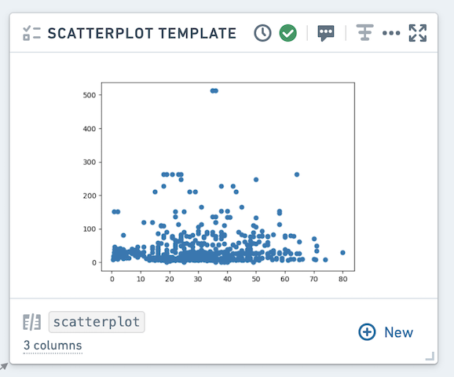

Using the context menu, you can toggle the view in the Graph between table and graph mode.

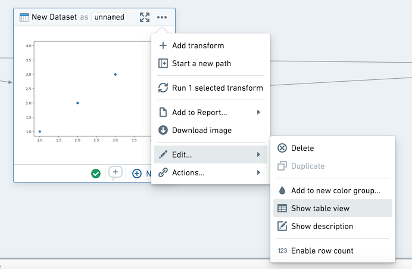

In the visualization tab, you can download your graph as an image or add it to a report. These actions are also available in the context menu.

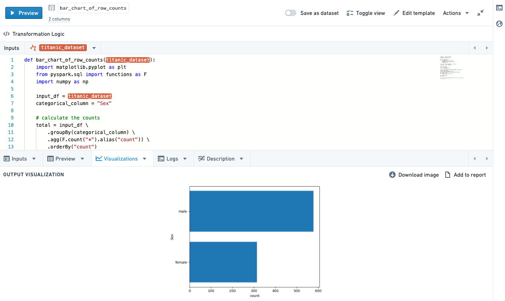

### Logs

View print statements (standard out), warnings and errors (standard error) from running your transform. If there is standard error, the logs tab will be automatically selected and a small callout will appear to notify you there is warning/error output.

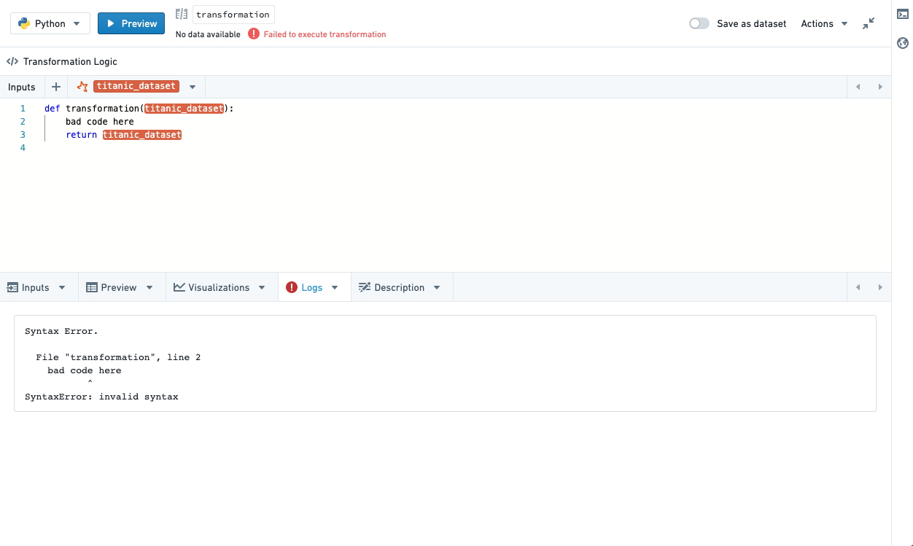

### Description

Update the description for your dataset. Note that updating the description will update it across all branches - the description will also be available in the **Open Dataset** view.

You can use markdown to style your descriptions, and view them in the graph by clicking enabling **Show Description** in the right-click (action) menu. To show descriptions for all nodes in a workbook, click the Tools cog in the header and select **Show all descriptions**.

### Models

Transforms that return models will automatically be written to Foundry as a model, allowing use of the Foundry ML interface. Refer to the [Languages documentation](/docs/foundry/code-workbook/workbooks-languages/) for details about how to use models in each language.

### Non-deterministic transforms

Some transformations are non-deterministic -- they return different results despite the same input data and transformation logic. Some functions that may lead to non-deterministic transforms include calls to the current timestamp, row number, monotonically increasing ID, and transformations after sorting on a column that contains duplicate values.

In Code Workbook, running a transform will start two jobs: one job calculates a 50 row preview, and the other job calculates the transformation on the full dataset and writes the result to Foundry. If there is a non-deterministic transform, the result you see in the 50 row preview may not match the result in the Foundry dataset.

When running non-deterministic code within a transformation, dataframes are not necessarily materialized. For example, assume you have a non-deterministic transform Transform A, which is the parent of Transforms B and C. If you run each transformation separately from within Code Workbook, each dataset will be written to Foundry sequentially, resulting in consistent results across transforms B and C. However, if you select "Run all downstream" on A, as A is not necessarily materialized when running B and C, you may see conflicting results. Running builds from within Data Lineage can prevent this as well, as each dataset will be materialized and sequentially calculated, as will converting to a Pandas dataframe.

Some examples of functions that result in non-deterministic transformations include `current_date()`, `current_timestamp()`, and `row_count()`, though other functions can result in non-determinism. More information on ways that Spark calculates transformations that may result in unexpected behavior can be found at the [Apache Spark docs ↗](https://spark.apache.org/docs/latest/rdd-programming-guide.html#rdd-operations).
