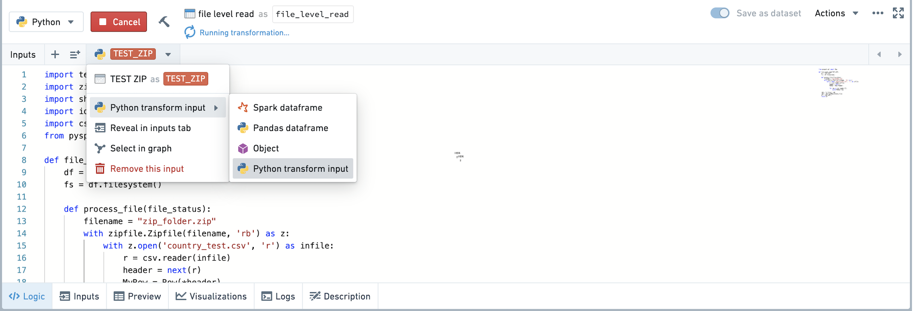
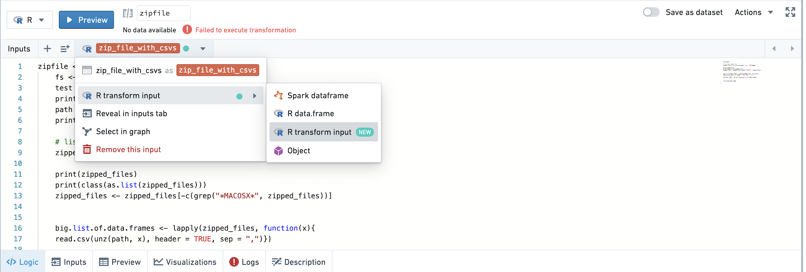

<!-- source: https://palantir.com/docs/foundry/code-workbook/transforms-unstructured/ · mirrored 2026-08-26 from Palantir Foundry docs -->

# Access unstructured files

In addition to operating over Foundry datasets that have a defined tabular schema, Code Workbook supports accessing unstructured files in a dataset. This can be useful for analyzing and transforming unstructured data such as images and other types of media, semi-structured formats such as XML or JSON, compressed formats such as GZ or ZIP files, or R data formats like RDA and RDS.

## Unstructured files in Python

### Reading files

You can read files in a Python transform by reading an upstream dataset as a `Python transform input`. This API exposes a `FileSystem` object that allows file access based on the path of a file within the Foundry dataset, abstracting away the underlying storage. [Learn more about the `FileSystem`.](/docs/foundry/api-reference/transforms-python-library/api-filesystem/#transforms.api.FileSystem). Other information, including the branch and RID (as detailed in the [transform input documentation](/docs/foundry/api-reference/transforms-python-library/api-transforminput/#transforms.api.TransformInput)), is also exposed.

Change the type of your input using the input helper bar, or in the inputs tab.

:::callout{theme="neutral"}
Only imported datasets and persisted datasets can be read in as Python transform inputs. Transforms that are not saved as a dataset cannot be read in as Python transform inputs.

Datasets with no schema should be read in as a transform input automatically.
:::



#### Example: Reading CSVs inside a ZIP file

For example, the following code will read the CSVs inside of a ZIP file and return the CSV contents as a dataframe.

```python
import tempfile
import zipfile
import shutil
import io
from pyspark.sql import Row

# datasetOfZippedFiles is a dataset with a single zipped file that contains 3 CSVs with the same schema: ["id", name"].
def sample(datasetOfZippedFiles):
    df = datasetOfZippedFiles
    fs = df.filesystem() # This is the FileSystem object.
    MyRow = Row("id", "name")
    def process_file(file_status):
        with fs.open(file_status.path, 'rb') as f:
            with tempfile.NamedTemporaryFile() as tmp:
                shutil.copyfileobj(f, tmp)
                tmp.flush()
                with zipfile.ZipFile(tmp) as archive:
                    for filename in archive.namelist():
                        with archive.open(filename) as f2:
                            br = io.BufferedReader(f2)
                            tw = io.TextIOWrapper(br)
                            tw.readline() # Skip the first line of each CSV
                            for line in tw:
                                yield MyRow(*line.split(","))
    rdd = fs.files().rdd
    rdd = rdd.flatMap(process_file)
    df = rdd.toDF()
    return df
```

### Writing Files

It is possible to write to an output FileSystem. This can be useful to write non-tabular data formats including images, PDFs, text files, etc.

Call `Transforms.get_output()` to instantiate a TransformOutput. [Learn more about the TransformOutput API.](/docs/foundry/api-reference/transforms-python-library/api-transformoutput/#transforms.api.TransformOutput)

:::callout{theme="neutral"}
You can only write files using TransformOutput in nodes that are saved as datasets. You cannot write files using TransformOutput in the console.
:::

:::callout{theme="neutral"}
Once you have instantiated a TransformOutput and used it by calling filesystem() or other methods, returning anything other than the TransformOutput object will be ignored.
:::

#### Example: Writing a text file or dataset

The following code is an example of how to write a text file:

```python
def write_text_file(): 
    output = Transforms.get_output()
    output_fs = output.filesystem()
    
    with output_fs.open('my text file.txt', 'w') as f: 
        f.write("Hello world")
        f.close()
    
```

The following code is an example of how to write a dataset and specify partitioning and output format.

```python
def write_dataset(input_dataset): 
    output = Transforms.get_output()
    output.write_dataframe(input_dataset, partition_cols = ["colA", "colB"], output_format = 'csv')
```

## Unstructured files in R

### Reading files

You can read files in an R transform by reading an upstream dataset as an `R transform input`. The `TransformInput` object is exposed which allows file access based on the path of a file within the Foundry dataset. [Learn more about the `FileSystem` API.](/docs/foundry/code-workbook/r-filesystem/)

Change the type of your input using the input helper bar, or in the inputs tab.

:::callout{theme="neutral"}
Only imported datasets and persisted datasets can be read in as R transform inputs. Transforms that are not saved as a dataset cannot be read in as R transform inputs.

By default, datasets without schemas should be set to input type R transform input already.
:::



#### Example: Loading an RDS

Use the code below to load an RDS that is a file in an imported dataset. The RDS contains an R data.frame.

```r
RDS_reader <- function(RDS_dataset) {
    fs <- RDS_dataset$fileSystem()
    
    ## The name of the file is test_loading_RDS.rds
    
    path <- fs$get_path("test_loading_RDS.rds", 'r')
    rds <- readRDS(path)
    return(rds)
}
```

#### Example: Using rbind on the contents of a set of zipped CSVs

Use the code below to `rbind` the contents of a set of zipped CSVs.

```r
result <- function(zip_file_with_csvs) {
    fs <- zip_file_with_csvs$fileSystem()

    ## Get the remote path (name) of the zipfile
    zipfile_name <- fs$ls()[[1]]$path

    ## Get the local path of the zipfile
    path <- fs$get_path(zipfile_name, 'r')

    # List the zipped files 
    zipped_files <- as.list(unzip(path, list = TRUE)$Name)

    # For every element on the list, return a dataframe
    list_of_data_frames <- lapply(zipped_files, function(x){read.csv(unz(path, x), header = TRUE, sep = ",")})

    # Bind all of the dataframes together
    rbind_df <- do.call(rbind,list_of_data_frames)

    return(rbind_df)

}
```

### Writing files

It is possible to write to an output FileSystem. This can be useful to write non-tabular data formats including images, PDFs, text files, and so on.

Call `new.output()` to instantiate a TransformOutput. [Learn more about the `FileSystem` API.](/docs/foundry/code-workbook/r-filesystem/)

:::callout{theme="neutral"}
You can only write files using TransformOutput in nodes that are saved as datasets. You cannot write files using TransformOutput in the console.
:::

#### Example: Saving an R data.frame to an RDS file

Use the code below to save an R data.frame to an RDS file.

```r
write_rds_file <- function(r_dataframe) {
    output <- new.output()
    output_fs <- output$fileSystem()
    saveRDS(r_dataframe, output_fs$get_path("my_RDS_file.rds", 'w'))

}
```

#### Example: Saving a plot to a PDF

Use the code below to save a plot to a PDF.

```r
plot_pdf <- function() {
    library(ggplot2)
    theme_set(theme_bw())  # pre-set the bw theme
    data("midwest", package = "ggplot2")

    # Scatterplot
    gg <- ggplot(midwest, aes(x=area, y=poptotal)) + 
        geom_point(aes(col=state, size=popdensity)) + 
        geom_smooth(method="loess", se=F) + 
        xlim(c(0, 0.1)) + 
        ylim(c(0, 500000)) + 
        labs(subtitle="Area Vs Population", 
            y="Population", 
            x="Area", 
            title="Scatterplot", 
            caption = "Source: midwest")
            
    output <- new.output()
    output_fs <- output$fileSystem()
    pdf(output_fs$get_path("my pdf example.pdf", 'w'))
    plot(gg)
}
```

#### Example: Writing a TXT file using a connection

Use the code below to write a TXT file using a connection.

```r
write_txt_file <- function() {
    output <- new.output()
    output_fs <- output$fileSystem()
    conn <- output_fs$open("my file.txt", 'w')
    writeLines(c("Hello", "world"), conn)
}
```

#### Example: Uploading a TXT file to a remote path

Use the code below to take the text file at the local path `output.txt`, and upload it to the remote path `output_test.txt`. In the saved dataset, you will see one file named `output_test.txt`

```r
upload <- function() {
    output <- new.output()
    output_fs <- output$fileSystem()
    fileConn<-file("output.txt")
    writeLines(c("Header 1"), fileConn)
    close(fileConn)

    output_fs$upload("output.txt", "output_test.txt")
}
```

```r
write_txt_file <- function() {
    output <- new.output()
    output_fs <- output$fileSystem()
    conn <- output_fs$open("my file.txt", 'w')
    writeLines(c("Hello", "world"), conn)
}
```

#### Example: Writing a Spark dataframe with partitions

Use the code below to write a Spark dataframe that is partitioned by columns A and B.

```r
write_partitioned_df <- function(spark_df) {
    output <- new.output()

    # partition on colA and colB
    output$write.spark.df(spark_df, partition_cols=list("colA", "colB"))
}
```
