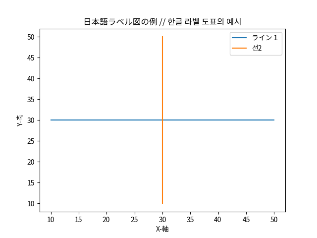
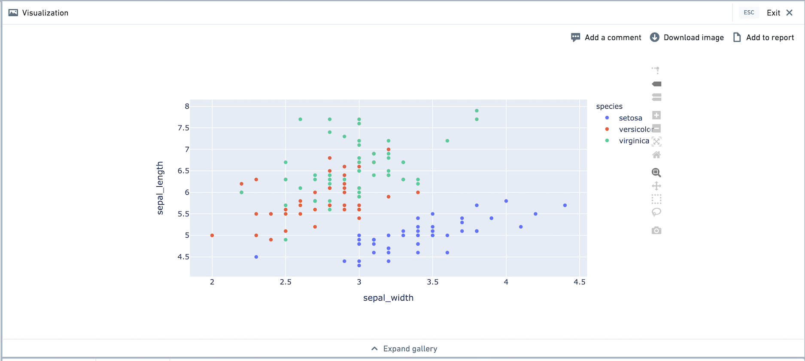
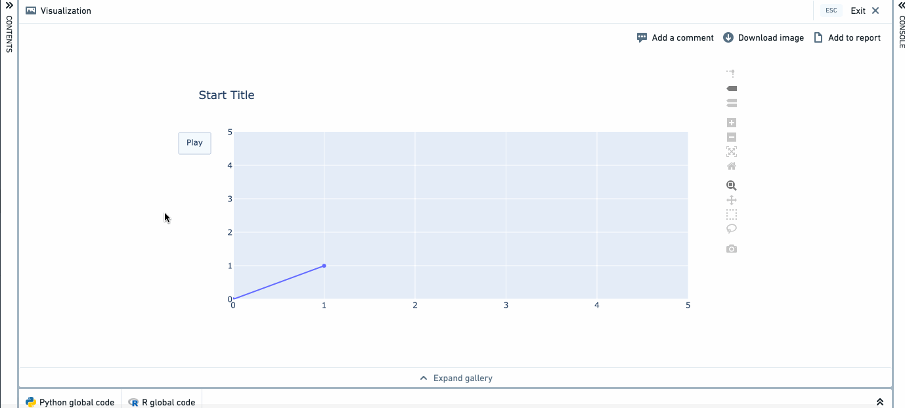

<!-- source: https://palantir.com/docs/foundry/code-workbook/transforms-visualize/ · mirrored 2026-08-26 from Palantir Foundry docs -->

# Visualize data

In Code Workbook, you can use open-source visualization libraries to display visualizations of your data. These visualizations can then be shared with others, for instance in [Notepad documents](/docs/foundry/notepad/widgets-code-workbook-chart/).

## Python Visualizations

In Python, Code Workbook supports visualizations using Matplotlib, Seaborn, and Plotly.

### Using Matplotlib and Seaborn

When using Matplotlib, a call to `matplotlib.pyplot.show()` causes the resulting plot image to be saved in the transform output and returned to the user interface, allowing the creation of customized plots. As with any visualization, you can download this image by right-clicking the transform in the graph and choosing **Download image**.

Here is an example of a transform that uses Matplotlib to render a visualization:

```python
def viz_plot_univariate_distribution_using_histogram(input_dataset):
    import matplotlib.mlab as mlab
    import matplotlib.pyplot as plt

    INPUT_DF = input_dataset
    SELECTED_COLUMN = "column_to_plot" # Note this should be a numeric column
    NUM_BINS = number_of_bins

    # Histogram the selected column
    bins, counts = INPUT_DF.select(SELECTED_COLUMN).rdd.flatMap(lambda x:x).histogram(NUM_BINS)

    # Plot the histogram
    fig, ax = plt.subplots()
    ax.hist(bins[:-1], bins, weights=counts, density=True)

    ax.set_xlabel(SELECTED_COLUMN)
    ax.set_ylabel('Probability density')
    ax.set_title(r'Histogram of ' + str(SELECTED_COLUMN))

    # Tweak spacing to prevent clipping of ylabel
    fig.tight_layout()
    plt.show()
```

When using Seaborn, a data visualization library based on Matplotlib, you must call `matplotlib.pyplot.show()` to return the image to the frontend.

You can add Seaborn to your environment by [editing your profile](/docs/foundry/administration/configure-code-workbook-profiles/#conda-environment) or by [customizing your workbook's environment](/docs/foundry/code-workbook/environment-overview/#modify-a-profile).

```python
def seaborn_example(pandas_df):
    import seaborn as sns
    import matplotlib.pyplot as plt

    sns.set_theme()

    # Create a visualization
    sns.relplot(
        data=pandas_df,
        x="price", y="minimum_nights"
    )

    # This is necessary to capture the plot
    plt.show()
```

```python
def seaborn_violinplot(pandas_df):
    import seaborn as sns
    import matplotlib.pyplot as plt

    sns.violinplot(x="col_A", y="col_B", data=pandas_df);
    plt.show()
```

By default, the output of Matplotlib and Seaborn visualizations in Code Workbook will be in PNG format. To output Matplotlib and Seaborn visualizations in SVG format, use the following code before your plot:

`set_output_image_type('svg')`

Or, use a hint for better visibility:

```python
@output_image_type('svg')
def chart(input):
    # create chart here
```

## Plotting with different languages and fonts using Matplotlib

To plot labels and text in languages using non-Roman characters (such as Japanese or Korean) or in non-default fonts using Matplotlib, you must specifically specify which font family you would like Matplotlib to use when rendering images. For more information, refer to the [list of available fonts installed by default](/docs/foundry/code-workbook/available-fonts/).

Here is an example of how to specify fonts for Matplotlib:

```
def japanese_korean_matplotlib_example():
    import matplotlib.mlab as mlab
    import matplotlib.pyplot as plt
    from matplotlib import rcParams
    # Set font family to the Noto Sans CJK font pack
    rcParams['font.family'] = 'Noto Sans CJK JP'
    # create data
    x = [10,20,30,40,50]
    y = [30,30,30,30,30]

    # plot lines
    plt.plot(x, y, label = "ライン１")
    plt.plot(y, x, label = "선2")
    plt.xlabel("X-軸")
    plt.ylabel("Y-축")
    plt.legend()
    plt.title("日本語ラベル図の例 // 한글 라벨 도표의 예시")
    plt.show()
```



:::callout{title="Matplotlib 2.* Font Designation"}
For `Matplotlib 2.*`, `.ttc` font files are not detected by Matplotlib automatically. Either upgrade to `3.*` or directly add the font filepath to Matplotlib's font manager.

```python
from matplotlib import rcParams
import matplotlib.font_manager as fm
fm.fontManager.ttflist += fm.createFontList(["/usr/share/fonts/opentype/noto/NotoSansCJK-Regular.ttc"])
rcParams['font.family'] = 'Noto Sans CJK JP'</pre>
```
:::

### Using Plotly

Plotly is a visualization library that allows you to create interactive images. To use Plotly, first make sure it is included in your environment.

A call to `fig.show()` causes the resulting plot image to be saved as part of the transform output and returned to the user interface. Here is an example of a transform that uses Plotly to render a visualization, using Plotly Express. Plotly Express comes pre-loaded with the iris dataset.

```python
def plotly_example():
    import plotly.express as px
    df = px.data.iris()
    fig = px.scatter(df, x = "sepal_width", y = "sepal_length", color = "species")
    fig.show()

```

After running the transform, the Plotly visualization will appear in the visualization tab. We recommend viewing the visualization in full screen mode. You are able to use functionality like zooming in and out, selection on the graph, and so on.



Here is a more complex example, which produces an animated visualization.

```python
def plotly_example_2():
    import plotly.graph_objects as go
    fig = go.Figure(
        data=[go.Scatter(x=[0, 1], y=[0, 1])],
        layout=go.Layout(
            xaxis=dict(range=[0, 5], autorange=False),
            yaxis=dict(range=[0, 5], autorange=False),
            title="Start Title",
            updatemenus=[dict(
                type="buttons",
                buttons=[dict(label="Play",
                          method="animate",
                          args=[None])])]
        ),
        frames=[go.Frame(data=[go.Scatter(x=[1, 2], y=[1, 2])]),
            go.Frame(data=[go.Scatter(x=[1, 4], y=[1, 4])]),
            go.Frame(data=[go.Scatter(x=[3, 4], y=[3, 4])],
                     layout=go.Layout(title_text="End Title"))]
        )

    fig.show()
```

## R Visualizations

In R, Code Workbook supports visualizations using ggplot2 and plotly.



### Using ggplot2

```r
fare_distribution <- function(titanic_dataset) {
    hist(titanic_dataset$Fare)
    return(titanic_dataset)
}
```

```r
example_ggplot <- function() {
    library(ggplot2)
    theme_set(theme_bw())  # pre-set the bw theme
    data("midwest", package = "ggplot2")

    # Scatterplot
    gg <- ggplot(midwest, aes(x=area, y=poptotal)) +
        geom_point(aes(col=state, size=popdensity)) +
        geom_smooth(method="loess", se=F) +
        xlim(c(0, 0.1)) +
        ylim(c(0, 500000)) +
        labs(subtitle="Area Vs Population",
            y="Population",
            x="Area",
            title="Scatterplot",
            caption = "Source: midwest")

    plot(gg)
    return(NULL)
}
```

By default, ggplot visualizations will be outputted as PNGs. To produce R ggplot visualizations in SVG format, add a hint using a comment:

```r
fare_distribution <- function(titanic_dataset) {
    # image: svg
    hist(titanic_dataset$Fare)
    return(titanic_dataset)
}
```

To customize the PNG or SVG output, you can call the `png()` or `svg()` function using the built-in `graphicsFile` variable as filename.

```r
unnamed_1 <- function() {
    png(
      filename=graphicsFile,
      width=800,
      height=400,
      units="px",
      pointsize=4,
      bg="white",
      res=300,
      type="cairo")

    plot(1:10, 1:10)
}
```

Note that if you want to use a custom `svg()` function, you will also need to provide a comment hint described above.

```r
unnamed_1 <- function() {
    # image: svg
    svg(
      filename=graphicsFile,
      width=5,
      height=9,
      pointsize=4,
      bg="white")

    plot(1:10, 1:10)
}
```

### Using Plotly

[Plotly ↗](https://plotly.com/r/) allows you to make interactive graphs. To use Plotly in R, add the `r-plotly` package to your environment. Plot graphs with `plot()` or `print()` to show them on the frontend. Here is a simple example:

```r
plotly_example <- function() {
    library(plotly)

    scatter_plotly <- plot_ly (
        x = rnorm(1000),
        y = rnorm(1000),
        mode = "markers",
        type = "scatter"
    )
    plot(scatter_plotly)
}
```

## Plotly limitations

The following notes apply to both Python and R.

* In the console, Plotly visualizations will be converted to images and displayed as PNGs. They will not be interactive. To view an interactive visualization, write the code in a transform node in the graph.
* When creating Plotly visualizations, visualizations with more than 20,000 points are not recommended due to degraded browser performance. If creating a scatterplot with a large number of points, use `scattergl` for better performance.

## Matplotlib limitations

The following limitations on Matplotlib apply to Python.

* [Matplotlib is not thread safe. ↗](https://matplotlib.org/stable/users/faq/howto_faq.html#work-with-threads)
  * When running multiple nodes, Spark will run these computations in parallel. As a result, unintended behavior may be revealed in the form of Matplotlib Runtime Exceptions or visualizations created in incorrect nodes.
* When using multiple Matplotlib visualizations in separate nodes within a single Code Workbook, you must lock each node. You can lock each node with the thread-safe decorator `@synchronous_node_execution`, as shown below.

```python
import matplotlib.mlab as mlab
import matplotlib.pyplot as plt
from matplotlib import rcParams
@synchronous_node_execution
def thread_safe_node():
    # Set font family to the Noto Sans CJK font pack
    rcParams['font.family'] = 'Noto Sans CJK JP'
    # create data
    x = [10,20,30,40,50]
    y = [30,30,30,30,30]

    # plot lines
    plt.plot(x, y, label = "ライン１")
    plt.plot(y, x, label = "선2")
    plt.xlabel("X-軸")
    plt.ylabel("Y-축")
    plt.legend()
    plt.title("日本語ラベル図の例 // 한글 라벨 도표의 예시")
    plt.show()
```
