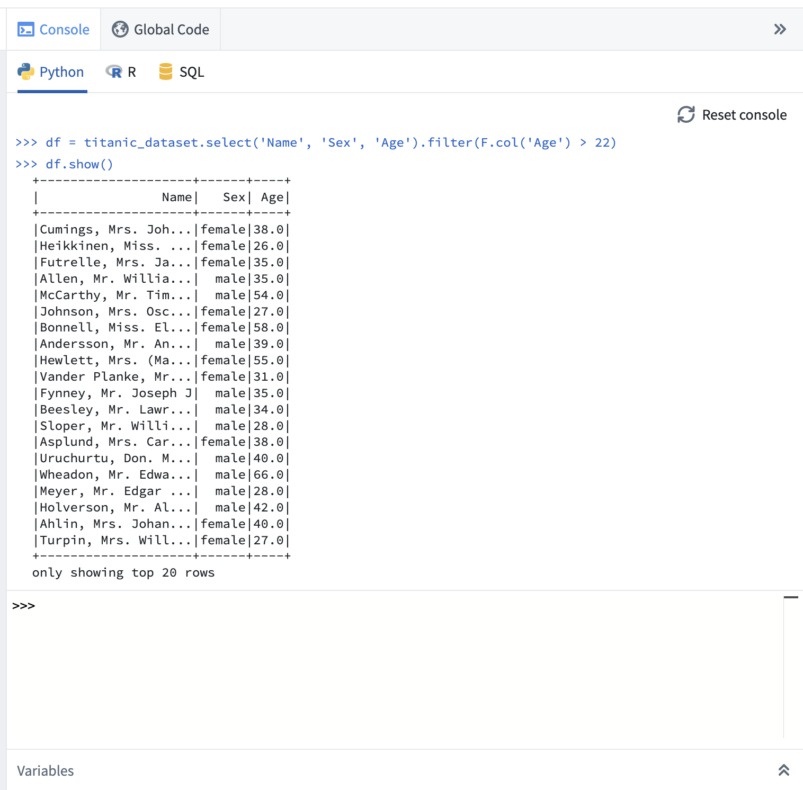
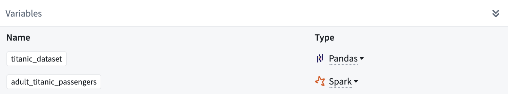

<!-- source: https://palantir.com/docs/foundry/code-workbook/workbooks-console/ · mirrored 2026-08-26 from Palantir Foundry docs -->

# Console

On the right side of the workbook, the console provides a REPL (read-evaluate-print loop), enabling rapid, ad-hoc analysis of any transform on the graph. There is one console for each language enabled on your branch.

When using the console:

* Use the Enter key to execute the current code input.
* Use Shift+Enter to input a newline and create multi-line statements.
* Use the Up and Down keys to navigate through previously executed commands.

Beneath the console, use the **Variables** pane to set the input type of a given transform to the console.

If a console command returns a dataframe, you can use the **+ Add to graph** button to convert the console command into a transform. This allows you to experiment with logic in the console before promoting it to be a repeatable transform.

You can use the [keyboard shortcut](/docs/foundry/code-workbook/keyboard-shortcuts/) Ctrl+Shift+Enter on Windows or Cmd+Shift+Enter on macOS to send code from a transform directly to the console.
