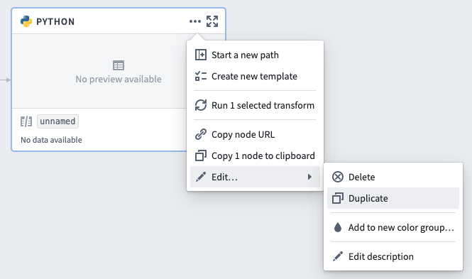
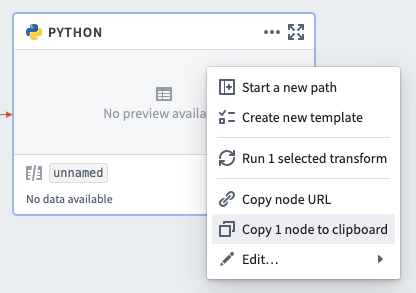

<!-- source: https://palantir.com/docs/foundry/code-workbook/workbooks-duplicate-nodes/ · mirrored 2026-08-26 from Palantir Foundry docs -->

# Duplicate nodes

Nodes can be duplicated one at a time within a Code Workbook. To duplicate a node, first open the node menu by either selecting the **...** button in the top right of the node or right-clicking anywhere on the node. Then, hover on **Edit...** to reveal a submenu and select Duplicate.

## Copy/paste nodes

Nodes can also be duplicated by using copy/paste. The following method allows you to create a copy of a node or set of nodes within the same Code Workbook or in different Code Workbooks. Doing so allows you to transfer the contents of one Code Workbook to another.

1. Switch to select mode in the top right corner of your screen.

2. Select the nodes to copy by clicking and dragging to draw a box around the desired nodes. You can also hold down `Cmd` on a Mac or `Ctrl` on a Windows machine and click on each node in turn.

3. Right-click on the selected nodes and choose **Copy X node to clipboard**. Alternatively, you can copy the nodes using the [keyboard shortcut](/docs/foundry/code-workbook/keyboard-shortcuts/) `Cmd+C` (macOS) or `Ctrl+C` (Windows).

4. While in select mode, paste the nodes into the desired destination using the [keyboard shortcut](/docs/foundry/code-workbook/keyboard-shortcuts/) `Cmd+V` (macOS) or `Ctrl+V` (Windows).
