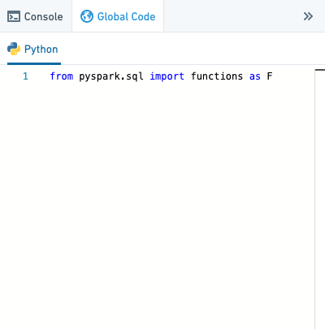
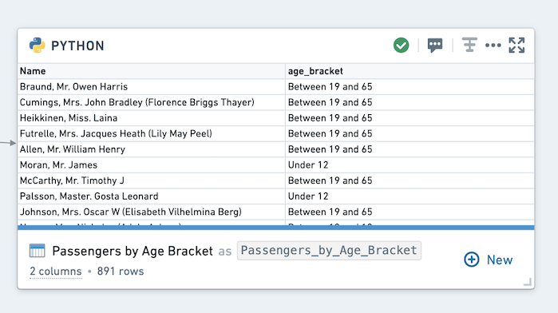

<!-- source: https://palantir.com/docs/foundry/code-workbook/workbooks-global-code/ · mirrored 2026-08-26 from Palantir Foundry docs -->

# Global code

The Global Code pane, accessible on the right-hand side of the Workbook interface, allows you to define variables and functions that will be available in all code transforms of that language across the Workbook. For instance, you can use global code to define constants that will be used in multiple transforms or define helper functions you want to use repeatedly.

## Example

In this example, write a simple function based on the `titanic_dataset` that takes the age of a passenger and returns their age bracket.

Begin by opening the Python Global Code panel at the right of the page, which looks like this:



Once the Global Code panel is open, copy-paste the following code into the panel:

```python
def return_age_bracket(age):
  if age is None: 
    return 'Not specified'
  elif (age <= 12):
    return '12 and under'
  elif (age >= 13 and age < 19):
    return 'Between 13 and 19'
  elif (age >= 19 and age < 65):
    return 'Between 19 and 65'
  elif (age >= 65):
    return '65 and over'
  else: return 'N/A'
```

To use this global function, create a new Python transform derived from `titanic_dataset` and paste the following code into the transform:

```python
def passengers_by_age_bracket_udf(titanic_dataset):
  from pyspark.sql.functions import udf

  input_df = titanic_dataset

  age_bracket_udf = udf(return_age_bracket)

  output_df = input_df.withColumn("age_bracket", age_bracket_udf(input_df.Age))
  output_df = output_df.select(output_df.Name, output_df.age_bracket)

  return output_df
```

Now run the code. You will see the following output:



This code may take some time to run since user defined functions (UDFs), especially with loops, can often be inefficient. Using globally defined functions is not always a best practice. For this example, `pyspark.functions` offers a simpler method: `when((condition), result).otherwise(result)`.

Try to get the same result as above without using a UDF:

```python
def passengers_by_age_bracket(titanic_dataset):
  from pyspark.sql import functions as F

  input_df = titanic_dataset
  output_df = input_df.withColumn("age_bracket", F.when(input_df.Age.isNull(), 'Not specified')\
                                                  .when( input_df.Age <= 12, '12 and under')\
                                                  .when(( (input_df.Age >= 13) & (input_df.Age < 19)), 'Between 13 and 19')\
                                                  .when(( (input_df.Age >= 19) & (input_df.Age < 65)), 'Between 19 and 65')\
                                                  .when(input_df.Age >= 65, '65 and over').otherwise('N/A'))
  output_df = output_df.select('Name','age_bracket')

  return output_df
```

Under most conditions, the above transformation should run in a few seconds, compared to minutes with a UDF.

## Note on reproducibility

Note that in order to ensure that results are reproducible, mutating variables and functions in global code will not propagate to other transforms. For example, in Python, if you define a list in global code like this:

```python
my_list = [1,2,3,4]
```

And then update the list in your transform:

```python
def my_transform(input_df):
    my_list.append(5)
    print(my_list)
```

Running `my_transform` will print `[1,2,3,4,5]`, but other transforms will still receive a value of `[1,2,3,4]`.
