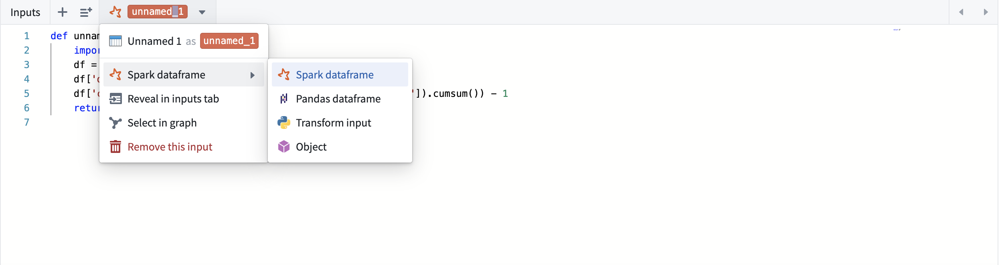
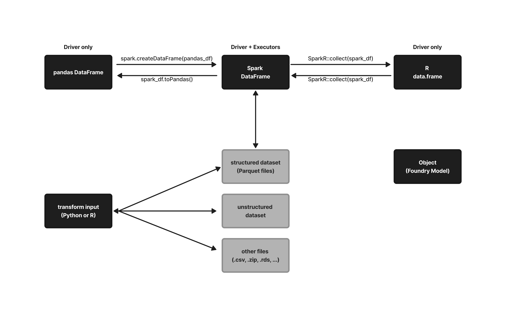
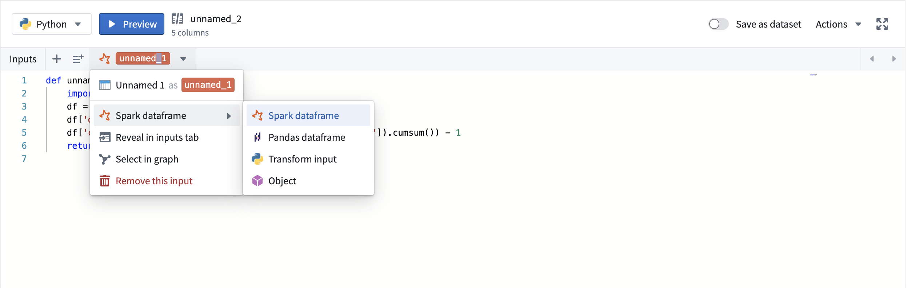
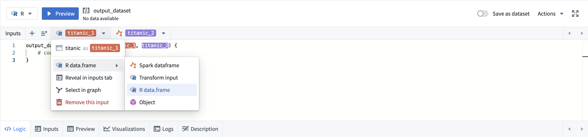

<!-- source: https://palantir.com/docs/foundry/code-workbook/workbooks-input-output-types/ · mirrored 2026-08-26 from Palantir Foundry docs -->

# Inputs and outputs

## Input types and conversions

Code Workbook allows you to specify the type of each input that a transform will receive. You can set the input type by selecting the dropdown menu under the transform's name:

In case the requested input type does not match the type of the actual input coming in, Code Workbook performs the necessary conversions.

For example: If `transform_A`'s output is a pandas dataframe, and its derived transform `transform_B` manually sets the input as a Spark dataframe, Code Workbook will convert the pandas dataframe into the requested Spark dataframe. If `transform_C`'s output is a pandas dataframe, and its derived `transform_D` requests its input to be an R data.frame, Code Workbook will first convert the pandas dataframe back into a Spark dataframe, then into an R data.frame.

The following flowchart provides an overview of how Code Workbook handles conversions between input types:

## Input and output restrictions

### Output types

A Code Workbook transform can have any amount of inputs, each of which can have a different input type configured. However, a transform can only have a single output. Multiple outputs are not currently supported.

Code Workbook only allows certain types of outputs in its transforms, depending on language:

|Language               |Permitted Output Types                                             |
|---                    |---                                                                |
|Python                 |Spark dataframe, Pandas dataframe, FoundryObject, None             |
|R                      |R data.frame, FoundryObject, NULL                                  |
|SQL                    |Spark dataframe                                                    |

If a transform returns any other type than the ones listed above, Code Workbook will return an unsupported type error.

:::callout{theme="neutral" title="Note on None and NULL output types"}
Code Workbook will let you run a transform that has a None/NULL return value, but downstream transforms will not accept None/NULL as an input.
:::

### Python input types

By default, a python transform will accept its inputs as Spark dataframes. You can set the input type by selecting the dropdown menu under the transform's name, and Code Workbook will take care of converting upstream outputs into the desired input type:

The following input types are supported in Python transforms:

|Input types                                                                        |Description                                                                    |
|---                                                                                |---                                                                            |
|Spark dataframe (default)                                                          |pySpark dataframe of class `pyspark.sql.dataframe.DataFrame`                   |
|Pandas dataframe                                                                   |Pandas dataframe of class `pandas.core.frame.DataFrame`                        |
|Python transform input (only available on inputs 'saved as dataset')      |A `FileSystem` object that allows direct file access on the input. See [Access unstructured files](/docs/foundry/code-workbook/transforms-unstructured/) documentation.  |
|Object                                                                             |A Foundry Model Object allowing you to perform modeling workflows. See [Models](/docs/foundry/model-integration/models/) documentation. |

### R input types

By default, an R transform will accept its input(s) as R data.frames. You can set the input type by selecting the dropdown menu under the transform's name, and Code Workbook will convert upstream outputs into the desired input type:

The following input types are supported in R transforms:

|Input types                                                                        |Description                                                                    |
|---                                                                                |---                                                                            |
|Spark dataframe                                                                    |SparkR dataframe of class `SparkDataFrame`                                     |
|R data.frame (default)                                                             |R dataframe of class `data.frame`                                              |
|R transform input (only available on inputs 'saved as dataset')                    |A `FileSystem` object that allows direct file access on the input. See [Access unstructured files](/docs/foundry/code-workbook/transforms-unstructured/) documentation.  |
|Object                                                                             |A Foundry Model Object allowing you to perform modeling workflows. See [Models](/docs/foundry/model-integration/models/) documentation.                                                                                                                          |

### SQL input and output types

The only supported input and output types in SQL transforms are Spark dataframes. The dataframe can be read within SQL as a table.
