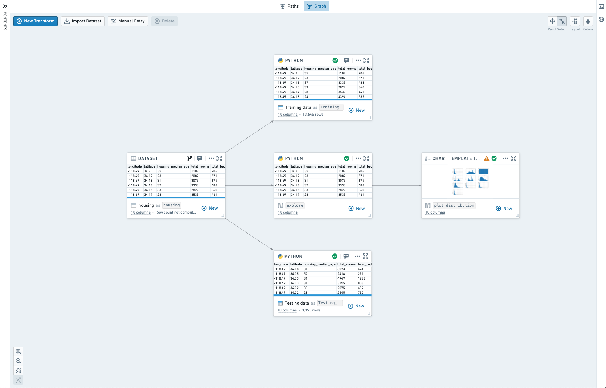
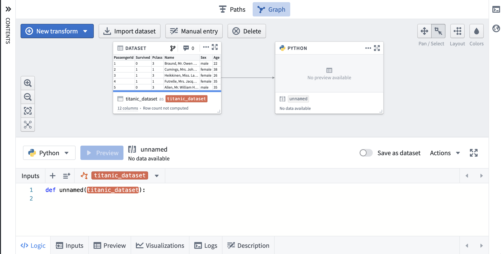
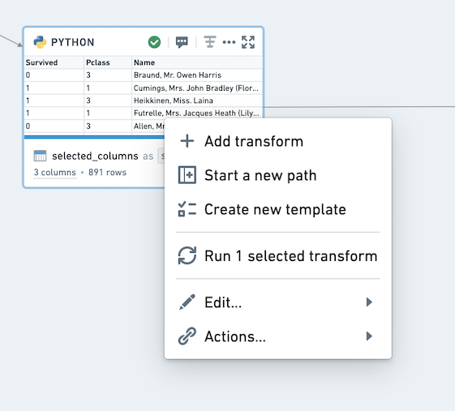
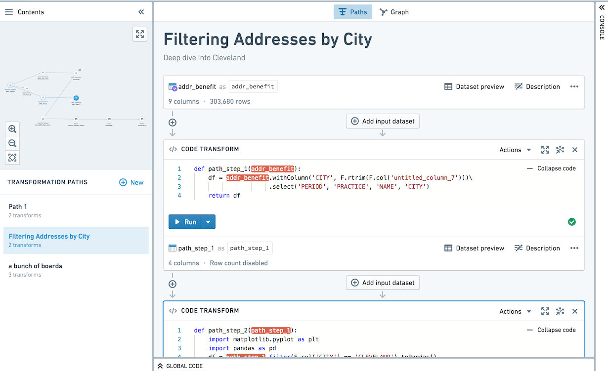
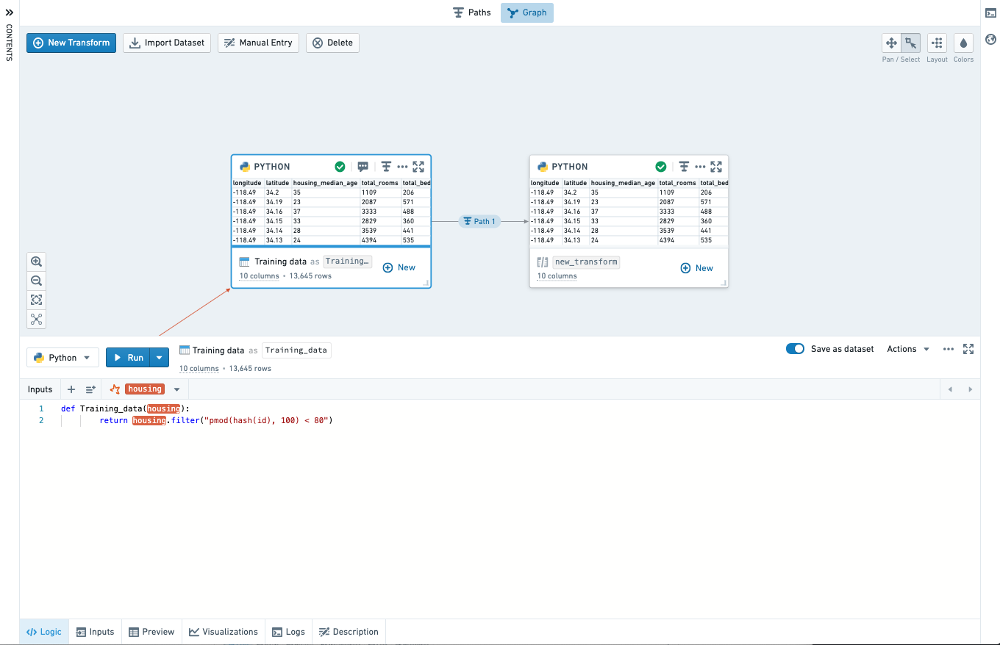
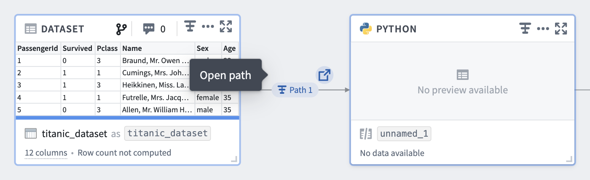
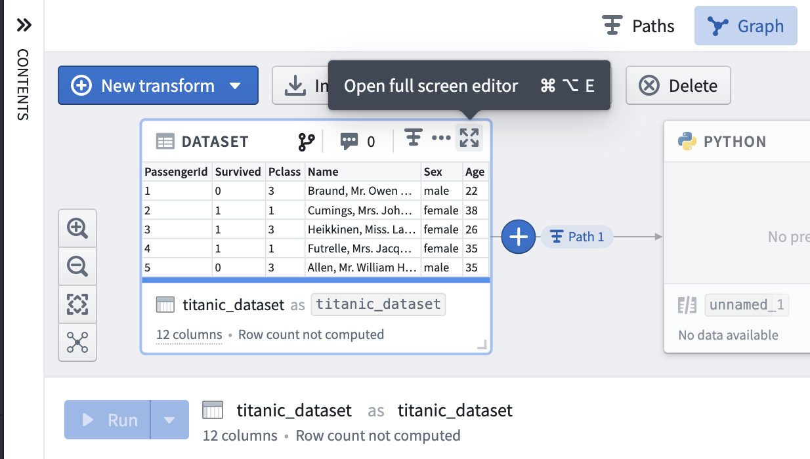
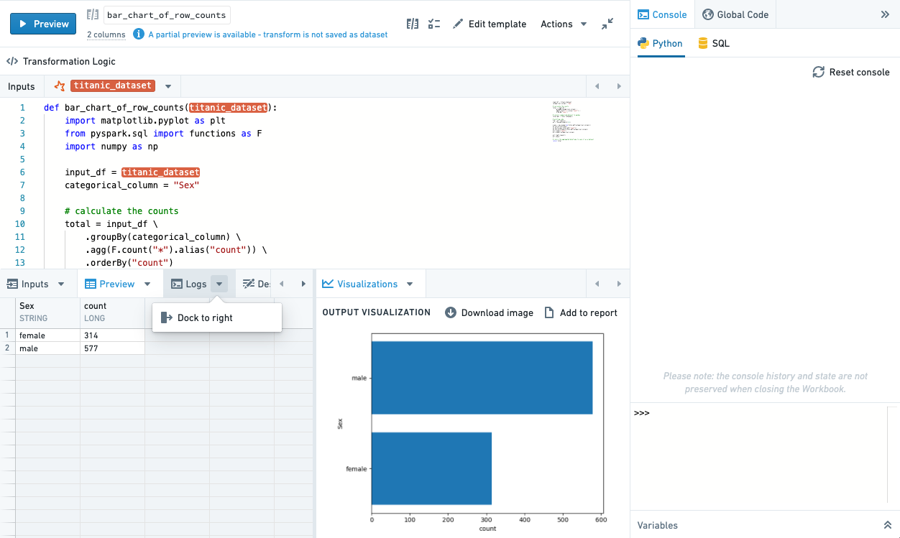
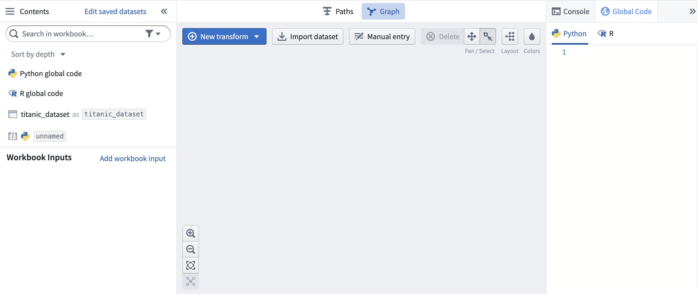
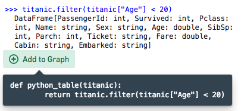

<!-- source: https://palantir.com/docs/foundry/code-workbook/workbooks-overview/ · mirrored 2026-08-26 from Palantir Foundry docs -->

# Workbooks

The main resource you interact with in Code Workbook is a **Workbook**. Workbooks are used to import datasets from Foundry and transform these input datasets for purposes such as:

* Cleaning and joining raw data imported from some external source to produce curated datasets for other users.
* Analyzing processed datasources to derive useful insights.
* Training and applying models to do predictive analysis.
* Creating parameterized visualizations to display in a report.

## Graph

The core component of the Workbook interface is the Graph. The Graph represents how data flows through logical steps in your Workbook to produce outputs.

Input datasets are imported from elsewhere in Foundry to be used as source data in the workbook. Other than input datasets, each node in the graph represents a **transform**. A transform is a piece of logic that can return an output dataframe or model, and possibly render a visualization. A transform may be saved as a derived **dataset**. When a transform is saved as a derived dataset, running the transform will automatically write the results to Foundry, allowing them to be used outside of this Code Workbook and easily shared with others.

There are three types of transforms available in Code Workbook:

* **Code** transforms allow you to write code to process inputs and return results.
* **Template** transforms provide a form-based interface to transformation code, making it simple to reuse and share code.
* **Manual entry** transforms allow users to input data into a node.

### Navigating the graph

Click on any transform in the graph to open the **Logic** panel at the bottom of the interface. This allows you to view and edit transform logic and view the transform output. You can select multiple transforms in the graph with Ctrl+Click on Windows or Cmd+Click on macOS.

To help navigate large Workbooks, you can use the zoom options in the lower left of the graph, which include a **Zoom to fit** button that zooms the graph to bring all transforms into view.

### Interacting with transforms

A key way to interact with transforms is through the *context menu*, which you can open by clicking on the ellipsis (**...**) on the top right of each transform in the graph, or by right-clicking on the transform in either the graph or the sidebar.

This menu provides a range of useful actions, including adding a new downstream transform, running the transform associated with this dataset, or deleting this transform from the Workbook. For transforms that are saved as datasets, the **Actions** option allows you to access the usual set of Foundry actions associated with the dataset.

If you select multiple transforms (by using Ctrl+Click on Windows or Cmd+Click on macOS), you can right-click anywhere on the graph to open the context menu for all the selected transforms. This can be helpful for adding a new transform with multiple inputs, or for running multiple transforms at once.

Hovering over a dataset name in the workbook will open a tooltip with the full path of the dataset in Foundry.

## Paths

You can switch to the Paths view at the top of your workbook. The Paths view is an alternate mode allowing for linear development within a workbook. The Paths view is well suited for workflows that drill down on one dataset and perform sequential transformation steps.

Paths can be started from datasets imported into the workbook, or transforms created in the workbook. In the Paths view, use the left sidebar to navigate between paths.

All transforms created in the Paths view are also persisted to the Graph. Navigate from a path node to the graph by clicking the **Open transform in Graph** icon () on the path node.

Within the Graph, you can see which nodes are part of a path by looking at the annotations on the edges between nodes. Hover over the annotation to open the source path.

You can also click on the Path icon on a node to open it in its source path.

## Full Screen Editor

You may want to focus on one transform and interact with that transform in full screen mode. From either the Graph or the Paths view, click on the expand button ( on a given node to view in Full Screen Editor.

When in fullscreen mode, you can rearrange your tabs to view two tabs at once by using the dock action or drag and drop.

To exit the Full Screen Editor and return to the Graph or Paths, use the Esc key or select the collapse button ().

## Panes

Code Workbook has three interface panes - [Contents](#contents), [Global Code](#global-code), and [Console](#console) - that are always available from the Graph, Paths view, and Full Screen Editor.

### Contents

On the left-hand side of the interface, click on the **Contents** bar to open the Workbook contents pane.

When in Graph mode, the Contents pane shows a list of all transforms in the Graph in order to summarize the entire Workbook. By default, this list of transforms is sorted in topological order; input datasets are at the top and the furthest downstream transforms are at the bottom. Next to each transform in the list, there is a zoom button that will center the graph on this transform. You can also zoom in on a selected transform using the space bar. Click on **Edit Saved Datasets** to change which transforms, if any, are saved as datasets.

When in the Paths view, the Contents pane shows a mini-graph of all of the transforms in the workbook, allowing quick navigation between nodes.

### Global Code

Use the [Global Code pane](/docs/foundry/code-workbook/workbooks-global-code/) on the right-hand side of the Workbook interface to define code (like variables or functions) that will be available in all code transforms of that language across the Workbook. For instance, you can use global code to define constants that will be used in multiple transforms or define helper functions you want to use repeatedly. [Learn more about how to use global code.](/docs/foundry/code-workbook/workbooks-global-code/)

### Console

On the right side of the workbook, the [console](/docs/foundry/code-workbook/workbooks-console/) provides a REPL (read-evaluate-print loop), enabling rapid, ad-hoc analysis of any dataset on the graph. [Learn more about how to use the console in each Workbook language.](/docs/foundry/code-workbook/workbooks-languages/)

Beneath the console, use the Variables pane to set the input type of a given transform in the console.

If a console command returns a dataframe, you can use the **+ Add to graph** button to convert the console command into a transform. This allows you to experiment with logic in the console before promoting it to be a repeatable transform.

You can use the [keyboard shortcut](/docs/foundry/code-workbook/keyboard-shortcuts/) Ctrl+Shift+Enter on Windows or Cmd+Shift+Enter on macOS to send code from a transform directly to the console.

