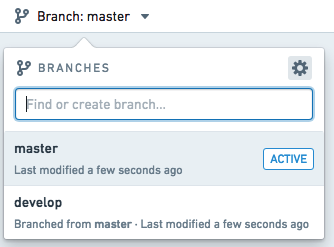
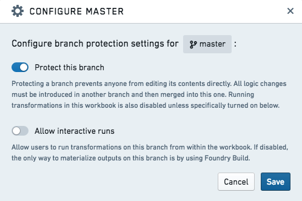
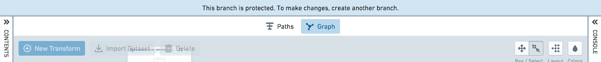
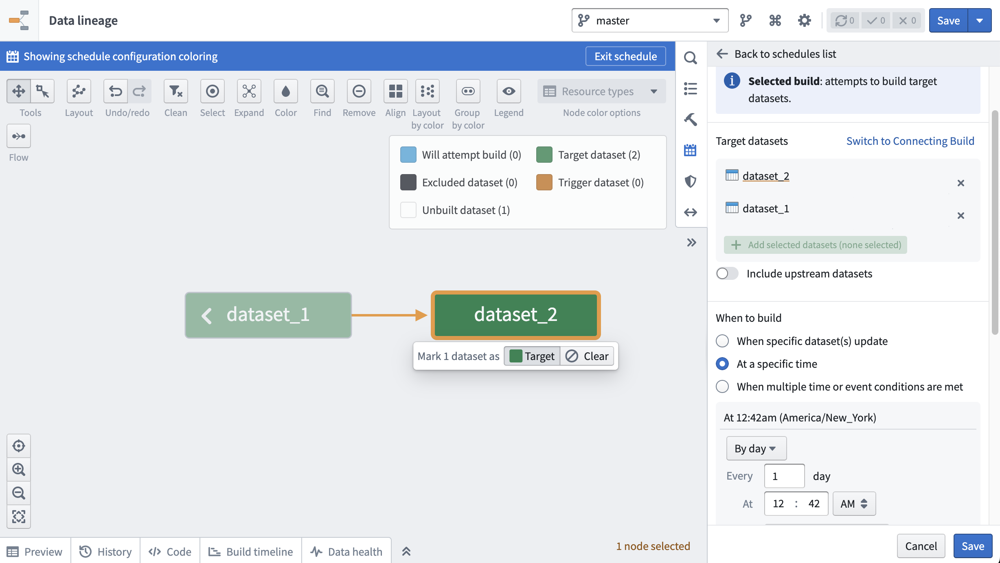
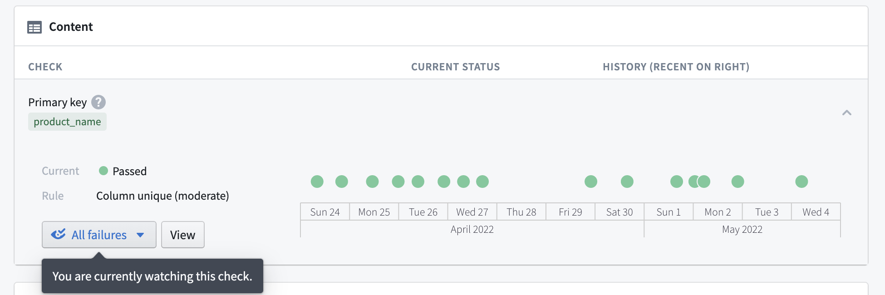
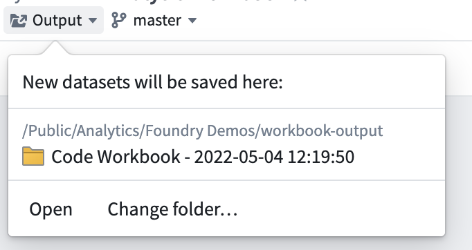
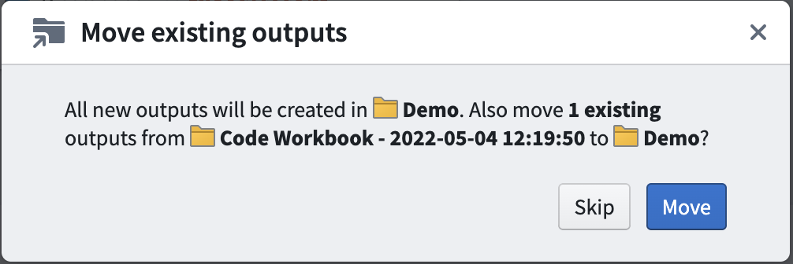
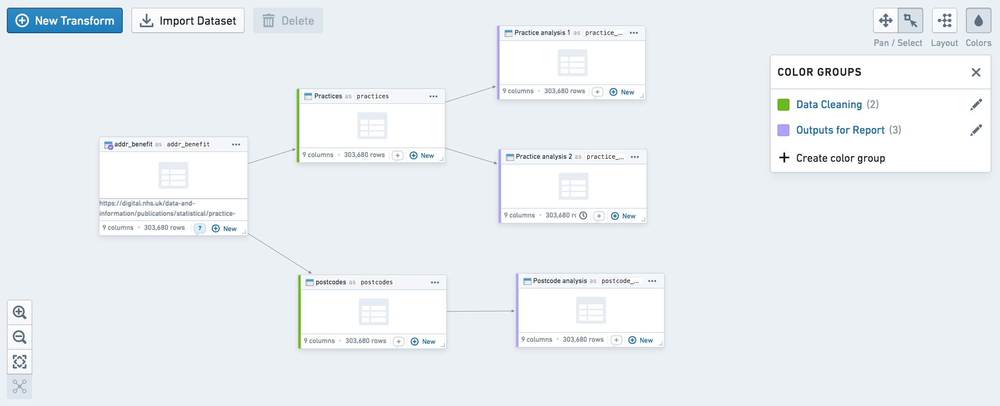
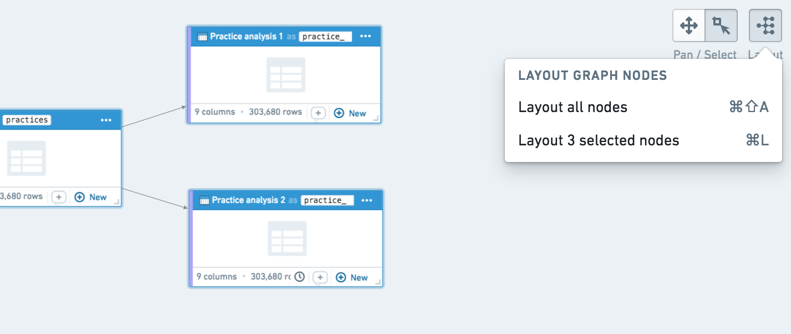

<!-- source: https://palantir.com/docs/foundry/code-workbook/workbooks-production/ · mirrored 2026-08-26 from Palantir Foundry docs -->

# Moving to production

:::callout{theme="neutral"}
We recommend using Code Workbook or Code Workspaces for code-based analyses and pipeline prototypes. We recommend Pipeline Builder and Code Repositories for robust production pipelines and support for workflows that require an additional layer of governance and scrutiny, high data, or optimized performance.

For more information about where to write your pipeline, review our [comparison of Code Workbook, Code Workspaces, and Code Repositories](/docs/foundry/code-workbook/code-products-comparison/).
:::

Once you are satisfied with the outputs you have derived in a Workbook, you should harden your logic and output datasets to make them reliable. Doing this in Code Workbook is straightforward. The following steps can help make your work robust and production-ready:

* [Protecting branches](#protecting-branches)
* [Using batch builds](#using-batch-builds)
* [Data health checks](#data-health-checks)
* [Organizing outputs](#organizing-outputs)
* [Organizing the graph](#organizing-the-graph)
* [Exporting to Code Repository](#exporting-to-code-repository)

## Protecting branches

:::callout{theme="neutral"}
To protect a branch in a Workbook, you must have Owner privileges on that Workbook.
:::

**Branch protection** allows branches within a Workbook to be locked down, preventing anyone from editing logic in that branch directly. Instead, logic changes must be created in another branch and then merged into the protected branch. Typically, users protect the `master` branch in a Workbook, but you can protect any other branches as well.

To protect a branch, click the settings icon () in the top right of the branch menu, as shown below.

Toggle on **Protect this branch** to enable branch protection, as shown below. By default, a protected branch does not allow any user to use the **Run** button on that branch to compute output datasets. This prevents Workbook runs from colliding with scheduled builds, which are described in the next section.

After saving, your branch will be protected and read-only.

## Using batch builds

You may want to regularly refresh output datasets created in Code Workbook, either based on the input dataset(s) updating, or on a time-based cadence. You can do this by scheduling a recurring build on these output datasets.

* To schedule a recurring build on one output dataset, open dataset actions and click on **Manage Schedules**.
* To schedule a recurring build on multiple output datasets, click the cog icon at the top of the workbook and select **Explore Data Lineage**. You should now see all input datasets and saved output datasets from your workbook.

Both actions will bring you to the Data Lineage app. Click on the calendar icon in the right hand pane to open the **Manage Schedules** interface. Follow the prompts to set up a recurring schedule. In the image below, a schedule that builds `dataset_1` and `dataset_2` daily is shown.

[Learn more about creating schedules in Data Lineage.](/docs/foundry/data-lineage/manage-schedules/)

Note that batch builds will not update transforms that are not saved as datasets (e.g. unpersisted transforms). Concretely, consider the case where unpersisted transform A is the parent of persisted transform B. If I use batch build to build transform B, transform B will use the latest logic from transform A, and the latest data from the upstream input dataset. However, the preview shown in the workbook for transform A, as well as any visualization created in transform A, will not be updated by this batch build.

## Data health checks

Another best practice for output datasets is adding **Data Health checks**. Open your output dataset and click the Health tab to access the Data Health page. Setting health checks allows you to receive notifications if a dataset’s build fails, it becomes stale, or fails to conform to some other requirement you specify.

[Learn more about Data Health in Foundry.](/docs/foundry/health-checks/overview/)

## Organizing outputs

When using Workbooks as part of your project, we recommend creating the following folder structure in the project:

* **/data**
* **/workbooks**
* **/templates**

Once this folder structure is set up, you can share a new Workbook from your home folder easily:

1. Move your Workbook to the `/workbooks` directory.
2. If you created any templates in your Workbook, move them to the `/templates`directory.
3. To move datasets, click the Output dropdown in the top-left of the Workbook and then click “Change folder…” to choose a folder where new output datasets will be added. Choose the `/data` folder in your project. By default, all the datasets you derived in your Workbook will be moved to the new folder you choose.

## Organizing the graph

You may want to curate and organize your graph to allow other users to easily understand the flow of transformation. Two organizational features available in Code Workbook are node coloring and auto-layout.

You can use node coloring to visually group nodes on the graph. Create a new color group by clicking on the **Colors** button at the top right, and add nodes to the color group by selecting them and using the **+** button on the color group. In the workbook contents helper, you can also sort the list of datasets by color group.

You can also auto-layout sections of your graph by clicking the layout button at the top right. By default, auto-layout arranges the entire graph, but you can also select specific nodes and click auto-layout to arrange only those nodes.

## Exporting to Code Repository

If you have finished prototyping a pipeline in Code Workbook and would like to move your code to Code Repositories, you can use the **Export to Code Repository** helper. [Learn more about exporting to Code Repositories.](/docs/foundry/code-workbook/code-repositories-export/)

You may want to move your code to Code Repositories for a variety of reasons:

* Code Repositories provides full Git support, allowing users to view and revert to previous commits.
* Code Repositories supports incremental transforms and multi-output transforms.
* Code Repositories supports [unmarking workflows](/docs/foundry/building-pipelines/remove-inherited-markings/) and provides control over when PRs can be merged using [branch settings](/docs/foundry/code-repositories/branch-settings/).
