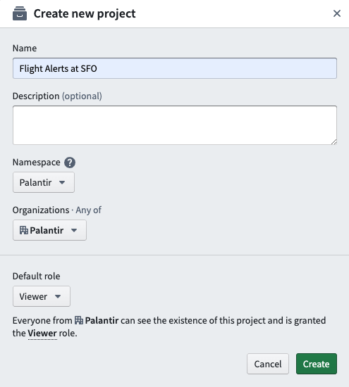

<!-- source: https://palantir.com/docs/foundry/compass/create-a-project/ · mirrored 2026-08-04 from Palantir Foundry docs -->

# Create a Project

If you have the [appropriate permissions](/docs/foundry/security/projects-and-roles/#create-projects), you can create new Projects by navigating to the Projects landing page and selecting **+ New project** located in the upper right.

Select **Project** to open a **Create new project** pane.

Name your Project, add an optional description, and select a location ([**space**](/docs/foundry/security/orgs-and-spaces/#spaces)) where your Project will live. You can also change the default role for users within your Organization.

To set the default role that is initially selected for a particular space, go to the corresponding [**space settings**](/docs/foundry/platform-security-management/manage-orgs-and-spaces/) and change the Project default roles.

Select **Create** to enter your new Project dashboard.

## Add documentation

You can add documentation to any folder by dragging and dropping a Markdown file named `README.md` into the folder, or selecting **Add description** from the folder’s Actions menu. [Standard Markdown ↗](https://daringfireball.net/projects/markdown/syntax) is supported, with some security-related restrictions:

* Inline HTML is disabled.
* Unless otherwise configured, only image files uploaded to Foundry will be rendered. Markdown for Foundry-hosted images is as follows: ``.

Links to Foundry resources are also supported. Use the following syntax to have the description automatically add links with icon and file name inferred: `[optional link text](rid)`.

:::callout{theme="neutral"}
Existing `.md` files in a Project will not automatically convert to be rendered in place, even if they are correctly named `README.md`. Downloading the existing `README.md`, deleting it from the folder, and re-uploading it will make it display.
:::
