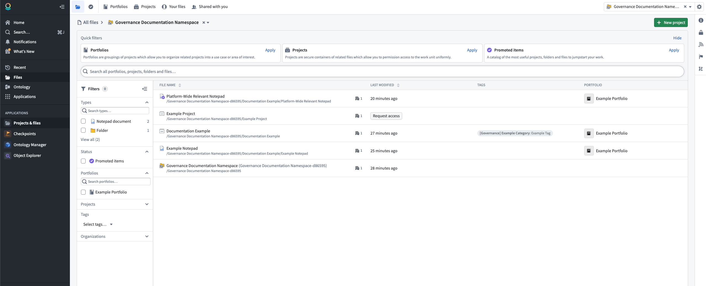
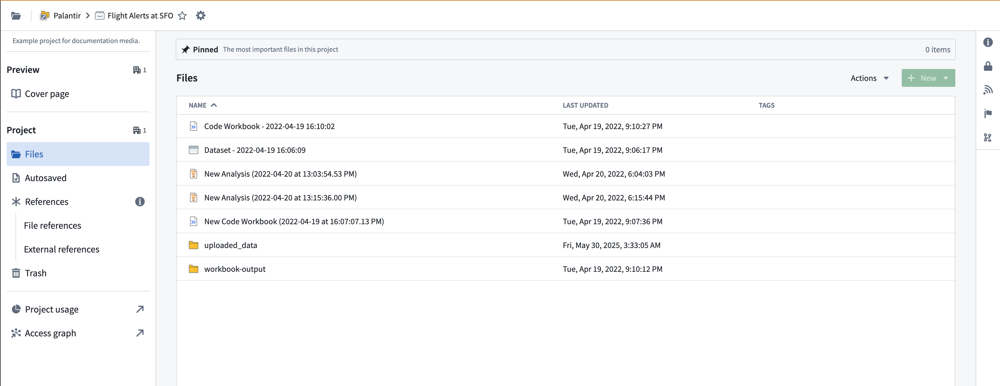

<!-- source: https://palantir.com/docs/foundry/compass/overview/ · mirrored 2026-08-18 from Palantir Foundry docs -->

# Compass

**Compass** is the filesystem for the Palantir platform. You can use Compass to organize and manage your projects, resources, and folders.

The most basic units in the platform are [**resources**](/docs/foundry/getting-started/projects-and-resources/), which are analogous to a *file* in a traditional filesystem. You can store resources in [**projects**](/docs/foundry/getting-started/projects-and-resources/), which are collaborative spaces that organize people, resources, and folders for a particular purpose. The **Files** page allows you to browse, share, secure, and organize your resources and projects in one place.

To find your resources, select **Files** in the workspace navigation sidebar. At the top of the page, you can use tabs to navigate between [**Portfolios**](/docs/foundry/security/portfolios/), [**Projects**](/docs/foundry/getting-started/projects-and-resources/), **Your files** (visible only to you), and [**Shared with you**](/docs/foundry/compass/move-and-share-resources/).

Below the tabs, quick filter cards allow you to filter the view by portfolios, projects, or [**Promoted items**](/docs/foundry/compass/resource-status/). If you need access to a project, select [**Request access**](/docs/foundry/security/projects-and-roles/#request-access-to-a-project) to submit an access request.

You can further refine the file list using the **Filters** panel in the left sidebar. Filter options include resource type, status, portfolio, project, organization, and tag. Select a project to access the project dashboard, or [create a new project](/docs/foundry/compass/create-a-project/).

When you open a project dashboard, you can view the following areas: **Files**, **Autosaved**, **References** (file and external), **Trash**, and **Sensitive Data Scanner**.

* **Files:** A collection of all resources within a project. Pinned resources appear at the top for quick access.
* **Autosaved:** Resources created within the project that were automatically saved without a designated location.
* **References:** A collection of resources that flow into the project, including file references and external references.
* **Trash:** Resources deleted from the project that are available for recovery or permanent deletion.
* **Sensitive Data Scanner:** A view for operational users to review [personally identifiable information (PII)](/docs/foundry/sensitive-data-scanner/overview/) detections.
