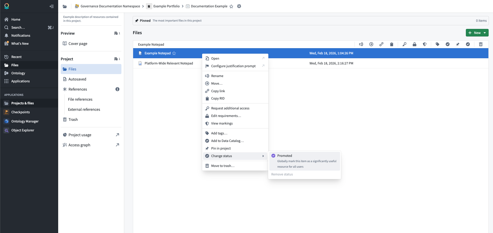
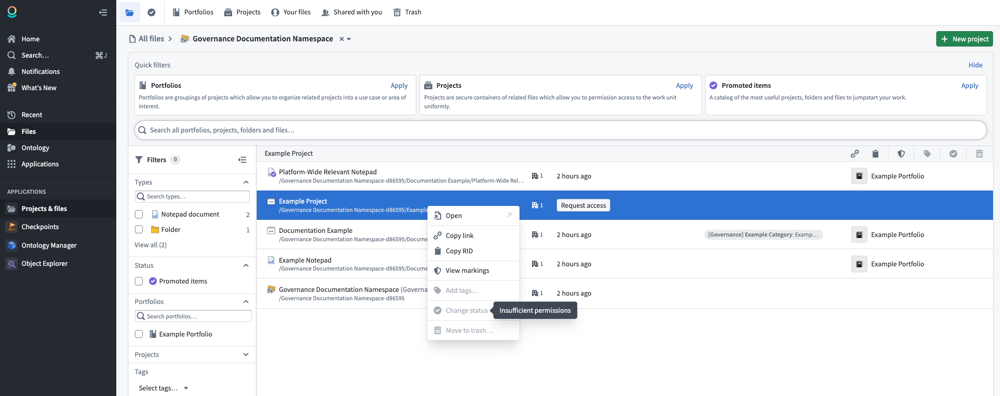

<!-- source: https://palantir.com/docs/foundry/compass/resource-status/ · mirrored 2026-08-18 from Palantir Foundry docs -->

# Resource status

Resource status allows you to indicate the importance of resources in the platform. Setting a status on a resource affects its visibility in search results, changes how it appears to other users, and influences how the platform treats the resource. Currently, the only available status is **Promoted**.

## Promoted status

You can mark a resource as **Promoted** to signal that it is recommended for all users. Promoted resources receive the following benefits:

* **Search visibility:** Promoted resources are boosted in search results across the platform for all users, making them easier to discover.
* **Visual indicator:** Promoted resources are marked with a checkmark icon, allowing users to quickly identify high-value content.
* **Quick filters:** Promoted resources appear in the **Promoted items** quick filter on the [Compass landing page](/docs/foundry/compass/overview/), providing a curated catalog of the most useful projects, folders, and files.

### Promote a resource

Take the following steps to promote a resource:

1. Navigate to the project or folder containing the resource.
2. Right-click on the resource to open the context menu.
3. Select **Change status**, then select **Promoted**.

:::callout{theme="warning"}
To promote a resource, you must have the **Editor** [role](/docs/foundry/security/projects-and-roles/#roles) or higher on that resource, and you must be granted the **Resource Curator** role at the [space](/docs/foundry/security/orgs-and-spaces/#spaces) level.
:::

### Remove promoted status

To remove the promoted status from a resource:

1. Right-click on the resource to open the context menu.
2. Select **Change status**, then select **Remove status**.

The resource will return to its default state with no status applied.
