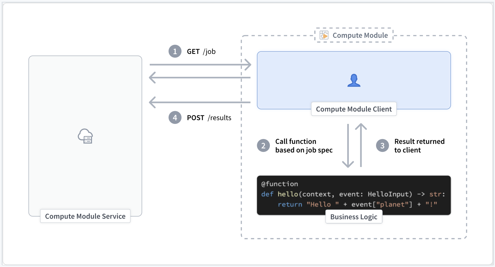

<!-- source: https://palantir.com/docs/foundry/compute-modules/advanced-custom-client/ · mirrored 2026-08-14 from Palantir Foundry docs -->

# Create a custom compute module client (Advanced)

## Why do I need a client?

If you are writing a compute module in a supported language (Python, Java, or TypeScript) and [use our available SDK](/docs/foundry/compute-modules/get-started/#build-a-compute-module-backed-function), you do not need to manually  create client logic.

However, if you are not using the SDK or need to build a compute module using a language that is not currently supported, you must create a compute module client yourself using the process explained below.

## Custom client responsibilities

A compute module client manages the execution of the logic within a compute module and handles three primary responsibilities:

### Post the function schema of your compute module (optional)

Before starting the main execution cycle of the client, we recommend publishing the schema of your compute module function(s). This exposes the schema of your compute module to the rest of Foundry. Alternatively, you can define this function schema manually in the **Functions** tab of your compute module.

For more information review our documentation on [automatic function schema inference](/docs/foundry/compute-modules/functions/#automatic-function-schema-inference).

### Poll for new jobs

The client polls the internal compute module service continuously for new jobs that must be processed. If a job is present, the client will find the function corresponding to that job and call that function with the associated payload.

### Post the result (output) of the compute module

Once a function completes and returns the result to the client, the client is responsible for reporting that output back to the compute module service.

Below is a simple visual representation of a compute module client execution lifecycle:



## API reference

:::callout{theme="warning"}
You may see 'connection refused' errors when first attempting to send HTTP requests to the internal compute module service. This is expected behavior during startup and can be fixed with a retry after a short sleep period.
:::

## `GET` job

### Variables

**MODULE\_AUTH\_TOKEN** `string`

* Review our [environment variables](/docs/foundry/compute-modules/containers/#environment-variables) documentation for more information.

**DEFAULT\_CA\_PATH** `string`

* Review our [environment variables](/docs/foundry/compute-modules/containers/#environment-variables) documentation for more information.

**GET\_JOB\_URI** `string`

* Review our [environment variables](/docs/foundry/compute-modules/containers/#environment-variables) documentation for more information.

#### Expected status codes

* **200:** A new job to be processed exists.
* **204:** No new jobs to be processed exist.

```
curl --header "Module-Auth-Token: $MODULE_AUTH_TOKEN" \
    --cacert $DEFAULT_CA_PATH \
    --request GET \
    $GET_JOB_URI
```

#### Response parameters

**jobId** `string`

* The unique identifier for the given job to be processed.

**queryType** `string`

* The name of the function to be invoked.

**query JSON** `object`

* The payload to be passed to the function.

**temporaryCredentialsAuthToken** `string`

* A temporary token that is used with the Foundry data sidecar.

**authHeader** `string`

* The Foundry authorization token that can be used to call other services within Foundry.
* Only available in certain modes.

```json
{
    "computeModuleJobV1": {
        "jobId": "9a2a1e94-41d3-47d7-807f-db2f4c547b9c",
        "queryType": "multiply",
        "query": {
            "n": 4.0,
        },
        "temporaryCredentialsAuthToken": "token-data",
        "authHeader": "auth-header"
    }
}
```

## `POST` result

### Variables

**result\_data** `octet-stream`

* The result returned from your compute module function.

**jobId** `string`

* The `jobId` provided from the corresponding `GET` job request.

**MODULE\_AUTH\_TOKEN** `string`

* Review our [environment variables](/docs/foundry/compute-modules/containers/#environment-variables) documentation for more information.

**DEFAULT\_CA\_PATH** `string`

* Review our [environment variables](/docs/foundry/compute-modules/containers/#environment-variables) documentation for more information.

**POST\_RESULT\_URI** `string`

* Review our [environment variables](/docs/foundry/compute-modules/containers/#environment-variables) documentation for more information.

#### Expected status codes

* **204:** The request was accepted.

#### Response parameters

None

```
curl --header "Content-Type: application/octet-stream" \
    --header "Module-Auth-Token: $MODULE_AUTH_TOKEN" \
    --cacert $DEFAULT_CA_PATH \
    --request POST \
    --data $result_data \
    $POST_RESULT_URI/$jobId
```

## `POST` function schema

### Variables

**schema\_data** `JSON array`

* The schema of your compute module function(s) in JSON format.

**MODULE\_AUTH\_TOKEN** `string`

* Review our [environment variables](/docs/foundry/compute-modules/containers/#environment-variables) documentation for more information.

**DEFAULT\_CA\_PATH** `string`

* Review our [environment variables](/docs/foundry/compute-modules/containers/#environment-variables) documentation for more information.

**POST\_SCHEMA\_URI** `string`

* Review our [environment variables](/docs/foundry/compute-modules/containers/#environment-variables) documentation for more information.

### Expected status codes

**204:** The request was accepted.

### Response parameters

None

```
curl --header "Content-Type: application/json" \
    --header "Module-Auth-Token: $MODULE_AUTH_TOKEN" \
    --cacert $DEFAULT_CA_PATH \
    --request POST \
    --data $schema_data \
    $POST_SCHEMA_URI
```

## Python example

app.py

```python
import json
import logging as log
import os
import socket
import time

import requests

log.basicConfig(level=log.INFO)

certPath = os.environ["DEFAULT_CA_PATH"]

with open(os.environ["MODULE_AUTH_TOKEN"], "r") as f:
    moduleAuthToken = f.read()

ip = socket.gethostbyname(socket.gethostname())

getJobUri = f"https://{ip}:8945/interactive-module/api/internal-query/job"
postResultUri = f"https://{ip}:8945/interactive-module/api/internal-query/results"
postSchemaUri = f"https://{ip}:8945/interactive-module/api/internal-query/schemas"

SCHEMAS = [
    {
        "functionName": "multiply",
        "inputs": [
            {
                "name": "n",
                "dataType": {"float": {}, "type": "float"},
                "required": True,
                "constraints": [],
            },
        ],
        "output": {
            "single": {
                "dataType": {
                    "float": {},
                    "type": "float",
                }
            },
            "type": "single",
        },
    },
    {
        "functionName": "divide",
        "inputs": [
            {
                "name": "n",
                "dataType": {"float": {}, "type": "float"},
                "required": True,
                "constraints": [],
            },
        ],
        "output": {
            "single": {
                "dataType": {
                    "float": {},
                    "type": "float",
                }
            },
            "type": "single",
        },
    },
]


# Gets a job from the compute module service. Jobs are only present when
# the status code is 200. If status code 204 is returned, try again.
# This endpoint has long-polling enabled, and may be called without delay.
def getJobBlocking():
    while True:
        response = requests.get(getJobUri, headers={"Module-Auth-Token": moduleAuthToken}, verify=certPath)
        if response.status_code == 200:
            return response.json()
        elif response.status_code == 204:
            log.info("No job found, trying again!")


# Process the query based on type
def get_result(query_type, query):
    if query_type == "multiply":
        return float(query["n"]) * 2
    elif query_type == "divide":
        return float(query["n"]) / 2
    else:
        log.info(f"Unknown query type: {query_type}")


# Posts job results to the compute module service. All jobs received must have a result posted,
# otherwise new jobs may not be routed to this worker.
def postResult(jobId, result):
    response = requests.post(
        f"{postResultUri}/{jobId}",
        data=json.dumps(result).encode("utf-8"),
        headers={"Module-Auth-Token": moduleAuthToken, "Content-Type": "application/octet-stream"},
        verify=certPath,
    )
    if response.status_code != 204:
        log.info(f"Failed to post result: {response.status_code}")


# Posts the schema of this compute module's function(s) to the compute module service.
# This only needs to be called 1 time, thus we call it before entering the main loop.
def postSchema():
    num_tries = 0
    success = False
    while not success and num_tries < 5:
        try:
            response = requests.post(
                postSchemaUri,
                json=SCHEMAS,
                headers={"Module-Auth-Token": moduleAuthToken, "Content-Type": "application/json"},
                verify=certPath,
            )
            success = True
            log.info(f"POST schema status: {response.status_code}")
            log.info(f"POST schema text: {response.text} reason: {response.reason}")
        except Exception as e:
            log.error(f"Exception occurred posting schema: {e}")
            time.sleep(2**num_tries)
            num_tries += 1


postSchema()

# Try forever
while True:
    try:
        job = getJobBlocking()
        v1 = job["computeModuleJobV1"]
        job_id = v1["jobId"]
        query_type = v1["queryType"]
        query = v1["query"]
        result = get_result(query_type, query)
        postResult(job_id, result)
    except Exception as e:
        log.info(f"Something failed {str(e)}")
        time.sleep(1)
```
