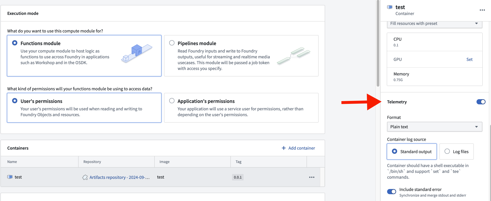

<!-- source: https://palantir.com/docs/foundry/compute-modules/containers/ · mirrored 2026-08-14 from Palantir Foundry docs -->

# Containers

This page provides information on Docker basics for use with compute modules. For full explanations, visit the [Docker documentation ↗](https://docs.docker.com/get-started/get-docker/).

## Get started with Docker

To build and publish images, you first need to install Docker. Follow the official instructions in the [Docker documentation ↗](https://docs.docker.com/get-started/get-docker/).

To verify that Docker is running, you can run the `docker info` command. If you see `Cannot connect to the Docker daemon`, visit the [troubleshooting guide ↗](https://docs.docker.com/desktop/troubleshoot/) to remediate.

### What is Docker?

Docker is a tool for packaging and deploying applications. Docker enables easy distribution, consistency in execution across runtime environments, and security through isolation. This is achieved with a process called **containerization** that packages everything required to run an application while ensuring it runs consistently wherever it is deployed. There are two core primitives of Docker containerization: images and containers.

* **Image:** An immutable file that contains all of the code, dependencies, and more necessary to run your application. In other words, an image only describes what should be run; it is the template from which containers are created.
* **Container:** A single running instance of an image. A container is a live, lightweight, isolated environment in which your application is actually running.

### Create images

Creating images in Docker involves packaging an application along with its dependencies, libraries, and configuration files into a single, portable unit. Packaging instructions are defined in a **Dockerfile**.

#### Dockerfiles

A Dockerfile is a text document made of sequential commands that instructs how to configure and run your application. The following list gives an overview of the most common commands you may need while creating images for compute modules. For a full guide, visit the [Dockerfile reference documentation ↗](https://docs.docker.com/reference/dockerfile):

* **FROM:** Declare the base image. The base image is the foundational layer upon which your image configuration will build. A base image can be minimal (just an operating system) or more comprehensive (including pre-existing software such as Python). `FROM` must be the first statement in your Dockerfile. You can also add the `--platform linux/amd64` flag to specify the target platform.
* **WORKDIR:** Set the working directory. The working directory is the base location in your image where commands will run.
* **RUN:** Run shell commands during the image build. Shell commands are typically used to install dependencies, compile your code, and perform filesystem operations.
* **COPY:** Copy files from your computer into the image.
* **USER:** Set the user for the container. The user must be a non-root numeric value.
* **ENTRYPOINT:** Set the default command that will run at container startup. This command specifies what your container will actually be doing.
* **EXPOSE:** Document the port(s) on which your container will be listening. All exposed ports must be between 1024 and 65535, excluding 8945 and 8946.
* **ENV:** Set environment variables. These variables can be used to configure and provide runtime information for your container to read during execution.

#### Image requirements for compute modules

* Images must be run as a non-root numeric user.
* Images must be built for the linux/amd64 platform.
* You must use a digest or any tag *except* `latest`.
* All exposed ports must be between 1024 and 65535, excluding 8945 and 8946.

#### Use your image in compute modules

Once you have an image compatible for a compute module, you can follow the steps below to upload it to Foundry. For full instructions, review our documentation on [publishing an Artifact documentation](/docs/foundry/code-repositories/publish-artifact/).

* Create an Artifacts repository.
* Navigate to **Publish** and select **Docker**.
* Follow the provided instructions to push your image to the repository.

### Build an image: Example

We have an application that we want to deploy as a compute module, and it is structured as follows:

**Project structure**

```
myapplication
├── Dockerfile
├── requirements.txt
└── src
    └── application.py
```

We can construct a Dockerfile line-by-line using the steps below:

1. Specify the base image.

```
FROM python:3.12
```

2. Set the current directory.

```
WORKDIR /app
```

3. Install necessary dependencies.

```
COPY ./requirements.txt /app
RUN pip install --no-cache-dir -r requirements.txt
```

4. Specify a non-root numeric user for the container to run as.

```
RUN adduser --uid 5001 user
USER 5001
```

5. Copy in the application code. This is done separately from the dependencies to leverage Docker image layer caching.

```
COPY ./src/application.py /app
```

6. Specify the container to run the application at startup.

```
ENTRYPOINT ["python", "application.py"]
```

Your Dockerfile should look something like this:

```
FROM python:3.12
WORKDIR /app
COPY ./requirements.txt /app
RUN pip install --no-cache-dir -r requirements.txt
RUN adduser --uid 5001 user
USER 5001
COPY ./src/application.py /app
ENTRYPOINT ["python", "application.py"]
```

Now, you can run the following command to build an image called `myimage` with the tag `0.0.0` from your Dockerfile:

```
docker build . -t myimage:0.0.0 --platform linux/amd64
```

## Logs

Logging can be configured at the container level, allowing you to enable or disable logging for each container. This granular control helps optimize resource usage and focuses on the most relevant log data. To access the logging configuration for a specific container, select the container's row in the **Containers** section. This will open a side panel where you can adjust the logging settings.



### Log formats

#### SLS format

The SLS format is a structured logging format that provides consistent and easily parsable logs. SLS logging is designed to support additional metadata for each log entry.

The following is an example of logging in the SLS format:

```java
package myproject;

import com.palantir.interactive.module.api.SafeArg;
import com.palantir.interactive.module.api.UnsafeArg;
import com.palantir.interactive.module.tasks.deployedapps.DeployedAppRuntime;
import org.slf4j.Logger;
import org.slf4j.LoggerFactory;

final class DeployedApp {

    private static final Logger log = LoggerFactory.getLogger(DeployedApp.class);

    public static void main(String[] _args) {
        DeployedAppRuntime.builder()
                .addQueryRunner(DeployedApp::hello, String.class, String.class, "hello")
                .buildAndStart();
    }

    static String hello(String name) {
        // SLS format for error
        log.error("This is an SLS error log with unsafe parameter", UnsafeArg.of("name", name));

        // This is not in SLS format. As a result, it won't be logged if SLS format is selected.
        System.out.println("This message will not be logged iff SLS format");

        // SLS format for info
        log.info("This is an SLS info log with safe parameter", SafeArg.of("name", name));

        return "Hello, " + name + "!";
    }

    private DeployedApp() {}
}
```

Notice that the logging adheres to the following styles and constrains:

* Use `UnsafeArg` for potentially sensitive data and `SafeArg` for non-sensitive data.
* `Standard System.out.println()` statements are not captured in SLS format.

The following is an example of an SLS-formatted log entry in JSON:

```json
{
  "type": "service.1",
  "level": "INFO",
  "time": "2024-01-15T12:00:00.000Z",
  "origin": "com.example.MyClass",
  "thread": "main",
  "message": "Processing request",
  "params": {
    "requestId": "abc-123"
  },
  "uid": "unique-log-id",
  "sid": "session-id"
}
```

##### Python SDK logging

If you are using the Python compute modules SDK, you can use the built-in logging utilities. The `get_logger` function returns a logger configured for the SLS format, and `set_internal_log_level` controls the verbosity of internal SDK logs.

```python
import logging
from dataclasses import dataclass
from compute_modules.annotations import function
from compute_modules.logging import get_logger, set_internal_log_level

set_internal_log_level(logging.INFO)
logger = get_logger(__name__)
logger.setLevel(logging.INFO)

@dataclass
class AddPayload:
    x: int
    y: int

@function
def add(context, event: AddPayload) -> int:
    try:
        logger.info("Received add request")
        result = event.x + event.y
        return result
    except Exception as e:
        logger.error("There was an error")
        raise e
```

The following log levels are available, listed from most verbose to least verbose:

* `DEBUG`: Detailed diagnostic information for troubleshooting.
* `INFO`: General informational messages about normal operation.
* `WARNING`: An indication that something unexpected happened, or may happen in the near future.
* `ERROR`: A serious issue that prevented a specific operation from completing.
* `CRITICAL`: A severe error indicating the application may not be able to continue running.

#### Plaintext format

Plaintext format provides human-readable logs without a specific structure. Plaintext logs are easier to read directly but may be more challenging to parse programmatically.

When plaintext is configured, the output is inserted into the message field of the SLS log. This allows for compatibility with existing SLS-based tools while maintaining readability.

:::callout{theme="neutral"}
Using plaintext logging as a default ensures that both plaintext and SLS logs are captured, with SLS logs appearing in JSON form in the messages field.
:::

### Container log sources

Container logs can be captured from two primary sources. Each source has specific requirements and configurations to ensure effective log collection.

#### Standard output

The standard output (`stdout`) source collects logs directly from the container's standard output stream. To enable this logging method, ensure your container meets the following requirements:

* Must have a shell executable at `/bin/sh`
* Must support the shell commands `set` and `tee`

**Standard error inclusion:** Optionally include standard error (`stderr`) in your logs. When set to `true`, `stdout` and `stderr` are synchronized and merged into a single stream.

#### Log files

The log files source captures logs from specific files within the container. There are two configuration parameters:

* **Directory path:** The base directory where log files are located.
* **File path patterns:** The patterns to match log files for capture. This parameter supports common wildcards for flexible file matching. Each pattern should include the specified directory path.

**Example:** To capture logs from all `.log` files in `/var/log/foo/` and the specific file `/var/log/bar.txt`, set the `directoryPath` to be `/var/log` and the `filePathPatterns` to be `/var/log/foo/*.log` and `/var/log/bar.txt`

:::callout{theme="warning"}
When using log files, the specified directory path must be empty when the compute module starts.
:::

## Environment variables

Docker environment variables are dynamic, named values that can customize the behavior of Docker containers and applications without changing the Dockerfile or container images. Environment variables can be used for many purposes, including the following:

* **Configure parameters:** Set parameters for Docker images, such as the CPU set and CPU shares.
* **Define behavior:** Define the behavior of an application or script.
* **Store credentials:** Securely store sensitive information like API keys and database credentials.
* **Create reusable configurations:** Use environment variables and interpolation to create reusable configurations that make it easier to manage and deploy Dockerized applications.
* **Override default values:** Override default configuration values specified in the Dockerfile when running a container.

### Example

We have two code paths, `production` and `test`, where `test` might return some extra metadata about a request. You can create a `production` environment variable that your code can read and use to execute different paths, without having to change and redeploy your code.

```python
# app.py
import os

if os.environ["production"] == "true":
    ...
else:
    ...
```

### Reserved environment variables reference

Some environment variable names are reserved. You cannot overwrite reserved environment variables, as they may contain important information when writing your compute module. Review the list of reserved environment variables below:

**CLIENT\_ID** `string`

* When present, this is the client ID of the third-party application associated with this compute module. It is present in functions execution mode and when using application permissions. Use it to obtain a Foundry-scoped token from your third-party application service user.
* **Example value:** `038120ac-ac39-4d91-be0e-55afabbb0912`

```python
# app.py
import requests
import os
token_response = requests.post("https://{FOUNDRY_URL}/multipass/api/oauth2/token",
    data={
        "grant_type": "client_credentials",
        "client_id": os.environ["CLIENT_ID"],
        "client_secret": os.environ["CLIENT_SECRET"],
        "scope": "compass:edit"
    },
    headers={
        "Content-Type": "application/x-www-form-urlencoded",
    }
)
access_token = token_response.json()["access_token"]
```

**CLIENT\_SECRET** `string`

* When present, this is the client secret of the third-party application associated with this compute module. It is present when in functions execution mode and when using application permission. Use it to obtain a Foundry-scoped token from your third-party application service user.
* **Example value:** `038120ac-ac39-4d91-be0e-55afabbb0912`

```python
# app.py
import requests
import os
token_response = requests.post("https://{FOUNDRY_URL}/multipass/api/oauth2/token",
    data={
        "grant_type": "client_credentials",
        "client_id": os.environ["CLIENT_ID"],
        "client_secret": os.environ["CLIENT_SECRET"],
        "scope": "compass:edit"
    },
    headers={
        "Content-Type": "application/x-www-form-urlencoded",
    }
)
access_token = token_response.json()["access_token"]
```

**RUNTIME\_HOST** `host`

* The host used to connect to the compute module service. Use it to construct a URI when creating a custom client.
* **Example value:** `localhost`

```python
# app.py
import os
runtime_host = os.environ["RUNTIME_HOST"]
```

**RUNTIME\_PORT** `port`

* The port used to connect to the compute module service. Use it to construct a URI when creating a custom client.
* **Example value:** `8945`

```python
# app.py
import os
runtime_port = os.environ["RUNTIME_PORT"]
```

**RUNTIME\_API** `hostname`

* The API path used to connect to the compute module service. Use it to construct a URI when creating a custom client.
* **Example value:** `localhost:8945`

```python
# app.py
import os
runtime_api = os.environ["RUNTIME_API"]
```

**GET\_JOB\_PATH** `uri path`

* The path used to get a job from the compute module service. Use it to construct a URI when creating a custom client.
* **Example value:** `/interactive-module/api/internal-query/job`

```python
# app.py
import os
get_job_path = os.environ["GET_JOB_PATH"]
```

**GET\_JOB\_URI** `uri`

* The fully qualified URI to get a job from the compute module service. Use it to construct a URI when creating a custom client.
* **Example value:** `https://localhost:8945/interactive-module/api/internal-query/job`

```python
# app.py
import os
get_job_uri = os.environ["GET_JOB_URI"]
```

**POST\_RESULT\_PATH** `uri path`

* The path used to post a result from the compute module service. Use it to construct a URI when creating a custom client.
* **Example value:** `/interactive-module/api/internal-query/results`

```python
# app.py
import os
post_result_path = os.environ["POST_RESULT_PATH"]
```

**POST\_RESULT\_URI** `uri`

* The fully qualified URI to post a result to the compute module service. Use it to construct a URI when creating a custom client.
* **Example value:** `https://localhost:8945/interactive-module/api/internal-query/results`

```python
# app.py
import os
post_result_uri = os.environ["POST_RESULT_URI"]
```

**POST\_SCHEMA\_URI** `uri`

* The fully qualified URI to post schemas to the compute module service. Use it to construct a URI when creating a custom client.
* **Example value:** `/interactive-module/api/internal-query/schemas`

```python
# app.py
import os
post_schema_uri = os.environ["POST_SCHEMA_URI"]
```

**MAX\_CONCURRENT\_TASKS** `integer`

* The maximum number of tasks that can be sent to a replica at a given time. Configure it on the frontend. Any changes to its value that occur while a replica is running will not be respected.
* **Example use case:** Setting up an initial thread pool when building a custom client.
* **Example value:** `1`

```python
# app.py
import os
max_concurrent_tasks = os.environ["MAX_CONCURRENT_TASKS"]
```

**SOURCE\_CREDENTIALS** `file path`

* Available only if you configured at least one external source. It is a path to a JSON file where the top level keys are all of your configured external source API names, and the values are a map of the corresponding secrets.
* **Example value:** `/opt/source-credentials/SOURCE_CREDENTIALS`

```python
# app.py
import json
import os

with open(os.environ['SOURCE_CREDENTIALS'], 'r') as f:
    credentials = json.load(f)

# Access a specific secret
secret = credentials["<Source API Name>"]["<Secret Name>"]
```

**SOURCE\_CONFIGURATIONS\_PATH** `file path`

* Available only if you configured at least one external source. It is a path to a JSON file where the top-level keys are all of your configured external source API names, and the values are a map of the corresponding secrets. This file may contain extra metadata about your configured sources.
* **Example value:** `/opt/source-credentials/SOURCE_CONFIGURATIONS_PATH`

```python
# app.py
import json
import os

with open(os.environ['SOURCE_CONFIGURATIONS_PATH'], 'r') as f:
    credentials = json.load(f)

# Access a specific secret
secrets = credentials["secrets"]
url = credentials["httpConnectionConfig"]["url"]
```

**DEFAULT\_CA\_PATH** `file path`

* The path to a mounted CA PEM file. You must use this certificate when connecting to the compute module service. Only relevant if you are constructing a custom client.
* **Example value:** `/etc/ssl/rubix-ca/ca.pem`

```python
# app.py
import os
default_ca_path = os.environ["DEFAULT_CA_PATH"]
```

**BUILD2\_TOKEN** `file path`

* Available only with pipeline execution mode. A file that contains a token scoped to your input and output resources. Use it when calling the API gateway.
* **Example value:** `/opt/build2-token/BUILD2_TOKEN`

```python
# app.py
import os
build_2_token = os.environ["BUILD2_TOKEN"]
```

**COMPUTE\_SESSION\_ID** `string`

* A unique identifier for the replica the container is running in. Each replica of your compute module will have a different session ID.
* **Example value:** `ses-7f3a9c2e-4b8d-4e1f-a5c6-9d2e8f4a3b1c`

```python
# app.py
import os
session_id = os.environ["COMPUTE_SESSION_ID"]
```

**FOUNDRY\_COMPUTE\_MODULE\_RID** `rid`

* The resource identifier (RID) of the compute module.
* **Example value:** `ri.foundry.main.deployed-app.3d460200-8861-4e2f-a70c-1be19cd79ae5`

```python
# app.py
import os
compute_module_rid = os.environ["FOUNDRY_COMPUTE_MODULE_RID"]
```

**MODULE\_AUTH\_TOKEN** `file path`

* The path to a file containing an authentication token for communicating with the internal compute module service. This token must be included as a header when making requests to the compute module service endpoints. Only relevant if you are constructing a [custom client](/docs/foundry/compute-modules/advanced-custom-client/).
* **Example value:** `/opt/module-auth-token/MODULE_AUTH_TOKEN`

```python
# app.py
import os
with open(os.environ["MODULE_AUTH_TOKEN"], "r") as f:
    module_auth_token = f.read()
```

**FOUNDRY\_ONTOLOGY\_RID** `rid`

* Available for compute modules installed through Marketplace. The resource identifier (RID) of the ontology from the Marketplace installation project. Use this when initializing the OSDK client to ensure the compute module references the correct target ontology. Review the [OSDK integration](/docs/foundry/compute-modules/osdk-integration/#marketplace-installed-compute-modules) documentation for more details.
* **Example value:** `ri.ontology.main.ontology.a1b2c3d4-e5f6-7890-abcd-ef1234567890`

```python
# app.py
import os
ontology_rid = os.environ["FOUNDRY_ONTOLOGY_RID"]
```
