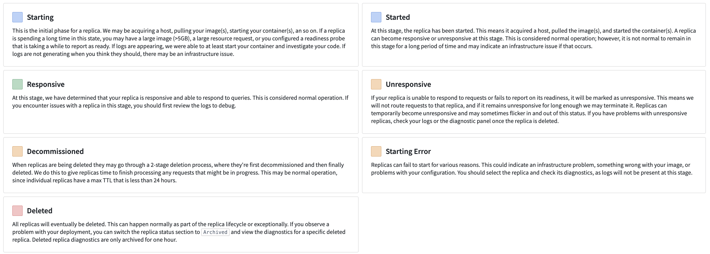
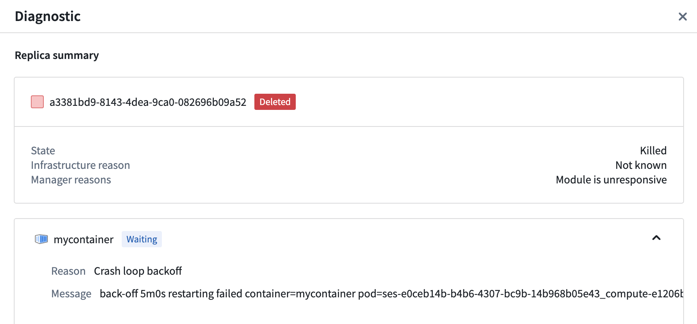
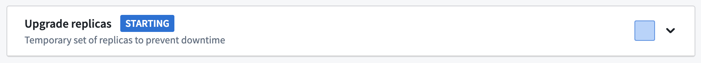

<!-- source: https://palantir.com/docs/foundry/compute-modules/debugging/ · mirrored 2026-08-14 from Palantir Foundry docs -->

# Debug using the replica status

Your first step when debugging your compute module should be to check the **Replica Status** section on the **Overview** tab. The **Replica Status** section shows each replica and its current status and can provide a high-level understanding of your deployment. Select an individual replica to view the images it contains, and view more detailed diagnostics by selecting the **Replica Diagnostics** callout. If you are unable to debug and think there may be an issue with the compute module infrastructure, contact Palantir Support by filing an issue.

## Replica status

The **Replica Status** section shows which replicas are currently active and part of your deployment along with archived replicas. Archived replicas are no longer running but can still be used to debug issues that occurred in the past. Each replica has its own lifecycle and can be in any of the various states documented below:

* **Starting:** The initial phase for a replica. We may be acquiring a host, pulling your image(s), starting your container(s), and so on. If a replica is spending a long time in this state, you may have a large image (>5GB), a large resource request, or you configured a readiness probe that is taking a while to report as ready. If logs are appearing, we were able to at least start your container and investigate your code. If logs are not generating when you think they should, there may be an infrastructure issue.
* **Started:** At this stage, the replica has been started. This means it acquired a host, pulled the image(s), and started the container(s). A replica can become responsive or unresponsive at this stage. This is considered normal operation; however, it is not normal to remain in this stage for a long period of time and may indicate an infrastructure issue if that occurs.
* **Responsive:** At this stage, we have determined that your replica is responsive and able to respond to queries. This is considered normal operation. If you encounter issues with a replica in this stage, you should first review the logs to debug.
* **Unresponsive:** If your replica is unable to respond to requests or fails to report on its readiness, it will be marked as unresponsive. This means we will not route requests to that replica, and if it remains unresponsive for long enough we may terminate it. Replicas can temporarily become unresponsive and may sometimes flicker in and out of this status. If you have problems with unresponsive replicas, check your logs or the diagnostic panel once the replica is deleted.
* **Decommissioned:** When replicas are being deleted they may go through a 2-stage deletion process, where they are first decommissioned and then finally deleted. We do this to give replicas time to finish processing any requests that might be in progress. This may be normal operation, since individual replicas have a max TTL that is less than 24 hours.
* **Starting Error:** Replicas can fail to start for various reasons. This could indicate an infrastructure problem, something wrong with your image, or problems with your configuration. You should select the replica and check its diagnostics, as logs will not be present at this stage.
* **Deleted:** All replicas will eventually be deleted. This can happen normally as part of the replica lifecycle or exceptionally. If you observe a problem with your deployment, you can switch the replica status section to **Archived** and view the diagnostics for a specific deleted replica. Deleted replica diagnostics are only archived for one hour.

## Replica diagnostics

Replica diagnostics can provide deeper insight into a degraded deployment. We provide a status and reason from our underlying infrastructure and/or from the compute module service directly. In the replica diagnostics panel, you can also select an individual image for further debugging.

:::callout{theme="warning"}
To view the diagnostics for a particular replica, you must first select the replica square. Some replicas may be archived, and you may need to toggle into the archive view.
:::

Below is an example of the diagnostics panel for a deployment that is failing to come up live:

In the above image, the container is experiencing a `CrashLoopBackoff`. We can turn to logs and the code provided to try and debug further.

# Debug upgrades

Compute modules will attempt a safe upgrade when possible. This means that when you upgrade your configuration while you have an active deployment, a new deployment will be launched alongside your active one and will switch over when your new deployment becomes responsive. New jobs will be routed to the updated deployment while existing jobs complete on the old deployment.

## Upgrade process

Upgrades for compute modules progress through a series of steps documented below:

1. The configuration for a running compute module changes. For example, you might have changed the version of a configured image. Some configuration settings may require downtime to apply, and you will be asked to acknowledge those before saving.
2. The compute module service creates a second deployment with your changes.
3. The compute module service waits for a responsive replica in your new deployment.
4. Your new deployment has a responsive replica and new requests are routing to the new deployment. The old deployment is being decommissioned and given a grace period to finish existing requests before it is fully deleted.

If your new deployment never becomes responsive, your current deployment will not change. If an upgrade is unsuccessful, you will not experience downtime. To end an unresponsive upgrade, you can revert your configuration changes or make forward changes where replicas can become responsive.

### My upgrade is unresponsive

Like the active **Replica Status** section, the status of the upgraded deployment's replicas will display in a section in the **Overview** tab.

Expand the section to view the images in the upgraded deployment, and select the replica square to view more replica diagnostics.

