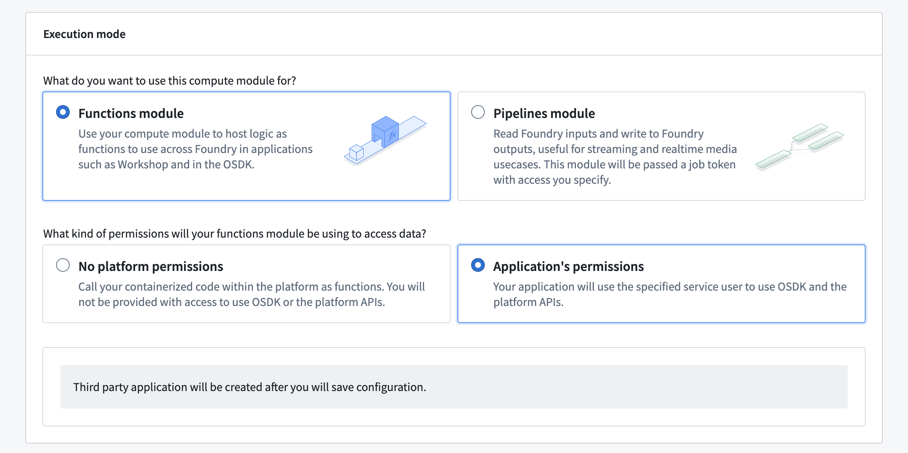
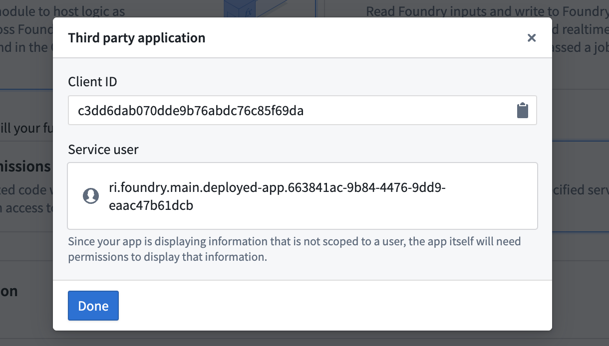
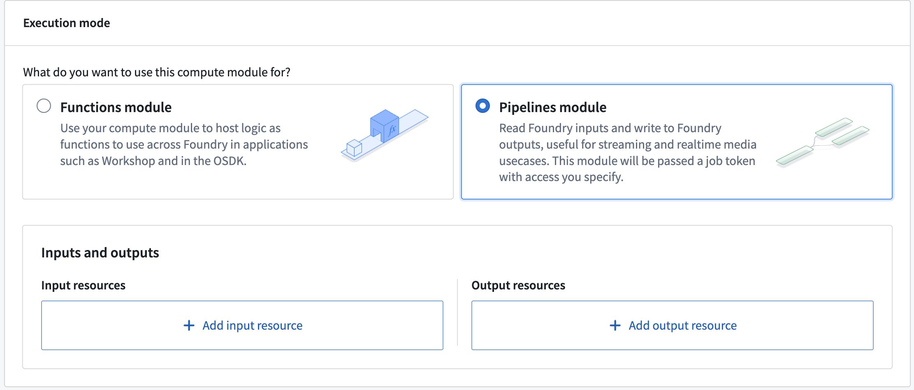
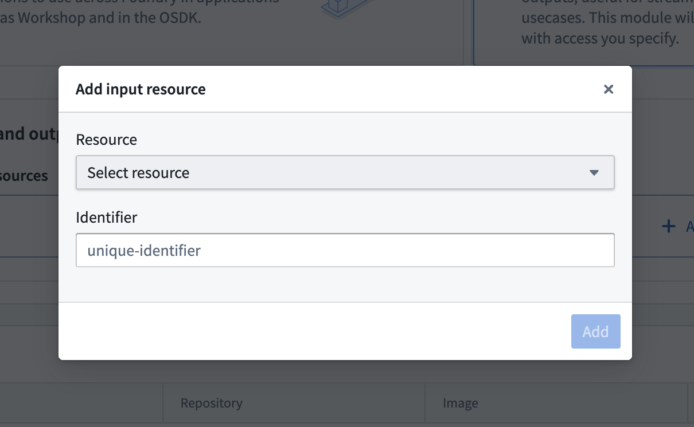

<!-- source: https://palantir.com/docs/foundry/compute-modules/execution-modes/ · mirrored 2026-08-14 from Palantir Foundry docs -->

# Execution modes

## Function execution mode vs. pipeline execution mode

| Function mode                    | Pipelines module |
|-----------------------------------|-------------------------|
| Use your compute module to host logic as functions. Use these functions across Foundry in applications like Workshop or the Developer Console with the Ontology SDK.                                             | Read Foundry inputs and write to Foundry outputs for streaming and realtime media use cases. This module will be passed as a job token with access you can specify.                                               |
| Power your Foundry applications using compute module functions. | Use the Foundry resource permissions system. |
| Execute compute module functions from another function. | Get data provenance across Foundry in the Data Lineage application. |

## Function mode permissions

**No platform permissions:** You will not be provided with access to use Ontology SDK or platform APIs.
**Application permissions:** Your application will use a service user for permissions rather than depending on user permissions.

## Pipeline mode permissions

Foundry job tokens will be attached to the compute module. Job tokens will be scoped to input and output resources and can be used to obtain data.

## Functions execution mode

Functions mode allows you to use your compute module to host logic for use across Foundry, such as in Workshop applications or through the Ontology SDK. You can define and write your logic in any language, [register them as functions](/docs/foundry/compute-modules/functions/#automatic-function-schema-inference), and execute this logic with function calls in the platform.

Functions mode can operate through two permission modes:

* **No platform permissions:** Your application will not be provided with access to any platform APIs or the Ontology SDK. Use this mode for running logic that does not need to interact with Foundry. You can still configure egress to external systems in this mode. Review [sources](/docs/foundry/compute-modules/sources/) for more information.
* **Application permissions:** Your application will use its accompanying service user to determine its permissions for accessing the platform APIs and Ontology SDK. Permissions will remain the same regardless of the compute module user. Use this mode to run logic that needs to interact with Foundry with a set of permissions for the application as a whole.

### Use application permissions

:::callout{theme="warning"}
Application permissions may not be available on all enrollments.
:::

#### Create the service user

1. Navigate to your compute module's **Configure** page.
2. Under **Execution mode**, choose a **Functions module** with **Application's permissions**.



3. Save your compute module configuration. This will automatically create a third-party application for your compute module and display its client ID and service user name.


4\. \[Optional] Configure the service user as needed, such as restricting its access to select Markings, in the **Third party applications** section of [Control Panel](/docs/foundry/administration/control-panel/).

:::callout{theme="warning"}
Only users in your organization with permissions to `Manage OAuth 2.0 clients` can perform this step. Review the [third-party applications documentation](/docs/foundry/platform-security-third-party/third-party-apps-overview/) for more information.
:::

#### Use the service user in your compute module

1. Add a source with a network policy that enables access to your Foundry environment's URL.

2. Exchange the client ID and secret for an access token with the desired permissions.

In `app.py`, with the compute modules SDK:

```python
from compute_modules.auth import oauth

access_token = oauth("yourenrollment.palantirfoundry.com", ["api:datasets-read", "api:datasets-write"])
```

:::callout{theme="neutral"}
Review the following SDK guides for detailed authentication patterns, including OSDK integration and dataset access:

* [Python SDK](/docs/foundry/compute-modules/python-sdk/#authentication)
* [Java SDK](/docs/foundry/compute-modules/java-sdk/#authentication)
* [TypeScript SDK](/docs/foundry/compute-modules/typescript-sdk/#retrieving-foundry-services)
:::

Without the compute modules SDK:

```python
import requests
import os

token_response = requests.post("https://yourenrollment.palantirfoundry.com/multipass/api/oauth2/token",
    data={
        "grant_type": "client_credentials",
        "client_id": os.environ["CLIENT_ID"],
        "client_secret": os.environ["CLIENT_SECRET"],
        "scope": "api:datasets-read api:datasets-write"
    },
    headers={
        "Content-Type": "application/x-www-form-urlencoded",
    },
    verify=os.environ["DEFAULT_CA_PATH"]
)

access_token = token_response.json()["access_token"]
```

3. Use the granted token to make calls to Foundry APIs.

In `app.py`:

```python
import requests
import os

DATASET_ID = "ri.foundry.main.dataset.7bc5a955-5de4-4c5f-9370-248c5517187b"

dataset_response = requests.get(
    f"https://yourenrollment.palantirfoundry.com/api/v1/datasets/{DATASET_ID}",
    headers={
        "Authorization": f"Bearer {access_token}"
    },
    verify=os.environ["DEFAULT_CA_PATH"]
)

dataset_name = dataset_response.json()["name"]
print(f"Dataset name is {dataset_name}")
```

## Pipeline execution mode

A compute module executed in pipeline mode is designed to facilitate computations for data pipeline workflows that require high data security and provenance control. Pipeline mode works by taking in Foundry inputs, executing user-specified computations, and subsequently producing outputs. The entire process strictly adheres to the protocols and workflows established by the Foundry build system.

Unlike function mode, where users directly interact with a compute module by sending queries, the inputs and outputs and their permissions are managed through the Foundry build system. This ensures that all data involved in the computation process is systematically tracked. By mandating that all inputs and outputs pass through the build system, the module maintains a high level of data integrity and traceability, which is crucial for Foundry data provenance control and security.

Due to provenance control requirements, pipeline mode compute modules are non-interactive, meaning users cannot send queries directly to the compute module. Because of this, the compute module only performs computations on inputs automatically provided by the build system once the compute module is running. The build system also manages the flow of information from a compute module's output. Interfaces are provided for interacting with inputs and outputs inside the container of a compute module running in pipeline mode.

To summarize, pipeline mode enforces data security and provenance control. Users should choose pipeline mode if the following is true:

* The relevant data is highly sensitive and must strictly conform to provenance control, marking control, and so on.
* Users want to track data lineage.

### Add inputs and outputs

Pipeline mode compute modules strictly conform to the provenance control and security model established by the Foundry build system. By default, the compute module does not have permission to interact with any Foundry resources. Users must explicitly add Foundry resources as inputs and outputs. Permissions will then be granted on these added resources.

1. In the configuration details for pipeline mode, choose to and an input or output resource.



2. Select a resource from the dropdown menu and give it a unique identifier. The identifier will be used to retrieve resource information inside the container. The resources must be from the same Project as the compute module. The currently supported inputs/outputs are Foundry datasets, streaming datasets, and media sets.



### Interact with inputs and outputs within the compute module

1. A bearer token will be mounted in a container file, where the file name is stored in a BUILD2\_TOKEN environment variable. The token will have permissions on the inputs and outputs and will be the only way to access them.

In `app.py`:

```
with open(os.environ['BUILD2_TOKEN']) as f:
    bearer_token = f.read()
```

2. A map of input and output unique identifiers and their information is mounted in a container file, where the file name is stored in a RESOURCE\_ALIAS\_MAP environment variable. You can get the resource information with the unique identifier you give in the configuration. The resource information is a tuple of RID and branch (branch can be none).

In `app.py`:

```
with open(os.environ['RESOURCE_ALIAS_MAP']) as f:
    resource_alias_map = json.load(f)

input_info = resource_alias_map['identifier you put in the config']
output_info = resource_alias_map['identifier you put in the config']

# structure of resource info
# {
#     'rid': rid
#     'branch': branch (can be none)
# }

input_rid = input_info['rid']
input_branch = input_info['branch'] or "master"
output_rid = output_info['rid']
output_branch = output_info['branch'] or "master"
```

3. Now, you can use the token and resource information to interact with the inputs and outputs. For example, if your input is a stream dataset, you can get the latest records by requesting the stream-proxy service.

In `app.py`:

```
FOUNDRY_URL = "yourenrollment.palantirfoundry.com"
url = f"https://{FOUNDRY_URL}/stream-proxy/api/streams/{input_rid}/branches/{input_branch}/records"
response = requests.get(url, headers={"Authorization": f"Bearer {bearer_token}"})
```

### Access dataset files using the API

If your input is a Foundry dataset, you can use the bearer token and resource information to list and retrieve files. The following example demonstrates how to list all files in a dataset and retrieve the content of a specific file.

In `app.py`:

```python
FOUNDRY_URL = "yourenrollment.palantirfoundry.com"

# List all files in the dataset
params = {
    "pageSize": 100,
    "includeOpenExclusiveTransaction": "false",
    "excludeHiddenFiles": "false",
}
url = f"https://{FOUNDRY_URL}/foundry-catalog/api/catalog/datasets/{input_rid}/views2/master/files"
response = requests.get(url, params=params, headers={"Authorization": f"Bearer {bearer_token}"})

# Get the content of a specific file
file_name = "example.csv"
url = f"https://{FOUNDRY_URL}/foundry-data-proxy/api/dataproxy/datasets/{input_rid}/views/master/{file_name}"
response = requests.get(url, headers={"Authorization": f"Bearer {bearer_token}"})
dataset_content = response.json()
```

:::callout{theme="warning"}
To access the Foundry URL from within the compute module container, you must add a [source](/docs/foundry/compute-modules/sources/) with a network policy that enables access to your Foundry environment URL.
:::

### Data provenance and observability

Pipeline mode provides built-in data provenance and observability through the Foundry build system. Because all inputs and outputs pass through the build system, every data transformation is tracked and visible in the **Data Lineage** application. This allows you to trace how data flows through your pipeline and audit the origin of any output.

:::callout{theme="neutral"}
During pipeline execution, the build system opens transactions on output datasets. These transactions are managed automatically and are committed when the pipeline completes successfully.
:::

### Other considerations

1. **Scaling:** Since no queries are sent to the compute module, the autoscaler may eventually scale it down to zero replicas. To keep your compute module constantly running, set the **Minimum replicas** to at least 1 in the [scaling](/docs/foundry/compute-modules/scaling/) configuration.
2. **Compute module client:** Since no queries are sent to the compute module, you do not need to implement a [compute module client](/docs/foundry/compute-modules/advanced-custom-client/). Review our documentation on [compute module clients](/docs/foundry/compute-modules/advanced-custom-client/) for more information.
