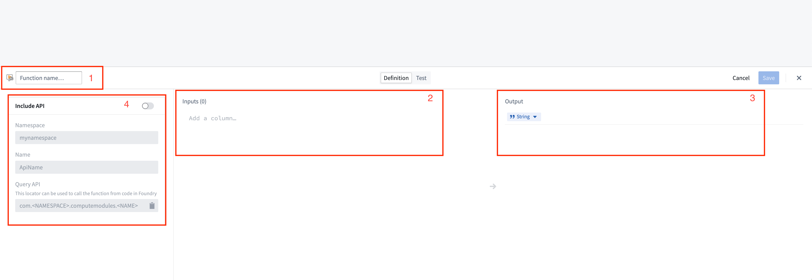
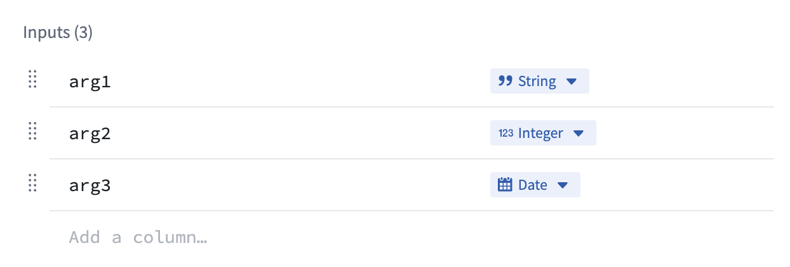
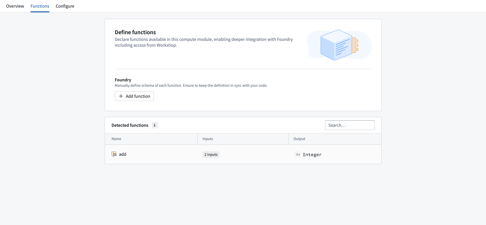
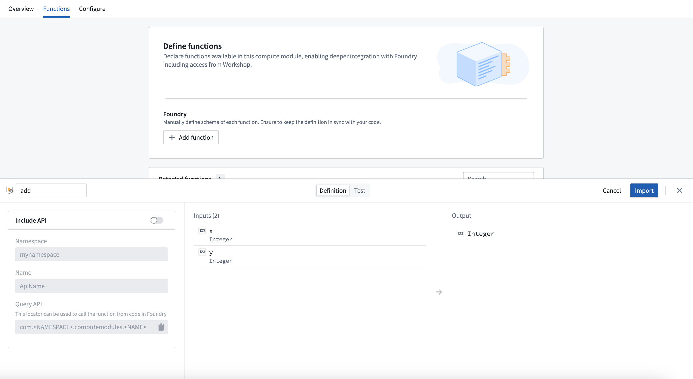
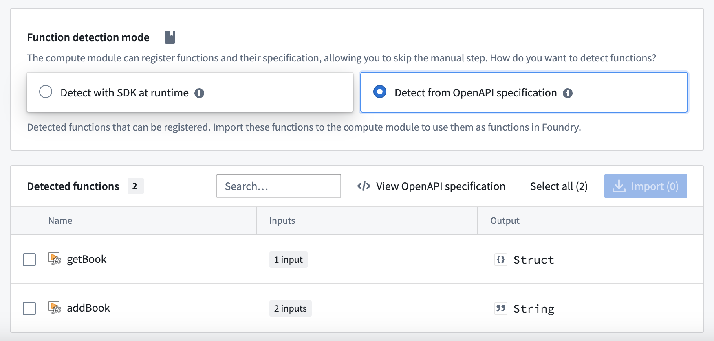
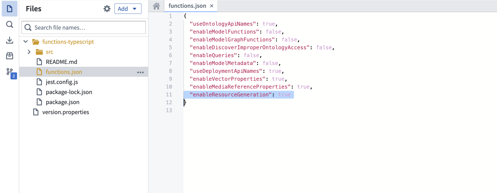
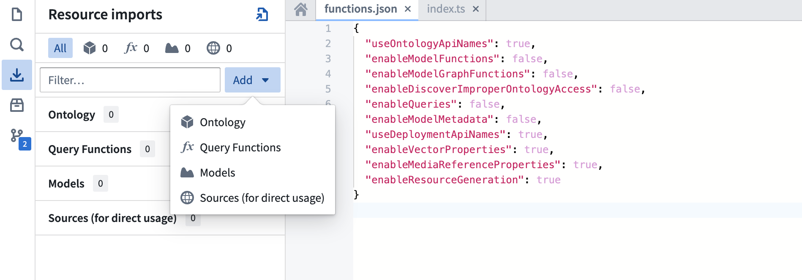
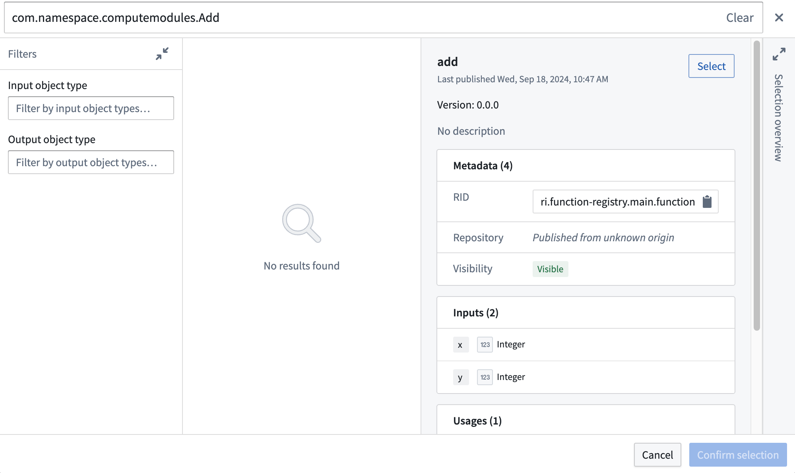
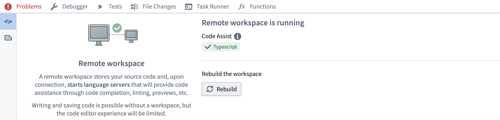

<!-- source: https://palantir.com/docs/foundry/compute-modules/functions/ · mirrored 2026-08-14 from Palantir Foundry docs -->

# Functions

## Register functions

If running in [function execution mode](/docs/foundry/compute-modules/execution-modes/#functions-execution-mode), you must register the functions in your compute module to make them callable from elsewhere in Foundry. This page explains two different methods for manually registering a compute module function.

:::callout{theme="neutral"}
The compute modules SDK makes it easier to register functions by automatically inferring the schema of your function(s). If you are using the compute modules SDK, review the [automatic function schema inference](#automatic-function-schema-inference) section below.
:::

### Register a function from the Compute Modules application

You can manually register a function for a compute module from the **Functions** page. Select **Add function** to open the **Create function** panel:



1. **Function name:** The name of the function to be invoked. Typically, this should match the name of the function in your compute module.
2. **Inputs:** The input parameter(s) to be passed as arguments to your compute module function.

Compute module function inputs are packaged into a JSON object; each input that you add corresponds to a property on the input object passed into your function. In the example below, function inputs are on the left, and the JSON object passed to the corresponding function is on the right.



example\_function\_payload.json

```json
{
    "arg1": "hello",
    "arg2": 2,
    "arg3": "1969-07-20"
}
```

3. **Output:** The return type of your function.
4. **API name:** The API name is the function locator that allows you call your function from other code in Foundry, such as through a TypeScript function.
   The compute module API format follows the structure `com.<namespace>.computemodules.<MyApiName>` and must comply to the following naming rules:

* **namespace:** Must be all lowercase and contain no special characters.
* **MyApiName:** Must be in camel case and contain no special characters.

:::callout{theme="warning"}
Changing the API name will break the consumer code. Only the latest published version of the query is supported.
:::

Once you define a function, you can switch to the **Test** tab to try invoking the function, and/or select **Save** to save the function and make it callable from Foundry.

:::callout{theme="warning"}
Compute module functions are always registered with version `0.0.0`. If you update the function, the function's version will be overwritten by your changes.
:::

### Register a function using JSON

You can also manually define your function schema by sending an HTTP POST request from within your compute module. Typically, you will only need to do this if you are creating your own client. For information on the HTTP request, review our [POST function schema](/docs/foundry/compute-modules/advanced-custom-client/#post-function-schema) documentation.

This endpoint accepts a JSON array as the payload, where each element in the array corresponds to the specification of a function in your compute module. Our [Python SDK ↗](https://github.com/palantir/python-compute-module) provides a good reference on how to assemble this JSON payload.

### Function type reference

Below is a table showing the mapping between function input/output types and how those types are serialized over HTTP to a compute module:

| Foundry type | Serialized over HTTP as | Notes |
|--------------|------------------------|--------|
| Integer	    | int	                |       |
| Byte          | string	            |       |
| Boolean       | boolean	            |       |
| Binary	    | string	            |       |
| Date          | string	            |       |
| Timestamp	    | int                   |	Milliseconds since epoch |
| Decimal       | string	            |       |
| Float         | float	                |       |
| Array	        | array (non-streaming), stream of JSON (streaming)	|   |
| Map   	    | JSON	                | Key-value store (for example, Python `dict`, Java Map) |
| Struct        | JSON	                | Custom object type |

:::callout{theme="neutral"}
Review the following SDK guides for more information on how to define types, including Records, dataclasses, TypedDict, and @JsonProperty annotations:

* [Python SDK](/docs/foundry/compute-modules/python-sdk/#typed-functions-recommended)
* [Java SDK](/docs/foundry/compute-modules/java-sdk/#defining-inputoutput-types)
* [TypeScript SDK](/docs/foundry/compute-modules/typescript-sdk/#schema-registration)
:::

## Automatic function schema inference

Compute modules offer a streamlined way to define and register functions, enabling automatic schema inference and integration with Foundry's Compute Module application. This section provides an in-depth look at the automatic registration of functions and advanced usage scenarios, ensuring a smoother development experience.

:::callout{theme="warning"}
The imported function schemas will only appear in the Compute Modules interface once your compute module is running and responsive. This means that you must deploy and run your compute module for the functions to be visible and accessible in Foundry. Review our documentation on [debugging using replica status](/docs/foundry/compute-modules/debugging/) for more details.
:::

In your compute module, you can define the schema of a function using a JSON structure directly within your code. This approach offers several benefits:

* Centralized schema definition
* Easy maintenance and updates
* Automatic integration with Foundry

By making a simple `POST` call when your compute module starts up, the module automatically infers the schema from the endpoint call and makes it available as a function in the Computes Modules application. This allows developers to define endpoint schemas once and easily import them into Foundry.

### Example: Add function schema

Consider a simple `add` function, where inputs are `x` and `y` (two integers) and the output is a string. The example below shows how to define the JSON schema for this function:

schemas.json

```json
{
    "functionName": "add",
    "inputs": [
        {
            "name": "x",
            "dataType": {
                "integer": {},
                "type": "integer"
            },
            "required": true,
            "constraints": []
        },
        {
            "name": "y",
            "dataType": {
                "integer": {},
                "type": "integer"
            },
            "required": true,
            "constraints": []
        }
    ],
    "output": {
        "single": {
            "dataType": {
                "string": {},
                "type": "string"
            }
        },
        "type": "single"
    }
}
```

Once you have defined your JSON schema, send an HTTP POST request in your `app.py` file to register it with Foundry:

```
if __name__ == "__main__":
    certPath = os.environ['DEFAULT_CA_PATH']
    postSchemaUri = os.environ["POST_SCHEMA_URI"]

    with open('schemas.json', 'r') as file:
        SCHEMAS = json.load(file)

    requests.post(
        postSchemaUri,
        json=SCHEMAS,
        headers={"Module-Auth-Token": moduleAuthToken, "Content-Type": "application/json"},
        verify=certPath
    )
```

Make sure to handle exceptions and implement proper error logging in a production environment.

Notice that the function adheres to the following constraints:

* The schema definition function must declare the types of all of its inputs and the type of its output, using the supported Python type (see table below).
* The schema definition of each function must declare a `functionName` that matches the Python function name.

| Python type   | Foundry type | Serialized over HTTP as | Notes |
|---------------|--------------|------------------------|--------|
|int            | Integer	    | int	                |       |
|str            | Byte          | string	            |       |
| bool          | Boolean       | boolean	            |       |
| bytes         | Binary	    | string	            |       |
| datetime.datetime | Date          | string	            |       |
| datetime.datetime| Timestamp	    | int                   |	Milliseconds since epoch |
| decimal.Decimal | Decimal       | string	            |       |
| float         | Float         | float	                |       |
| list          | Array	        | array (non-streaming), stream of JSON (streaming)	|   |
| set           | Array	        | array (non-streaming), stream of JSON (streaming)	|   |
| dict          | Map   	    | JSON	                | Key-value store (for example, Python `dict`, Java Map) |
| class/TypedDict | Struct        | JSON	                | Custom object type |
| Iterable      | Array	        | array (non-streaming), stream of JSON (streaming)	|   |

### Automatic function discovery with the compute module SDK

The compute module SDK includes functionality for automatic function discovery. It inspects the defined functions and their input/output types, then converts them into `FunctionSpecs` that can be imported as Foundry Functions without modification.

To ensure this feature works seamlessly, you should understand how type inference works within the SDK and how to correctly define input and output types. Review the following considerations:

* The input class must be a complex type. Foundry Function specifications require the input type of a Function to be a complex type. If your function takes only a single primitive type as input, make sure to wrap that parameter in a complex type to properly infer your function schema.
* Input type definition

✅ TypedDict as input type

```python
# app.py
from typing import TypedDict
from compute_modules.annotations import function

class HelloInput(TypedDict):
    planet: str

@function
def hello(context, event: HelloInput) -> str:
    return "Hello " + event["planet"] + "!"
```

✅ dataclass as input type

```python
# app.py
from compute_modules.annotations import function
from dataclasses import dataclass
import datetime
import decimal

@dataclass
class TypedInput:
    bytes_value: bytes
    bool_value: bool
    date_value: datetime.date
    decimal_value: decimal.Decimal
    float_value: float
    int_value: int
    str_value: str
    datetime_value: datetime.datetime
    other_date_value: datetime.datetime

@function
def typed_function(context, event: TypedInput) -> str:
    diff = event.other_date_value - event.datetime_value
    return f"The difference between the provided dates is {diff}"
```

✅ Regular class with both class **AND** constructor type hints

```python
# app.py
from compute_modules.annotations import function

class GoodExample:
    some_flag: bool
    some_value: int

    def __init__(self, some_flag: bool, some_value: int) -> None:
        self.some_flag = some_flag
        self.some_value = some_value

@function
def typed_function(context, event: GoodExample) -> int:
    return event.some_value
```

❌ **AVOID** Python class with no class type hints

```python
# app.py
# This will raise an exception
class BadClassNoTypeHints:
    def __init__(self, arg1: str, arg2: int):
        ...
```

❌ **AVOID** Python class with `Args` in constructor

```python
# app.py
# This will raise an exception
class BadClassArgsInit:
    arg1: str
    arg2: int

    def __init__(self, arg1: str, arg2: int, *args):
        ...
```

❌ **AVOID** Python class with `Kwargs` in constructor

```python
# app.py
# This will raise an exception
class BadClassKwargsInit:
    arg1: str
    arg2: int

    def __init__(self, arg1: str, arg2: int, **kwargs):
        ...
```

* **Streaming output:** The compute module python SDK includes support for streaming output if it is any `Iterable` type (except `dict`). To enable result streaming, change `@function` to `@function(streaming=True)`. You can review more details in our [SDK documentation ↗](https://github.com/palantir/python-compute-module?tab=readme-ov-file#advanced-usage-1---streaming-result). To make sure your streaming function is registered correctly, use any `Iterable` type as the return type. Then the output will be registered as Foundry `Array`.

:::callout{theme="warning"}
If you do not set `streaming=True`, the result will be posted as a single JSON blob of the whole iterable. It may throw if your iterable is not able to be serialized in JSON. If you set `streaming=True`, the result will be posted as a stream of JSON blobs serialized from each element. Review more in our [SDK documentation ↗](https://github.com/palantir/python-compute-module?tab=readme-ov-files#3-serializationde-serialization-of-various-types).
:::

✅ Regular `Iterable` as output type

```python
# app.py
# The outputs will be registered as Foundry Array
from compute_modules.annotations import function

@function(streaming=True)
def get_string_list(context, event) -> list[str]:
    return [f'string {i}' for i in range(10)]

@function(streaming=True)
def get_string_set(context, event) -> set[str]:
    return {'string 1', 'string 2', 'string 3'}
```

✅ Generator as output type

```python
# app.py
# Generator is Iterable. The output will be registered as Foundry Array
from compute_modules.annotations import function
import typing

@function(streaming=True)
def string_generator(context, event) -> typing.Iterable[str]:
    for i in range(10):
        yield f'string {i}'
```

⚠️ Regular Iterable as output type but streaming not enabled

```python
# app.py
# This is valid. The output will be registered as Foundry Array, but the result will not be streamed
from compute_modules.annotations import function

@function
def get_string_list(context, event) -> list[str]:
    return [f'string {i}' for i in range(10)]
```

❌ Generator as output type but streaming not enabled

```python
# app.py
# Generator is not JSON serializable as a whole object. Cannot be used in a non-streaming function since it serializes the whole object
# The output type will be registered as Foundry Array, but it will throw when executed
from compute_modules.annotations import function
import typing

@function
def string_generator(context, event) -> typing.Iterable[str]:
    for i in range(10):
        yield f'string {i}'
```

### Register the function

Follow the steps below to register your function:

1. Ensure your compute module is running.
2. Navigate to the **Functions** tab in the Compute Module application.
3. You should be able to view your function in the list of detected functions.



4. Select the function you want to register to open a pop-up window.
5. In the window, select **Import**.



## Integrate a server

:::callout{theme="warning"}
Integrating a server in compute modules is in the [experimental](/docs/foundry/platform-overview/development-life-cycle/) phase of development and may not be available on your enrollment. Functionality may change during active development.
:::

Typically, compute modules use a client which pulls jobs from the compute modules API. However, you can also use an HTTP server in compute modules without any need for a client, adapter, or SDK.

### OpenAPI Specification

The [OpenAPI Specification (OAS) ↗](https://swagger.io/specification) is an open-source framework for enumerating HTTP APIs. You will first need to provide an OpenAPI specification for your server. There are many ways to create an OpenAPI specification for your server; you can do so manually or with an LLM assistant by following the OpenAPI documentation, using a generic OpenAPI generator, or using language-specific libraries.

To work with compute modules, your OpenAPI specification must adhere to all of the following constraints:

* Use OpenAPI Specification version 3.0.0 or higher.
* Include a single server with a URL of the form `http://localhost:port`.
* Include an `operationId` on each operation, which will be the name of the function in Foundry.
* Only use `GET`, `PUT`, `POST`, and `DELETE` verbs.
* Include the `schema` field on all parameters, and not use any parameters with `cookie` locations.
* Must not use `anyOf`, `oneOf`, or `allOf` schemas, or schemas with multiple types.
* Only include a single response code on all endpoints (since functions in Foundry only support a single output schema), which must be of `application/json` content type.

The following is an example of a Python server using Flask, and its accompanying OpenAPI specification:

```python
from flask import Flask, request, jsonify
import uuid

app = Flask(__name__)

books = {}


@app.route('/books', methods=['POST'])
def add_book():
    data = request.json

    user_id = request.headers.get('User-ID')
    title = data.get('title')
    author = data.get('author')
    published_year = int(data.get('published_year'))

    book_id = str(uuid.uuid4())

    books[book_id] = {
        'title': title,
        'author': author,
        'published_year': published_year,
        'added_by': user_id
    }
    return jsonify(book_id), 200


@app.route('/books/<book_id>', methods=['GET'])
def get_book(book_id):
    return jsonify(books.get(book_id)), 200


if __name__ == '__main__':
    app.run(port=8000)
```

```json
{
  "openapi": "3.0.0",
  "servers": [
    {
      "url": "http://localhost:8000"
    }
  ],
  "paths": {
    "/books": {
      "post": {
        "operationId": "addBook",
        "requestBody": {
          "content": {
            "application/json": {
              "schema": {
                "type": "object",
                "properties": {
                  "title": {
                    "type": "string"
                  },
                  "author": {
                    "type": "string"
                  },
                  "published_year": {
                    "type": "integer"
                  }
                }
              }
            }
          }
        },
        "parameters": [
          {
            "name": "User-ID",
            "in": "header",
            "schema": {
              "type": "string"
            }
          }
        ],
        "responses": {
          "200": {
            "content": {
              "application/json": {
                "schema": {
                  "type": "string"
                }
              }
            }
          }
        }
      }
    },
    "/books/{book_id}": {
      "get": {
        "operationId": "getBook",
        "parameters": [
          {
            "name": "book_id",
            "in": "path",
            "schema": {
              "type": "string"
            }
          }
        ],
        "responses": {
          "200": {
            "content": {
              "application/json": {
                "schema": {
                  "type": "object",
                  "properties": {
                    "title": {
                      "type": "string"
                    },
                    "author": {
                      "type": "string"
                    },
                    "published_year": {
                      "type": "integer"
                    },
                    "added_by": {
                      "type": "string"
                    }
                  }
                }
              }
            }
          }
        }
      }
    }
  }
}
```

### Using your server

When building your Docker image, use the `server.openapi` image label with the value as your OpenAPI specification. The following is a Dockerfile for the example above with the server's specification attached:

```dockerfile
FROM python:3.12

EXPOSE 8000

RUN pip install flask
COPY src .

USER 5000

LABEL server.openapi='{"openapi":"3.0.0","servers":[{"url":"http://localhost:8000"}],"paths":{"/books":{"post":{"operationId":"addBook","requestBody":{"content":{"application/json":{"schema":{"type":"object","properties":{"title":{"type":"string"},"author":{"type":"string"},"published_year":{"type":"integer"}}}}}},"parameters":[{"name":"User-ID","in":"header","schema":{"type":"string"}}],"responses":{"200":{"content":{"application/json":{"schema":{"type":"string"}}}}}}},"/books/{book_id}":{"get":{"operationId":"getBook","parameters":[{"name":"book_id","in":"path","schema":{"type":"string"}}],"responses":{"200":{"content":{"application/json":{"schema":{"type":"object","properties":{"title":{"type":"string"},"author":{"type":"string"},"published_year":{"type":"integer"},"added_by":{"type":"string"}}}}}}}}}}}'

CMD ["python", "app.py"]
```

Build, publish, select your image, and save your compute module configuration as normal. Then, navigate to the **Functions** tab and select **Detect from OpenAPI specification**. You can then import your functions and view the OpenAPI specification from which they were generated. These functions can be used throughout the Foundry platform.




:::callout{theme="warning"}
Do not manually modify your function definitions - they must be kept in line with the OpenAPI specification attached to your image.
:::

## Functions CLI

The Functions CLI is a standalone tool that helps you publish compute module artifacts. It has two core responsibilities:

1. Running static inference against your source code to generate function specifications.
2. Building and publishing Docker images with the metadata labels required by Foundry.

You can use the Functions CLI in local development workflows or integrate it into CI/CD pipelines to automate the build and publish process for your compute modules.

### Access the Functions CLI

To get started with the Functions CLI:

1. Download the latest binary for your platform.
2. Ensure the binary is executable:

```bash
chmod +x functions-cli
```

You can then invoke the CLI directly from your terminal.

### Inference

The Functions CLI can perform static inference against your source code to automatically generate function specifications. This is useful when you want to inspect or verify the function schemas that will be registered in Foundry.

Use the `--opt functions` flag to run function spec inference. For Python compute modules using the SDK, specify the `--plugin python_cm` flag.

The following example runs inference against Python source code in the `./src` directory:

```bash
functions-cli infer --opt functions --plugin python_cm --dir ./src
```

You can also use a plan file to configure inference:

```bash
functions-cli infer --planfile ./infer_plan.yml --dir ./src
```

The output is a JSON array of function specifications. Each specification includes the function name, input parameters with their data types, and the output type.

### File plugin

If you prefer to define function schemas manually rather than relying on automatic inference, you can use the file plugin. This approach lets you specify function schemas in a JSON file with explicit type definitions.

The following example shows a function schema file with a custom type and a function that uses it:

```json
{
  "types": {
    "Person": {
      "type": "object",
      "fields": {
        "name": { "dataType": "string" },
        "age": { "dataType": "integer" }
      }
    }
  },
  "functions": [
    {
      "functionName": "example_function",
      "inputs": [
        { "name": "text", "dataType": "string", "required": true },
        { "name": "items", "dataType": "list<Person>", "required": true },
        { "name": "metadata", "dataType": "optional<dict<string, string>>", "required": false }
      ],
      "outputs": [
        { "dataType": "dict<string, set<Person>>" }
      ]
    }
  ]
}
```

The file plugin supports the following data types:

| Data type | Description |
|-----------|-------------|
| `string` | Text value |
| `integer` | Whole number |
| `boolean` | True or false |
| `float` | Floating-point number |
| `binary` | Binary data |
| `date` | Date value |
| `decimal` | Arbitrary-precision decimal |
| `timestamp` | Point in time |
| `list<T>` | Ordered collection of type `T` |
| `set<T>` | Unordered collection of unique values of type `T` |
| `dict<K, V>` | Key-value mapping from type `K` to type `V` |
| `optional<T>` | Value of type `T` that may be absent |

You can nest these types to create complex structures, such as `dict<string, set<Person>>` or `optional<list<integer>>`.

### Build

The Functions CLI can build and publish Docker images for your compute module. You configure the build using a plan file in YAML or JSON format.

The following example shows a build plan:

```yaml
name: my-compute-module-image
tag: $(IMAGE_TAG)
registry:
  url: stack-container-registry.palantirfoundry.com
  username: ri.artifacts.main.repository.example-artifact-repo-rid-abc123
auth:
  client_id: $(CLIENT_ID)
  client_secret: $(CLIENT_SECRET)
  host: stack.palantirfoundry.com
kind: python_cm
```

Run the build with:

```bash
functions-cli build -p ./build_plan.yml -d ./src
```

The `auth` section of the build plan supports two authentication methods:

* **OAuth client**: Uses `client_id`, `client_secret`, and `host` fields.
* **Token**: Uses a `token` field with a Foundry API token.

#### Tag increment

You can use the `-t` flag to automatically increment the image tag version instead of specifying a tag manually:

| Flag | Increment |
|------|-----------|
| `-t` | Patch version |
| `-tt` | Minor version |
| `-ttt` | Major version |

### Engine options

By default, the Functions CLI uses Docker to build images. If you do not have a Docker daemon available, you can use the GoCR engine instead.

The following example shows a build plan using the GoCR engine:

```yaml
name: my-compute-module-image
tag: 0.0.1
registry:
  url: stack-container-registry.palantirfoundry.com
  username: ri.artifacts.main.repository.example-artifact-repo-rid-abc123
auth:
  token: $(FOUNDRY_TOKEN)
engine:
  gocr:
    base_image: python:3.12
    copy_paths:
      - source: ./src
        dest: /app/client
    entrypoint: ["python", "app.py"]
kind: python_cm
```

The GoCR engine does not require a Docker daemon, which makes it suitable for CI/CD environments where Docker-in-Docker is unavailable or restricted.

### Logging

You can increase the verbosity of CLI output for debugging purposes:

| Flag | Level |
|------|-------|
| `-v` | Info |
| `-vv` | Debug |

## Use compute module functions in TypeScript functions

Prerequisites:

* You must register your function in the Compute Module application with an API name.
* You must have the compute module running for live preview to work.
* You must initialize a TypeScript code repository.

### Enable resource generation

Before you begin, ensure that resource generation is enabled in your Typescript code repository:

* Open your `functions.json` file.
* Set the `enableResourceGeneration` property to `true`.



### Import your compute module function

To import a compute module function in TypeScript, follow the steps below:

1. From the left panel of the TypeScript code repository, find and select the **Resource imports** tab.
2. Select **Add**, then select **Query Functions** to display a pop-up window to select an Ontology.



3. Although compute modules are not tied to a specific Ontology, you must select one for the import process. Choose any Ontology that suits your use case.
4. Search for your compute module function's API name.
5. Select the function.



6. Choose **Confirm selection**.

### Rebuild your code workspace



### Import and use the function

The example below shows how to import and use a compute module function:

```
// index.ts
import { Function } from "@foundry/functions-api";

// API Name: com.mycustomnamespace.computemodules.Add
import { add } from "@mycustomnamespace/computemodules";

export class MyFunctions {
    @Function()
    public async myFunction(): Promise<string> {
        return await add({ x: 50, y: 50 });
    }
}
```

### Important considerations

* **Project location:** Ensure the compute module is in the same Project as your TypeScript code for live preview to work correctly.
* **Type consistency:** TypeScript enforces strict type checking. Ensure the declared return type matches the actual return type of your compute module function. For example, if you declare a `string` return type, your registered compute module function must return a `string`, not a `struct` type.
* **Asynchronous operations:** Compute module functions are typically asynchronous. Use `async/await` syntax for proper handling.

:::callout{theme="warning"}
Since TypeScript functions go through the `function-executor`, only compute module functions that take less than five minutes will succeed. If the function takes longer than five minutes, it will time out.
:::
