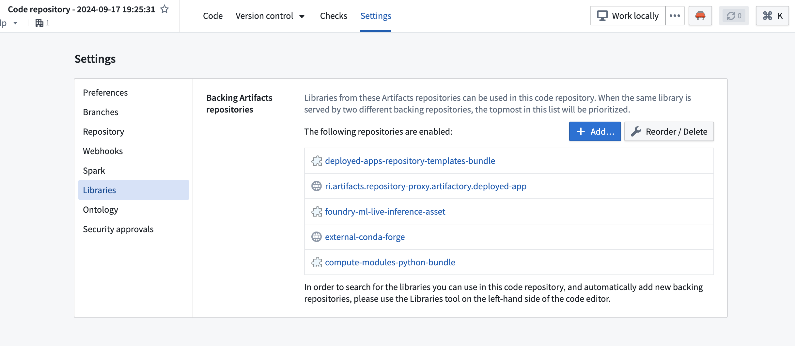
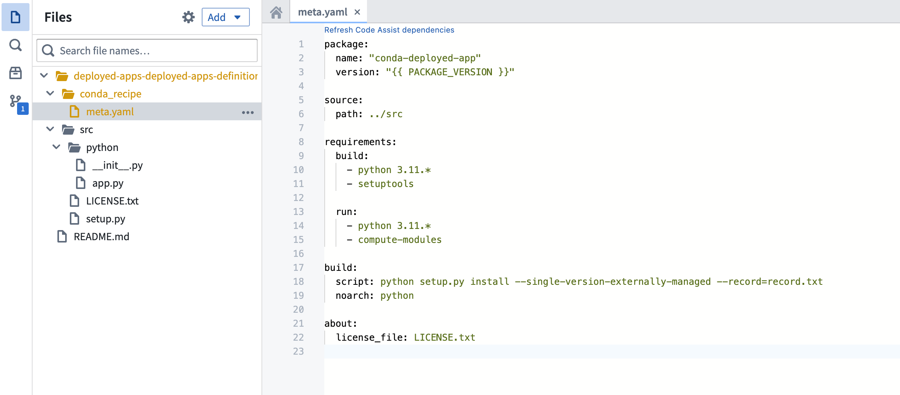
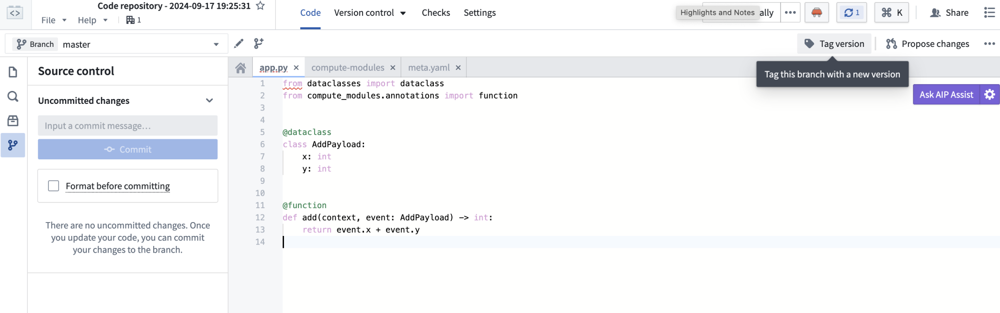

<!-- source: https://palantir.com/docs/foundry/compute-modules/get-started/ · mirrored 2026-08-14 from Palantir Foundry docs -->

# Getting started

To get started with compute modules, you can use your preferred developer environment. In a few minutes, you will be able to create and deploy a compute module and test it in Foundry.

In Foundry, choose a folder and select **+ New > Compute Module**, then follow the steps in the dialog to start with an empty compute-module backed function or pipeline. Follow the documentation below for next steps depending on your execution mode, or, for a more seamless experience, select the **Documentation** tab within your compute module to follow along with in-platform guidance.

## Build a compute module-backed function

Compute modules support multiple languages through open-source SDKs. Choose the language that best fits your team and use case:

* **Python:** Use the [open-source Python library ↗](https://github.com/palantir/python-compute-module).
* **Java:** Use the [open-source Java library ↗](https://github.com/palantir/java-compute-module) with the `com.palantir.computemodules:lib` dependency.
* **Node.js:** Use the [open-source TypeScript library ↗](https://github.com/palantir/typescript-compute-module).

:::callout{theme="neutral"}
Review the following SDK guides for detailed API documentation, authentication patterns, type systems, and code examples:

* [Python SDK](/docs/foundry/compute-modules/python-sdk/): Includes `@function` decorator, typed functions, streaming, authentication, OSDK integration, and logging
* [Java SDK](/docs/foundry/compute-modules/java-sdk/): Includes `ComputeModule` builder, type definitions, authentication, OSDK integration, and logging
* [TypeScript/Node.js SDK](/docs/foundry/compute-modules/typescript-sdk/): Includes function registration, TypeBox schema definitions, streaming, and SLS logging
:::

If you prefer to create your own client or implement your compute module in another language not supported by the SDKs, review the documentation on how to implement the [custom compute module client](/docs/foundry/compute-modules/advanced-custom-client/).

**Prerequisites:**

* Install [Docker Desktop](/docs/foundry/compute-modules/containers/#get-started-with-docker)
* Install one of the following:
  * Python 3.9 or higher
  * Java 21 or higher
  * Node.js 18 or higher

### Write the compute module locally

1. Begin by creating a new directory for your compute module.
2. Create a file called `Dockerfile` in the directory.
3. Copy and paste the following into the `Dockerfile`:

```dockerfile tab="Python"
# Change the platform based on your Foundry resource queue
FROM --platform=linux/amd64 python:3.12

COPY requirements.txt .
RUN pip install -r requirements.txt
COPY src .

# USER is required to be non-root and numeric for running compute modules in Foundry
USER 5000
CMD ["python", "app.py"]
```

```dockerfile tab="Java"
# Build stage
FROM --platform=linux/amd64 gradle:jdk21 AS build
COPY . /home/gradle/src
WORKDIR /home/gradle/src
RUN gradle shadowJar --no-daemon

# Run stage
FROM --platform=linux/amd64 eclipse-temurin:21-jre-alpine

RUN mkdir /app
COPY --from=build /home/gradle/src/build/libs/*.jar /app/app.jar

# USER is required to be non-root and numeric for running compute modules in Foundry
USER 5000
CMD ["java", "-jar", "/app/app.jar"]
```

```dockerfile tab="Node.js"
# Change the platform based on your Foundry resource queue
FROM --platform=linux/amd64 node:18-alpine

WORKDIR /app
COPY package.json package-lock.json ./
RUN npm ci --production
COPY src .

# USER is required to be non-root and numeric for running compute modules in Foundry
USER 5000
CMD ["node", "index.js"]
```

4. Create the dependency file for your language:

```text tab="Python"
# requirements.txt
foundry-compute-modules
```

```groovy tab="Java"
// build.gradle
plugins {
    id 'java'
    id 'com.gradleup.shadow' version '9.4.1'
}

repositories {
    mavenCentral()
}

dependencies {
    implementation 'com.palantir.computemodules:lib:0.6.0'
}

jar {
    manifest {
        attributes 'Main-Class': 'com.example.App'
    }
}
```

```json tab="Node.js"
{
  "name": "my-compute-module",
  "version": "1.0.0",
  "dependencies": {
    "@palantir/compute-module": "^0.2.12"
  }
}
```

5. Create the directory structure for your application code:

```text tab="Python"
MyComputeModule
├── Dockerfile
├── requirements.txt
└── src
    └── app.py
```

```text tab="Java"
MyComputeModule
├── Dockerfile
├── build.gradle
└── src
    └── main
        └── java
            └── com
                └── example
                    └── App.java
```

```text tab="Node.js"
MyComputeModule
├── Dockerfile
├── package.json
└── src
    └── index.js
```

6. Inside your application file, copy and paste the following code:

```python tab="Python"
from compute_modules.annotations import function

@function
def add(context, event):
    return str(event['x'] + event['y'])

@function
def hello(context, event):
    return 'Hello' + event['name']
```

```java tab="Java"
package com.example;

import com.palantir.computemodules.ComputeModule;
import com.palantir.computemodules.functions.Context;

public class App {
    public static void main(String[] args) {
        ComputeModule.builder()
            .add(App::add, AddEvent.class, Integer.class, "add")
            .add(App::hello, HelloEvent.class, String.class, "hello")
            .build()
            .start();
    }

    record AddEvent(int x, int y) {}
    record HelloEvent(String name) {}

    static Integer add(Context context, AddEvent event) {
        return event.x() + event.y();
    }

    static String hello(Context context, HelloEvent event) {
        return "Hello, " + event.name();
    }
}
```

```javascript tab="Node.js"
const { ComputeModule } = require("@palantir/compute-module");

const computeModule = new ComputeModule();

computeModule.register("add", (context, event) => {
    return String(event.x + event.y);
});

computeModule.register("hello", (context, event) => {
    return "Hello" + event.name;
});

computeModule.start();
```

:::callout{theme="neutral"}
Learn how to add type inference and [automatically register a compute module function with the function registry](/docs/foundry/compute-modules/functions/#automatic-function-schema-inference).
:::

:::callout{theme="neutral" title="Typed Python example"}
For production use, consider using typed inputs and outputs with the Python SDK. This enables automatic schema inference and function registration:

```python
from dataclasses import dataclass
from typing import TypedDict
from compute_modules.annotations import function

class HelloInput(TypedDict):
    planet: str

@dataclass
class AddPayload:
    x: int
    y: int

@function
def hello(context, event: HelloInput) -> str:
    return "Hello " + event["planet"] + "!"

@function
def add(context, event: AddPayload) -> int:
    return event.x + event.y
```

Review the documentation on [automatic function schema inference](/docs/foundry/compute-modules/functions/#automatic-function-schema-inference) for more details on supported type patterns.
:::

### Understand your function code

When working with compute module functions, your function will always receive two parameters: **event objects** and **context objects**.

**Context object:** An object parameter containing metadata and credentials that your function may need. Examples include user tokens, source credentials, and other necessary data. For example, if your function needs to call the OSDK to get an Ontology object, the context object includes the necessary token for the user to access that Ontology object.

**Event object:** An object parameter containing the data that your function will process. Includes all parameters passed to the function, such as `x` and `y` in the `add` function, and `name` in the `hello` function. In Python, this is a `dict`; in Java, this is a JSON node object; in Node.js, this is a plain JavaScript object.

:::callout{theme="warning"}
If you use static typing for the event/return object, the library will convert the payload/result into that statically-typed object. Review documentation on [automatic function schema inference](/docs/foundry/compute-modules/functions/#automatic-function-schema-inference) for more information.
:::

:::callout{theme="warning"}
The function result will be wired as a JSON blob, so be sure the function is able to be serialized into JSON.
:::

### Create your first container

Now, you can publish your code to Foundry using an Artifact repository, which will be used to store your Docker images.

1. Create or select an Artifact repository to publish your code to Foundry. To do this, navigate to the **Documentation** tab of your compute module. Then, find the corresponding in-platform documentation section to this external documentation page: **Build a compute module-backed function > Create your first container**. There, you can **Create or select repository**.
2. On the next page, select the dropdown menu to choose **Publish to DOCKER** and follow the instructions on the page to push your code.
3. In the **Configure** tab of your compute module, select **Add Container**. Then, select your Artifact repository and the image you pushed.
4. Select **Update configuration** to save your edits.
5. Once the configuration is updated, you can start the compute module from the **Overview** page, test it using the bottom **Query** panel, and view the logs.

## Build using Code Repositories

As an alternative to developing locally, you can build a Python compute module directly within the Foundry platform using Code Repositories. This approach provides an integrated development experience with built-in version control, dependency management, and container image publishing.

### Prerequisites

* Understand [function execution mode](/docs/foundry/compute-modules/execution-modes/#functions-execution-mode) and its configuration.
* Familiarity with [Code Repositories](/docs/foundry/code-repositories/overview/).

### Create a Python compute module code repository

1. In Foundry, navigate to a folder and select **+ New > Code Repository**.
2. Select **Python Compute Module** as the repository type.
3. Name your repository and select **Create**.

The code repository will be pre-configured with the necessary project structure for a compute module, including a `src/` directory and default configuration files.

### Write functions in your code repository

Inside the `src/` directory, open the `app.py` file and define your functions using the `@function` decorator:

```python
from compute_modules.annotations import function

@function
def add(context, event):
    return str(event['x'] + event['y'])

@function
def hello(context, event):
    return 'Hello ' + event['name']
```

For typed inputs and outputs that enable automatic schema inference, use `TypedDict` or `dataclass` types as described in the [automatic function schema inference](/docs/foundry/compute-modules/functions/#automatic-function-schema-inference) documentation.

### Add Python libraries

You can add Python libraries to your compute module code repository in two ways:

* **Using the Settings panel:** Navigate to **Settings > Libraries** in your code repository and add the libraries you need.
* **Using `meta.yaml`:** Add dependencies directly in the `meta.yaml` configuration file in your repository root.





### Tag a version

Once your code is ready, tag a version in your code repository to create an image:

1. Select **Tag version** from the repository toolbar.
2. Enter a version number (for example, `0.0.1`).
3. Select **Tag** to create the version.



This creates a container image that can be linked to your compute module.

### Link the image to your compute module

1. Navigate to the **Configure** tab of your compute module.
2. Select **Add Container**.
3. Select your code repository and the tagged version you created.
4. Select **Update configuration** to save your edits.

### Import functions

After the compute module is running, you can import your functions:

1. Navigate to the **Functions** tab in the Compute Module application.
2. Select **Import** to view the list of detected functions from your running compute module.
3. Select the functions you want to register and confirm the import.

Your functions are now available to use across the Foundry platform, including in [Workshop](/docs/foundry/workshop/overview/) and [Slate](/docs/foundry/slate/overview/) applications.

## Build a compute module-backed pipeline

Compute modules can operate as a connector between inputs and outputs of a data pipeline in a containerized environment. In this example, you will build a simple use case with streaming datasets as inputs and outputs to the compute module, define a function that doubles the input data, and write it to the output dataset. You will use notional data to simulate a working data pipeline.

### Prerequisites

* Understand [pipeline execution mode](/docs/foundry/compute-modules/execution-modes/#pipeline-execution-mode) and its configuration.
* Set up an [input and output stream](/docs/foundry/compute-modules/execution-modes/#add-inputs-and-outputs).
* Install [Docker Desktop](/docs/foundry/compute-modules/containers/#get-started-with-docker).
* Install Python 3.9 or higher

### Write the compute module to your local machine

1. Create a new directory for your compute module.
2. Create a file called `Dockerfile` in the directory.
3. Copy and paste the following into the `Dockerfile`:

```
# Change the platform based on your Foundry resource queue
FROM --platform=linux/amd64 python:3.12

COPY requirements.txt .
RUN pip install -r requirements.txt
COPY src .

# USER is required to be non-root and numeric for running compute modules in Foundry
USER 5000
CMD ["python", "app.py"]
```

4. Create a new file called `requirements.txt`. Store your dependencies for your Python application in this file. For example:

```
requests == 2.31.0
```

5. Create a new subdirectory called `src`. This is where you will put your Python application.
6. Inside the `src` directory, create a file called `app.py`.
7. Your directory should now look like the following:

```
MyComputeModule
├── Dockerfile
├── requirements.txt
└── src
    └── app.py
```

8. Add the following code to `app.py`. This complete example reads from an input stream, doubles the values, writes to an output stream, and repeats every 60 seconds:

```python
import os
import json
import time
import requests

# Read the bearer token for input and output access
with open(os.environ['BUILD2_TOKEN']) as f:
    bearer_token = f.read()

# Read input and output resource information
with open(os.environ['RESOURCE_ALIAS_MAP']) as f:
    resource_alias_map = json.load(f)

input_info = resource_alias_map['identifier you put in the config']
output_info = resource_alias_map['identifier you put in the config']

input_rid = input_info['rid']
input_branch = input_info['branch'] or "master"
output_rid = output_info['rid']
output_branch = output_info['branch'] or "master"

FOUNDRY_URL = "yourenrollment.palantirfoundry.com"

def get_stream_latest_records():
    url = f"https://{FOUNDRY_URL}/stream-proxy/api/streams/{input_rid}/branches/{input_branch}/records"
    response = requests.get(url, headers={"Authorization": f"Bearer {bearer_token}"})
    return response.json()

def process_record(record):
    # Assume input stream has schema 'x': Integer
    x = record['value']['x']
    # Assume output stream has schema 'twice_x': Integer
    return {'twice_x': x * 2}

def put_record_to_stream(record):
    url = f"https://{FOUNDRY_URL}/stream-proxy/api/streams/{output_rid}/branches/{output_branch}/jsonRecord"
    requests.post(url, json=record, headers={"Authorization": f"Bearer {bearer_token}"})

# Run the pipeline autonomously
while True:
    records = get_stream_latest_records()
    processed_records = list(map(process_record, records))
    [put_record_to_stream(record) for record in processed_records]
    time.sleep(60)
```

### Deploy your compute module

1. Build a Docker image and publish it to the [Artifact repository](/docs/foundry/code-repositories/publish-artifact/).
2. Finally, deploy the compute module using pipeline execution mode after selecting the relevant container image.

You can now view the results streamed live in the output dataset.

### Understand your pipeline code

To interact with inputs and outputs, we provide a [bearer token and input/output information](/docs/foundry/compute-modules/execution-modes/#pipeline-execution-mode).

You can then write code to interact with the inputs and outputs and perform computations. The code snippets provide a simple example of pipelining two stream datasets:

* It reads the latest records from the input stream dataset using the bearer token and input info by calling the `stream-proxy` service.
* It then performs computations (in the above example, doubling the data). The data format depends on your own input data.
* Next, it writes results to the output stream dataset using the bearer token and output info.
* Finally, as you cannot query a pipeline mode compute module, the code runs the pipeline autonomously at the end of the script, which will be executed on container start.

### Create your first container

Now, you can publish your code to Foundry using an Artifact repository, which will be used to store your Docker images.

1. Create or select an Artifact repository to publish your code to Foundry. To do this, navigate to the **Documentation** tab of your compute module. Then, find the corresponding in-platform documentation section to this external documentation page: **Build a compute module-backed function > Create your first container**. There, you can **Create or select repository**.
2. On the next page, select the dropdown menu to choose **Publish to DOCKER** and follow the instructions on the page to push your code.
3. In the **Configure** tab of  your compute module, select **Add Container**. Then, select your Artifact repository and the image you pushed.
4. Select **Update configuration** to save your edits.
5. Once the configuration is updated, you can start the compute module from the **Overview** page, test it using the bottom **Query** panel, and view the logs.
