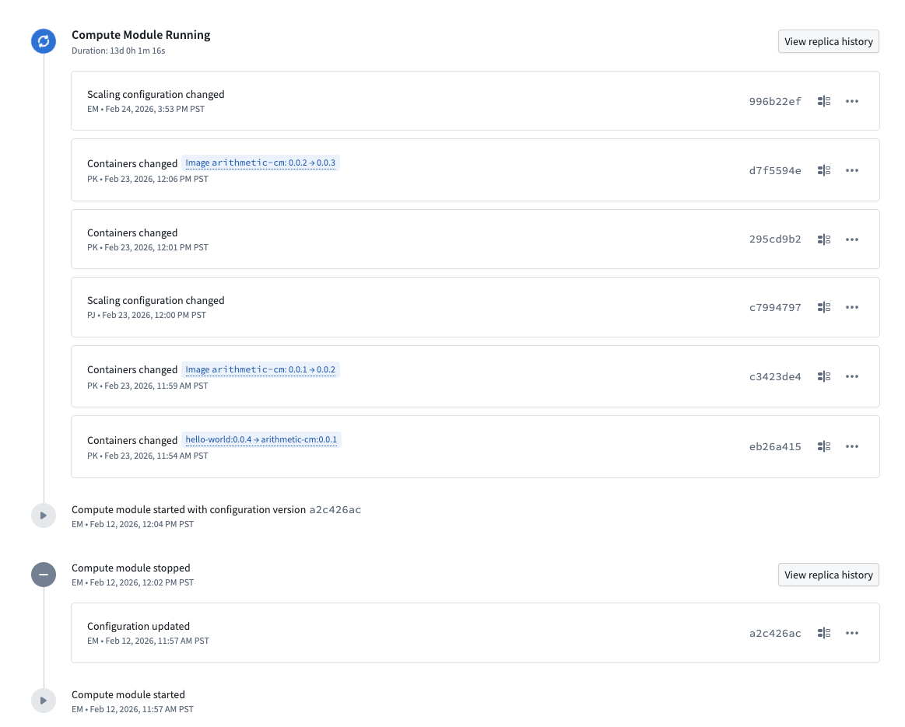
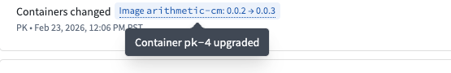
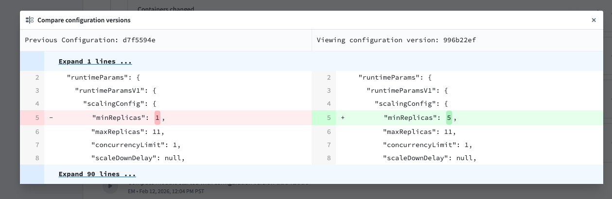
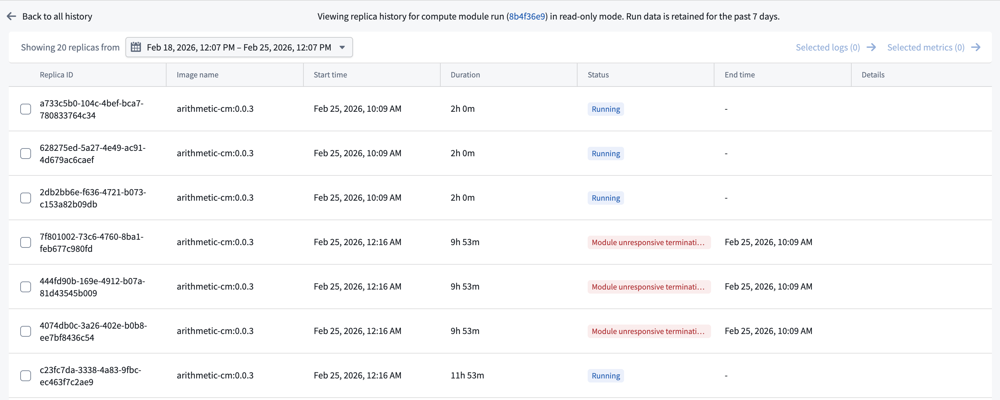
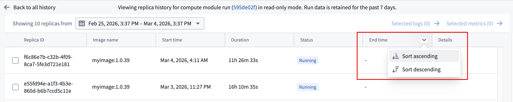
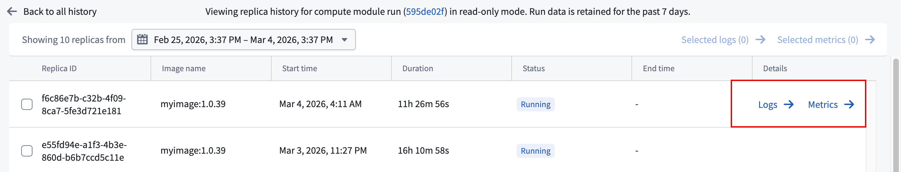

<!-- source: https://palantir.com/docs/foundry/compute-modules/history/ · mirrored 2026-08-14 from Palantir Foundry docs -->

# Compute module history

The **History** tab provides a chronological record of all changes and runs for your compute module, which is useful for debugging. Use this view to understand how your compute module's configuration has evolved over time and to investigate past deployments.

The history tab displays events in reverse chronological order, including the following:

* **Configuration changes:** Each change is labeled with the type of modification, such as **Containers changed** or **Scaling configuration changed**. When container images are updated, the history shows the specific version transition (for example, `image arithmetic-cm: 0.0.1 → 0.0.2`). Hovering over this tag will display the impacted container.   
     
  Each configuration change is associated with a unique configuration version identifier. You can use these identifiers to review and compare specifications across changes.

  * To view the full specification for a configuration version, select the tag containing the version identifier.
  * To compare a configuration version against the previous saved version, select the compare icon next to a configuration entry. This opens a side-by-side diff view that shows the previous configuration on the left and the selected configuration on the right. Additions and removals are highlighted, making it straightforward to identify exactly what changed between versions.   
       
* **Run events:** The history tab tracks when a compute module was started or stopped, along with who initiated the action and when it occurred.

## Replica history

For any given compute module run, you can view the replica history by selecting **View replica history** next to a stopped run or an in-progress run. The replica history provides a detailed view of all replicas created during that run.

The banner at the top of the replica history page displays the run identifier as a link. Select this link to open the run in Job Tracker, where you can view additional information about the compute module run.

The replica history table displays the following information for each replica:

* **Replica ID:** The unique identifier for the replica.
* **Image name:** The container image and version used by the replica.
* **Start time:** When the replica was created.
* **Duration:** How long the replica has been running, or its total run time if the run has completed.
* **Status:** The current or final state of the replica, such as whether it is still running, whether it reached its maximum lifetime, or if it was terminated early. If a replica was terminated early, the status indicates the reason, such as an unresponsive termination strategy.
* **End time:** When the replica stopped, if applicable. You can filter replicas by end time by hovering over the **End time** column header.

To view logs or metrics for an individual replica, hover over its row to reveal the **Logs** and **Metrics** buttons in the **Details** column, then select the desired option.

To view logs or metrics for multiple replicas at once, select the replicas using the checkboxes and then use the **Selected logs** or **Selected metrics** links at the top of the table.

:::callout{theme="neutral"}
Replica history is read-only. Replica details are only retained for 7 days.
:::
