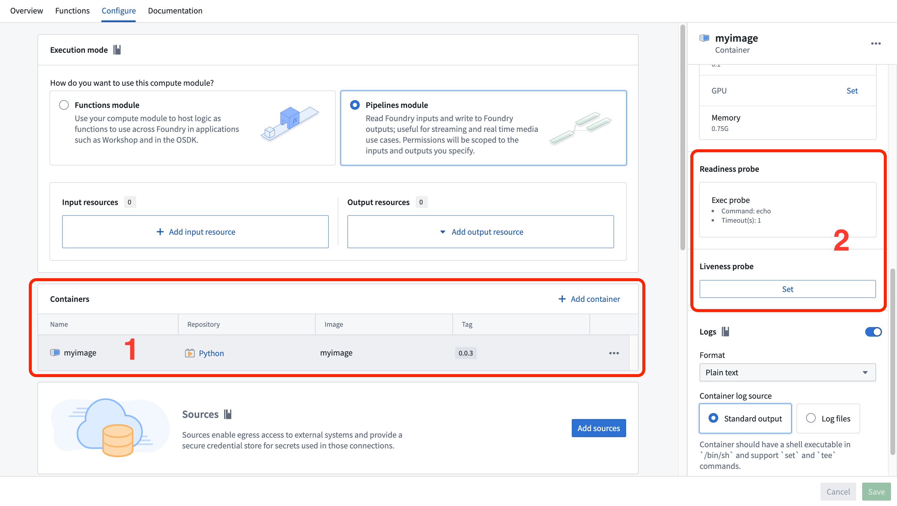
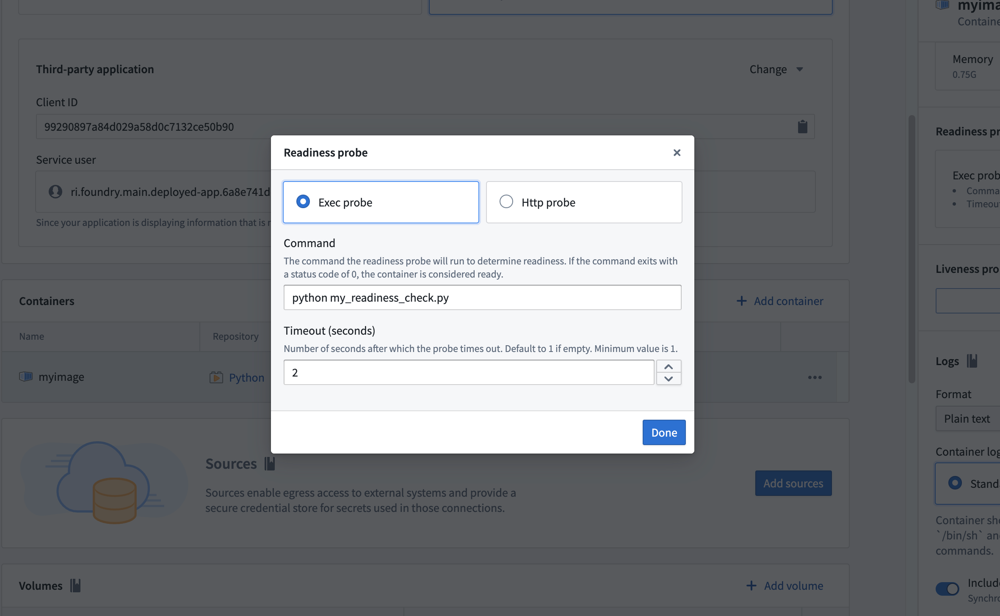
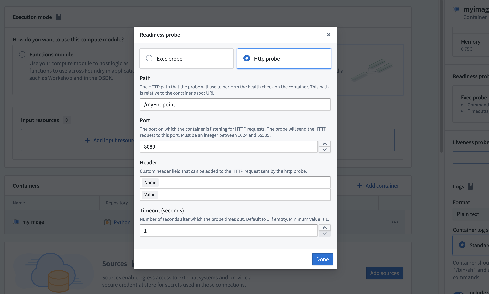

<!-- source: https://palantir.com/docs/foundry/compute-modules/probes/ · mirrored 2026-08-14 from Palantir Foundry docs -->

# Probes

A probe is a diagnostic mechanism used to check the readiness and liveness of containers in a compute module. Probes run custom checks to determine whether containers are functioning correctly and can handle traffic, then report the container status. You can configure two types of probes: readiness probes and liveness probes.

## Readiness probe vs. liveness probe

A **Readiness probe** checks if a container is ready to handle queries. It runs intermittently throughout the container lifecycle. If the probe succeeds, the container is considered ready to receive queries. If the probe fails, the container is marked as unresponsive and will not receive queries until the probe succeeds again. A common use case for readiness probes is verifying that prerequisite tasks have completed during startup.

A **Liveness probe** checks if a container is still running correctly. Like the readiness probe, it runs intermittently throughout the container lifecycle. If the liveness probe fails, the container is restarted.

Both probe types only differ in the actions taken after the check returns a result. The probe check itself is agnostic to the subsequent actions.

## Set up a probe

To configure a probe for your compute module:

1. Navigate to the **Containers** section of the **Configure** tab. Locate and select the container you want to configure.

2. Scroll to find the **Readiness probe** or **Liveness probe** section. Select **Set** or **Edit**.

   

3. Fill in the probe configuration by choosing between an [exec probe](#exec-probe) or an [HTTP probe](#http-probe).

## Exec probe

An exec probe executes a command inside the container and checks the exit status. An exit code of `0` indicates success, and any non-zero exit code indicates failure.

Configure the following fields for an exec probe:

* **Command:** The command to execute within the container
* **Timeout (seconds):** The maximum time allowed for the command to complete. If the command does not complete within this time, the probe fails.



:::callout{theme="neutral"}
By default, an exec readiness probe is set with the command `echo` to check if the container has crashed.
:::

### Example: Python exec probe

The following example demonstrates a Python exec probe script that downloads a dataset file as a prerequisite task during container startup. The script uses [application permissions](/docs/foundry/compute-modules/execution-modes/) to obtain an access token and fetch data from a Foundry dataset. Place this script in the same folder as your `app.py` so that it is copied into your container.

```python
import os
import requests

HOSTNAME = "..."
CLIENT_SECRET = os.environ["CLIENT_SECRET"]
CLIENT_ID = os.environ["CLIENT_ID"]

# Get token using third-party application in function mode
TOKEN = requests.post(f"https://{HOSTNAME}/multipass/api/oauth2/token",
    data={
        "grant_type": "client_credentials",
        "client_id": CLIENT_ID,
        "client_secret": CLIENT_SECRET,
        "scope": "api:datasets-read"
    },
    ).json()["access_token"]
HEADERS = {
    "Authorization": f"Bearer {TOKEN}"
}

DATASET_RID = os.environ["DATASET_RID"]
FILENAME = "tmp/my_file.csv"

if not os.path.exists(FILENAME):
    response = requests.get(f'https://{HOSTNAME}/api/v1/datasets/{DATASET_RID}/readTable?branchId=master&format=CSV', headers=HEADERS)
    if (response.status_code >= 400):
        exit(1)
    with open(FILENAME, 'w') as file:
        file.write(response.text)
```

This script exits with code `1` if the dataset download fails, causing the readiness probe to report a failure and preventing the container from receiving queries until the download succeeds.

## HTTP probe

An HTTP probe sends an HTTP GET request to an endpoint on the container. A response with a status code between `200` and `399` indicates success, and any other status code indicates failure.

Configure the following fields for an HTTP probe:

* **Path:** The URL path of the endpoint to check
* **Port:** The port number for the request. The port must be between 1024 and 65535, excluding 8945 and 8946.
* **HTTP header (optional):** A custom header specified as a name-value pair
* **Timeout (seconds):** The maximum time allowed for the request to complete. If the request does not complete within this time, the probe fails.


