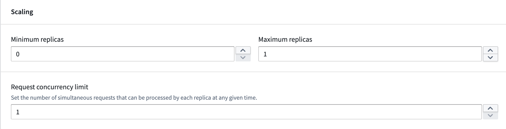
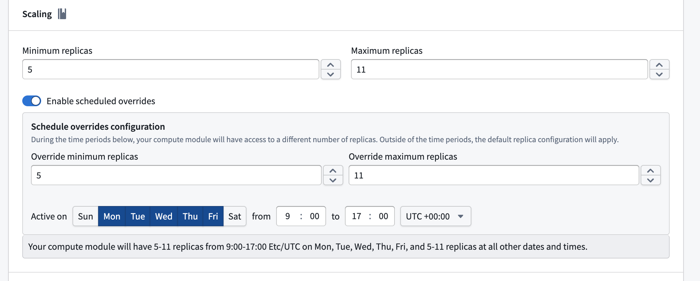

<!-- source: https://palantir.com/docs/foundry/compute-modules/scaling/ · mirrored 2026-08-14 from Palantir Foundry docs -->

# Scaling

Compute modules offer automatic horizontal scaling capabilities, allowing you to efficiently manage your deployment's resources. You can configure a range of replicas and set concurrency limits per replica, both of which influence scaling behavior.

## Minimum replicas

**Non-zero minimum:** Set the minimum number of replicas to greater than zero to ensure that at least that many instances of your application will be running at all times, even during periods of inactivity.
**Zero minimum:** Set the minimum to zero to allow your application to scale down to zero replicas when there are no active requests. However, your application will immediately scale up from zero when a request is received, upon initial deployment, and whenever load is predicted.

## Maximum replicas

* Set the highest number of active replicas for horizontal scaling.
* Ensure resource allocation stays within desired boundaries, prevent excessive costs, and protect against uncontrolled scaling due to traffic spikes.

## Concurrency limit

The concurrency limit defines the maximum number of requests a single replica can process simultaneously. It represents the parallel processing capacity of each replica. For example, a concurrency limit of three means each replica can handle up to three queries at the same time. The default setting is one, meaning each replica processes requests sequentially.

If you are using one of the SDKs, this concurrency is built in for you. However, if you are building a [custom client](/docs/foundry/compute-modules/advanced-custom-client/), this value can be obtained from the `MAX_CONCURRENT_TASKS` environment variable.

## Autoscaling

Autoscaling adjusts the number of active replicas of your model based on the current workload. In addition to setting minimum and maximum replica limits, you can configure the [scale-up load threshold](#scale-up-load-threshold), [scale-down load threshold](#scale-down-load-threshold), and [delays](#delays) to control how and when scaling occurs.

### Load thresholds

Load thresholds determine when autoscaling adds or removes replicas. The load is calculated using the following formula:

`current running job count / (current replica count * concurrency limit)`

Both the scale-up and scale-down thresholds must be between `0.0` and `1.0`.

#### Scale-up load threshold

The scale-up load threshold defines the load level at which the deployment adds a replica. When the calculated load is greater than or equal to this threshold for the duration of the [scale-up delay](#scale-up-delay), the deployment scales up by one replica.

The default scale-up load threshold is `0.75`. The scale-up load threshold cannot be lower than the scale-down load threshold.

#### Scale-down load threshold

The scale-down load threshold defines the load level at which the deployment removes a replica. When the calculated load falls below this threshold for the duration of the [scale-down delay](#scale-down-delay), the deployment scales down by one replica.

The default scale-down load threshold is `0.75`. The scale-down load threshold cannot exceed the scale-up load threshold.

### Delays

Delays control how long the deployment must remain above or below a load threshold before a scaling action is triggered. Configuring delays helps prevent unnecessary scaling events caused by brief fluctuations in load.

#### Scale-up delay

The scale-up delay is the amount of time the deployment must be oversubscribed (at or above the scale-up load threshold) before an additional replica is added. The default scale-up delay is one minute. The scale-up delay must be at most as high as the scale-down delay.

#### Scale-down delay

The scale-down delay is the amount of time the deployment must be undersubscribed (below the scale-down load threshold) before a replica is removed. The default scale-down delay is 30 minutes.

## Predictive scaling

Compute modules feature predictive scaling by tracking historic query load for your deployment. This system attempts to preemptively scale up to meet anticipated demand. If the prediction is inaccurate, the system will adjust and scale down. Predictive scaling respects your configured maximum number of replicas, so be sure to monitor your deployment's scaling over time and adjust your settings accordingly.

## Scheduled overrides

You can schedule overrides to your minimum and maximum replica configuration for specific days and times during the week. This is useful when you expect predictable changes in demand, such as higher traffic during business hours.

To configure a scheduled override, enable the **Enable scheduled overrides** toggle in the **Scaling** section. This reveals the **Schedule overrides configuration** panel, where you can set the following:

* **Override minimum replicas:** The minimum number of replicas during the scheduled period.
* **Override maximum replicas:** The maximum number of replicas during the scheduled period.
* **Active on:** The days of the week that the override will be applied.
* **Time range:** The start and end time for the override, along with the timezone.

Outside of the configured time periods, the default replica configuration applies. Currently, only one scheduled override is supported.

