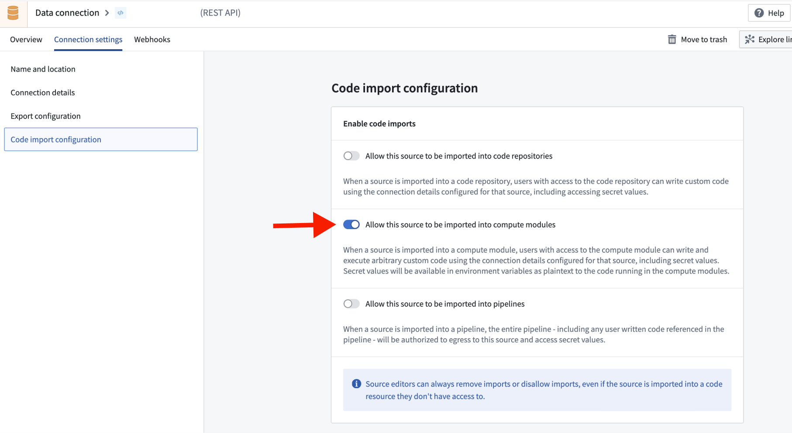
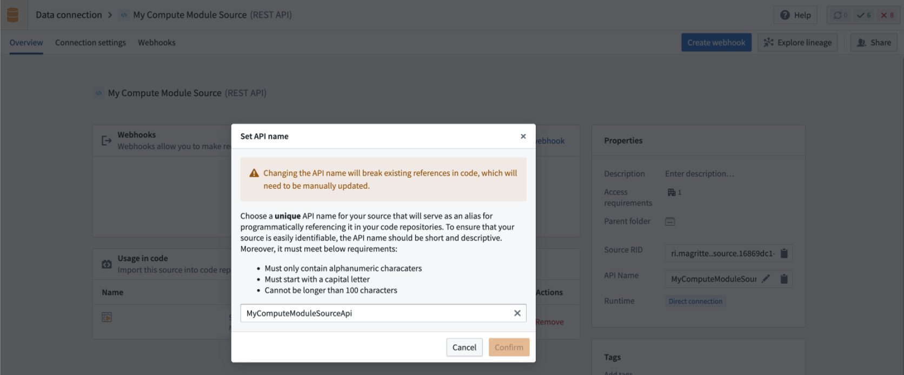
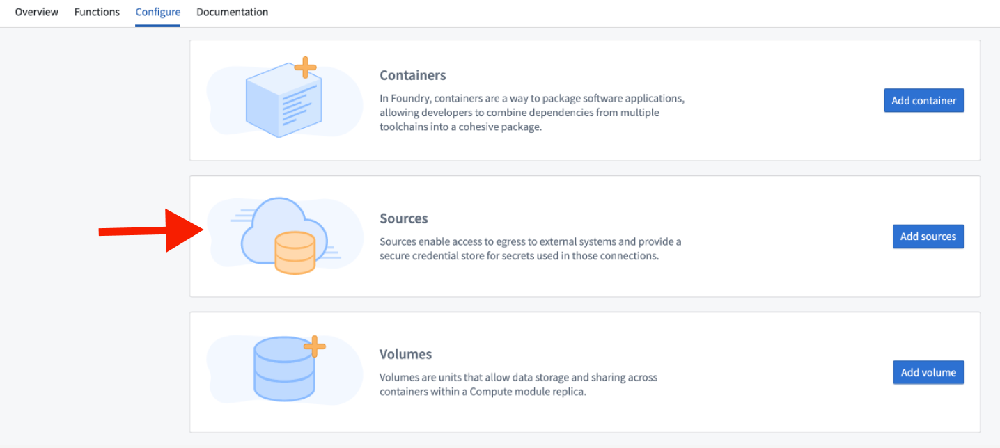

<!-- source: https://palantir.com/docs/foundry/compute-modules/sources/ · mirrored 2026-08-14 from Palantir Foundry docs -->

# Sources

Compute modules in Foundry operate under a "zero trust" security model, ensuring maximum isolation and security. By default, these modules lack any external network access, including access to other Foundry services. This strict isolation is crucial for maintaining a secure environment.

To enable external network access for your compute module, you must explicitly configure a source through the Data Connection application. Sources also allow secure storage of credentials needed to access external systems for use in your compute module. The following sections outline the process of using sources within your compute module as a means of packaging network policies and credentials.

## Add a source to your compute module

### Create a source in Data Connection

1. Create a source in the [Data Connection](/docs/foundry/data-connection/set-up-source/) application, attaching any required network policies and secrets.
2. Ensure the following configurations:

   * The source must be in the same Project as your compute module.
   * In the **Code import** configuration tab, choose to **Allow this source to be imported into compute modules**.

   

   * Add an API name for the source that you will use to access it from your compute module.

   

### Add the source to the compute module configuration

In your compute module, select **Configure > Sources > Add Sources**.



## Access source credentials within a compute module

When a compute module launches, source credentials are mounted as JSON in a file where the file path is contained by the `SOURCE_CREDENTIALS` environment variable. To access these credentials, perform the following:

1. Read the file pointed to by the `SOURCE_CREDENTIALS` environment variable.
2. Parse the contents as a JSON dictionary.
3. Access specific credentials first by specifying the source's API name, then the secret's name.

:::callout{theme="warning"}
Some sources, like REST sources, require an `additionalSecret` prefix before the specified secret's name (for example, `additionalSecretMySecretName`).
:::

```python tab="Python"
import json
import os

with open(os.environ['SOURCE_CREDENTIALS'], 'r') as f:
    credentials = json.load(f)

# Access a specific secret (when using a REST source, secrets are prefixed with 'additionalSecret')
secret = credentials["<Source API Name>"]["<Secret Name>"]
```

```javascript tab="Node.js"
const credentials = require(process.env.SOURCE_CREDENTIALS);

// Access a specific secret (when using a REST source, secrets are prefixed with 'additionalSecret')
const secret = credentials["<Source API Name>"]["<Secret Name>"];
```

You can also access source configuration details, including connection URLs, through the `SOURCE_CONFIGURATIONS_PATH` environment variable:

```python tab="Python"
import json
import os

with open(os.environ['SOURCE_CONFIGURATIONS_PATH'], 'r') as f:
    credentials = json.load(f)

# Access a specific secret
secrets = credentials["secrets"]
url = credentials["httpConnectionConfig"]["url"]
```

```javascript tab="Node.js"
const credentials = require(process.env.SOURCE_CONFIGURATIONS_PATH);

const url = credentials["httpConnectionConfig"]["url"];
```

You can use the [compute module SDK ↗](https://github.com/palantir/python-compute-module) to simplify this process. See the section below for details.

## Python Compute Module SDK

The [compute module SDK ↗](https://github.com/palantir/python-compute-module) provides a simplified interface for accessing sources and their credentials in Python. Instead of manually reading environment variables and parsing JSON, you can use the SDK to retrieve sources, secrets, and HTTPS connections directly.

To use the SDK, install the sources extra and import `get_source` from the `compute_modules.sources_v2` module:

```bash
pip install foundry-compute-modules[sources]
```

Then, pass the API name of your source:

```python
from compute_modules.sources_v2 import get_source
from external_systems.sources import Source

source: Source = get_source("<SOURCE_API_NAME>")

# Retrieving a secret
secret = source.get_secret("<SECRET_NAME>")

# Making an HTTPS request
https_connection = source.get_https_connection()
client = https_connection.get_client()
url = https_connection.url

response = client.get(url).text
```

The `get_source` function returns a `Source` object that provides the following methods:

* `get_secret("<SECRET_NAME>")`: Retrieves a specific secret by name from the source.
* `get_https_connection()`: Returns an HTTPS connection object configured with the source's network policies and credentials. Use `get_client()` on the connection to obtain an HTTP client and `url` to retrieve the base URL.

## Manage sources

To add or remove sources on your compute module, you must first stop the compute module. You cannot add or remove a source if the compute module is running. Additionally, changes to network policies on the source require a full restart of the compute module to apply. Changes to credentials will be reflected in a compute module rolling upgrade.
