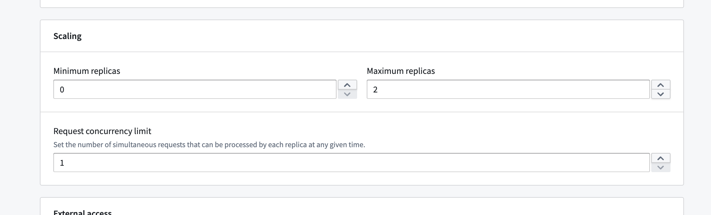
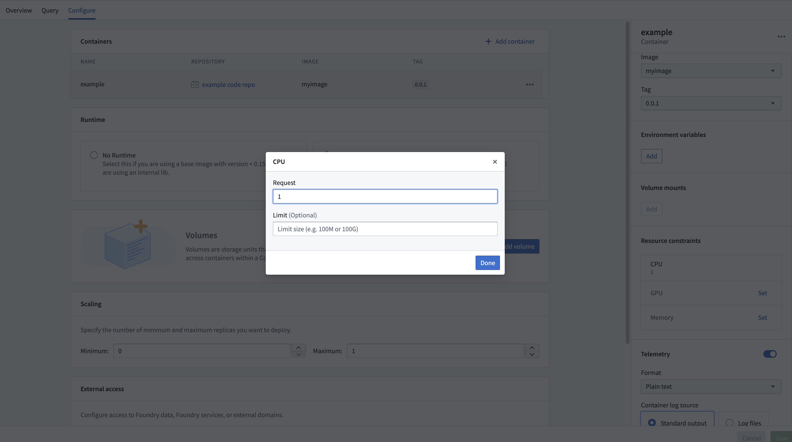

<!-- source: https://palantir.com/docs/foundry/compute-modules/usage/ · mirrored 2026-08-14 from Palantir Foundry docs -->

# Compute module usage and pricing

Compute modules enables you to deploy interactive containers. To understand their compute usage you should know that these deployments can horizontally scale up and down automatically, and may do so even without requests due to predictive autoscaling. You might consume usage anytime you click build and the deployment is running.

When running any compute usage consumed will be attributed to the compute module itself.
Compute usage is consumed any time you have a "replica" starting or running, and will not be consumed when you have no replicas starting or running. How much usage is consumed depends on the number of replicas and their associated resource usage over time.

To best understand your usage you should know that a compute module can have many replicas, and each replica can have many containers.

## Pricing

Compute module usage is tracked as Foundry compute-seconds. Review our [usage types documentation](/docs/foundry/resource-management/usage-types/) for more details.

Compute seconds are measured as long as a replica is starting or active. There are a few factors used to determine compute seconds:

* The number of vCPU’s per replica
* The GiB of RAM per replica
* The number of GPUs per replica
* The number of replicas
  * The number of replicas at any given time is dynamic, but they all have the same resource configuration

When paying for Foundry usage, the default usage rates are the following:

| vCPU / GPU | Usage Rate |
| --- | --- |
| vCPU | 0.2 |
| T4 GPU | 1.2 |
| V100 GPU | 3 |
| A100 GPU | 1.3 |
| A10G GPU | 1.5 |
| L4 GPU | 2.1 |
| H100 GPU | 4.7 |

If you have an enterprise contract with Palantir, contact your Palantir representative before proceeding with compute usage calculations.

```
vcpu_compute_seconds = max(vCPUs_per_replica, GiB_RAM_per_replica / 7.5) * num_replicas * vcpu_usage_rate * time_active_in_seconds
```

The following formula measures GPU compute seconds:

```
gpu_compute_seconds = GPUs_per_replica * num_replicas * gpu_usage_rate * time_active_in_seconds
```

## Scaling configuration for compute modules

You can configure the minimum and maximum number of allowed replicas directly on our configure page.



This range allows you to have some control over the automatic horizontal scaling. Essentially, we will be allowed to scale at any time to any number of replicas within the range you configure. You can also set concurrency limits per replica, which will have an impact on scaling. A lower concurrency limit may lead to more aggressive horizontal scaling under the same load.

If you set the minimum number of replicas to a non-zero value you will consume compute usage even if you are not actively using your deployment. If you set minimum to zero, and no request has been sent to your deployment in some time we can scale down to zero and in that case you will not consume usage. However we will immediately scale up from zero anytime a request is sent, immediately when you deploy for the first time, and any time that we predict there might be load.

Compute modules have predictive scaling where we track historic query load for your deployment and attempts to scale up preemptively to meet predicted demand. If our prediction was inaccurate we will use it to refine our next predictions and we will scale down relatively quickly. This system respects your configured max number of replicas, so you should monitor your deployments scaling overtime and tune your scaling settings accordingly.

## Resource configuration for compute modules

The Compute Modules application interface enables you to configure resources for each container on a per-replica basis. CPU, memory, and GPU resource requests and limits can all be configured per replica.



Setting these resources is optional; in the absence of configuration, the replica will default to 1 vCPU, 4 GB memory, and no GPU. Each replica will request the amount of configured resources, and will respect limits if set. This means if you use the default resources (1 vCPU and 4 GB memory and no limit) and you have four replicas, you may be consuming 4 vCPUs and 16 GB memory (though you could be consuming more or less depending on request load).
