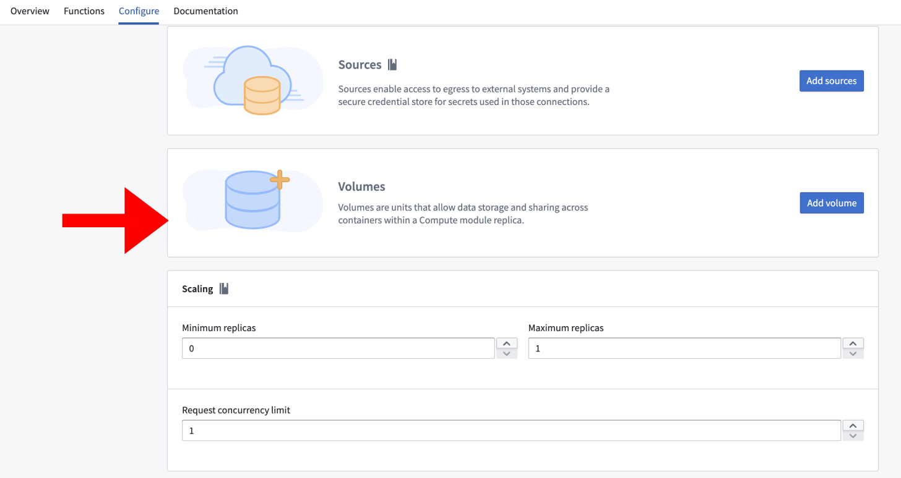
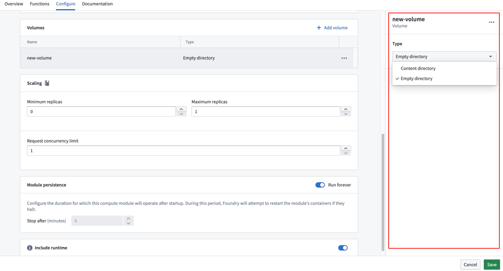
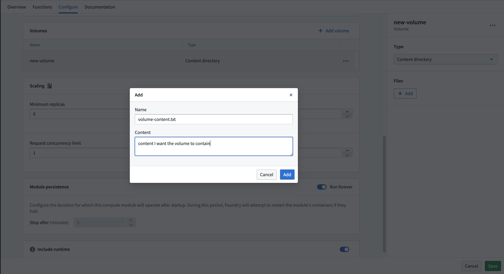
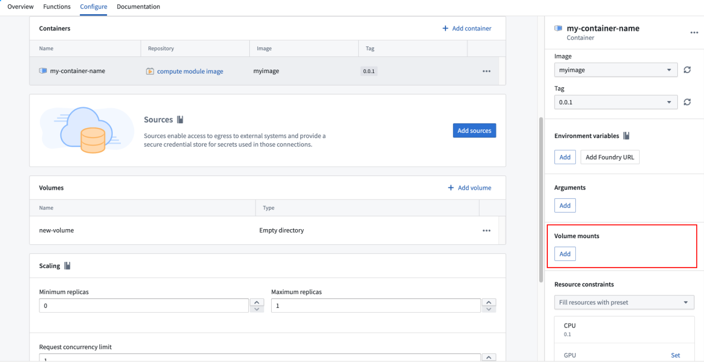
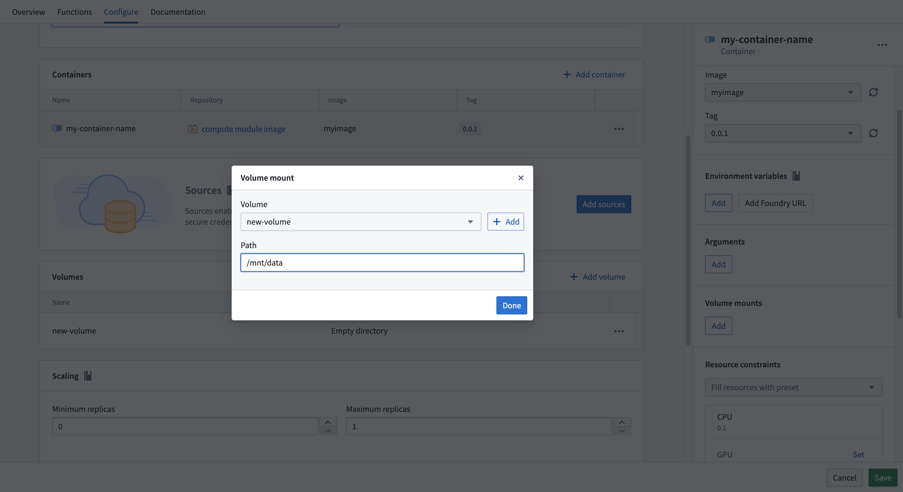

<!-- source: https://palantir.com/docs/foundry/compute-modules/volumes/ · mirrored 2026-08-14 from Palantir Foundry docs -->

# Volumes

Volumes provide a method to share data between containers within a compute module replica. They enable more efficient storage by allowing volume size to be independent of the container root filesystem.

:::callout{theme="warning"}
Volumes are ephemeral and do not persist data across replica restarts. All volume data is tied to the lifecycle of the replica. Do not rely on volumes for persistent state.
:::

Volumes cannot share data between different replicas. Each replica has its own separate set of volumes.

## Supported volume types

All volumes are ephemeral and are not intended for persistent storage. There are two supported volume types: **empty directory** and **content directory**.

### Empty directory

An **empty directory** volume is created when a replica starts and exists for the duration of the replica lifespan. It is initially empty. All containers mounted to the volume can read and write the same files. The content is deleted when the replica terminates.

Use empty directory volumes when containers in the same replica need to exchange data at runtime.

### Content directory

A **content directory** volume is pre-loaded with a predefined set of files when a replica starts. This is useful for separating environment-specific configuration from application code. Content directory volumes are read-only.

You must define the content before starting the compute module.

:::callout{theme="warning"}
The total content size of a content directory volume cannot exceed 100KB.
:::

## Create a volume

1. Navigate to the **Configuration** tab and scroll to the volumes section.



2. Select **Add Volume**.
3. Choose a name for the volume. The name must start with a letter and can only contain lowercase letters, numbers, and hyphens. The maximum length is 63 characters.
4. By default, an empty directory volume is created.

## Change to a content directory type

To change a volume from an empty directory to a content directory:

1. Select the volume to open its settings.
2. Change the type from **Empty directory** to **Content directory**.



3. Select **+ Add** to add files.
4. Fill in the **Name** field with the filename and the **Content** field with the plaintext content of the file.
5. Select **Save**.



## Mount a volume to a container

After creating a volume, you must mount it to a container before the container can access it.

1. Navigate to the **Containers** section.
2. Select the container you want to mount the volume to.
3. Find the **Volume mounts** section.



4. Select **Add** and choose the volume.
5. Specify the mount path. The mount path must be an absolute path and cannot be the root directory, for example, `/mnt/data`.
6. Select **Save**.



## Example use case

The following example demonstrates how to mount an Ontology object into an empty directory volume so that the data persists between function executions within the same replica. The volume is written to when the replica starts, and subsequent function calls read from the volume instead of reloading the data.

```python
from compute_modules.annotations import function
import os
import json

# The following code runs when the replica starts up
# /mount/osdk was configured as the path to an empty volume
osdk_object = load_ontology_object()
write_to_empty_volume("/mount/osdk", osdk_object)

def load_ontology_object():
    # Code to load the ontology object
    # Replace with actual loading logic
    return {"example_key": "example_value"}

def write_to_empty_volume(path, obj):
    os.makedirs(os.path.dirname(path), exist_ok=True)
    with open(path, 'w') as f:
        json.dump(obj, f)

def read_from_volume(path):
    with open(path, 'r') as f:
        return json.load(f)

# Functions that read from the volume instead of reloading
@function
def use_object_set(ctx, event):
    osdk_object = read_from_volume("/mount/osdk")
    # Use the osdk_object as needed
```

## Limitations

Review the following limitations when working with volumes:

* Persistent volumes are not supported. All volumes are ephemeral and tied to the replica lifecycle.
* Replicas have a maximum lifespan of 22 hours.
* Replicas may be replaced at any time by the platform.
* Do not rely on volumes for persistent state. Use Foundry datasets or other platform storage for data that must survive replica restarts.
