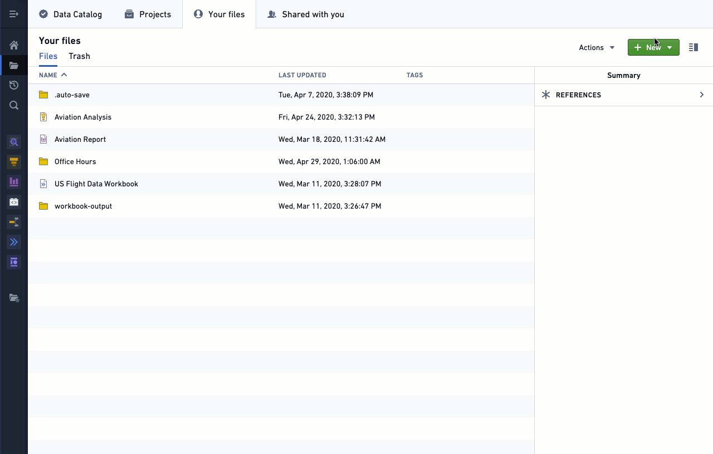
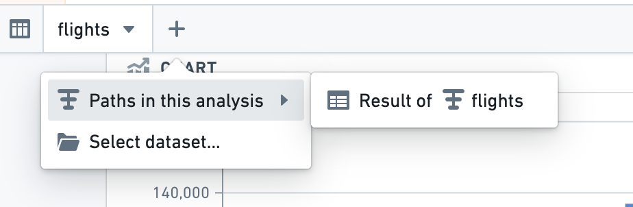

<!-- source: https://palantir.com/docs/foundry/contour/analysis-create-path/ · mirrored 2026-08-26 from Palantir Foundry docs -->

# Create a path

In Contour, there are two types of datasets you can use to begin a new analysis path:

* [Datasets saved on the platform](#starting-an-analysis-from-datasets-in-foundry)
* [Results from a path in the current analysis](#using-resulting-datasets-to-begin-a-new-path)

***

## Starting an analysis from datasets in Foundry

In Foundry, every user has their own folder called **Your Files**. This is a folder where users can prototype with data and share their results with other users. Once inside the folder, users can create their first analysis:

1. Navigate to the **Project & Files** module.
2. Navigate to **Your Files**.
3. Create a new analysis by selecting the green **+New** action menu and choosing **Analysis** in the dropdown menu.
4. Select **+Create a new path** after your new analysis is generated.
5. Select the dataset that you would like to analyze in the corresponding folder.

***

## Using resulting datasets to begin a new path

A single analysis can contain multiple paths, and it is often valuable to use the results from one path in an analysis as the starting place for a new path. We recommend performing all of the filtering on the dataset in the first path. This allows you to make use of the resulting dataset in other paths to generate visualizations and further transform the dataset of interest. We also recommended consolidating the usage of parameters in your Contour analysis to this primary filtering path.

At the bottom of every path is a resulting dataset, which reflects all the transformations carried out using the boards in the path. You can use the resulting dataset as the starting dataset for a new path in the same Analysis without needing to save the resulting dataset.

:::callout{theme="neutral" title="Note on Resulting Datasets"}
Saving the resulting dataset will make it available for use with other Contour analyses as well as other tools on the platform. Saving the resulting dataset is not necessary if you are continuing your analysis in another path of the same Contour analysis.
:::

You can add a new path based on a resulting dataset by selecting the **+** symbol as shown in the screenshot below, or by selecting the  new path icon from within an existing path.

***

Next, read about [adding a board](/docs/foundry/contour/boards-add/) to your Path.
