<!-- source: https://palantir.com/docs/foundry/contour/analysis-parameterize/ · mirrored 2026-08-26 from Palantir Foundry docs -->

# Parameterize your analysis

Use **Parameters** in a Contour analysis to easily switch between different views of the data and results. For example, imagine a dataset listing sales of food items across time and store location. For each food item, we would like to perform some analysis on its sales. Rather than creating one path for item and duplicating work, we can use parameters to switch the food item.

## Creating parameters

Use the sidebar on the left-hand side of the interface to create a parameter. The supported types are **Date**, **String**, and **Number**. Here, we create a **Item** parameter with default value `Sandwich`. When you or others open this analysis, the value for the **Item** parameter will default to `Sandwich`. Editors and viewers can choose to override this parameter to investigate other food items.

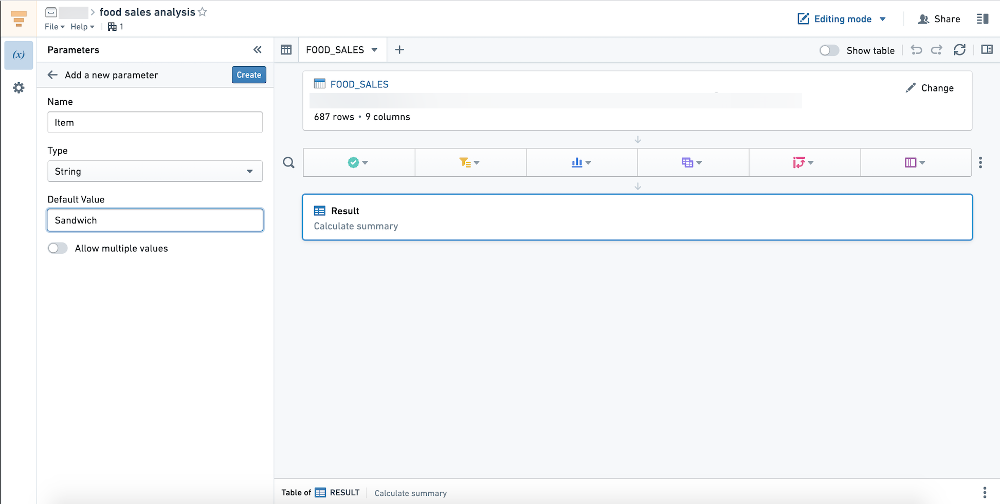

:::callout{theme="neutral" title="Adding parameters"}
After adding a new parameter and using it in your analysis, ensure that you update any downstream paths so that any linked Report will be updated with the newly added parameter.
:::

### Multi-value parameters

To enable a parameter to take multiple values simultaneously, toggle **Allow multiple values** in the parameter settings. This option is available for **String** and **Number** parameters but not for **Date** parameters.

Note that a multi-value parameter is treated as an array of its values in the Expression Board, even if only one or no values are specified for the parameter. When enabling multiple values for a parameter, you may have to update any expressions where it is used so that the correct type (Array) is expected.

## Using parameters in transformations

Parameters can be used in the Filter or Expression boards.

Suppose we want to visualize our data by producing a Pivot Table with the sales of the food item for each location. First, we need to filter the dataset to rows where the Item is equal to the value of the **Item** parameter. In the filter board, clicking the down arrow shows a list of available parameters. Then, select the **Item** parameter.

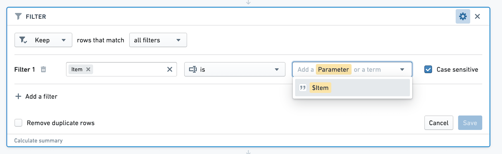

Another visualization we would like to produce is a chart comparing sales of the food item to all other items. We want to create a new column with value True for sales of the item, and False otherwise.

Use parameters in the Expression board by referring to `$parameter_name` (note the dollar sign). We can add a case when statement to create this new column, as below.

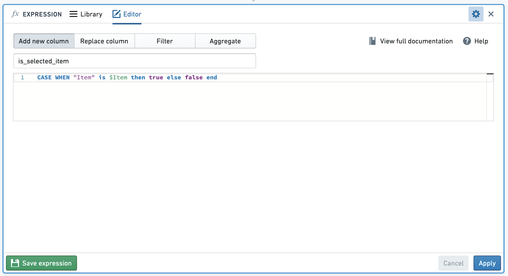

## Editing parameters

If you want to change the name, type, default value, or whether the parameter accepts multiple values, click the pencil icon to edit the parameter.

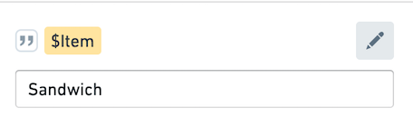

Note that editing the parameter will change what all viewers and editors of the analysis see. If you would like to quickly try out a parameter value, without changing the default, override the parameter value as described below.

### Suggested values

Sometimes the valid options of a parameter may be drawn from a known set. You can provide suggested values for a parameter either by linking it to a column of dataset or restricted view included in the analysis, or by manually entering a list of values. To get started, toggle on **Suggest values from linked column** at the bottom of the parameter editor.

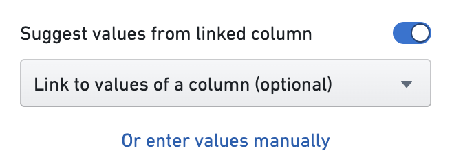

From here, you can add a manual set of values by selecting **Or enter values manually**. This will open a dialog where you can enter your own suggested values for the parameter, one per line.

Alternatively, opening the **Link to values of a column** dropdown will show a list of all of the datasets and restricted views included in starting boards in the analysis. Hovering over one of these datasets or restricted views will open a nested menu showing the columns of that resource.

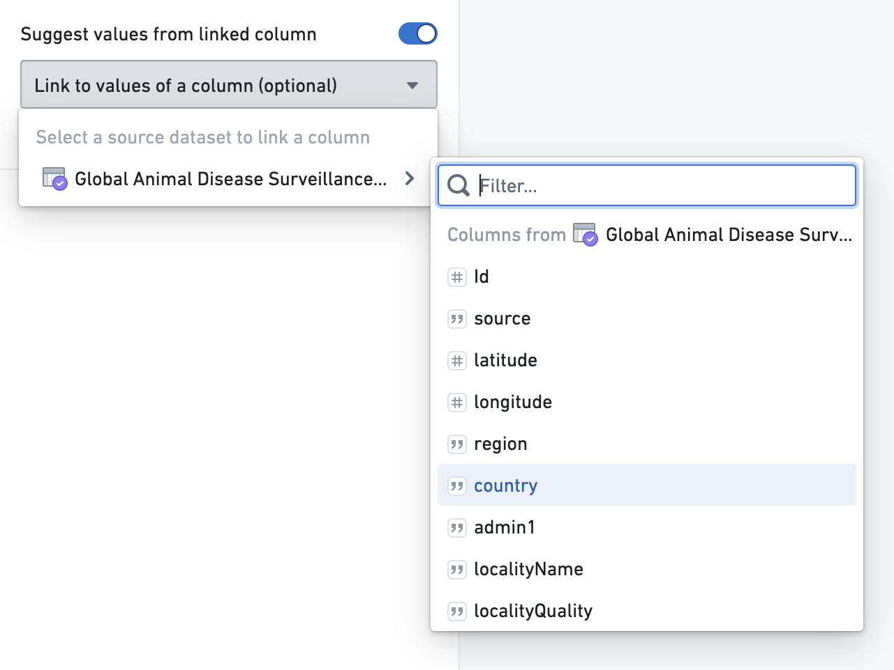

*The dataset in the screenshot above uses [open source data from the UN Food and Agriculture Organization ↗](https://empres-i.apps.fao.org/).*

Select a column and save the parameter. In the parameter overview, you should see a list of suggestions when you select the input field for that parameter. This will provide up to 1000 unique values computed from the saved column.

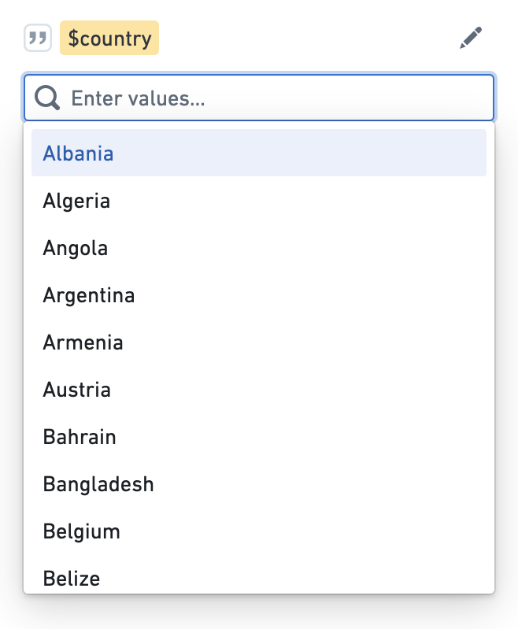

### Cross-filter groups

If you have multiple string parameters derived from various columns of a single dataset or restricted view, these parameters can be added to a cross-filtering group. In a cross-filtering group, selections for each parameter will filter the suggestions shown for other parameters. After linking a parameter to a column of a resource, you should see a new section appear which allows you to add that parameter to a group:

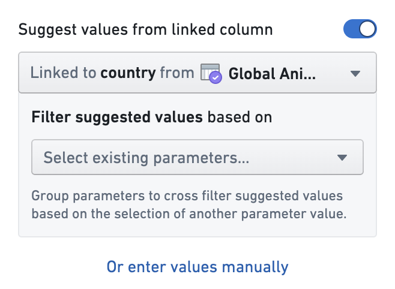

Click into the dropdown and select **Create new cross-filtering group**. Enter a name for the group (in this example, "Location parameters"). Remember to save the parameter. Now, you can edit another parameter linked to the same dataset and add it to the group by selecting it from the dropdown.

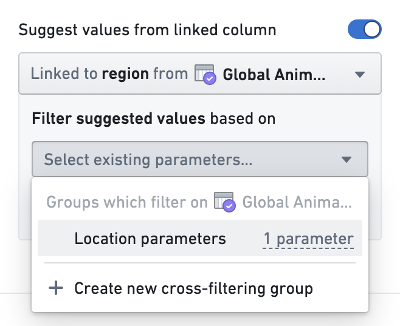

Save the parameter and go back to the editor. The parameters will now be displayed together under the "Location parameters" heading. Make a selection for one of the parameters and then click into the second. The suggested values for the second will update accordingly.

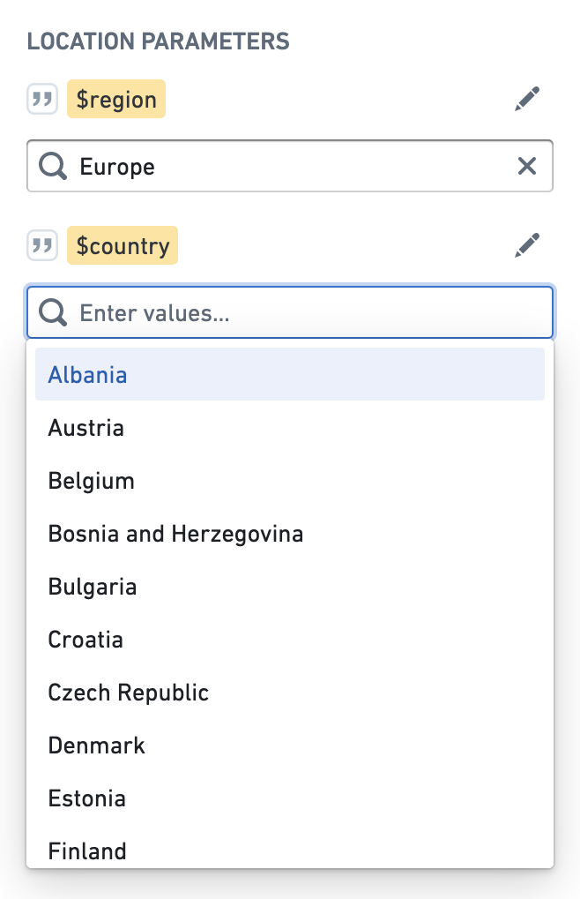

Note that the 1000 unique values limit applies to the entire group rather than an individual parameter within the group. If a pair of columns has more than 1000 unique pairs between them, not all of the possible suggested values will be available.

## Overriding parameter values

You can temporarily override the value of your parameter by manually typing in parameter values in the left sidebar. This is useful to see how an analysis updates to a change in the value, without updating the default for all viewers.

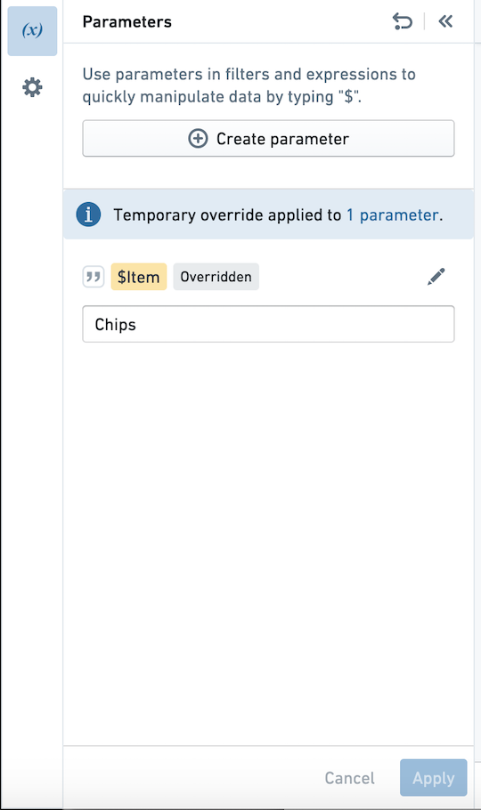

Once this change is applied, note that the parameter is tagged with `Overridden`. Use the arrow in the top bar to reset all parameter values to their defaults.

Overriding a parameter value will persist until you refresh the page, and will not affect what that other users see.

## Parameters in Contour dashboards

If any boards you add to a Contour dashboard rely on a parameter, that parameter will automatically show up in the Contour dashboard. This means that if a parameter exists in the analysis but is unused by the boards in the dashboard, it will not appear in the dashboard.

In a Contour dashboard, users can override the values of parameters to see different views of their data. [Learn more about Contour dashboards.](/docs/foundry/contour/dashboards-overview/)

When navigating between the Contour dashboard and the analysis, parameter values will be retained. If you override a parameter value in the dashboard and want to investigate its origin path more deeply, clicking the **Back to analysis** button will retain the overridden parameter value.

## Parameters in Foundry Reports

Once you create a parameter inside a Contour analysis, you can also use it in the legacy [Foundry Reports](/docs/foundry/reports/overview/) application. However, Reports does not support parameters linked to Restricted View columns, or cross-filter groups - these features are only available in Contour analyses and Contour dashboards. If you add a parameter linked to a Restricted View to a Report, no suggested values will be populated. If you add a parameter in a cross-filter group to a Report, by default the Report parameter will be linked to the same dataset column, but it will not be cross-filtered based on selections in other parameters in the Contour cross-filter group.
