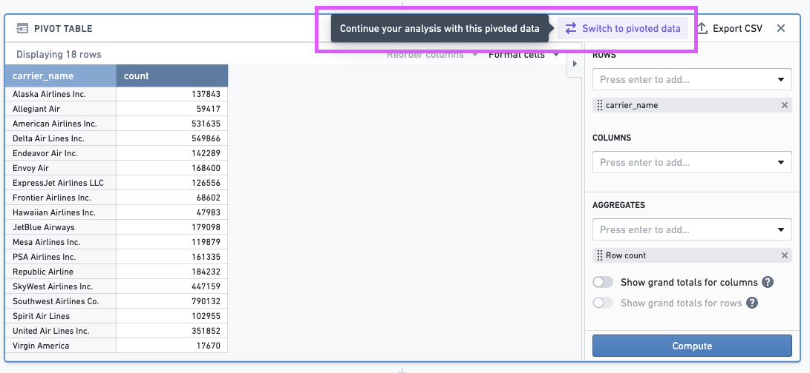
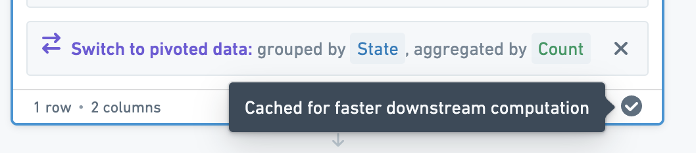

<!-- source: https://palantir.com/docs/foundry/contour/analysis-switch-aggregated/ · mirrored 2026-08-26 from Palantir Foundry docs -->

# Switch to aggregated data

Some boards that allow you to calculate aggregate metrics have an option to pivot. This switches your working dataset to the aggregate data computed in that board, instead of the original dataset. Any boards that follow will use the new aggregate dataset.

The new dataset will include all the columns you selected in the aggregate board, as well as one column for every aggregate. The dataset will not include any grand total rows or columns.

To improve performance, Contour will attempt to cache the aggregate data computed in the pivot table after you switch to aggregated data. If caching of aggregate data is successful, you will see a tick mark in the bottom-right of the board (as illustrated below):

:::callout{theme="neutral"}
Because commas are not supported by Contour within column names, using Contour's Pivot Table board on a column whose values include commas is not recommended. Consider using an Expression board to modify the values of that column prior to use of the Pivot Table board.
:::
