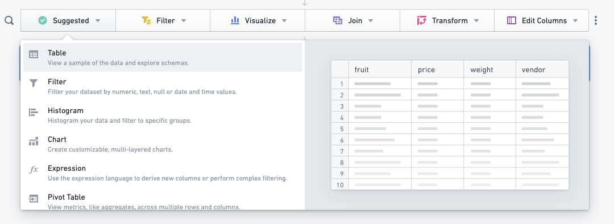
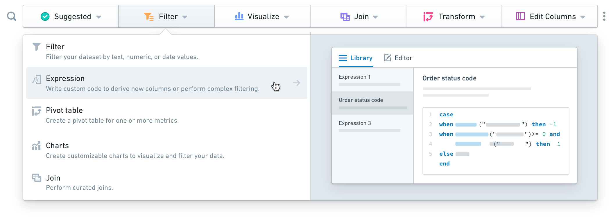
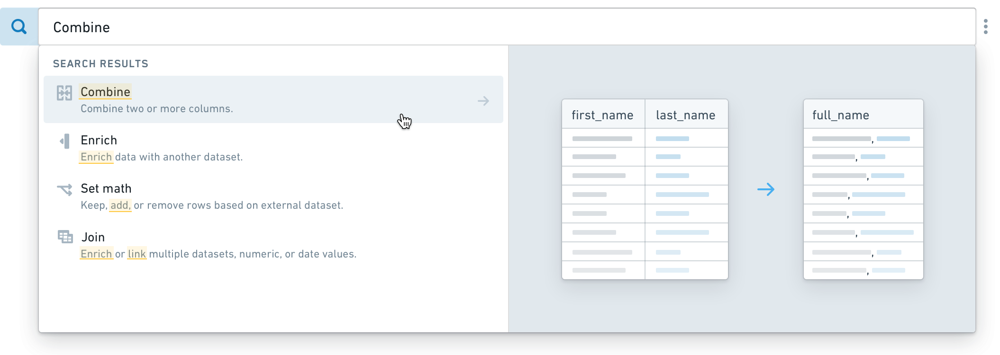
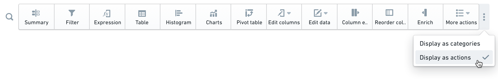
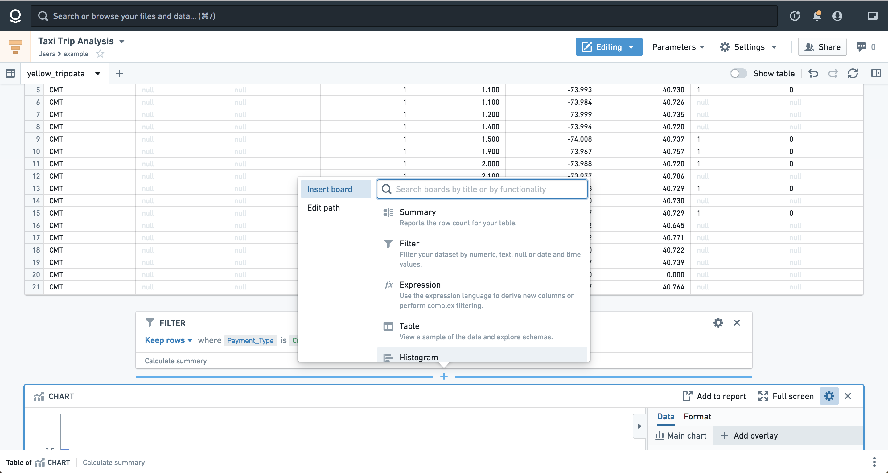
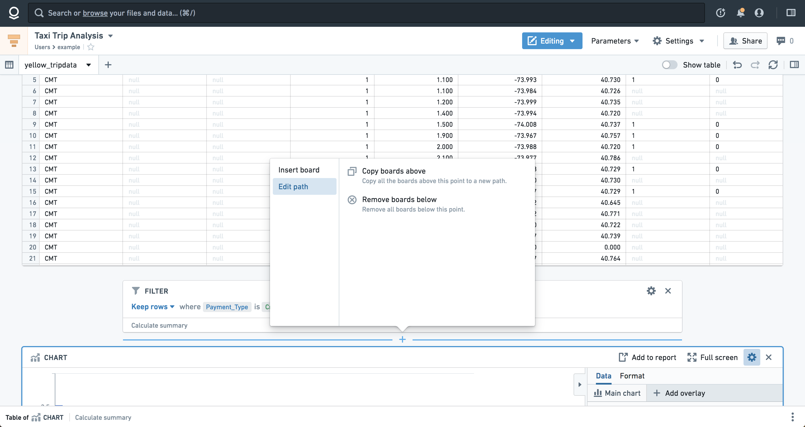

<!-- source: https://palantir.com/docs/foundry/contour/boards-add/ · mirrored 2026-08-26 from Palantir Foundry docs -->

# Add a board

Contour's toolbar is always located at the bottom of your analysis path and allows you to select [boards](/docs/foundry/contour/boards-overview/) to be applied to your dataset. Clicking a board in the toolbar will add the board to your path.

***

## Category mode

Category mode is the default mode for the toolbar, where all the available boards can be easily found grouped by their functionality. You will notice that some boards appear in multiple categories, as they have multiple functionalities.
The categories are:

* **Suggested:** The most popular boards in Contour. Consult the suggested boards if you are unsure where to start with your analysis.
* **Filter:** Filter columns, make selections in visualizations or write more complex filter expressions.
* **Visualize:** Display your data in different visual forms (such as a histogram, a heatmap with geographic data, a pie chart, or a pivot table).
* **Join:** Join to bring in more data or alter your dataset based on another set.
* **Transform:** Change the schema of your data, find and replace or obfuscate text, derive new columns, or perform other transformations.
* **Edit Columns:** Combine, duplicate, remove, rename, or split columns in your dataset.

***

## Search mode

Search mode allows you to search for a desired board based on its functionality or a keyword. To turn on search mode, click on the magnifying glass icon (). Alternatively, you can use keyboard shortcuts to enter the search mode (Ctrl+Enter on Windows or Cmd+Enter on macOS). The matching results will appear in the dropdown, with the keyword or a related word highlighted.

***

## Actions mode

You also have an option to switch the toolbar to Actions Mode by clicking on the **More** button (**...**) on the right side of the toolbar. In this mode, the toolbar displays all boards at once, rather than nested in categories.

***

## Inserting boards

If you would like to add a board elsewhere in the analysis, hover on the desired position and click. A menu with all the available boards will appear where you can search for a board by name or click to select a board from the list.

*These screenshots use open source data from the [NYC Taxi & Limousine Commission ↗](https://www.nyc.gov/site/tlc/about/tlc-trip-record-data.page).*

***

## Remove or copy boards in bulk

If you would like to remove or recreate a set of boards in bulk, hover over and click the space between two boards, and then select **Edit path**. A menu will appear with options to copy the boards above to a new path within the analysis or remove the boards below.

