<!-- source: https://palantir.com/docs/foundry/contour/boards-descriptions/ · mirrored 2026-08-26 from Palantir Foundry docs -->

# Board descriptions

Exploration and analysis in Contour are performed through the use of boards in series. Some boards create charts or perform calculations, while others are used to manipulate your dataset by filtering, removing columns, and so on.

***Use the links in this summary table to navigate between board types on this page.***

|Board |Description |Visualize |Filter Rows |Aggregate |Manipulate Columns |Remove Duplicates |
|--- |--- |--- |--- |--- |--- |--- |
|[Summary](#summary) |Reports the row count for your table. |Yes | No | No | No | No |
|[Filter](#filter) |Filter your dataset by numeric, text, or date and time values. | No | Yes | No | No | Yes |
|[Expression](#expression) |Use the expression language to derive new columns or perform complex filtering. | No | Yes | No | Yes | No |
|[Table](#table) |View a portion of raw data, explore schemas and calculate data coverage metrics. | Yes | No | No | No | No |
|[Histogram](#histogram) |Create a histogram of your data and filter to specific groups. | Yes | Yes | Yes | Yes, via the Pivot option | No |
|[Distribution](#distribution) |Create a distribution plot of your data. | Yes | Yes | No | No | No |
|[Time series](#time-series) |Create a chart with date/time on the x-axis and filter to specific groups. | Yes | Yes | No | No | No |
|[Edit columns](#edit-columns) |Combine, duplicate, remove, rename, or split columns. | No | No | No | Yes | No |
|[Transform data](#transform-data) |Obfuscate data, find and replace values, or parse dates. | No | No | No | Yes | No |
|[Chart](#chart) |Create customizable, multi-layered charts. | Yes | Yes | Yes | No | No |
|[Grid](#grid) |Create a matrix of two categorical columns. Cells can be filtered and are displayed as a heatmap. | Yes  | Yes | No | No | No |
|[Heatmap](#heatmap) |View a heatmap based on coordinate data. | Yes | Yes | No | No | No |
|[Pivot table](#pivot-table) |Create a pivot table for one or more metrics. | Yes | Yes | Yes | Yes, via the Pivot option | No |
|[Column editor](#column-editor) |Derive new columns or remove unnecessary columns. | No | No | No | Yes | Yes |
|[Multi-column editor](#multi-column-editor) |Rename, remove, reorder columns, or remove duplicate rows in the data. | No | No | No | No | No |
|[Enrich](#enrich) |Enrich data with another dataset and return columns from both datasets. | No | No | No | Yes | Yes |
|[Link](#link) |Join to another dataset and return the matching records of that dataset. | No | No | No | Yes | Yes |
|[Set math](#set-math) |Keep, add, or remove rows based on external dataset. | No | Yes | No | No | No |
|[Join](#join) |Perform curated joins. | No | Yes | No | No | No |
|[Export](#export) |Export your final filtered set of observations to CSV or XLS. | No | No | No | No | No |
|[Reorder columns](#reorder-columns) |Reorder the columns in your table. | No | No | No | No | No |
|[Macro](#macro) |Apply templatized transformations to your path. | No | No | No | No | No |
|[Sort](#sort)  |Sort the rows of data based on one or more columns. | No | No | No | No | No |
|[Calculation](#calculation)  |Display multiple aggregate calculations. | Yes | No | Yes | No | No |
|[Unpivot](#unpivot)  |Reshape your data by turning some columns into rows. | No | No | No | Yes | No |

***

## Summary

The summary board displays the number of rows and columns in your table at the current location in the path.

If you have not filtered data down at all, then this is the number of rows in your starting set. If you have applied filters (for example, by adding a histogram and selecting certain bars), this is the number of rows remaining after the filter.

***

## Filter

The purpose of the filter board is to apply customizable filters on your dataset. Although you can also apply filters in other boards (distribution, histogram), the filter board allows for building in one place more complex filters involving multiple variables.

Using a list in the filter board is akin to a `WHERE IN (x,y,z)` clause in SQL. Contour can handle lists of thousands of items in the filter board. However, large lists will tax the browser, and lists that are too large will likely cause browser failure. In these cases, the list should be imported into Contour as a separate set, and the filter should be implemented using a link or set math board. [Learn how to use the link or set math boards.](/docs/foundry/contour/boards-join/)

### Configuration

Click **Add filter**, choose a column to filter, then choose a filter type from the dropdown. Based on the column you selected, Contour will select an appropriate category of filter (for example, number for columns of numeric values).

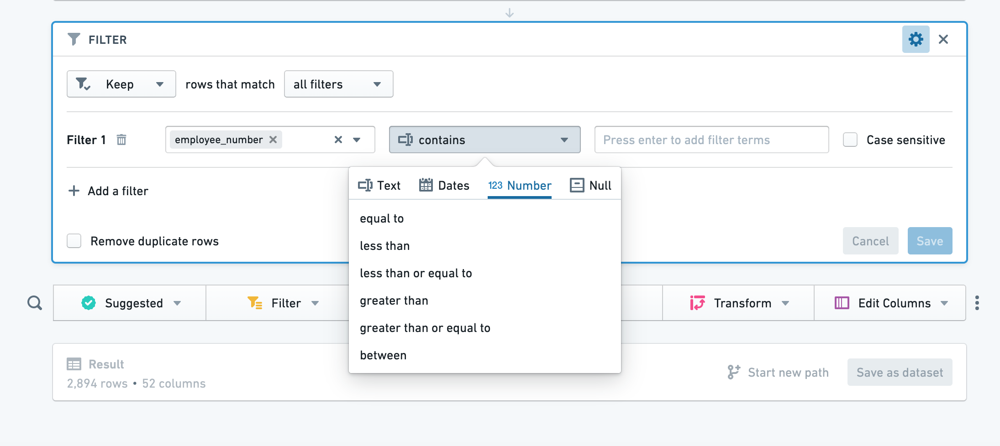

:::callout{theme="success" title="Tip"}
In some text filters, you can use wildcards: <code>\*</code> can be replaced by multiple characters, and <code>?</code> can be replaced by a single character.

In a "matches" (regular expression) text filter, you can input your regular expression directly (no quotes or string indicators necessary).
:::

To add another filter, simply click **Add filter** again. You can choose to match **all filters** or **any filter**. To remove a filter, click the trash button next to the filter.
Click **Save** to apply your filters.

### Text filter details

The text filter currently offers the following options:

* **contains:** This returns rows that contain any of your search terms. Your search terms should only contain text. For example, a term of “hello” would match a row that contains “hihellohi”.
* **contains (with wildcards):** This returns any rows that contain any of your search terms. Your search terms can contain `?` to indicate a single character wildcard, or \* to indicate a multi-character wildcard. For example, a term of `h?l*o` will match “hi hello hi” or “hi halqqqqqo hi”.
* **is:** This returns any rows that are equal to any of your search terms. Your search terms should only contain text. For example, a term of `hello` would match “hello”, but NOT “hi hello hi”.
* **is (with wildcards):** This returns any rows that are equal to any of your search terms. Your search terms can contain ? to indicate a single character wildcard, or \* to indicate a multi-character wildcard. For example, a term of `h?l*o` will match “hello” or “halqqqqqo”.
* **matches:** This returns any rows that match any of the terms, where a term is a regular expression. This option uses [Java Pattern ↗](https://docs.oracle.com/javase/7/docs/api/java/util/regex/Pattern.html) to evaluate regular expressions.

***

## Expression

In addition to its visual tools like the histogram and chart, Contour also offers an expression board that lets you work with Contour’s rich expression language to derive new columns from your data, perform complex filtering, or perform complex aggregations.

* When using the expression editor, click the **?** icon for a quick reference of the expression language.
* As you type, suggested functions appear in a dropdown. Click or use the Enter key to select the function you want.

:::callout{theme="neutral"}
Column names are case-sensitive. Additionally, when selecting a column, you may write the column name with or without double quotes. For example, <code>year("birthdate\_col")</code> is equivalent to <code>year(birthdate\_col)</code>. For consistency, column names in this documentation are written with double quotes.
:::

***

## Table

The table board shows a snapshot of your dataset in tabular format. Note that only the first `limit` (default: 1,000) rows in the dataset are displayed. This limit exists to prevent browser performance issues and is generally not configurable.

The table board is useful for spot-checking your data to make sure it looks as you expect. You can interact with the table: drag-and-drop the columns to reorder them or choose from the dropdown on each column. These formatting changes to the table do not change the underlying data (if you view only a subset of the columns, all columns still exist in the underlying data).

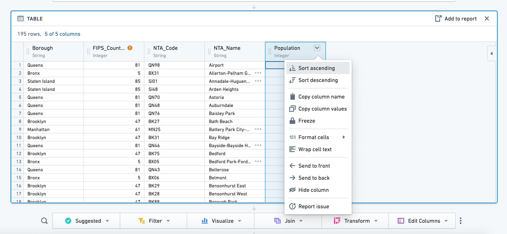

To move multiple columns at once, select the columns while holding down the Shift key.
You can also use the **Configure** panel to modify multiple columns at once.

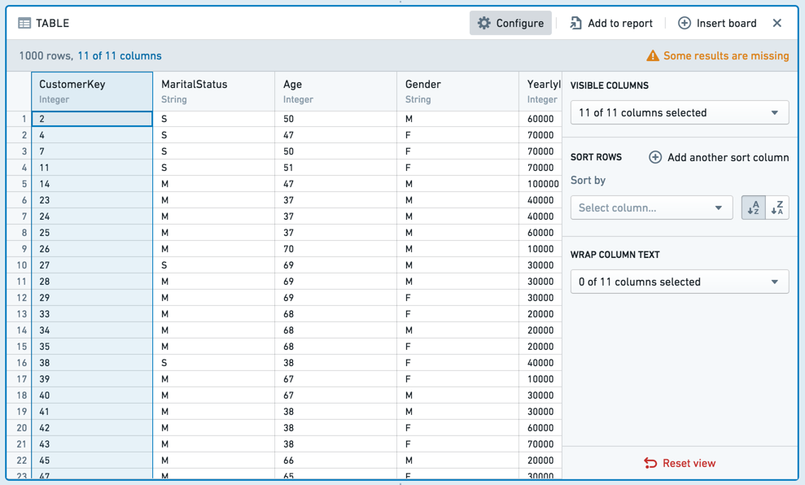

### Conditional formatting

You can add conditional formatting to the table board by clicking the column dropdown.

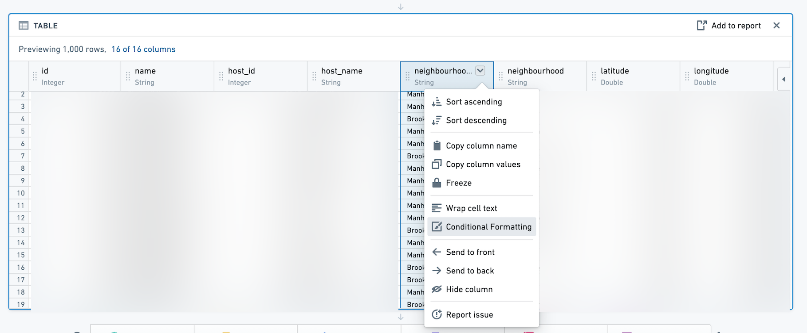

Then, use the dialog to add rules for a given column. Conditionally formatted cells will appear with text and background of the selected color. Rules are not supported for Date columns.

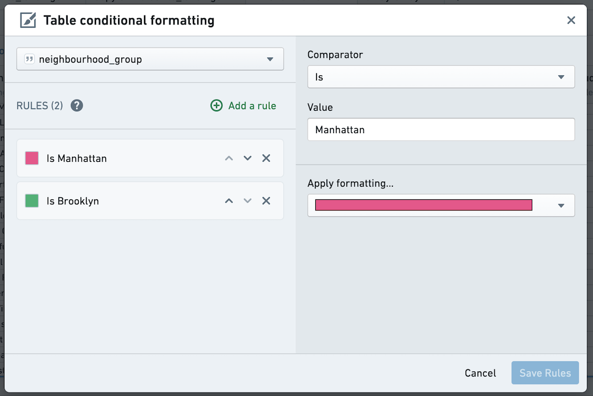

### Table board vs. table panel

You can add the table board at any point in your path to get a quick preview of the data at that moment, or you can switch from path view to the **table panel**.

The table panel makes the table (not boards) the focus, so you can see how the data changes as you add each board. This can be especially helpful when writing [expressions](#expression).


You can switch to the table panel by clicking **Table** in the upper right. Click the button again or click **Hide table** to return to path view.

The table panel does not support conditional formatting.

***

## Histogram

The histogram board aggregates the distinct values in a given column and displays the results as a bar chart.

For example, the following histogram calculates the average length of a taxi ride by which New York neighborhood it began in.

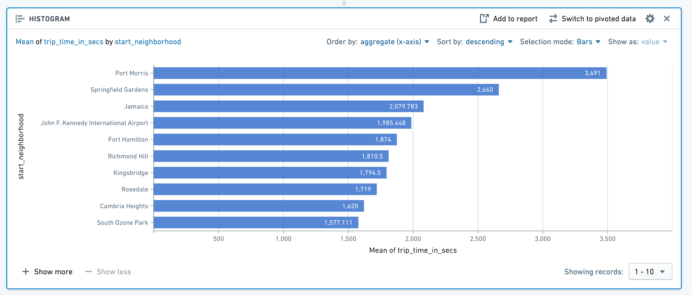

Note that only the top ten bars are displayed. To display more bars, click **+ Show More**. You can display up to 50 values at once. If there are more than 50 values, use the dropdown to navigate to other parts of the range.

### SQL Equivalent

The histogram board is a visualization of a SQL `GROUP BY` clause.
The above example histogram is equivalent to the following SQL query:

```sql
SELECT start_neighborhood, mean(trip_time_in_secs)
FROM <table name>
GROUP BY start_neighborhood
```

### Configuration

* **Y-Axis**
  * Choose a column to group the data by. The data is grouped based on the discrete values of this column, and then the aggregate is calculated.
* **X-Axis**
  * Choose an aggregate to compute, and if the aggregate is not **Count**, choose the column to apply it to.
* **Aggregates**
  * The available aggregate metrics are: **Count** (number of records), **Unique Count**, **Min**, **Max**, **Sum**, **Mean**, **Approx. median**, **Standard Deviation**, and **Variance**.
    * Except for **Count**, you must specify which column the aggregate applies to. For **Unique Count**, you can select any column.
    * **Min**, **Max**, **Sum**, **Mean**, **Approx. Median**, **Standard Deviation**, and **Variance** only apply to numerical columns.
    * Aggregates are computed for each distinct value in the column selected as the Y-Axis.

:::callout{theme="neutral" title="Approximate median"}
The **Approx. Median** aggregate is approximate. Contour calls the [percentile\_approx ↗](https://spark.apache.org/docs/latest/api/sql/index.html#percentile_approx) function with percentage value 0.5 and the default accuracy.
:::

### Switch to Pivoted Data

When you click **Switch to Pivoted Data**, any boards you add after the histogram will use the aggregated data computed in the table, rather than the original dataset.

The new dataset will include the column you selected for Y-Axis in the original histogram configuration, as well as a column for the aggregate. For example:

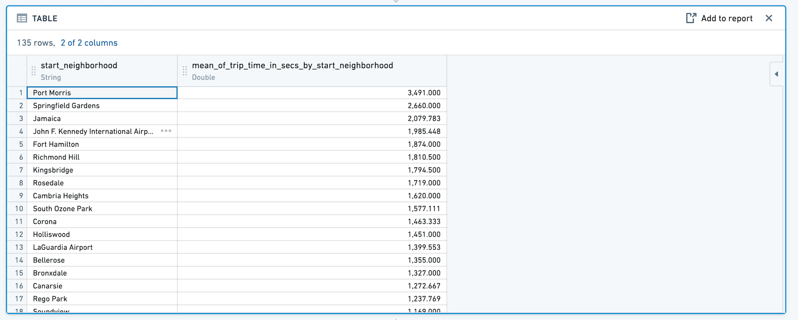

### Sorting

The histogram defaults to sorting by the aggregate in descending order. For very large histograms, sorting is performed on the 1,000 highest values of the aggregate.

You can use the dropdowns to change to sort by the Y-Axis column values instead, or to change the sort direction.

### Filtering

Select data on the histogram to filter the dataset for future boards.

**Selection modes:**

* Choose **Bar** to filter by one or multiple distinct values of the column you selected as the Y-Axis. <br><br>
  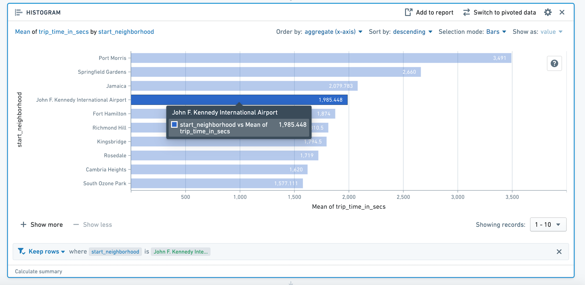 <br><br>

* Choose **Range** to filter by aggregate value. For example, you might use Range selection to select only categories that have values above a certain threshold. <br><br>
  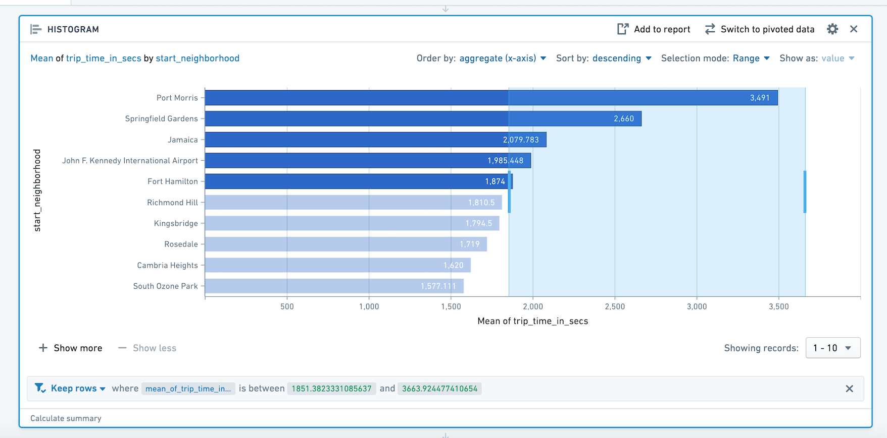 <br><br>

  Then choose **Keep** to filter to *only* the selected values, or **Remove** to keep only the non-selected values. <br><br>
  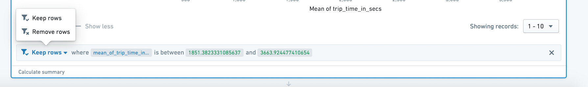 <br><br>

***

## Distribution

The distribution board displays the distribution of a numerical variable for an aggregate metric.

The distribution board is similar to the histogram, but it displays aggregated data based on *ranges* of values, rather than specific values. For example, the following distribution displays data about customers’ ages. Ages are divided into ten ranges (or “buckets”).

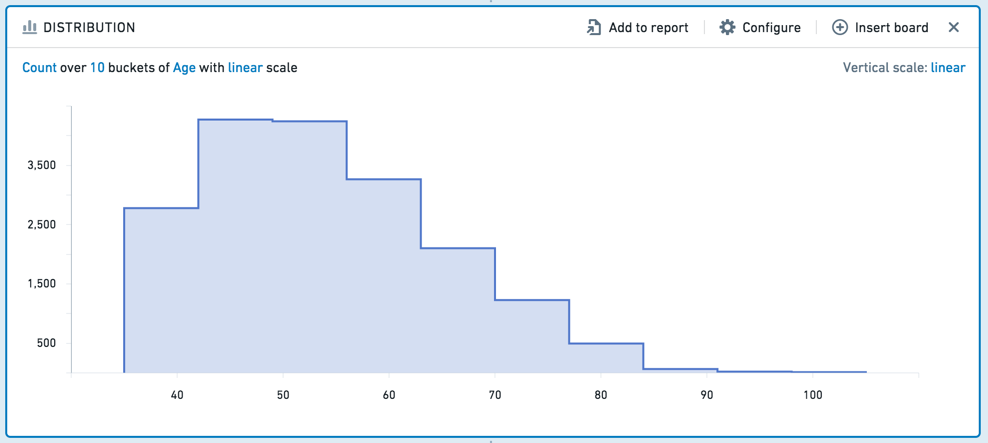

### SQL Equivalent

In calculating the distribution board, we first find the minimum and maximum of the X-Axis and create a function to calculate the buckets. The SQL equivalent of the distribution is then approximately equivalent to the following:

```sql
SELECT X_AXIS_BUCKET_FUNCTION([x-axis-column]), <AGGREGATE_METRIC>([aggregate-column])
FROM <PARENT_BOARD>
GROUP BY X_AXIS_BUCKET_FUNCTION([x-axis-column])
```

### Configuration

* **X-Axis**
  * Choose a column of numeric values. The values in this column are grouped in equal-width ranges (in other words, your data is divided equally into ten, 100, or 1000 “buckets”), and then the aggregate is applied. You can also configure the scale of this axis (linear or logarithmic).
* **Y-Axis**
  * Choose an aggregate metric to calculate on each range.
    * The available aggregate metrics are: **Count** (number of records), **Unique Count**, **Min**, **Max**, **Sum**, **Mean**, **Approx. Median**, **Standard Deviation**, and **Variance**. Except for **Count**, you must specify which column the aggregate applies to.
  * You can configure the scale of the Y-Axis as well (linear or logarithmic).

:::callout{theme="neutral" title="Approximate median"}
The **Approx. Median** aggregate is approximate. Contour calls the [percentile\_approx ↗](https://spark.apache.org/docs/latest/api/sql/index.html#percentile_approx) function with percentage value 0.5 and the default accuracy.
:::

### Filtering

To select a range to filter by, click-and-drag your desired interval on the chart.

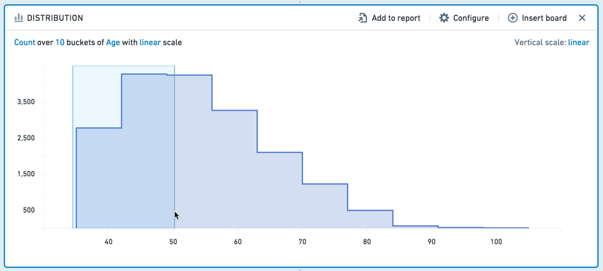

You can then adjust the interval more finely in the editable board footer.

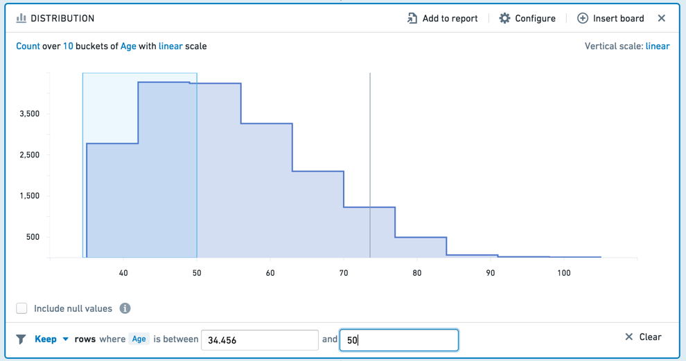

You can choose to **Keep** the values in the selected interval, or **Remove** those values, keeping only non-selected values. To clear your selection, click the **Clear** button (**x**).

***

## Time series

The time series board allows you to group data by time intervals and calculate aggregate metrics on that data.

For example, given a dataset with personal information about customers, the following time series board computes the number of people born in each year.

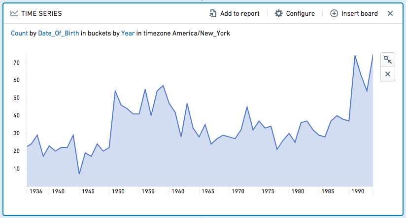

You can further specify a column to use as the **series**. For the above example, you could choose to use gender as the series. The time series board will then divide into one line for each value in the series column: in this case, **F** (female) or **M** (male).

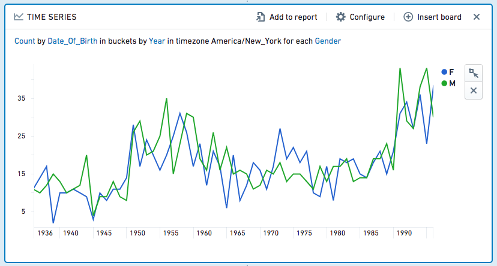

Note that the time series performs its aggregates over the *entire* dataset, and reduces the output to the first 1000 values upon displaying it.

### Configuration

* **X-Axis**
  * Choose a DateTime column to group the data temporally. Then choose a unit of time – the data will be grouped by intervals of that length. The available units are: **Second**, **Minute**, **Hour**, **Day**, **Week**, **Month**, and **Year**.
* **Aggregates**
  * Define the aggregates to be applied to each time interval.
  * The available aggregate metrics are: **Count** (number of records), **Unique Count**, **Min**, **Max**, **Sum**, **Mean**, **Standard Deviation**, and **Variance**.
    * Except for **Count**, you must specify which column the aggregate applies to. For **Unique Count**, you can select any column.
    * **Min**, **Max**, **Sum**, **Mean**, **Approx. Median**, **Standard Deviation**, and **Variance** only apply to numerical columns.
* **Series**
  * Choose a column to divide the data into series. There will be one series (represented as a line in the chart) for each discrete value in the column.

:::callout{theme="neutral" title="Approximate median"}
The **Approx. Median** aggregate is approximate. Contour calls the [percentile\_approx ↗](https://spark.apache.org/docs/latest/api/sql/index.html#percentile_approx) function with percentage value 0.5 and the default accuracy.
:::

### Filtering

You can select a date range on the time series to filter the dataset for future boards. Click , then click-and-drag your desired interval. (You can adjust the interval more finely in the editable board footer.) To clear your selection, click the  icon.

Choose **Keep** from the dropdown to filter to *only* the selected values, or choose **Remove** to keep only the non-selected values.

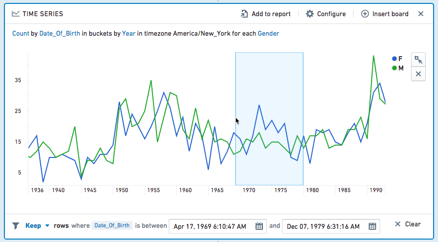

***

## Edit columns

You can edit columns in Contour with the following boards:

* **Combine** two or more columns.
* **Duplicate** a column (for example, to try out operations on that column without affecting the original data.)
* **Remove** a column from the table.
* **Rename** a column.
* **Split** a column on some delimiting character.

***

## Transform data

You can transform data in a column using the following boards:

### Obfuscate

* **Hashing** cell values (for example, to obscure sensitive data such as names). Each value in the column is replaced with a hashed representation of the value, using the [SHA-1 ↗](https://en.wikipedia.org/wiki/SHA-1) hash function.

:::callout{theme="warning"}
The SHA-1 hash can be decrypted and is not considered fully secure. Therefore, it should NOT be used for data compliance purposes.
:::

* **Masking** some number of characters in the value (for example, mask all but the last 2 digits in a phone number).
* **K-anonymizing** columns of data as a privacy technique that seeks to set a threshold value (`k`) to apply to a dataset, ensuring at least `k` number of instances with the same set of sensitive information to reduce the risk of re-identification (even if there is no personally identifiable information). This process is done by “suppressing” specific fields that would potentially help with the re-identification of the data.

:::callout{theme="neutral"}
The appropriate k-value for your use case is determined by context. Organizations typically set their own policies for setting k-values based on the context of the analysis and statistical risk of re-identification. Some example policies include [National Center for Education Statistics ↗](https://nces.ed.gov/pubs2011/2011603.pdf) and the [U.S Department of Health & Human Services ↗](https://www.hhs.gov/guidance/document/cms-cell-suppression-policy). At a minimum, the k-value should always be greater than 1 and less than the total number of rows in the dataset.
:::

Using the k-anonymize function, the board asks for the columns to k-anonymize, k-value target, strategies for suppression, and what to do with rows that do not meet the k-value post-suppression.

1. **Columns:** Represents “quasi-identifiers” or attributes that can be linked with external data to uniquely identify an individual.
2. **k-value:** Represents the threshold value `k` where there are at least `k` number of instances with the same set of sensitive information.
3. **Strategies:** Represents how data should be suppressed and in what order. You can set the given order of operations to reach the indicated k-value. For each column listed, you can choose amongst different strategies that would be applied to data to meet the k-value:
   * **Bucket:** Replaces integers with a rangee; only available when a numeric type column is selected.
   * **Mask:** Replaces the last *n* characters with a `*`.
   * **Replace:** Replaces the entire value with a string. The default behavior suggests `***` as the replacement value, but this can be replaced with a user-provided value.
   * The columns with the **Suppress Column** flag checked will apply the strategy for all values, regardless of meeting the k-value. This behavior is particularly relevant for cases such as bucketing ages where it is useful to have a consistent bucketing strategy for all values.
4. **Rows that do not meet the k-value post-suppression:** If some rows do not meet the k-value threshold and cannot be suppressed to meet a count greater than `k`, the following options are available:
   * **Keep:** Keep the rows so the data is not lost. Note that if you keep these rows, the dataset will not be k-anonymized; this is often a useful step for reviewing the results of the k-anonymization.
   * **Drop:** Remove all rows that do not meet the k-value. When choosing to drop, be sure to calculate the number of rows before and after the obfuscation to understand the number of dropped rows.
   * **Redact:** Obfuscate all values in the table with `***`. This option is particularly relevant if you want to retain the same count of rows. <br><br>
     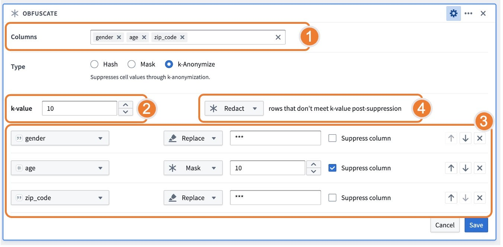 <br><br>

### Find and replace

Find and replace text within a column, or find empty or null cells. This board supports properties that are String or Numeric types.

### Parse dates

Dates are parsed from strings by interpreting the strings against a user-provided date format, symbol by symbol.

In the provided format, unquoted letters are treated as patterns, representing specific date or time components. String symbols matched with patterns are interpreted as the date or time components according to the following rules:

| Letter | Date or time component | Example |
| --- | --- | --- |
| y | year | 1996; 96 |
| M | month of year | July; Jul; 07 |
| d | day of month | 10 |
| a | AM/PM marker | AM; PM |
| h | hour in am/pm (1-12) | 12 |
| H | hour in day (0-23) | 13 |
| m | minute of hour | 30 |
| s | second of minute | 55 |
| S | fraction of second | 978 |
| z | General timezone | Pacific Standard Time; PST; GMT-08:00 |
| Z | time zone offset | -0800; -08:00 |

* Formats containing other letters are not supported. Unsupported letters are still treated as patterns, but using them may result in unexpected parsing results.
* Use the expression board if your desired format is unsupported.
* If your strings contain letters that should not be interpreted, enclose them in single quotes `'  '` so they are treated as plain text instead of patterns.
* Non-letter or quoted symbols are treated as plain text. They must be strictly matched with the corresponding symbols in the input string during parsing.

After matching and interpreting the date and time components, the output date is constructed based on these interpreted components.

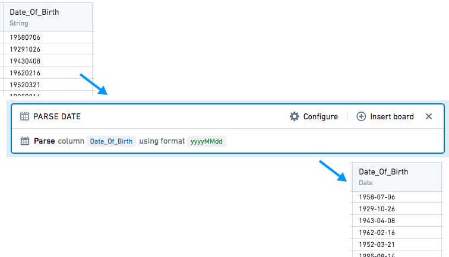

***

## Chart

The Contour Chart board allows you to build custom charts for analyzing your data.

### Configuration

Choose a chart type for the main chart layer, then configure the x and y axes. Currently the Chart board offers the following types of charts:

**Bar**

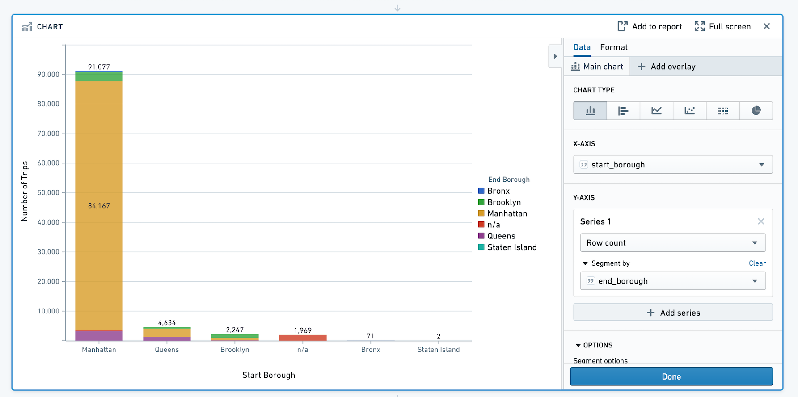

**Horizontal Bar**

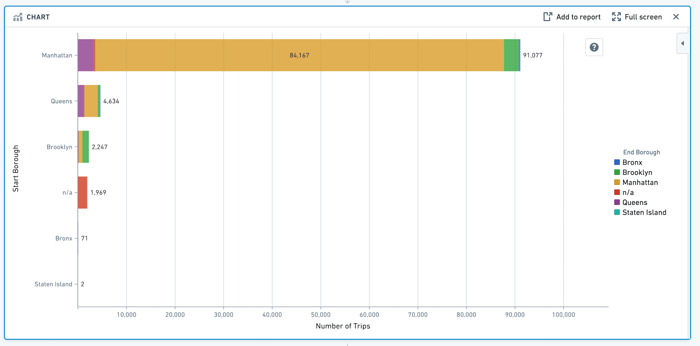

**Line**

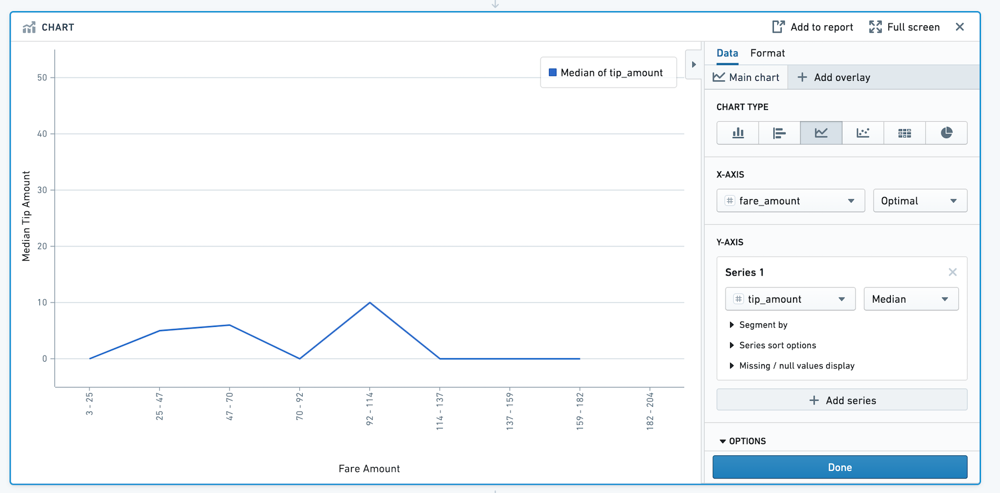

**Scatter**

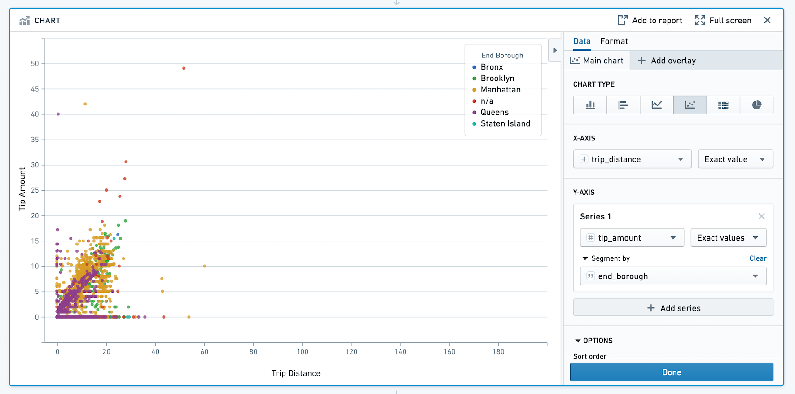

**Heat Grid**

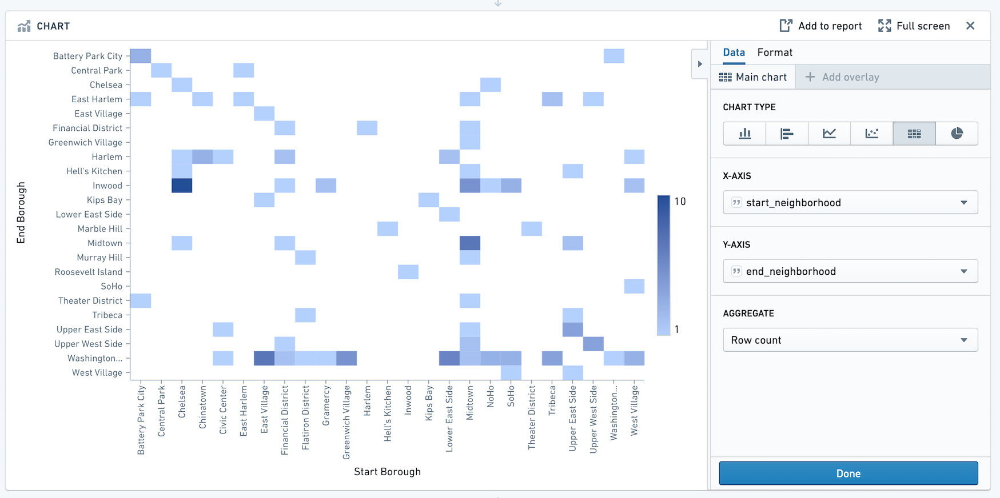

**Pie**

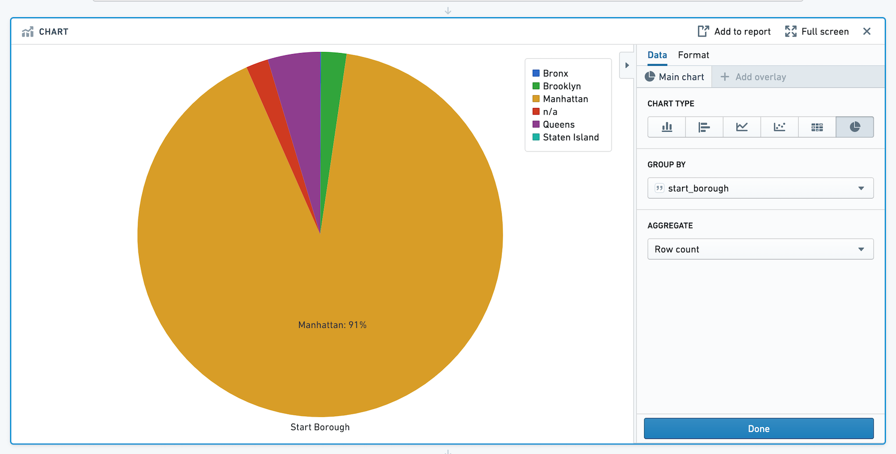

**Segment by**

For chart types other than heat grid and pie, you can also choose to **segment the data into series**.

**Sorting**

Expand the **Options** section to change how your chart data is sorted.
You may order chart data by values in the main layers:

* X values
* Y values
* A custom column value. This sort value may be *any* column in the dataset (even ones that are not plotted on the chart).

The following example sorts a bar chart by the number of gold medals received by a country in the Olympics:

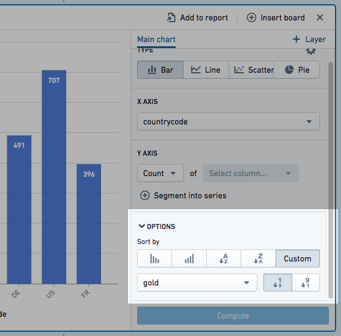

Data can be sorted in ascending or descending order. Overlay plot values cannot be used to order chart data.

**Formatting**

Use the Format tab to configure the chart. You can change the X- and Y-axis titles, formatting of the axes, legend positioning, series sorting, and series colors.

**Adding Overlays**

You can add overlay plots by clicking **+ Add Overlay**. For example, you might want to overlay a line chart on top of a bar chart.

When you add an overlay, you can choose whether the chart should use the data in the current path or from a different dataset.

:::callout{theme="neutral"}
Plotting data from a different dataset does *not* join that dataset with the working set. To join datasets, you should use the [Join board](#join).
:::

Note that *only the main chart layer is part of the data path*. The other layers are solely for presentation purposes. In other words, making a selection or otherwise manipulating the data on an overlay layer will *not* affect the data downstream in your path.

You can plot your chart layers on separate y axes if the values of the individual layers are not related, or if the data range or plot scale is significantly different.

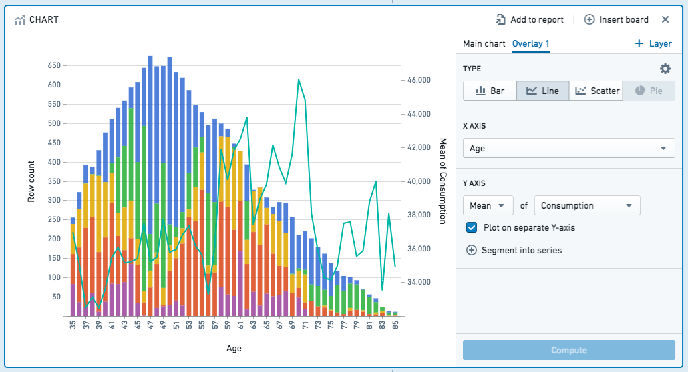

**Bucket selection**

You can choose how to bucket data points when configuring **Group by** columns (e.g. on the x-axis) and **Segment by** columns. Only numeric, date, or time columns can be bucketed. For example, if you create a bar chart and select a date column for the x-axis **Group by** column and choose bucket type **Year**, the resulting chart will have a bar for every year. The available bucket types are listed below.

Numeric column bucket types:

* **Exact value:** the data is not bucketed and exact values are shown.
* **Optimal:** the number of buckets is equal to the square root of points in the underlying data range. The data range is the difference between the maximum and minimum values of the column.
* **Most granular:** the chart uses the maximum number of buckets that can fit within the [Result limit](#result-limit). Exact values are used when possible.
* **Custom:** the number of buckets can be manually selected. Note, the number of buckets cannot be greater than the [Result limit](#result-limit).

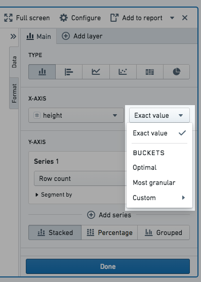

Date and time column bucket types:

* **Exact time:** the data is not bucketed and exact values are shown.
* **Rounding:** the data is bucketed to the nearest **Second**, **Minute**, **Hour**, **Day**, **Week**, **Month**, or **Year**, depending on the selection. For example, if bucketing by **Year**, a data point with date June 15th, 2018 is bucketed into the 2018 bucket.
* **Ordinals:** the data is bucketed into ordinal dates. For example, if **Day of week** is selected, the data is bucketed into seven buckets, one for each day of the week.

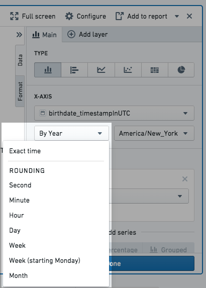

:::callout{theme="neutral"}
If the bucket selection does not fit within the result limit, the most granular option that does fit will be applied so that data is not dropped. Read <a href="#result-limit">Result limit</a> for more information.
:::

### Result limit

Contour limits the number of data points it displays on the browser. Practically speaking, Contour cannot display more data points than there are pixels in the screen. In order to produce accurate charts and not drop any data, the Chart board will rebucket the chart configuration to the most granular bucket selection possible that fits under the result limit.

The result limit is set by your Palantir administrator and defaults to 1000 points. Rebucketing will occur for numeric, date, or time columns.

To illustrate rebucketing, consider the following example:

* A Chart board is created on a dataset that includes birth dates.
* The board is configured to be a bar chart with the x-axis set as the birthdate column. For example, to count the number of people with the same birthdate.
* The birth date column specifies the date down to the second, so the Second bucket type is selected.
* In this dataset, the number of unique birthdates per second exceeds the result limit.
* Therefore, upon computation the Chart board automatically buckets the data by Hour instead of by Second, as Hour is the most granular bucket size that fits the result limit for this particular dataset.

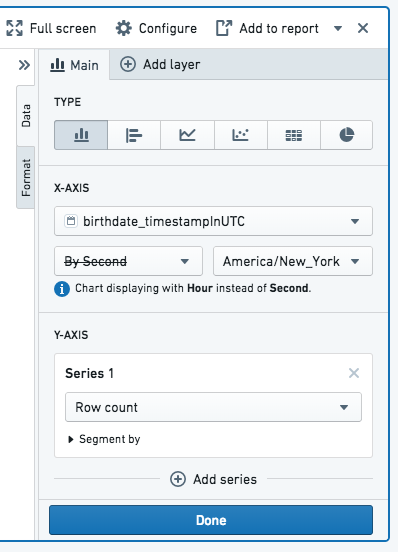

### Filtering

Select data on the chart to filter the dataset for future boards. Use Ctrl+Click or Cmd+Click for multi-select.

You can pan and zoom on charts to more easily see the data. Hovering over a bar or point on the chart also displays a tooltip highlighting what you are looking at.

***

## Grid

The grid board is similar to the [histogram](#histogram), but the grid board aggregates data by two columns rather than one, displaying a heat grid chart of the results. (For more than two columns, you can use a [pivot table](#pivot-table).) For example, the following grid compares education level to yearly income:

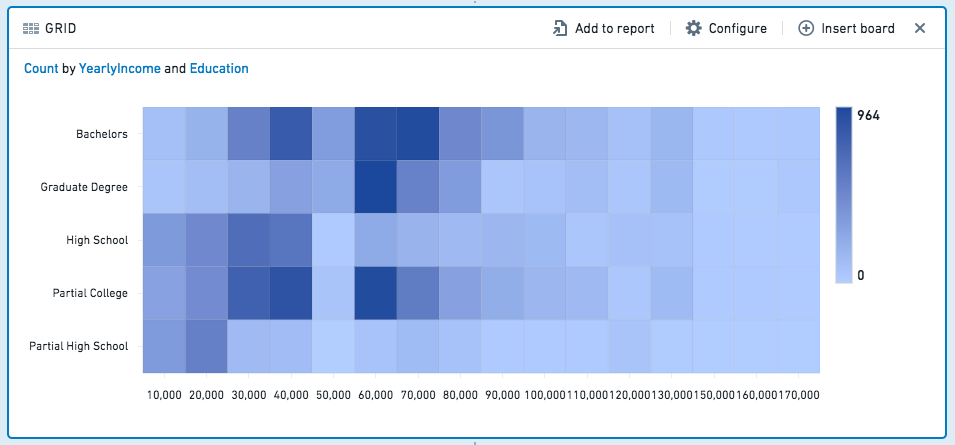

### SQL Equivalent

The grid board is a visualization of an aggregate query, similar to the histogram and pivot table boards.
A grid is approximately equivalent to the following SQL query:

```sql
SELECT [x-axis-column], [y-axis-column], <AGGREGATE_METRIC>([aggregate-column])
FROM <PARENT_BOARD>
GROUP BY [x-axis-column], [y-axis-column]
```

### Configuration

* **X-Axis** and **Y-Axis**
  * Choose two columns – each combination of unique values in those columns will form a cell in the grid.
* **Aggregate**
  * Choose an aggregate metric to calculate for each cell in the grid. The result of the aggregate will determine the cell’s color.
  * The available aggregate metrics are: **Count** (number of records), **Unique Count**, **Min**, **Max**, **Sum**, **Mean**, **Approx. Median**, **Standard Deviation**, and **Variance**.
    * Except for **Count**, you must specify which column the aggregate applies to. For **Unique Count**, you can select any column.
    * **Min**, **Max**, **Sum**, **Mean**, **Approx. Median**, **Standard Deviation**, and **Variance** only apply to numerical columns.

:::callout{theme="neutral" title="Approximate median"}
The **Approx. Median** aggregate is approximate. Contour calls the [percentile\_approx ↗](https://spark.apache.org/docs/latest/api/sql/index.html#percentile_approx) function with percentage value 0.5 and the default accuracy.
:::

### Filtering

Select one or more cells on the grid to filter the dataset for future boards. Click a cell again to deselect it.

Choose **Keep** to filter to *only* the selected values, or choose **Remove** to keep only the non-selected values.

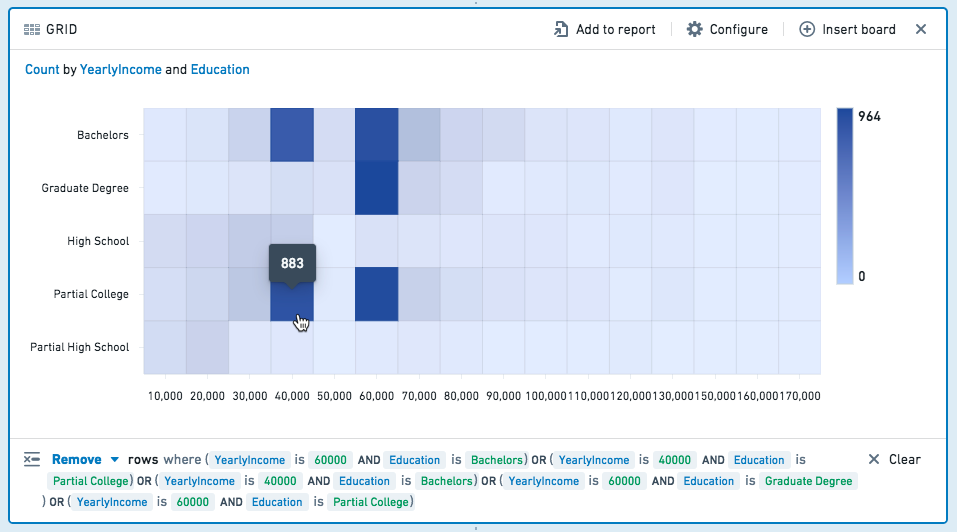

***

## Heatmap

The heatmap board displays geocoded data on a map, color-coded to represent the values.
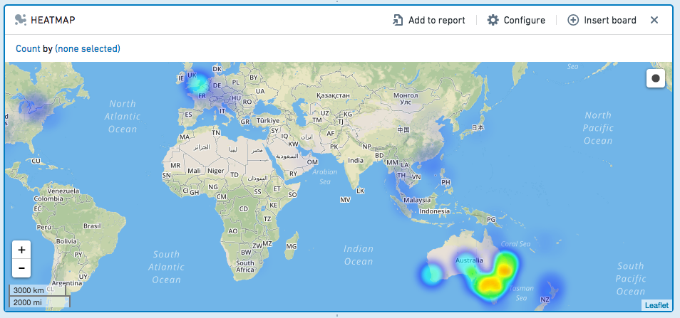

### Configuration

* Specify which columns have latitude/longitude data.
* Optionally, specify a geohash column.
* Then, choose an aggregate metric to calculate.
  * The available aggregate metrics are: **Count** (number of records), **Unique Count**, **Min**, **Max**, **Sum**, **Mean**, **Approx. Median**, **Standard Deviation**, and **Variance**.
    * Except for **Count**, you must specify which column the aggregate applies to. For **Unique Count**, you can select any column.
    * **Min**, **Max**, **Sum**, **Mean**, **Approx. Median**, **Standard Deviation**, and **Variance** only apply to numerical columns.

:::callout{theme="neutral" title="Approximate median"}
The **Approx. Median** aggregate is approximate. Contour calls the [percentile\_approx ↗](https://spark.apache.org/docs/latest/api/sql/index.html#percentile_approx) function with percentage value 0.5 and the default accuracy.
:::

### Filtering

You can draw a radius on the Heatmap to select all rows containing geo data that lies within that radius.

Click , then click-and-drag to draw a circle on the map.

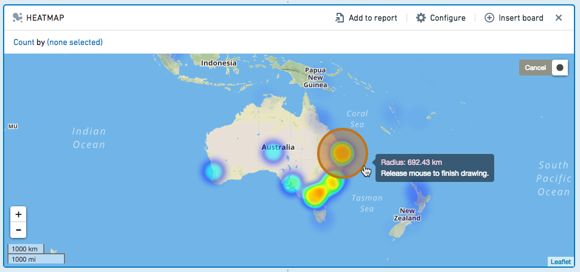

Choose to **Keep** the values in the selected radius, or **Remove** those values, keeping only non-selected values.

To clear your selection and remove the filter, click outside of the circle on the map.

***

## Pivot table

The pivot table board allows you to quickly compute multiple aggregate values of your data across multiple dimensions. The result of this computation is sampled and therefore what is displayed in the table may be incomplete. This sampling is described in further detail below.

Given a dataset with demographic information about customers, the following pivot table computes how many customers (by age) are married females, married males, single females or single males.

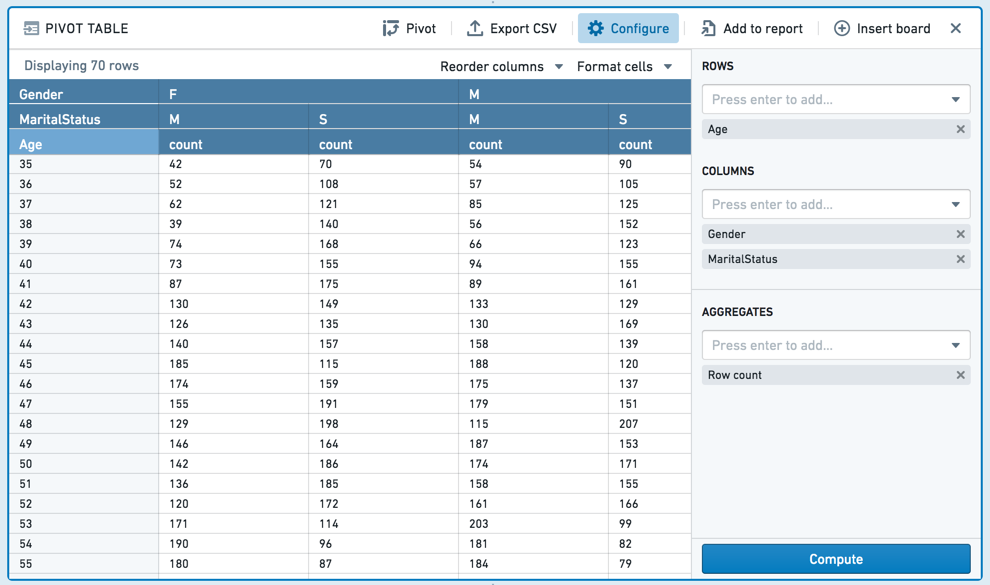

### Important note on sampling

To prevent slow front-end and back-end performance, the number of rows to calculate is limited. The limit is 1,000 rows in most environments and is generally not configurable.

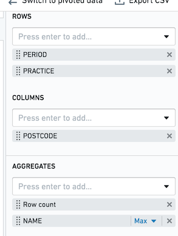

Suppose that as in the above screenshot, you have Pivot Table row aggregates of `PERIOD` and `PRACTICE`, and a column aggregate of `POSTCODE`. For each combination, you want to get the row count and the max value of the column `NAME`. If the limit in your environment is the default value of 1,000, you will only calculate 1,000 complete rows. Each row is guaranteed to be complete, but some rows may not be present.

When you sort a column in your pivot table, sorting is performed on the preview, rather than the entire dataset. To sort your entire dataset, use the Sort Board. See [Sort](#sort) for more information.

In order to interact with the entirety of pivoted data, use the **Switch to pivoted data** option on the board, which will transition your Contour analysis to the fully-computed pivoted data for all boards beneath the pivot table board. Alternatively, you can attempt to avoid the cell limit by further filtering your data upstream of the pivot table.

### Configuration

:::callout{theme="success" title="Tip"}
When specifying a column aggregate, the values in the column must be case-insensitively unique. For example, if column "Borough" contains values "Brooklyn" and "brooklyn", and you specify "Borough" as a column aggregate, the pivot table calculation will fail. Consider casting all values to a consistent case to avoid this issue.
:::

* **Columns**
  * Choose one or more columns to perform aggregates on – each combination of values across the selected columns in the original dataset will form a column in the pivot table.
* **Rows**
  * Choose one or more columns from the original dataset to define the rows in the pivot table – each combination of values across the selected columns in the original dataset will form a row in the pivot table.
* **Aggregates**
  * The available aggregate metrics are: **Count** (number of records), **Unique Count**, **Min**, **Max**, **Sum**, **Mean**, **Approx. Median**, **Standard Deviation**, and **Variance**.
    * Except for **Count**, you must specify which column the aggregate applies to. For **Unique Count**, you can select any column.
    * **Min**, **Max**, **Sum**, **Mean**, **Approx. Median**, **Standard Deviation**, and **Variance** only apply to numerical columns.

:::callout{theme="neutral" title="Approximate median"}
The **Approx. Median** aggregate is approximate. Contour calls the [percentile\_approx ↗](https://spark.apache.org/docs/latest/api/sql/index.html#percentile_approx) function with percentage value 0.5 and the default accuracy.
:::

You can drag and drop between Columns, Rows and Aggregates.

You can specify multiple aggregates in a single pivot table. Each aggregate will be calculated for each combination of rows and columns you select.

Grand totals can also be calculated for rows, columns, or both. Grand totals are calculated by performing the aggregate over the entire dataset (in other words, the grand total of **Unique Count** is the total number of unique counts over the dataset, the grand total of **Mean** is the mean of the entire dataset).

### Pivot (switch to aggregated data)

When you click **Pivot** (switch to aggregated data), any boards you add after the histogram will use the aggregated data computed in the table, rather than the original dataset.

The new dataset will include the column you selected for Y-Axis in the original histogram configuration, as well as a column for the aggregate. For example:

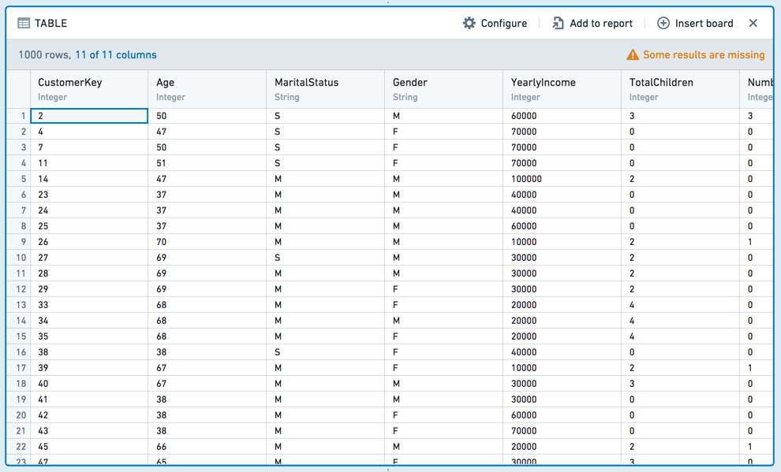

***

## Column editor

The column editor board allows you to easily remove columns from your dataset and derive new columns. Subsequent boards will consume the set of columns you choose to keep.

### Add new column

You can perform binary operations on existing columns in your dataset to create new derived columns, or parse columns of strings into number- or date-formatted columns.

**SQL Equivalent**

Derived columns are equivalent to using operators in SQL or Spark. For example, the following derives a column for **Income per person**:

```sql
SELECT
    [Household Members],
    [Marital Status],
    [Income Column] / [Household Members] AS [Income per person]
FROM [Table Name]
```

### Existing columns

To remove columns, select **Show existing columns** and select the name of any column you want to remove. You can add back a column by selecting it again. If you want to delete many columns, you can also select **Remove All** and then select any columns you want to retain.

### Remove duplicate rows

You can remove duplicate rows using the **Remove duplicate rows** option in the column editor board.

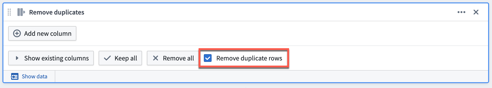

**SQL Equivalent**

Removing columns via the column editor board is equivalent to selecting column names in SQL. For example, given a table that has 5 columns, A-E, the following removes columns D and E:

```sql
SELECT columnA, columnB, columnC
FROM <tableName>
```

***

## Multi-column editor

The multi-column editor board allows you to reorder, rename and remove columns from your data, and remove duplicate rows. Subsequent boards will consume the set of columns you choose to keep.

The left side of the board shows **All Columns**, while the right side shows **Kept Columns**. In the **Kept Columns** section, you can choose to rename or reorder the kept columns, or use the bulk rename functionality.

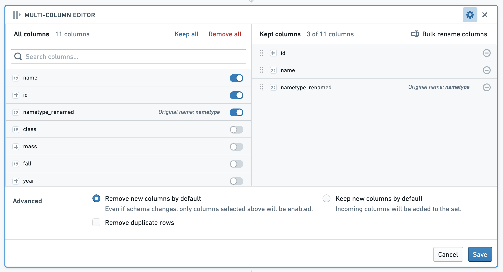

**SQL Equivalent**

Reordering, renaming, and removing columns is equivalent to selecting column names in SQL. For example, given a table that has 5 columns, A-E, the following code removes columns D and E, and renames A to A\_1:

```sql
SELECT columnA as columnA_1, columnB, columnC
FROM <tableName>
```

***

## Enrich

The enrich board lets you join your current working dataset to another dataset, and merge the matching results into your data.

[Learn how to use the enrich board.](/docs/foundry/contour/boards-join/)

***

## Link

The link board lets you join to another dataset and return the matching records of that dataset. This differs from the set math keep only operation in that it returns columns *from the linked (right) table only*.

[Learn how to use the link board.](/docs/foundry/contour/boards-join/)

***

## Set math

The set math board lets you alter your current dataset based on another set. You can filter the dataset to keep only data that exists in the other dataset (keep only); append data from another dataset (add); or remove data based on the results of another dataset (remove).

[Learn how to use the set math board.](/docs/foundry/contour/boards-join/).

***

## Join

The join board presents you with suggested join templates curated by your Palantir administrator. If you would like to add or modify suggested joins, contact your administrator.

[Learn how to use the join board.](/docs/foundry/contour/boards-join/).

***

## Export

The export board allows you to download your analytical set as a CSV or XLS file.

Choose **csv** or **xls** from the dropdown, then click **Export**. After the board finishes its operations on the server, you are given the option to customize the filename. Then click **Download <#> records** to download the file.

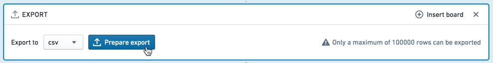

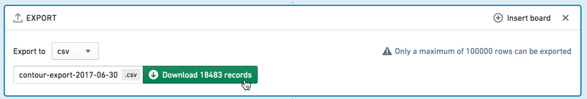

***

## Reorder columns

The reorder columns board lets you drag and drop the columns in your table into a different order.

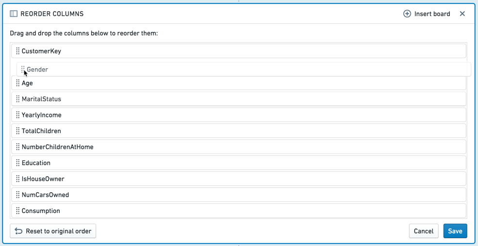

***

## Macro

The macro board lets you apply a previously created macro to your path.

***

## Sort

The sort board lets you sort all of the data in the dataset. Note that this sort is limited to the analysis and does not persist to the saved dataset. The sort may be lost by any downstream aggregations (e.g. a join or removing duplicate rows), so it is recommended to do such aggregations prior to the sort.

***

## Calculation

The calculation board lets you display multiple aggregate calculation on your data in the form of cards or lists. The available aggregate metrics are: **Unique Count**, **Min**, **Max**, **Sum**, **Mean**, **Median**, **Standard Deviation**, and **Variance**.

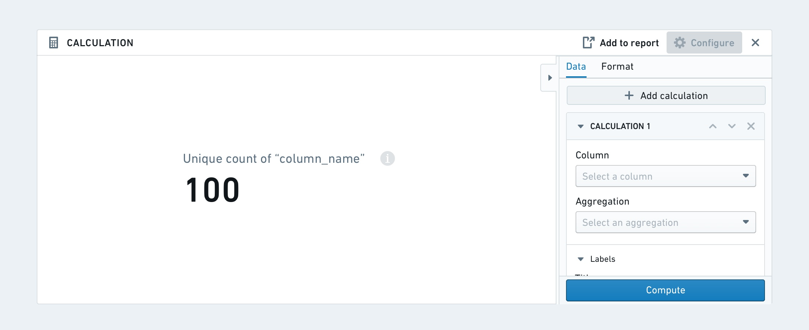

The calculation board can either be formatted as a **card** or as a **list**.

The card format has additional formatting options for **horizontal or vertical direction** and **metric sizes**.

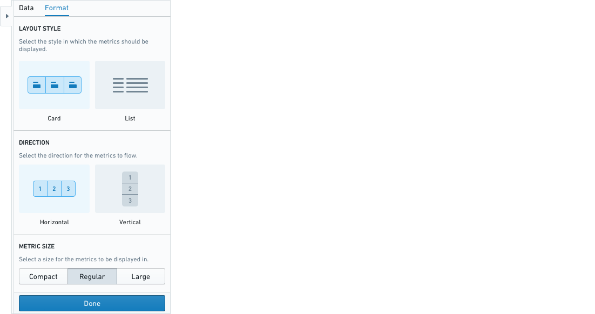

Lastly, each calculation can have **conditional formatting** based on a set of specified rules (conditions). This means that font color and background color can change based on whether a condition is met.

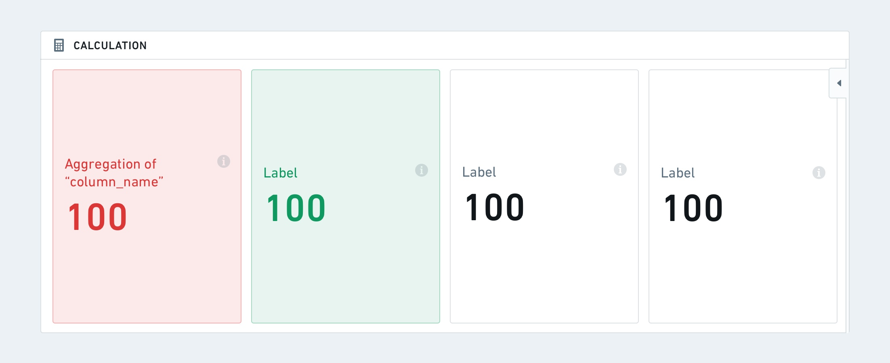

***

## Unpivot

The unpivot board allows you to reshape your data by turning some columns into rows. The columns that you select will be reformatted into two new columns: a header column (containing the original column names) and a value column (containing the original data values.)
