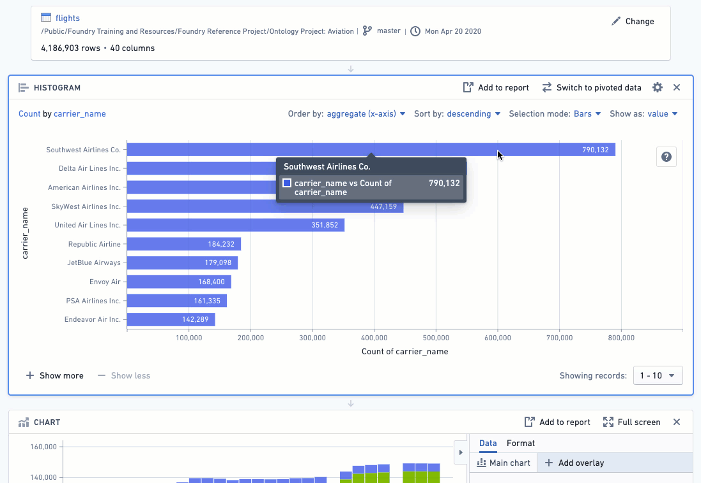
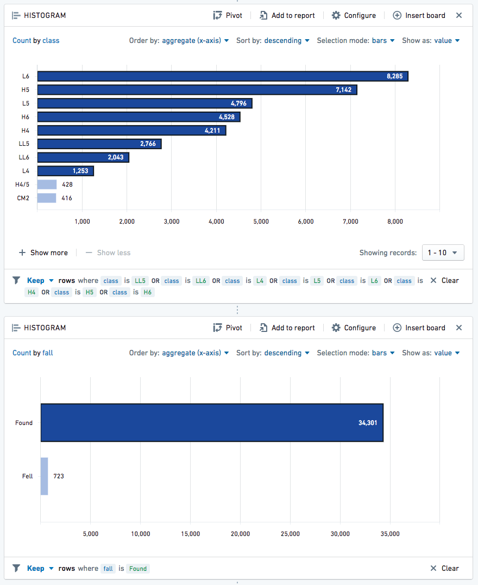
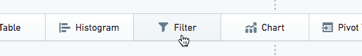
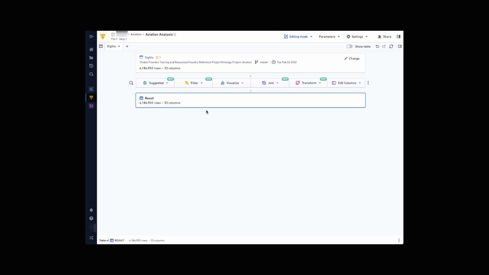
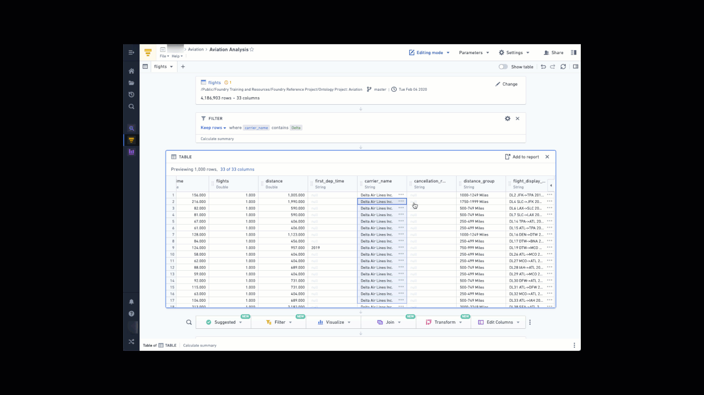
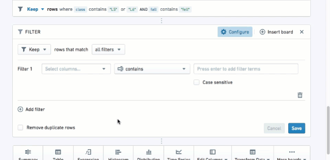
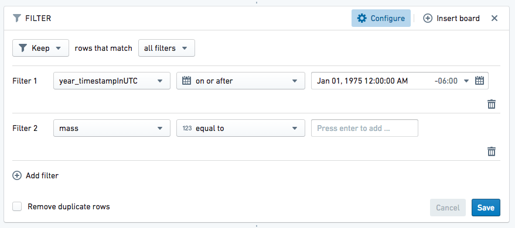
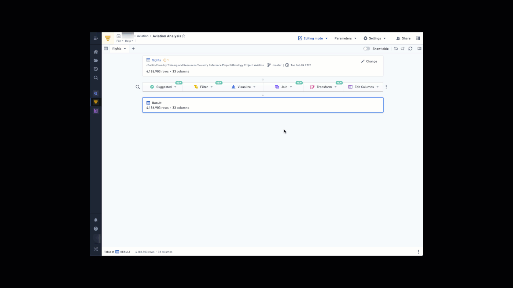
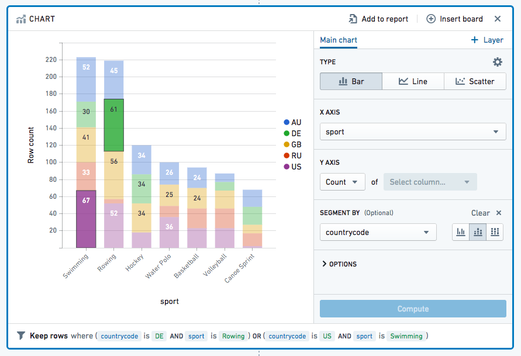
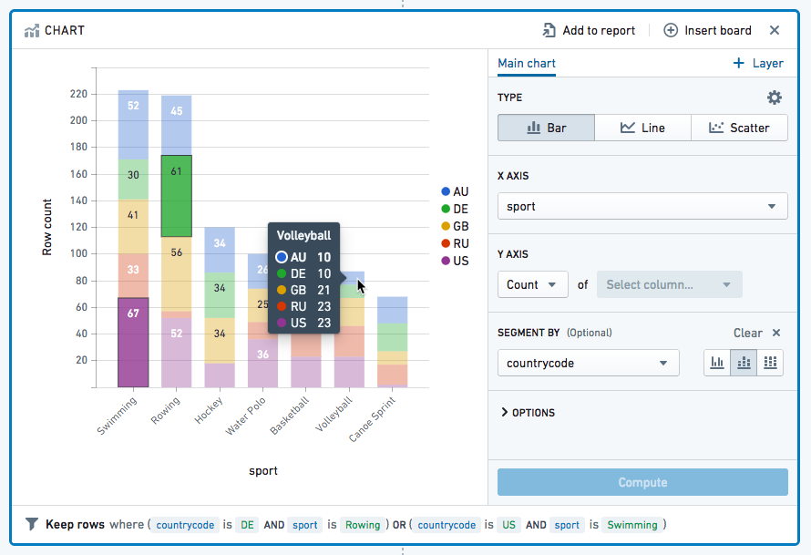

<!-- source: https://palantir.com/docs/foundry/contour/boards-filter/ · mirrored 2026-08-26 from Palantir Foundry docs -->

# Filter data

You can use many of Contour's visualization boards to filter as well as visualize data. This document explores how to use the histogram, filter, and chart boards to do so. Advanced users may want to look at Contour’s [expression language](/docs/foundry/contour/expressions-overview/) for more powerful filtering options. The screenshots on this page use open source aviation data.

***

## Histogram board

The histogram is one of the simplest ways to filter, and is recommended for visually exploring an unfamiliar dataset.

After creating a histogram, simply click on the bars to filter on them:

After selecting bars in the histogram, the bottom of the histogram will say **Keep rows where `column_name` is `value`**. This tells you that your working dataset has been filtered down to just the rows that have that value in that particular column. (You can use the dropdown selector to change **Keep** to **Remove** if you want to keep only rows that do *not* have that value.)

You can use multiple histograms in sequence to perform more complex filtering:

***

## Filter board

The filter board works best when you already know what you are looking for. The filter board is very flexible and lets you input exactly what you want to filter.

Add a filter board by choosing **Filter** from the action ribbon:

Click **Add filter** and select the name of the column on which you want to filter (you can start typing the column name to find it more quickly). Enter the values you want to filter to and add each value with the Enter key. Then click **Save** when you are finished adding filters.

Use **Keep** if you want to filter down to only data that meet the set criteria, as shown below:

Use **Remove** if you want to exclude only data that meet the set criteria, as shown below:

### Advanced comparisons

The above examples simply check whether a column value contains a word or phrase. However, there are many other comparisons available. Click where it says **contains** to see the full list, divided by category (click the heading names to change categories)

If you choose a column of a particular type (like a date or a number), Contour will automatically select the appropriate category for you:

### Multiple data filters

* Use **AND MATCHING** if you want to filter to data that meet multiple conditions at the same time.
* Use **OR MATCHING** if you want to filter to data that meet multiple conditions but not necessarily at the same time/within the same row of data.

### Adjusting filters

When someone creates a new analysis for a specific filter (e.g. `carrier_code = DL`), other people can easily replicate their analysis by changing the filter to their use case (e.g. `carrier_code = UA`) or removing the filter all-together to perform a global analysis.

:::callout{theme="neutral"}
In Foundry, analytical operations are applied to an entire column by default, in order to facilitate analysis of large datasets. If you would like to run an analysis on a smaller selection of rows (similar to selecting a specific cell range in Excel), filter the data down to the desired rows before applying the operations.
:::

### Wildcards in string filters

Some string filter types support the use of `?` and `*` as wildcards. `?` represents exactly one arbitrary character, while `*` represents a sequence of any number of arbitrary characters (that number can be 0).

The filters that support the use of wildcards are the following:

* `contains`
* `contains (with wildcards)`
* `is (with wildcards)`

Despite the unintuitive naming, both `contains` and `contains (with wildcards)` support wildcards. The difference between these two filters is that `contains` allows wildcard characters to be escaped with two forward slash characters (`\\`), while `contains (with wildcards)` does not allow wildcard characters to be escaped. For example, a `contains` filter with value `apples\\*pears` will match the string `apples*pears` but not the string `apples_pears`. Conversely, there is no way to construct a filter that matches `apples*pears` but not `apples_pears` using a `contains (with wildcards)` filter, because the `contains (with wildcards)` filter will always treat `*` as a wildcard.

Because this difference in behavior between `contains` and `contains (with wildcards)` may not be obvious, Contour analyses with filter logic that depend upon this behavior can be difficult to understand and maintain. If you need to express a complex string match condition, we suggest using a `matches` (regular expression) filter instead of a `contains` filter with wildcard escaping.

***

## Chart board

You can filter data on the chart by clicking on the chart area you would like to filter; hold Ctrl on Windows or Cmd on macOS and click to select multiple segments. This will filter your working dataset down to your selection (similar to the behavior of histograms).

Hover the mouse cursor over a piece of data to see a key with the exact figure:

