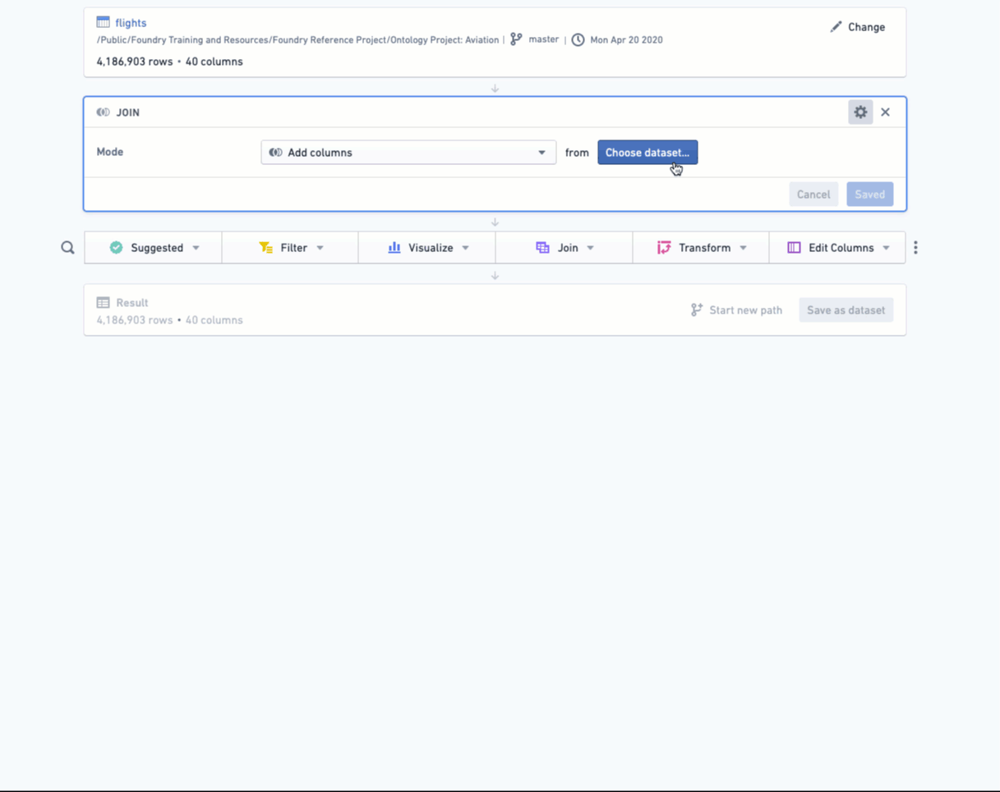
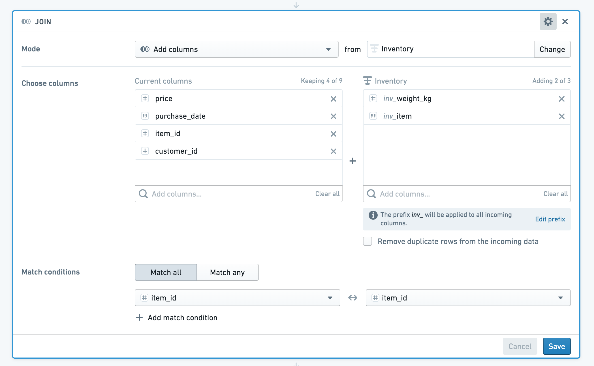

<!-- source: https://palantir.com/docs/foundry/contour/boards-join/ · mirrored 2026-08-26 from Palantir Foundry docs -->

# Join datasets

Contour offers several different boards for performing joins. This guide will teach you (1) how to use each board in order to join datasets together, (2) each board's SQL equivalencies, and (3) performance considerations.

***

## Join board

The join board lets you join your current working dataset to another dataset, and merge the matching results into your data. Here is an overview:



### Example

Say you have a table with information about purchases made by customers.

|customer\_id	|item\_id	|purchase\_date	|price	|
|---	|---	|---	|---	|
|101	|999	|1/1/2000	|50	|
|121	|997	|1/1/2000	|35	|
|…	|	|	|	|

You might have a second table with information on all items in your inventory:

|item\_id	|item	|weight\_kg	|
|---	|---	|---	|
|999	|Toaster oven	|1	|
|997	|Frying pan	|0.5	|
|…	|	|	|

You can use the join board to enrich your starting dataset (`transactions`) with information about each item purchased.

If your datasets have columns with the same name, Contour will prompt you to add a prefix to the column names. In this case, both datasets have a column called `item_id`. Apply the prefix “inv” (for `inventory`) to columns from the incoming dataset.

If you do not want to add the duplicate `item_id` column to the resulting joined dataset, you can deselect that column from the incoming dataset.



Your enriched dataset will look like this:

|customer\_id	|item\_id	|purchase\_date	|price	|inv\_item	|inv\_weight\_kg	|
|---	|---	|---	|---	|---	|---	|
|121	|997	|1/1/2000	|35	|Frying pan	|0.5	|
|101	|999	|1/1/2000	|50	|Toaster oven	|1	|
|…	|	|	|	|	|	|

### Configuration of the join board

Choose a join type to perform: left join (`Add columns`), inner join (`Intersection`), right join (`Switch to dataset`), or full join (`Incorporate all data, matching rows where possible`).

Choose which columns from the other dataset to add to your current working set. By default, all columns from the first dataset are returned.

Then choose one or more keys from each set. If you use multiple join keys, you can choose to **Match Any** or **Match All** conditions.

Note that for a full join, all rows will be returned from the two datasets; this means that the join column for either dataset may show null values, since there is no coalescing of the two columns.

***

## Union board

Use the union board to alter your current dataset based on another set. You can append data from another dataset (**Add rows**), filter the dataset to keep only data that exists in the other dataset (**Keep rows**), or remove data based on data that exists in another dataset (**Remove rows**). You can choose to match based on the position of the column in the dataset, or column names.

The following three tables provide a concrete notional example:

**people**

|first\_name	|last\_name	|
|---	|---	|
|Casey	|Linden	|
|Jess	|Sage	|
|Lee	|Rose	|
|Taylor	|Oak	|

**candidates**

|first\_name	|surname	|
|---	|---	|
|Jess	|Sage	|
|Lee	|Rose	|
|Jamie	|Wood	|

**candidates\_backward**

|last\_name	|first\_name	|
|---	|---	|
|Sage	|Jess	|
|Rose	|Lee	|
|Wood	|Jamie	|

We have a table of people, and want to compare it to two tables of candidates. Both tables do not have the same schema as the `people` table. The following sections show the resulting set, depending which comparison (set math) you perform on the tables.

### Example: Add rows

Starting with the `people` table, if we **Add rows** from the `candidates_backward` table **By name**, then the resulting set looks like this:

|first\_name	|last\_name	|
|---	|---	|
|Casey	|Linden	|
|Jess	|Sage	|
|Lee	|Rose	|
|Taylor	|Oak	|
|Jess	|Sage	|
|Lee	|Rose	|
|Jamie	|Wood	|

Starting with the `people` table, if we **Add rows** from the `candidates_backward` table **By position**, then the resulting set will append the first names from the `people` table to the last names from the `candidates_backward` table, and vice versa. This is likely not desirable. The resulting set looks like this:

|first\_name	|last\_name	|
|---	|---	|
|Casey	|Linden	|
|Jess	|Sage	|
|Lee	|Rose	|
|Taylor	|Oak	|
|Sage	|Jess	|
|Rose	|Lee	|
|Wood	|Jamie	|

You would want to **Add rows** to the `people` table from the `candidates` table **By position** because the column names do not match, but the positions of the first name and last name columns do. Notice the column name is taken from the starting set:

|first\_name	|last\_name	|
|---	|---	|
|Casey	|Linden	|
|Jess	|Sage	|
|Lee	|Rose	|
|Taylor	|Oak	|
|Jess	|Sage	|
|Lee	|Rose	|
|Jamie	|Wood	|

### Example: Keep rows

Starting with the `people` table, if we configure the union board to **Keep rows** that **Appear in** the `candidates` table **By position**, then the resulting set looks like this:

|first\_name	|last\_name	|
|---	|---	|
|Jess	|Sage	|
|Lee	|Rose	|

Starting with the `people` table, if we configure the union board to **Keep rows** that **Appear in** the `candidates_backward` table **By name**, then the resulting set looks like this:

|first\_name	|last\_name	|
|---	|---	|
|Jess	|Sage	|
|Lee	|Rose	|

### Example: Remove rows

Starting with the `people` table, if we **Remove rows** that **Appear in** the `candidates` table **By position**, then the resulting set looks like this:

|first\_name	|last\_name	|
|---	|---	|
|Casey	|Linden	|
|Taylor	|Oak	|

Starting with the `people` table, if we **Remove rows** that **Appear in** the `candidates_backward` table **By name**, then the resulting set looks like this:

|first\_name	|last\_name	|
|---	|---	|
|Casey	|Linden	|
|Taylor	|Oak	|

If we instead started with the `people` table and **Remove rows** that **Appear in** the `candidates_backward` table **By position**, the resulting set looks as below. Note that this table is identical to the `people` table as there were no rows that appeared in the `candidates_backward` table when matching on position.

|first\_name	|last\_name	|
|---	|---	|
|Casey	|Linden	|
|Jess	|Sage	|
|Lee	|Rose	|
|Taylor	|Oak	|

### Configuration of the union board

Choose **Keep rows**, **Add rows**, or **Remove rows**, then select the set you want to compare to.

For **Keep rows** and **Remove rows**, you can choose either **Appear in** or **Match on**.

* When using **Appear in**, you can choose either to match **By position** or **By name**.
* When using **Match on**, you must specify the columns to join on (one column from each set).

:::callout{theme="warning" title="Warning"}
When performing a union, both datasets must have the same number of columns. Thus, when using a union board, it is important to be careful if the schemas are subject to change. For example, a union board downstream of a pivot table that has been switched to pivoted data could be subject to unexpected changes in the number of columns due to schema changes.
:::

***

## SQL equivalencies

For users who are familiar with SQL, it may be helpful to think of Contour join operations in terms of their equivalents in SQL.
The following table shows which SQL join types are supported in which boards:

|Board	|<a href="https://www.w3schools.com/sql/sql_union.asp">Union</a>	|<a href="https://www.w3schools.com/sql/sql_join_left.asp">Left join</a>	|<a href="https://www.w3schools.com/sql/sql_join_right.asp">Right</a>	|<a href = "https://www.w3schools.com/sql/sql_join_full.asp">Outer</a>	|<a href="https://www.w3schools.com/sql/sql_join_inner.asp">Inner</a>	|
|---	|---	|---	|---	|---	|---	|
|Join	|	|X	|X	|X	|X	|
|Union	|X	|X	|	|	|	|

### Join

The join operation is equivalent to the following in SQL:

```sql
SELECT [DISTINCT] <Column1, Column2, ...>
FROM CurrentTable
<INNER JOIN | LEFT OUTER JOIN | RIGHT OUTER JOIN | FULL OUTER JOIN > OtherTable 
ON <join condition 1>([AND | OR] <join condition 2> [AND | OR] <join condition 3> ...)
```

### Union

**Keep rows match on** is equivalent to a Left Semi Join in SQL:

```sql
SELECT L.*
FROM L INNER JOIN (SELECT DISTINCT <join column> FROM R) AS R_KEY
ON L.<join column> = R_KEY.<join column>
```

**Remove rows match on** is equivalent to a SQL Left Outer Join where the join keys do not match:

```sql
SELECT L.*
FROM L LEFT OUTER JOIN R
ON L.<join column> = R.<join column>
WHERE R.<join column> is null
```

***

## Data Types

:::callout{theme="neutral" title="Tip"}
Inspect your resulting set to ensure the data types are as expected.
:::

When using the union board, be aware of the data types of your columns. Compatible column types will be cast. For a concrete example, consider the following two datasets.

**dataset1**

|ID (int)	|Name (string)	|
|---	|---	|
|555	|Alice	|
|666	|Bob	|

**dataset2**

|ID (long)	|Name (string)	|
|---	|---	|
|555	|Alice	|
|999	|Chloe	|

Starting with `dataset1`, if we **Add rows by position** from `dataset2`, the resulting set looks as below:

|ID (long)	|Name (string)	|
|---	|---	|
|555	|Alice	|
|666	|Bob	|
|555    |Alice  |
|999	|Chloe	|

Starting with `dataset1`, if we **Keep rows** that **appear in** `dataset2` **by position**, the resulting set looks as below:

|ID (long)	|Name (string)	|
|---	|---	|
|555	|Alice	|

Note that even though the starting set included the column ID as an int type, in the resulting set it is a long type. **Keep rows** that **appear in**
uses the `Intersect` <a href="https://spark.apache.org/docs/latest/api/java/org/apache/spark/sql/Dataset.html#intersect-org.apache.spark.sql.Dataset-">function</a> in spark.

Starting with `dataset1`, if we **Remove rows** that **appear in** `dataset2` **by position**, the resulting set looks as below:

|ID (long)	|Name (string)	|
|---	|---	|
|666	|Bob	|

Again, note that although the starting set included the column ID as an int type, in the resulting set it is a long type. **Remove rows** that **appear in**
uses the `Except` <a href="https://spark.apache.org/docs/latest/api/java/org/apache/spark/sql/Dataset.html#except-org.apache.spark.sql.Dataset-">function</a> in spark.

***

## Performance considerations

* When choosing keys for joining two tables, you should use unique IDs (like primary keys) as much as possible. We *strongly* advise against using foreign key joins – doing so will crash Spark.
* You should use the **Save as dataset** functionality after complex joins or expressions, to “save” your work before continuing. This will make downstream queries more performant because the join has been persisted to disk.

## Checking the results

After joining your datasets, it is a good idea to look at a table of the joined set to check whether the results are what you expect. Select **Table** in the action ribbon to add a table board, and scroll through your new joined set.
