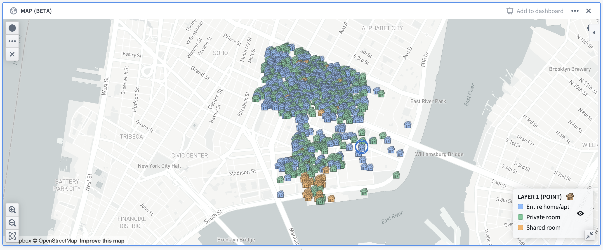
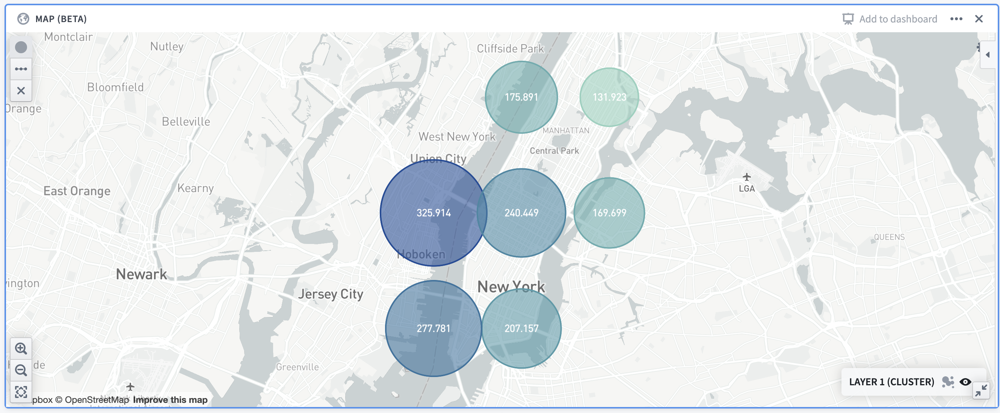
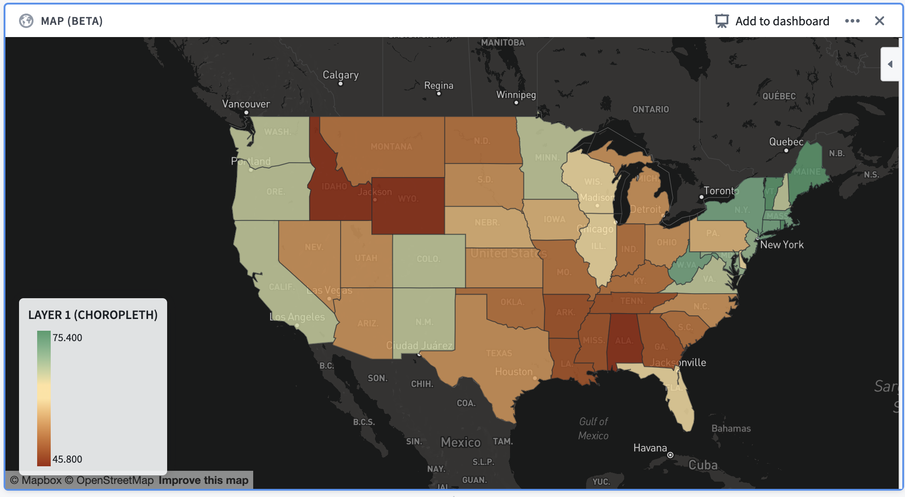
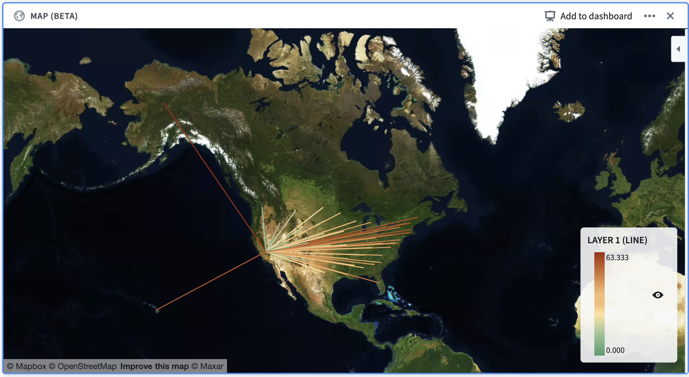
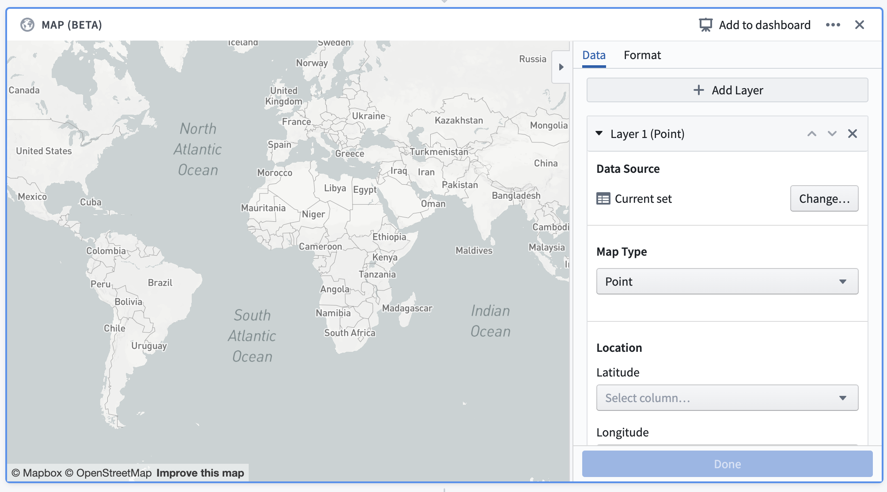
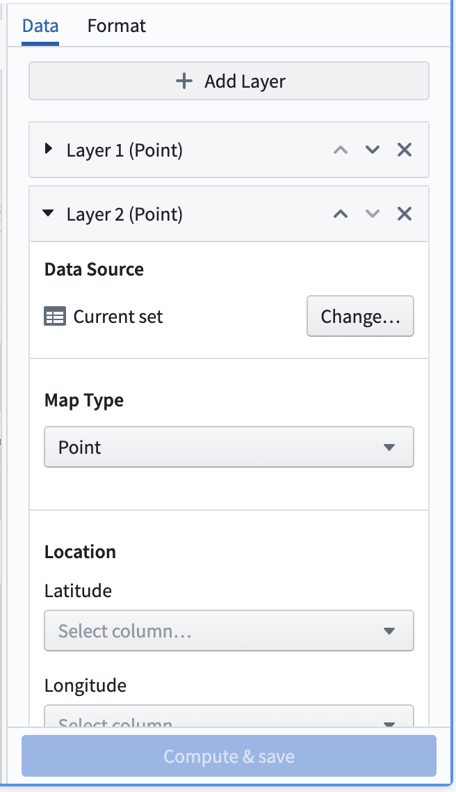
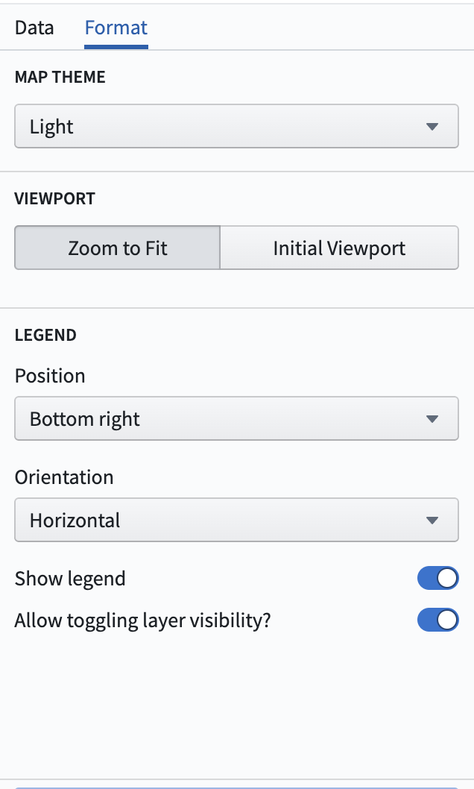
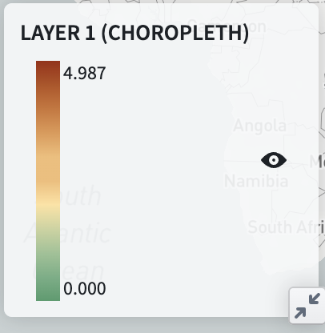
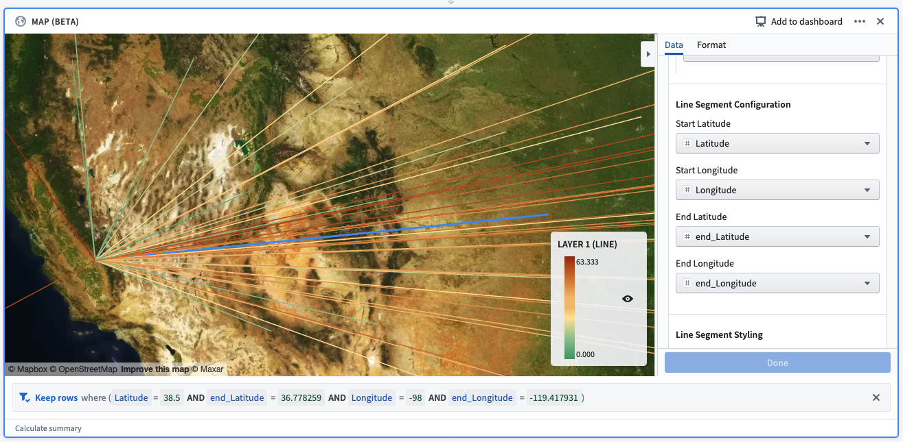
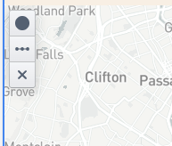

<!-- source: https://palantir.com/docs/foundry/contour/boards-map/ · mirrored 2026-08-26 from Palantir Foundry docs -->

# Map board

The Contour **map board** allows you to visualize and interact with your geospatial data.

These map visualizations are comprised of two types of layers:

* A **base layer** (also called a **tile layer**), which provides the background map imagery, and
* **Overlay layers**, which represent data as points or shapes on top of the base layer.

The map board supports map rendering with [MapboxGL ↗](https://docs.mapbox.com/mapbox-gl-js/api/). If WebGL is not supported in a user’s browser, the map board will render with [Leaflet ↗](https://leafletjs.com/).

:::callout{theme="neutral"}
Check whether or not your browser supports WebGL by visiting the [WebGL website ↗](https://get.webgl.org/).
:::

The map board uses *Mapbox* as the primary source for its base map imagery. To learn more about web map technology, see the [Mapbox documentation ↗](https://docs.mapbox.com/help/getting-started/web-apps/).

## Overlay layer types

In the map board, **overlay layers** (referred to as “layers” in the interface) represent data as points or shapes on top of a map’s base layer. The map board contains the following types of overlay layers:

* [Point](#point)
* [Cluster](#cluster)
* [Choropleth](#choropleth)
* [Line segment](#line-segment)

Currently, static layers (which are commonly used in Workshop maps) are not supported in the map board.

### Point

**Point layers** use points or markers to represent individual objects on a map, plotted by a latitude/longitude pair. The color, icon type, and size of the points can be styled.

For configuration information, see the [configure point layers section](#configure-point-layers) below.

> Example: A map showing Airbnb locations in the Lower East Side neighborhood of Manhattan, colored by the room type. The map uses open source data from [Inside Airbnb ↗](https://insideairbnb.com/get-the-data/).

### Cluster

**Cluster layers** are ideal for large sets of data containing latitude/longitude pairings. Clusters are similar to points, but instead of plotting a single marker per object, the objects being plotted are aggregated based on their geographic proximity into **clusters**. The size and/or color of the cluster is configurable to represent the number of data points within a given area.

In addition to the number of data points (which is a **count aggregation**), the cluster layer supports a number of different aggregation functions, such as the sum or average of a different column in the dataset.

For configuration information, see the [configure cluster layers section](#configure-cluster-layers) below.

> Example: A map showing the distribution of Airbnb prices in Manhattan. Cluster size/colors are based off of the average price in the given area.

### Choropleth

The **choropleth layer** displays regions (such as countries or provinces) that are colored based on some column value or aggregation over column values of rows represented by that region. This provides a way to visualize variation or patterns across different regions, with the option of seeing how those values change over time.

For configuration information, see the [configure choropleth layers section](#configure-choropleth-layers) below.

> Example: A map of the continental United States, with each state colored according to the percentage of its total population that is fully vaccinated as of December 13, 2021.

### Line segment

**Line segment layers** plot individual rows as a line segment connecting two points. Points are defined by a latitude/longitude pair.

For configuration information, see the [configure line segment layers](#configure-line-segment-layers) below.

> Example: A map of the United States, with line segments that start in the center of each state and end in California. The line segments are colored according to their distance from California.

## Configuration

Below is an image of a newly added and not yet configured **map board.** By default, a point layer with its data source set as the **Current set** will be added to the board.

At the top of the configuration panel are a set of tabs: **Data** and **Format**.

* The **Data** tab allows you to add and configure the [overlay layers](#overlay-layer-types) of the map, which are described in the previous section.
* The **Format** tab allows you to configure the **base layer** of the map, along with other general formatting options for the map (for example, the position of the legend in the map).

### Data tab

The data tab contains an **Add layer** button at the top and a collapsible section for each overlay layer that is shown on the map.

Clicking the **Add layer** button at the top of the section will add a new layer (defaulting to a point layer) to the map and will collapse all other sections.

The **Data source** represents the dataset or Contour path that the layer will use to display data and compute aggregations. By default, the **Current set** is selected for this option which will use data from the current Contour path.

Other options for the data source include other paths in the same analysis, or a different Foundry dataset.

The **Map Type** can be changed to configure a different type of layer. The different options for these layers are point, cluster, choropleth, and line segment, as described above.

#### Configure point layers

For the point layer, the main configuration options are as follows:

* **Location:** Allows selecting latitude and longitude columns, indicating the location of each row in the data source.
* **Point styling:** Allows configuring the **icon type, color,** and **size** for each point:
  * **Icon type:** A dropdown selector of the available icon types which can be filtered with a text search.
  * **Color:** A selection between “Single color” and “Color by value”.
    * **Single color:** Provides a dropdown selector of a color that will be used to uniformly color all points of the layer.
    * **Color by value:** Provides a column selector. Each point will be assigned a color based on the value contained in the selected column.
  * **Size:** A dropdown selector of the available sizings: small, medium, large, and extra large.
  * **Tooltip:** A column selector allowing users to add a column containing tooltip labels. These labels will be displayed in a tooltip when hovering over points in the map.

#### Configure cluster layers

For the cluster layer, the main configuration options are as follows:

* **Location:** Allows selecting latitude and longitude columns, indicating the location of each row in the data source.
* **Aggregation:** Allows selecting a column containing values and an aggregation type based on that column. The result of this aggregation will be used in determining the size/color of the clusters.
* **Cluster styling:** Allows configuring the **size scaling, color,** and **opacity** of the clusters:
  * **Size scaling:** Describes how the clusters in the map should scale according to the result of the aggregation. Options are linear, log, and square root.
  * **Color:** A selection between “Single color” and “Scaled color”:
    * **Single color:** Provides a dropdown selector of a color that will be used to uniformly color all clusters of the layer.
    * **Scaled color:** Provides selectors for a “color scale” and a “scale type”. The color scale and scale type will be used to color the clusters on a gradient according to the value of each cluster.
  * **Opacity:** A slider that allows configuration of the fill opacity of the clusters on the layer, from a scale of 0 (fully transparent) to 1 (fully opaque).

:::callout{theme="neutral"}
For additive aggregations (count or sum, for example), the map board will **supercluster** existing clusters. This means that clusters will automatically adjust as you zoom in and out of the map so that an appropriate level of cluster granularity will be shown for the current zoom level.
:::

#### Configure choropleth layers

To configure a choropleth layer, you must first specify the **Choropleth type**. This corresponds to the source for the boundaries that will define the regions that are shown. Currently, the map board supports the following choropleth types:

* **Mapbox:** This is the easiest method of configuring a choropleth, assuming that you are interested in displaying generic regions around the world (countries, states, or counties, for example). This option leverages the use of [Mapbox enterprise boundary sets ↗](https://docs.mapbox.com/data/boundaries/guides/). First, [install Mapbox boundary datasets on your Foundry instance](/docs/foundry/geospatial/ontology/).
* **GeoJSON:** This option is useful if you have simple, custom regions defined via GeoJSON, or do not have access to the Mapbox APIs from your environment (due to network restrictions, for instance). This option leverages data in [GeoJSON ↗](https://geojson.org/) format.

The configuration options for the layer itself differ based on the choropleth type selected:

* **Mapbox**:
  * **Choropleth region type:** Allows selecting [boundary types and data levels ↗](https://docs.mapbox.com/data/boundaries/guides/#boundary-types-and-data-levels). Mapbox Boundaries data are categorized into five broad types based on the functions the boundaries serve: admin, legislative, locality, postal and stats. Within each boundary type, features are organized into a hierarchy of different numbered levels. Typically, larger-numbered levels will nest under smaller-numbered levels. For example, in the United States, counties (admin level 2) are subdivisions of states (admin level 1), which are subdivisions of the country (admin level 0).
    * The **region ID column** for the layer must match the required Mapbox feature IDs for whatever boundary level you select. The mappings for these feature ID values are available through an imported dataset that should already exist on the platform. If you are unaware of how to locate these mappings, contact support.
  * **Worldview:** This [feature ↗](https://docs.mapbox.com/vector-tiles/reference/mapbox-countries-v1/#--polygon---worldview-text) renders map boundaries for different audiences when multiple versions of boundaries exist; currently, the available options are the United States, Japan, India, and China.
  * **Aggregation:** Allows selecting a column containing values and an aggregation type based on that column. The result of this aggregation will be displayed in a tooltip that is visible when hovering over a choropleth region. Additionally, it will be used when using the **Color scale** coloring option.
  * **GeoJSON:**
    * **GeoJSON geometry column:** Allows the selection of a column that contains data in a GeoJSON format. The shapes specified by the data will be displayed on the map for each layer. This allows for custom shapes that may not be supported by Mapbox but does not allow for aggregation or selections.

Additionally, choropleth layers support different types of color configurations:

* **Single color:** Provides a dropdown selector of a color that will be used to uniformly color all shapes on the layer.
* **Scaled color:** Provides selectors for a “color scale” and a “scale type”. The color scale and scale type will be used to color the regions on a gradient according to the value of each region.
  * For **Mapbox choropleths**, the value for each region is determined by the result of the aggregation.
  * For **GeoJSON choropleths**, the value for each region is determined by a column that the user must provide when selecting this option.
* **Color by value:** Provides a column selector. Each region will be assigned a color based on the value contained in the selected column.
  * This option is only available for GeoJSON choropleth layers.
* **Custom buckets:** Provides a form for assigning colors based on value ranges. To configure a custom bucket, select a color, a label (optional), and a minimum value. Each bucket encompasses any choropleth region whose aggregated value falls between the bucket's minimum value and the minimum value of the adjacent bucket.
  * This option is only available for Mapbox choropleth layers.

#### Configure line segment layers

To configure a line segment layer, you must first specify the **Line segment type**. This will specify how lines should be drawn on the line layer. Currently, the following options are supported by the map board:

* **Point to point:** For each row in the input dataset, this draws a straight line between the provided start and end points.
  * When selecting this option, users must provide four columns:
    * Start latitude,
    * Start longitude,
    * End latitude, and
    * End longitude
* **GeoJSON source:** For each row in the input dataset, this draws the line provided by the GeoJSON shape contained in the specified column. This option allows for more complex lines to be drawn on a map, but selections will not be available for such layers.
  * When selecting this option, users must provide a column corresponding to the **GeoJSON feature column,** which is the column containing the GeoJSON shapes.

Additionally, line segment layers support different types of color configurations:

* **Single color:** Provides a dropdown selector of a color that will be used to uniformly color all lines on the layer.
* **Scaled color:** Provides selectors for a “Value column”, “color scale”, and a “scale type”. The color scale and scale type will be used to color the lines on a gradient according to the value of each line, which is determined using the value column that the user provides.
* **Color by value:** Provides a column selector. Each line will be assigned a color based on the value contained in the selected column.

### Format tab

The format tab contains general formatting information for the map.

**Map theme:** Corresponds to the style of the base layer of the map. These options are provided by Mapbox. The default map theme is the [light theme ↗](https://www.mapbox.com/maps/light). Other options include the following:

* Dark
* Satellite
* Basic
* Bright
* Outdoor
* Satellite streets
* Street

**Viewport:** Specifies the viewport of the map when initially loading the map, or when updates are made that cause the map to re-render points.

* **Zoom to fit:** The map viewport will automatically zoom to fit the current data on the map.
* **Initial viewport:** Allows for manually configuring the latitude, longitude, and zoom levels. There is also an option to automatically set these values to the current viewport of the map.

**Legend:** specifies options for the map legend.

* **Position:** Where the legend should appear on the map.
* **Orientation:** Specifies whether the legend should expand horizontally or vertically.
* **Show legend:** Toggling this option will show/hide the legend from users
* **Allow toggling layer visibility:** When enabled, will show each layer on the legend with an eye icon. Clicking this icon will allow users to temporarily hide individual layers.

## Map filtering and drawings

### Filtering

The map board supports many filtering options which differ by layer. Note that filtering is only enabled when the **Data source** option is set to the **Current set**. Multiple filters on the map will be unioned together (OR filters) rather than intersected.

#### Point layer filtering

* Clicking on individual points will add filter(s) corresponding to the latitude and longitude of the selected point(s). The filter(s) will apply to the latitude and longitude columns selected in the configuration. There is a maximum of 30 selections allowed per layer.
* Drawing a radial filter (see the [map drawings section](#map-drawings)) will create a radial filter corresponding to the latitude and longitude columns selected in the configuration.
* Similarly, drawing a polygon filter will create a polygon filter corresponding to the latitude and longitude columns selected in the configuration.

> Example: A point selection and a radial filter drawn on a map. The corresponding filter reads: “keep rows where (latitude = 40.80826 and longitude = -73.93401) OR latitude, longitude is within 0.2969 km of 40.8081, -73.94189)”. The first filter corresponds to the point selection, and the second filter corresponds to the radial filter.

#### Cluster layer filtering

Filtering is not currently supported on the cluster layer.

#### Choropleth layer filtering

* **Mapbox:** Clicking on a region will create a filter on the **Region ID column** based on the value of the selected region. There is a maximum of 30 selected regions allowed per layer.
* **GeoJSON:** Filtering is not currently supported for GeoJSON choropleths.

.

> Example: A selection made on a Mapbox choropleth layer. The selection creates a filter, which reads: “Keep rows where feature\_id = 332521”. feature\_id is the column provided as the “Region ID column”, and 332521 is the Mapbox feature id corresponding to the selected shape (California).

#### Line segment layer filtering

* **Point to point:** Clicking on a line will create a filter on the start latitude, start longitude, end latitude, and end longitude columns. There is a maximum of 30 selected lines per layer.
* **GeoJSON:** Filtering is not currently supported for GeoJSON line segment layers.

> Example: A selection made on a line segment layer. The selection creates a filter, which reads: “Keep rows where (Latitude = 38.5 AND end\_Latitude = 36.778259 AND Longitude = -98 AND end\_Longitude = -119.417931).”

### Map drawings

The map board supports the drawing of shapes on the map. These can be accessed by the buttons in the top left corner of the map, which are visible when hovering the cursor over the map:

The following options are supported for drawings:

* **Add circular filter:** Allows the drawing of a circle on the map, which will create a radial filter on all point layers in the board with the **Data source** set to **current set**. Follow these steps to draw the filter:
  1. Click on the button.
  2. Then, click anywhere on the map to specify the center of the circle. Dragging your cursor away/towards the center point will increase/decrease the radius of the circle.
  3. Finally, click on the map again to finish drawing the circle.

:::callout{theme="neutral"}
For filtering purposes, the circular filter uses the **Great Circle** projection, which generally gives distances between points on the surface of the Earth correct to about 0.5%. However, better accuracy is possible (and generally expected) when applying the projection to a small area. [Learn more about the Great Circle projection. ↗](https://en.wikipedia.org/wiki/Great-circle_distance)
:::

* **Add polygon filter:** Allows the drawing of a polygon on the map, which will create a polygon filter on all point layers in the board with the **Data source** set to **current set**. Follow these steps to draw the filter:
  1. Click on the button.
  2. Then, click anywhere on the map to specify the first vertex of the polygon. Subsequent clicks on the map will specify other vertices of the polygon, in order.
  3. Finally, click on the first point to finish drawing the polygon.

:::callout{theme="neutral"}
You may notice that your drawn polygon creates two filters instead of one. This will occur for polygons that are intersected by the [antimeridian ↗](https://en.wikipedia.org/wiki/180th_meridian); for filtering purposes, the polygon will be split across the antimeridian.
:::

* **Draw line:** Allows the drawing of a line on the map. Lines are for display purposes only and will not create a filter on the map. Follow these steps to draw a line:
  1. Click on the button.
  2. Then, click anywhere on the map to specify the beginning of the line. Subsequent clicks will create additional line segments
  3. Finally, click the most recently added segment again to complete the drawing.

* **Remove drawn shapes:** Allows users to remove the drawn shapes on the map. If removing a circle, the corresponding filter(s) will be removed. Follow these steps to remove shapes:
  1. Click on the button with the **x** icon.
  2. Hover over the shape that you would like to remove. The shape should turn red.
  3. Click the hovered shape to remove it.
  4. Finally, click the button again to finish removing shapes.
