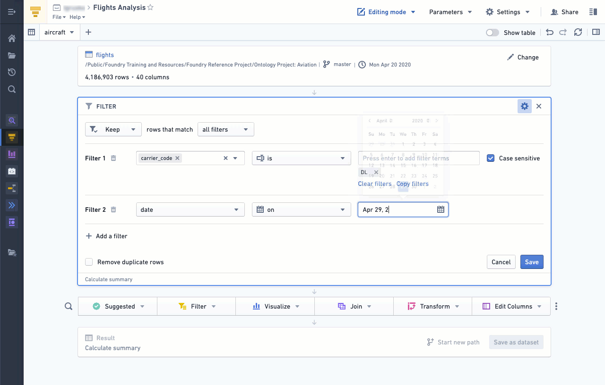
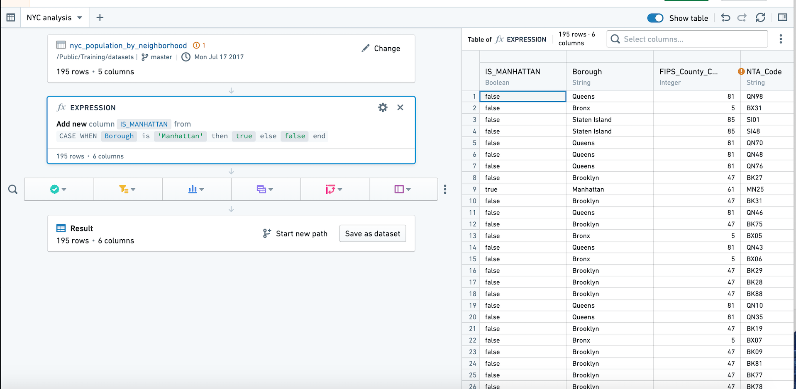
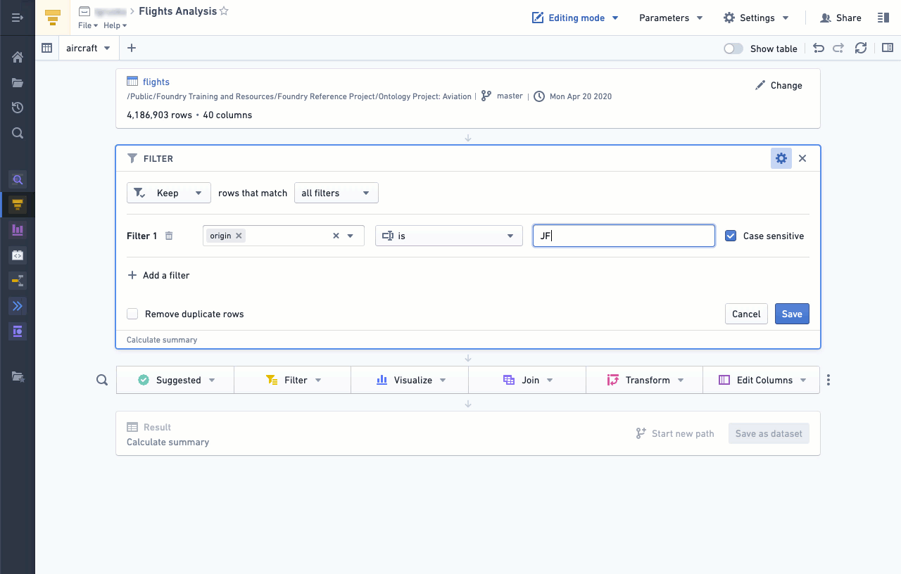

<!-- source: https://palantir.com/docs/foundry/contour/boards-verify-results/ · mirrored 2026-08-26 from Palantir Foundry docs -->

# Verify results

In Contour, you can use various boards to check the dataset produced by your analysis. Some of the simplest ways to check results are:

* [Using the Table board](#using-the-table-board)
* [Using the Table panel](#using-the-table-panel)
* [Using the Histogram board](#using-the-histogram-board)

***

## Using the Table board

By inserting a **Table** board after an analysis, you can quickly check to see if any new columns are correct or if the logic of a previous board resulted in the intended outcome.

***

## Using the Table panel

In addition to the path view, which lists the boards you have applied to your dataset, Contour also offers a **table panel**. Using the table panel enables you to see the underlying data in a table as you apply each board.

The table panel makes the table (not boards) the focus, so you can see how the data changes as you add each board. This can be especially helpful when writing [expressions](/docs/foundry/contour/expressions-overview/).

You can switch to the table panel by clicking **Show table** in the upper right. Click the button again or click **Hide table** to return to path view.

***

## Using the Histogram board

Inserting a **Histogram** board after an analysis provides a quick overview of the different data categories, which can be used for general assessment of the data or to check that the filtered categories are correct.

