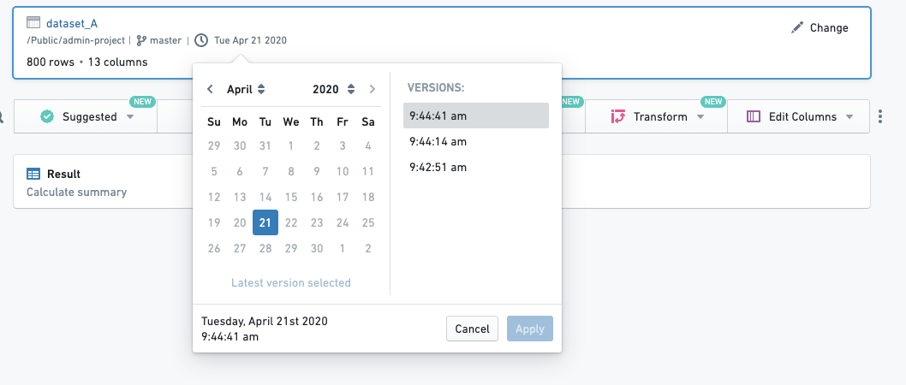

<!-- source: https://palantir.com/docs/foundry/contour/change-dataset-version/ · mirrored 2026-08-26 from Palantir Foundry docs -->

# Change input dataset version

Contour allows you to start an analysis with a previous version of your dataset. To do this, open the date picker in the summary board at the top of your analysis and select the timestamp corresponding to the version of the data you would like to use:

If you are changing the dataset version on an existing analysis, Contour will simply update your entire analysis on top of the selected version.
