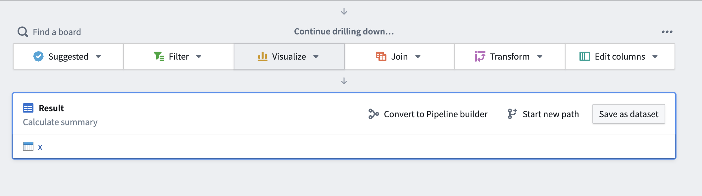
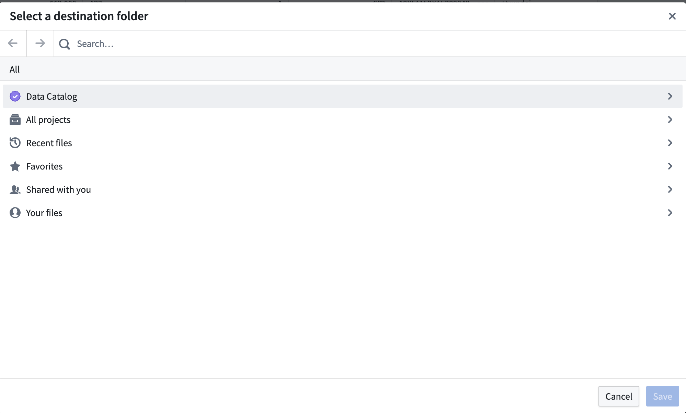

<!-- source: https://palantir.com/docs/foundry/contour/convert-to-pipeline-builder/ · mirrored 2026-08-26 from Palantir Foundry docs -->

# Export Contour logic to Pipeline Builder

In Foundry, you can take a complex Contour analysis and export the underlying logic to [Pipeline Builder](/docs/foundry/pipeline-builder/overview/). Although Contour is the ideal tool for exploratory analysis and drilling down on specific issues, it is not well-suited for production pipeline maintenance. If your analysis logic will not be frequently changing for your use case, we recommend exporting to Pipeline Builder for more flexibility and maintenance configuration of production pipelines.

The guide below provides points of consideration when choosing to export Contour analyses, along with a guided walkthrough on how to easily export your logic into Pipeline Builder.

:::callout{theme="warning"}
The Contour to Pipeline Builder tool cannot guarantee that your logic will remain the same after export. We recommend conducting your own validation for sensitive use cases that depend on strict logic.
:::

## Considerations

Before deciding to export Contour logic to Pipeline Builder, review the following benefits, unsupported features, and possible breaking changes to expect.

### Benefits

[Pipeline Builder](/docs/foundry/pipeline-builder/overview/) is the recommended Foundry tool for pipeline building and maintenance in most use cases. As you start working with steady-state pipelines and have downstream applications or users relying on a consistent schema, you may find Pipeline Builder a much more flexible and configurable tool for pipeline maintenance and performance with access to a variety of production quality utilities including the following:

* Easy collaboration using branches and pull requests.
* Secure, consistent schemas.
* A wide range of type-safe functions.
* Custom, powerful compute profiles.
* Incremental transform mode to avoid rebuilding the same data.

### Unsupported features

The converter will not currently work for the SPLIT function or pivot conversions. Aggregations in the pivot board will work as expected.

Along with the above unsupported configurations, other functions may not be supported for various reasons. In these cases, the converter should return an error explaining the failure. If you still want to move unsupported logic to Pipeline Builder, remove the unsupported board(s) until the conversion succeeds. Then, add the logic to the appropriate location in the [Pipeline Builder graph](/docs/foundry/pipeline-builder/transforms-transform-data/).

:::callout{theme="danger" title="Breaking changes"}
The following breaking changes may occur when attempting to convert Contour logic to Pipeline Builder:

* Contour's extremely flexible typing system may not match the strong typing used in Pipeline Builder. In most cases, the conversion should fail with a message to fix the type error. In some edge cases, Pipeline Builder may choose a different output type for your schema.
* Some parameters in Contour are not able to convert to Pipeline Builder parameters. If this occurs, the converter will create a blank parameter that you can fill.
* Timezones may be treated differently in Pipeline Builder than they are in Contour. Be sure to confirm timezone behavior after converting your analysis.
:::

## Convert a Contour analysis to Pipeline Builder

Follow the steps below to convert your Contour analysis to Pipeline Builder:

1. Navigate to a Contour analysis in Foundry.

2. Scroll to the bottom of the analysis, then select **Convert to Pipeline Builder**.   
      

3. In the dialog that appears, select a destination folder for your new pipeline and choose **Save**.   
      

4. Once in Pipeline Builder, [preview](/docs/foundry/pipeline-builder/outputs-preview-pipeline/) and [build](/docs/foundry/pipeline-builder/outputs-deliver-pipeline/) your pipeline.

## Troubleshooting

### Analysis fails to convert

In most situations, you will receive a clear error when your analysis fails to convert. This means that the behavior is a known deficiency. If unblocking this is critical to your use case, contact Palantir Support to see if this issue can be addressed.

When an error is not known or expected, you will receive a best-effort message informing you of the likely operation type that failed and reiterating that Pipeline Builder has much stronger type checking than Contour (and is the likely root cause for your error).

