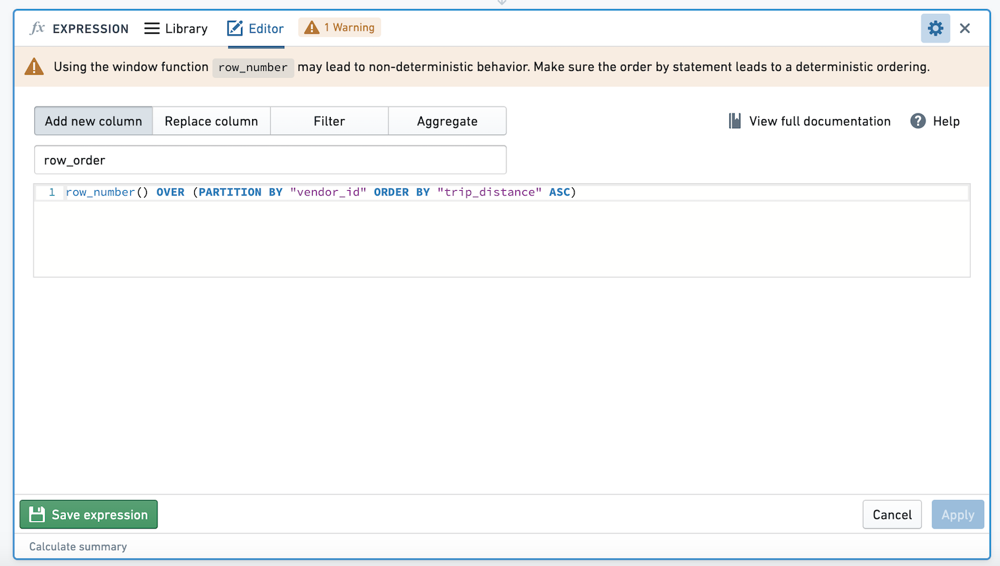
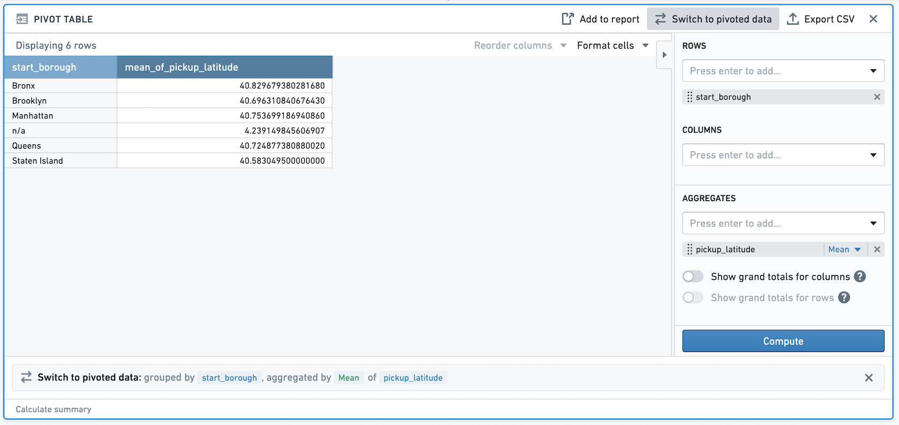
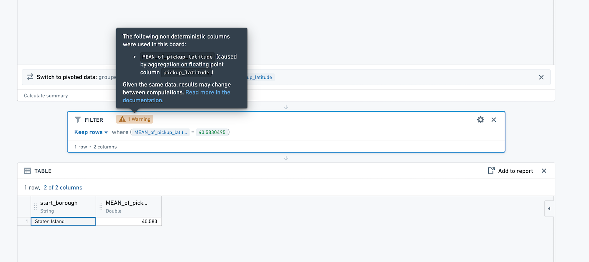

<!-- source: https://palantir.com/docs/foundry/contour/correctness-non-determinism/ · mirrored 2026-08-26 from Palantir Foundry docs -->

# Non-determinism in Contour

### Non-deterministic window functions

When using `ROW_NUMBER`, `FIRST`, `LAST`, `LEAD`, `LAG`, `NTILE`, `ARRAY_AGG`, or `ARRAY_AGG_DISTINCT` in a window function, be careful of nondeterminism. Imagine we are partitioning by column A and ordering by column B. If for the same value of column A, there are multiple rows with the same value of column B, the results of these window functions may be non-deterministic, meaning that they may produce different results given the same input data and logic.

When using these expressions in the expression board, you will be prompted with a warning to ensure that the `ORDER BY` clause in your window function is deterministic.

Consider the following example with data:

|name	|class	|grade	|
|---	|---	|---	|
|Aaron | Math | 95 |
|Burt  | Math | 95  |
|Chrissy | Math | 80 |
|Angelica | Science | 77 |
|Burt   | Science |81|
|Charlie | Science | 66 |

We want to rank students in each class by grade, so we add a new column `rank` with expression `ROW_NUMBER() OVER (PARTITION BY "class" ORDER BY "grade" DESC)`.

We receive this result:

|name	|class	|grade	| rank |
|---	|---	|---	|--- |
|Aaron | Math | 95 | 1 |
|Burt  | Math | 95  | 2 |
|Chrissy | Math | 80 | 3 |
|Angelica | Science | 77 | 2 |
|Burt   | Science |81| 1 |
|Charlie | Science |66 | 3 |

But some of the time, we receive this result:

|name	|class	|grade	| rank |
|---	|---	|---	|--- |
|Aaron | Math | 95 | 2 |
|Burt  | Math | 95  | 1 |
|Chrissy | Math | 80 | 3 |
|Angelica | Science | 77 | 2 |
|Burt   | Science |81| 1 |
|Charlie | Science | 66 | 3 |

Because Aaron and Burt have the same grade in Math, the `rank` column is nondeterministic. To make the column deterministic, we can add the "name" column to the order by clause in our expression: `ROW_NUMBER() OVER (PARTITION BY "class" ORDER BY "grade" DESC, "name" ASC)`. With this expression, we use the `name` column to tiebreak any rows that have the same grade, so we will always get the result below:

|name	|class	|grade	| rank |
|---	|---	|---	|--- |
|Aaron | Math | 95 | 1 |
|Burt  | Math | 95  | 2 |
|Chrissy | Math | 80 | 3 |
|Angelica | Science | 77 | 2 |
|Burt   | Science |81| 1 |
|Charlie | Science | 66 | 3 |

### Other non-deterministic functions

Other than the window functions outlined above, the functions `CURRENT_DATE`, `CURRENT_TIMESTAMP`, `CURRENT_UNIX_TIMESTAMP`, and `MONOTONICALLY_INCREASING_ID` are also non-deterministic.

For `CURRENT_DATE`, `CURRENT_TIMESTAMP`, and `CURRENT_UNIX_TIMESTAMP`, these values will be calculated only upon path update. For example, if you create a new column with `CURRENT_DATE` on day 1, and go back to the analysis on day 2, the new column will still reflect yesterday's date.

### Aggregation over double columns

Due to the distributed nature of Spark computations, the ordering of operands in arithmetic operations are non-deterministic (that is, 1+2 vs. 2+1). This non-deterministic ordering can lead to aggregations that create non-deterministic outputs when used with input type `double`. This means that aggregations over doubles may differ from one computation to another despite having the same inputs; these differences are very small, e.g. 0.000001.

For example, taking the `mean` or `variance` of a double column will result in a non-deterministic column. The results of performing an action on a non-determistic column (e.g. filtering) will also be non-deterministic.

Taking the `mean`, `sum`, `stddev`, `variance`, `corr`, or `sum_distinct` of a double column in your analysis will create a non-deterministic column.

Consider the following example:

Imagine you have double column `pickup_latitude`. In a pivot table, Contour takes the mean of the double column `pickup_latitude`. If you switch to pivoted data, this creates a non-deterministic column.

If you then filter on the newly created column, the result of this filter will be non-deterministic. For example, in the above screenshot, the mean `pickup_latitude` for Staten Island is 40.5830495. If we filter to that value, we see that one row remains.

However, if we recalculate this path, it is possible that the row will no longer appear after the filter, because the value of the mean has changed very slightly. **We recommend avoiding usage of exact filters on non-deterministic columns (e.g. filtering to mean = 40.5830495). We also recommend that you avoid using non-deterministic columns as join keys.**

When performing an action on a non-deterministic column in Contour (for example, filtering on that column), a warning will appear on the board where the action is performed. The warning states which aggregation is the source of the non-deterministic column.

### Diagnosing non-determinism

One sign that an analysis is non-deterministic is inconsistent row counts. For example, suppose you have an analysis in which you have inserted a Summary board, then performed a series of transformations that do not change the row count, and then added another Summary board. If the row counts of the two Summary boards do not match, you should investigate if there are non-deterministic operations in the path above. Look out for warning signs in the UI that warn when using a non-deterministic function, or using the aggregation of doubles.
