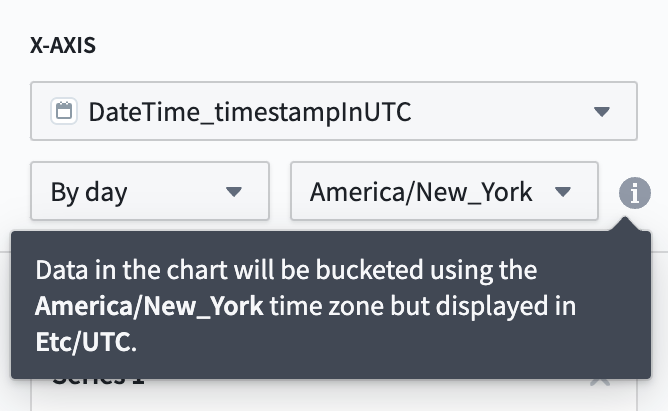
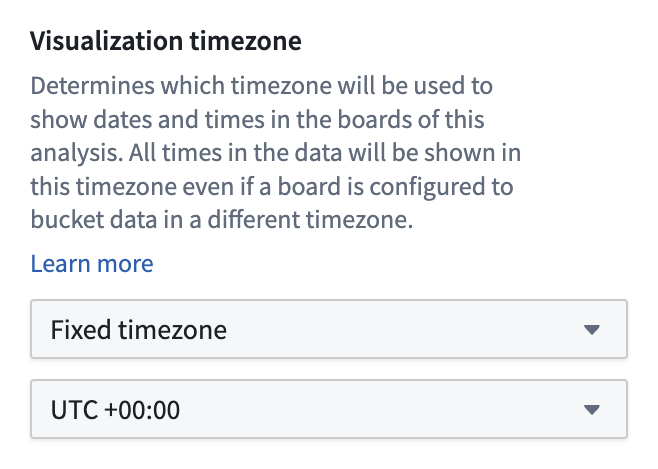
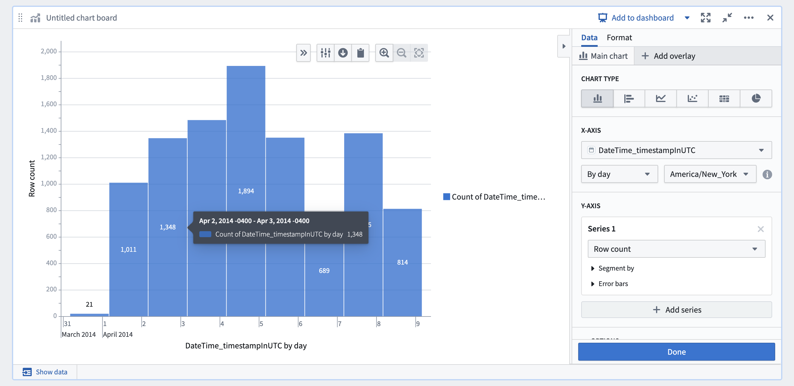

<!-- source: https://palantir.com/docs/foundry/contour/correctness-timezones/ · mirrored 2026-08-26 from Palantir Foundry docs -->

# Time zones in Contour

This page describes [time zone configurations](#time-zone-configurations) available for Contour, as well as Contour's [DateTime type](#datetime-type-in-contour).

## Time zone configurations

Contour has two different time zone configurations that affect how date times are displayed:

1. **Bucketing time zone (board-level setting):** Boards that allow users to group data by time (such as Chart, Histogram, or Time Series), require users to choose a time zone for the time column. This determines how the data is grouped. For example, if you choose the UTC time zone, then the data will be grouped by day starting and ending at midnight UTC. To ensure that boards show consistent data across users, this setting cannot be set to default to the user's local time zone and must be set to a fixed time zone. Below, an example of the configuration in the Chart board is presented. It states the data will be displayed in UTC, due to the **visualization time zone** configured for the analyses.   
      

2. **Visualization time zone (analysis-level setting):** This is the time zone used to visualize date times in the user interface. This setting affects how every board in the analysis displays data. For example, if a board is configured to bucket by day in UTC, and the analysis is configured to render time zones in UTC+5, then the board will show the day as appearing to start and end at 5:00 AM UTC+5. This setting, located in the **Data settings** section of the settings side panel, can be set to default to the user's local time zone so that each user viewing the analysis will view all date times in their own time zone. This setting can be found in the **Data settings** section of the settings side panel.   
      

   For example, in the chart board example above, the data is bucketed in EDT and the analysis is configured to show data in UTC. As such, the bars are bucketed in EDT but displayed in UTC, resulting in buckets that span from 8:00 PM to 8:00 PM the next day. If this analysis used **Local time zone** for the visualization time zone setting, then this chart would look slightly different for users in different time zones but the buckets would represent the exact same data.   
      

   Some older analyses may not have the visualization time zone setting configured. In this case, different boards will have different behaviors regarding what time zone date times are displayed in that board.

## DateTime type in Contour

You can create the `DateTime` type using the Mesa language, a proprietary Java-based DSL. When using this type in Contour, the `DateTime` type is automatically converted to a `timestamp` column, and an additional column is created to mark the original time zone.

For example, if you have the column `landing_datetime` in your original dataset, you will see two columns in Contour: `landing_datetime_timestampinUTC`, which represents the original `datetime` column as a `Timestamp` type, and `landing_datetime_originalTimezone`, which contains the original time zone of the column as a `String` type.
