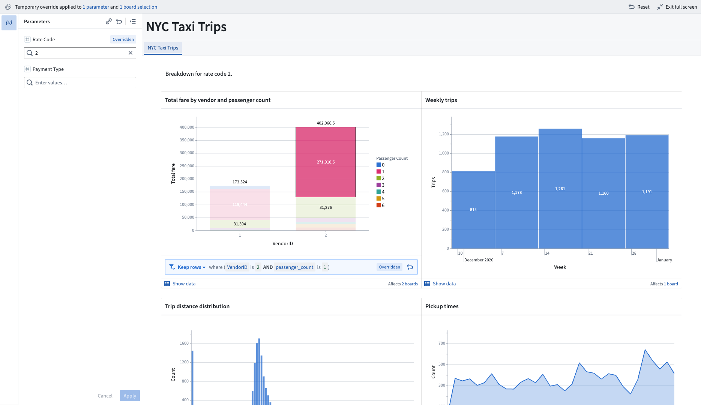

<!-- source: https://palantir.com/docs/foundry/contour/dashboards-overview/ · mirrored 2026-08-26 from Palantir Foundry docs -->

# Dashboards

You can present your analysis findings using Contour Dashboard mode. Key functionality for Dashboard mode includes chart-to-chart filtering, inline parameter references, a fullscreen presentation view, and PDF exports.

[Learn more about other options for dashboards based on analysis content.](/docs/foundry/analytics/dashboards/)

