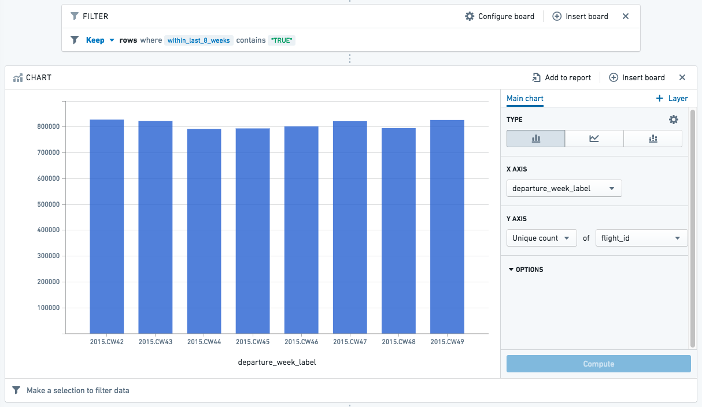

<!-- source: https://palantir.com/docs/foundry/contour/expressions-relative-dates/ · mirrored 2026-08-26 from Palantir Foundry docs -->

# Derive relative dates

This guide will show you how to use Contour’s expression language to derive relative dates from your dataset.

In this case, we want to look at dates *grouped by calendar week*, and see rows that fall within the eight preceding weeks (i.e. *not* including the current calendar week).

To get there, we will derive a few intermediate columns:

* **departure\_week:** determine the calendar week — which week of the year (1-52) this date falls on
* **departure\_year\_week\_as\_integer:** create an integer that is the year plus the calendar week (for example, “201501” is the first week of 2015)
* **latest\_calendar\_week:** find the most recent week in your dataset

And finally get to the column of interest:

* **within\_last\_8\_weeks:** compare each date to **latest\_calendar\_week** to determine whether it falls within the eight preceding weeks (return true or false)

We will also derive a label column that can be used in charts to display the year and calendar week nicely: **departure\_week\_label**.

:::callout{theme="neutral"}
There are simpler ways to calculate a straightforward “falls within the last eight weeks,” but this guide is intended to give as many examples as possible (and to show how you might use Contour to conform to explicit requirements).
:::

## Deriving relative dates

Start with a dataset that has a date column. This example uses a column called **departure\_date\_time** in the original dataset. You can change the column names as appropriate to your dataset.

You may want to filter down to a range of a few months for faster loading. Then, click **Table** to open the table view.
In the table editing view, click **Expression** to derive each new column.

:::callout{theme="success" title="Tip"}
Alternatively, you can add expression boards directly from the path, without navigating to the table view.
:::

### departure\_week

Name the first column **departure\_week**.

Use the `week_of_year` function to determine the week of the year for each date in the **departure\_date\_time** column. For weeks 1-9, use case statements to format the numbers with a 0 in front. The final column expression should look like this:

```sql
CASE week_of_year("departure_date_time")
WHEN 1 THEN '01'
WHEN 2 THEN '02'
WHEN 3 THEN '03'
WHEN 4 THEN '04'
WHEN 5 THEN '05'
WHEN 6 THEN '06'
WHEN 7 THEN '07'
WHEN 8 THEN '08'
WHEN 9 THEN '09'
ELSE CAST (week_of_year("departure_date_time") AS STRING)
END
```

:::callout{theme="success" title="Tip"}
You can also simplify the above by using the left padding (`lpad`) function instead of case statements: `lpad(week_of_year("departure_date_time"), 2, '0')`. This will add a zero to the left of any value that needs it to ensure that every value has a total of two digits.
:::

### departure\_year\_week\_as\_integer

In this column, concatenate the year to the value in the **departure\_week** column just derived.

Use the year function to extract the year from each date in the **departure\_date\_time** column. Then add the **departure\_week** column to the result, using || characters to concatenate them. Finally, cast the resulting value as an integer.
The final column expression should look like this:

```
CAST (year("departure_date_time")||"departure_week" AS INTEGER)
```

### latest\_calendar\_week

Now find the maximum value in the column just created — the maximum value should be the latest week in the data. (This example assumes that the data is updated regularly, so “latest week in the data” is roughly equivalent to the current week.)

The syntax is a window function. If you are interested in learning more about window functions, you can read the [SQL documentation ↗](https://www.postgresql.org/docs/current/static/tutorial-window.html) or see the [Window Functions documentation](/docs/foundry/contour/expressions-window-functions/); otherwise, simply copy the function:

```
max("departure_year_week_as_integer") OVER ()
```

This will create a column that is simply the maximum value of the range, so it will be the same in every row.

### within\_last\_8\_weeks

To derive this column, use a couple comparison statements to check whether the date falls within the eight weeks before the latest week of data. If it does, use TRUE for the value of that row. Otherwise, FALSE.

```sql
CASE 
    WHEN ("departure_year_week_as_integer" < "latest_calendar_week") 
    AND ("departure_year_week_as_integer" > ("latest_calendar_week" - 9)) 
    THEN TRUE
    ELSE FALSE
END
```

### departure\_week\_label

This column simply presents the year and calendar week nicely as a string, to use in labeling charts. Use the year function to extract the year from each date, then add “.CW” and the calendar week.

```sql
year("departure_date_time") || '.CW' || "calendar_week"
```

Now that we have all the derived columns, click **Table** to exit the table view (or simply carry on in your analysis if you added expression boards directly to the path).

## Using relative dates in charts

You can use a filter to keep only rows where **within\_last\_8\_weeks** is true, then create a chart with the filtered dataset.
The following chart uses the **departure\_week\_label** to show the number of unique flights per week for the last eight weeks before the current date:



You can add this chart to a report, and refer to the chart regularly for an updated view of the past couple months.
