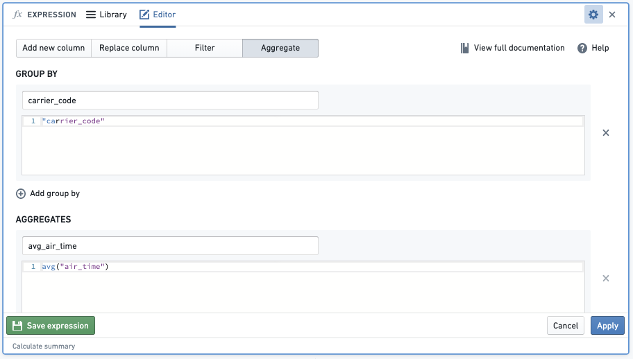
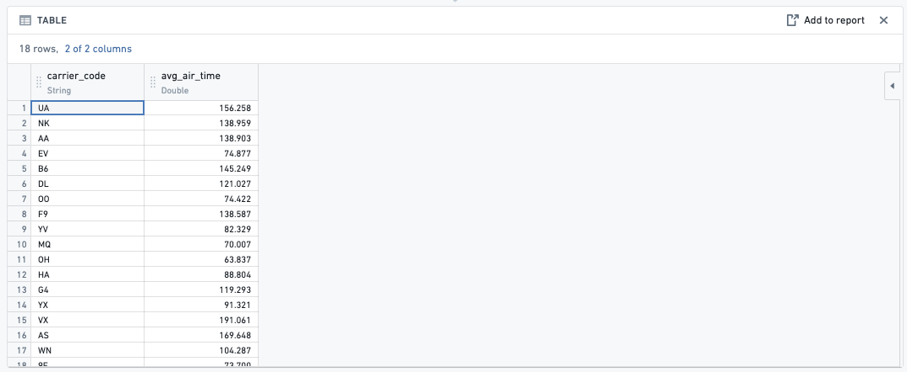
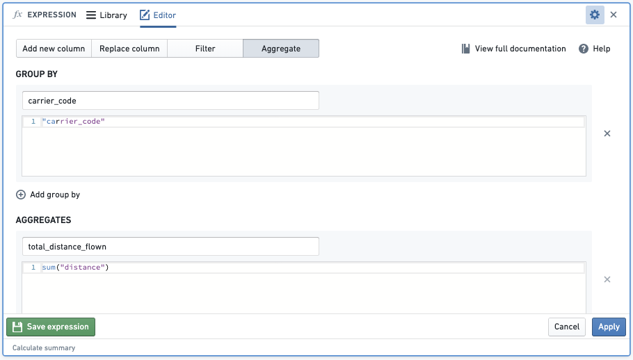
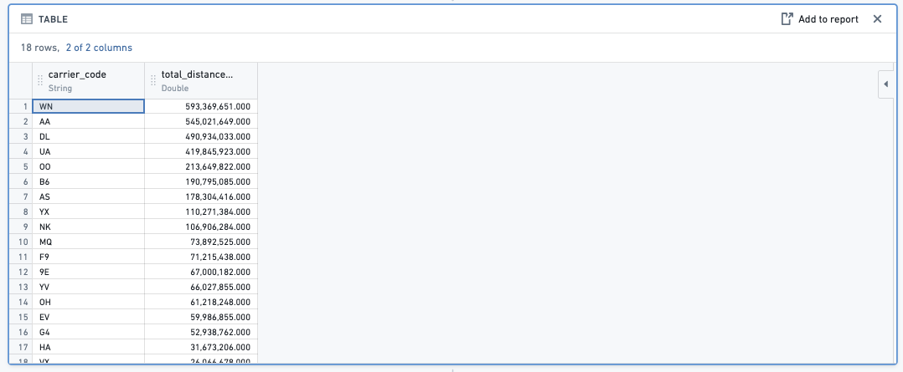
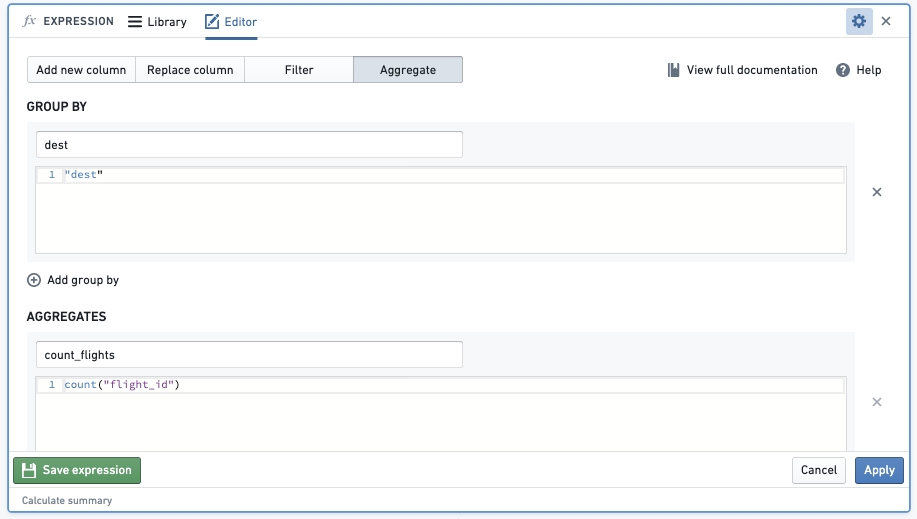
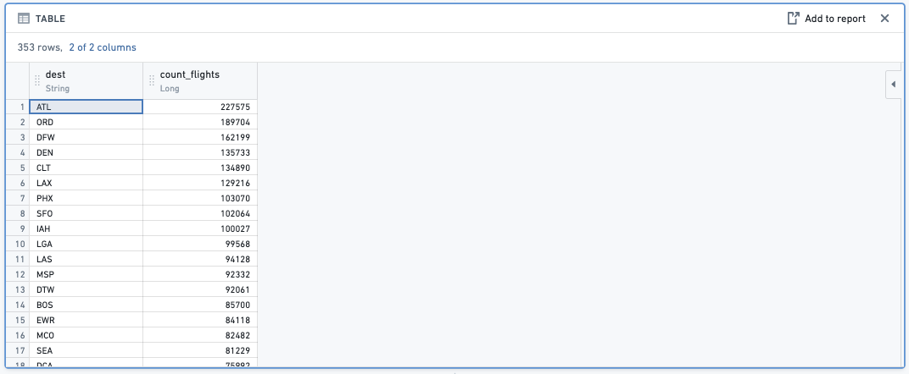
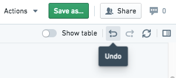

<!-- source: https://palantir.com/docs/foundry/contour/faq/ · mirrored 2026-08-26 from Palantir Foundry docs -->

# Contour FAQ

The following are a few frequently asked questions about Contour.
For general information, view our [Contour documentation](/docs/foundry/contour/overview/).

* [How do I start a new analysis?](#how-do-i-start-a-new-analysis)
* [How do I look for relevant data in the platform?](#how-do-i-look-for-relevant-data-in-the-platform)
* [How do I share an analysis with a coworker?](#how-do-i-share-an-analysis-with-a-coworker)
* [How do I create an initial dataset on which to perform an analysis?](#how-do-i-create-an-initial-dataset-on-which-to-perform-an-analysis)
* [How do I change the view of my analysis?](#how-do-i-change-the-view-of-my-analysis)
* [How do I apply a calculation?](#how-do-i-apply-a-calculation)
* [What are common Microsoft Excel analysis equivalents in Foundry?](#what-are-common-microsoft-excel-analysis-equivalents-in-foundry)
* [How do I create a pivot table?](#how-do-i-create-a-pivot-table)
* [How do I apply a function across an entire series of data?](#how-do-i-apply-a-function-across-an-entire-series-of-data)
* [What are common Microsoft Excel aggregate equivalents in Foundry?](#what-are-common-microsoft-excel-aggregate-equivalents-in-foundry)
* [What are some ways to check my analysis?](#what-are-some-ways-to-check-my-analysis)
* [What is the difference between saving a dataset in Contour and creating one in Code Repositories or Code Workbook?](#what-is-the-difference-between-saving-a-dataset-in-contour-and-creating-one-in-code-repositories-or-code-workbook)
* [When I attempt to export it gives me a 100,000 row limit. Is this correct?](#when-i-attempt-to-export-it-gives-me-a-100000-row-limit-is-this-correct)
* [Can I automatically update a Contour analysis path?](#can-i-automatically-update-a-contour-analysis-path)
* [Can I revert changes to my Contour analysis?](#can-i-revert-changes-to-my-contour-analysis)
* [When I try to duplicate my analysis, I just see a spinner and nothing happens. What do I do?](#when-i-try-to-duplicate-my-analysis-i-just-see-a-spinner-and-nothing-happens-what-do-i-do)
* [Unable to build dataset from Contour](#unable-to-build-dataset-from-contour)
* [Pivot Table not showing all data](#pivot-table-not-showing-all-data)
* [Duplicate column found in pivot table](#duplicate-column-found-in-pivot-table)
* [General performance issues](#general-performance-issues)
* [`count_distinct()` fails in a window function in the expression board](#count_distinct-fails-in-a-window-function-in-the-expression-board)

***

## How do I start a new analysis?

In Foundry, every user has their own folder called **Your files**. This is a folder where users can prototype with data and share their results with other users. Inside the folder, users can create their first analysis:

1. Navigate to the **Files** section on your workspace navigation bar.
2. Navigate to the **Your files** tab.
3. Create a new analysis by selecting **+New** and selecting **Analysis** from the dropdown menu.
4. Select **+Create a new path** after your new analysis generates.
5. Select the dataset that you would like to analyze in the corresponding folder.

[Return to top](#contour-faq)

***

## How do I look for relevant data in the platform?

There are two primary methods for discovering data:

* **Search:** Foundry has a platform-wide search tool located in the workspace sidebar on the left side of the page. This tool will search all resources in the platform and is an excellent method for finding data when you know the name of the dataset. Note that the search tool can be used to find any resource in the platform, including spreadsheets, Contour analyses, and code workbooks.

* **Data Catalog:** The Foundry **Data catalog** contains cleaned, curated datasets, ready for consumption by business analysts and data scientists. The **Data Catalog** is an excellent starting point if you are curious about what data already exists in the platform and can be accessed directly from the homepage. You can come back to the homepage by selecting **Home** in the workspace sidebar.

[Return to top](#contour-faq)

***

## How do I share an analysis with a coworker?

Sharing a resource with a coworker means they must have access to the Project you are working in. Select **Share** and send a sharing URL or add your coworker directly to the resource to automatically notify them. If your coworker receives a **Permission denied** error, they will need to request access. Once your coworker's access to the Project has been approved, they will be able to see the analysis you shared with them over email.

[Return to top](#contour-faq)

***

## How do I create an initial dataset on which to perform an analysis?

Given the data is often available in its raw form within the Foundry platform, it is important to know how to filter it before you begin creating your analysis. Data filtering will allow you to focus on the elements that are important for your analysis without getting distracted by irrelevant data.

* **Sort and filter: Histogram data filtering:**
  * In Foundry, sort and filter is one of the most commonly-used features.  You can view all the different options in a given column with a histogram board and then select the specific categories that you want to work with.
* **Attribute data filtering:**
  * Use **KEEP** if you want to filter down to only data that meet the set criteria.
  * Use **REMOVE** if you want to **exclude** only data that meet the set criteria.
* **Multiple data filters:**
  * Use **AND MATCHING** if you want to filter to data that meet multiple conditions at the same time.
  * Use **OR MATCHING** if you want to filter to data that meet multiple conditions but not necessarily at the same time/within the same row of data.
* **Adjusting filters:**
  * When a user creates a new analysis for a specific filter (for example, `carrier_code` = `DL`), other users can easily replicate their analysis by changing the filter to their use case (for example, `carrier_code` = `UA`) or removing the filter altogether to get a global analysis.

Analytical operations are applied to an entire column by default, to facilitate analysis of large datasets. If you would like to run an analysis on a smaller selection of rows (similar to selecting a specific cell range in Excel), filter the data down to the desired rows before applying the operations.

To see more filtering options, review our [filter data](/docs/foundry/contour/boards-filter/) documentation.

[Return to top](#contour-faq)

***

## How do I change the view of my analysis?

There are four options available to change the view of your analysis. You can perform the following:

* **SORT** columns by ascending or descending order

* **REORDER** columns

* **REMOVE** columns

* **ADD** columns: See the **VLOOKUP** section in [common Excel analysis equivalents in Foundry](#what-are-common-microsoft-excel-analysis-equivalents-in-foundry)

* Create an automated Notepad document: You have the option to add your Contour analysis outputs into an automated [Notepad](/docs/foundry/notepad/overview/) to present your data in executive summaries. This report will change based on the refreshed data in Foundry, removing any need to recreate the same report.

[Return to top](#contour-faq)

***

### How do I apply a calculation?

To perform a new calculation in Contour you need to select **Add a Column** in an expression board. However, instead of cell-level operations, Foundry operates on column-level operations. Instead of a formula multiplying `A1` \* `B1` to return to cell `C1`, Foundry will multiply `column1` \* `column2` (multiplying every corresponding row-level entry in `column1` and `column2`) to return `column3`.

[Return to top](#contour-faq)

***

## What are common Microsoft Excel analysis equivalents in Foundry?

Below are some of the most common Microsoft Excel functions and their expression equivalents in Contour. You can apply these calculations in the same way as discussed in [How do I apply a calculation?](#how-do-i-apply-a-calculation).

* **Excel: IF(logical\_test, value\_if\_true, \[value\_if\_false])**
  * **Foundry:**
    ```
    CASE
        WHEN logical_test THEN value_if_true
        ELSE value_if_false
    END
    ```
  * Example: If I want to create a column that returns `yes` if the flight starts in `JFK` and `no` if otherwise, the expression will look like:
    ```
    CASE
        WHEN "origin" = 'JFK' THEN 'yes'
        ELSE 'no'
    END
    ```

* **Excel: CONCAT(cell1, \[cell2],…)**
  * **Foundry:** `CONCAT("col1", ["col2"],...)`
  * Example: If I want to create a column with a unique key for each order by concatenating `timestamp` and `order_ID_number` columns, the expression will look like:
    * `CONCAT("timestamp","order_ID_number")`

* **Excel: VALUE(text)**
  * **Foundry:** `CAST("col1" AS DOUBLE)`
  * Note: You can convert your column datatype to a `STRING`, `INTEGER`, `BOOLEAN`, `DATE`, `TIMESTAMP`, or `LONG` by replacing the `DOUBLE` type in the expression
  * Example: If I want to be able to perform multiplication on some columns but one of the necessary columns `cost` is classified as a string, the expression will look like:
    * `CAST("cost" AS DOUBLE)`

* **Excel: LEFT(text, \[num\_chars])**
  * **Foundry:** `SUBSTRING("col1", num2, num3)`
  * Note: `num2` is the start index and `num3` is the length of the substring
  * Example: If I want to extract the letters in the brackets from a column of `airport_display_name` such as `[ALB] Albany International + Albany, NY`, `[AZA] Phoenix - Mesa Gateway + Phoenix, AZ`, `[CLT] Charlotte Douglas International + Charlotte, NC`, the expression will look like:
    * `SUBSTRING("airport_display_name", 2, 3)` and would return a column with `ALB`, `AZA`, and `CLT`.

Read [the expression board](/docs/foundry/contour/expressions-use-board/) and [support expression syntax](/docs/foundry/contour/expressions-syntax/) documentation for more information.

* **Excel: VLOOKUP(value, table, col\_index, \[range\_lookup]) & ADD in columns from other datasets**
  * **Foundry:** **JOIN** board.
  * The join board lets you join your current working dataset to another dataset and merge the matching results into your data.
    Example: You are working with the dataset `flights` and you would like to add the column `manufacturer` and `number_of_seats` from the `aircraft` dataset.

FLIGHTS DATASET EXAMPLE

|flight\_id |date    |origin  |tail\_num   |
|---    |---    |---    |---    |
|999    |2018-04-01  |LAS |N227FR    |
|---    |---    |---    |---    |
|997    |2018-07-27  |MIA |N303FR    |
|   |   |   |…  |

AIRCRAFT DATASET EXAMPLE

|tail\_number |manufacturer   |number\_of\_seats   |
|---    |---    |---    |
|N303FR    |Airbus   |186    |
|---    |---    |---    |
|N227FR    |Airbus   |180    |
|…  |   |   |

You could use the join board to enrich your `flights` dataset with columns `manufacturer` and `number_of_seats` from the `aircraft` dataset. Since both datasets share a column referencing the tail number, we can use this column to join on. If your datasets have columns with the same name that are not join keys, Contour will prompt you to add a prefix to the column names. Then, fill out the following fields:

1. Choose a join type to perform: left join (`Add columns`), inner join (`Intersection`), right join (`Switch to dataset`) or full join.
2. Choose which columns from the other dataset to add to your current working set. By default, all columns from both sets are returned.
3. Choose one or more keys from each set. If you use multiple join keys, you can choose to `Match Any` or `Match All` conditions.

### Enriched dataset example

Your enriched dataset will look like this:

|flight\_id   |date |origin    |tail\_num  |manufacturer   |number\_of\_seats   |
|---    |---    |---    |---    |---    |---    |
|999    |2018-04-01    |LAS  |N227FR |Airbus    |186   |
|---    |---    |---    |---    |---    |---    |
|997    |2018-07-27    |MIA  |N303FR |Airbus    |180   |

[Return to top](#contour-faq)

***

## How do I create a pivot table?

You can quickly compute multiple aggregate values of your data across multiple dimensions through a **pivot table** board.

To interact with the entirety of pivoted data, use the **Switch to pivoted data** option on the board which will transition your Contour analysis to the fully-computed pivoted data for all boards beneath the pivot table board.

[Return to top](#contour-faq)

***

## How do I apply a function across an entire series of data?

You can do this in Foundry with the **Aggregate** option in the **expression** board. Note that instead of range-level operations that you can select in another spreadsheet software, Foundry operates on column-level operations, so your columns will need to be properly filtered to the rows that you are interested in.

* Function:



* Result:



[Return to top](#contour-faq)

***

## What are common Microsoft Excel aggregate equivalents in Foundry?

Below are some of the most common Excel aggregate functions and the Contour expression equivalents. You can apply these calculations in the same way as displayed in the [How do I apply a function across an entire series of data?](#how-do-i-apply-a-function-across-an-entire-series-of-data) question.

* **SUM():** When you aggregate with the sum function, this will sum the values of an aggregate column across specified column groupings.
  * Example: Find the `total_distance_flown` of each airline (`carrier_code`)
    * Function:
      <br/>



```
    - Result:
```

<br/>


* **COUNT():** When you aggregate with the count function, this will count the number of entries of an aggregate column across specified column groupings.
  * Example: Find the number of flights by `carrier_code` by aggregating the count of total `flight_id`

  * Function:
    

  * Result:
    

* **AVG():** When you aggregate with the avg function, this will average, for example, the `air_time` of each `carrier_code`.

* **MAX():** When you aggregate with the max function, this will find the maximum, for example, of the `air_time` of each `carrier_code`.

* **MIN():** When you aggregate with the min function, this will find the minimum, for example, of the `air_time` of each `carrier_code`.

[Return to top](#contour-faq)

***

## What are some ways to check my analysis?

You can add another board to check your resulting dataset.

* **Table board:** By inserting a **table** board after an analysis, you are able to quickly check to see if the new columns that you added were right or if the logic of a previous board resulted in the intended outcome.

* **Histogram board:** By inserting a **histogram** board after an analysis, you are provided with a quick overview of the different data categories to give a general sense of the data or if the filtered categories are correct.

[Return to top](#contour-faq)

***

## What is the difference between saving a dataset in Contour and creating one in Code Repositories or Code Workbook?

The process of saving a dataset from a Contour analysis is largely the same as creating a dataset from a code repository or Code Workbook - the logic is translated into a series of Spark transformations, executed across the cluster, and saved into a dataset that is stored in a distributed file system. There is no row limit restriction when saving an analysis as a new dataset. That said, the greater the scale of the data, the longer it will take to save, as underlying computation will be more computationally expensive. Note that there are, however, row limits when exporting data from Contour, which is distinct from saving a path as a dataset.

[Return to top](#contour-faq)

***

## When I attempt to export it gives me a 100,000 row limit. Is this correct?

Yes, that is correct. There is a 100K row export limit from Contour. If you need to export more than that, you can save the result of Contour as a dataset, and then download it from the **Actions** dropdown on that **Dataset preview** page.

The limits for both Contour export and dataset downloads may differ between Foundry enrollments based on partner requirements.

[Return to top](#contour-faq)

***

## Can I automatically update a Contour analysis path?

At this time, there is no way to automatically update a Contour analysis path; this must be completed manually. However, it is possible to set a schedule for the resulting dataset of the analysis. Once you have saved the dataset, you can then open the dataset preview and, from the **Actions** dropdown menu, choose **Manage schedules**. The resulting dataset will then build based on the way you have configured the schedule.

[Return to top](#contour-faq)

***

## Can I revert changes to my Contour analysis?

Yes, you can revert changes by selecting **Undo** in the top right corner of your screen.



[Return to top](#contour-faq)

***

## When I try to duplicate my analysis, I just see a spinner and nothing happens. What do I do?

This may happen when your analysis has too many paths. Try deleting unnecessary paths and duplicating again.

Review the section on [general performance issues](#general-performance-issues) for more information.

[Return to top](#contour-faq)

***

## Unable to build dataset from Contour

I am receiving an error message when building a dataset from Contour.

Refer to our guidance on [builds and checks errors](/docs/foundry/health-checks/builds-checks-faq/) for more information.

[Return to top](#contour-faq)

***

## Pivot table not showing all data

Pivot table previews do not show all the data within the table. The pivot table calculates aggregates over the *entire* dataset, and reduces the output to the first 100 columns or 10,000 values to prevent slow browser performance. To get the definitive answer for these large pivot tables, you will need to **Switch to pivoted data**. You can read more about this in the [pivot table documentation](/docs/foundry/contour/boards-descriptions/#pivot-table).

To troubleshoot, perform the following steps:

1. Try **Switching to pivoted data**, which will force Contour to compute the entirety of the dataset.
2. View the data in a table board. Note that the pivot board will remain incomplete.
3. If possible, insert a filter board above your pivot table to trim down the data you are passing through (this should also improve performance overall), but, again it does not change the fact that the pivot table board will only compute over the first 10,000 cells of the pivot table (for performance reasons).
4. To get a complete export, select **Switch to pivoted data**, then use an export board or use the export option from the end of the current path.

[Return to top](#contour-faq)

***

## Duplicate column found in pivot table

My pivot table fails to compute due to a duplicate column. This is generally because there are column names that are equivalent apart from casing.

To troubleshoot, perform the following steps:

1. Check if any of the columns in the columns section of your pivot table contain values that are the same apart from casing (for example, `Test` and `test`). Foundry dataset column names are case-insensitive, so when the column is pivoted, the columns `Test` and `test` are considered duplicates.
2. Map any such values to a single casing so that when the column is pivoted there are no collisions.

[Return to top](#contour-faq)

***

## General performance issues

Your Contour is slow, and you would like to figure out what is causing the decreased performance.

To troubleshoot, perform the following steps:

1. First, check to determine whether the input datasets used in your analysis are using Parquet or Avro files; if not, ensure that you are working on an appropriate, clean version of the dataset.

2. Check if you are using a raw, ingested version of a dataset that is stored as a CSV file, which is non-performant. This is the most frequent cause of this issue.

3. Check the partitions of your input dataset(s). If datasets used in your analysis are poorly partitioned, then this will result in slower performance.

4. To check the size of files in your input datasets go to **Dataset → Details → Files → Dataset Files**.

5. The files should be at least 128 MB each. If they are too small, or much too large, you will need to re-partition them.

6. If you have a very long path, then you should materialize intermediate datasets and create new paths that begin with these newly materialized datasets. This will reduce redundancy in logic execution as each board executes the full query path required to create the board (such as the transformation logic used, if any, in all previous boards).

7. Consider reducing the number of paths that you have in an analysis. This can slow down the browser performance specifically when using the path overview screen.

For further reading, review our [Contour analysis performance optimization](/docs/foundry/contour/performance-optimize/) documentation.

[Return to top](#contour-faq)

***

## `count_distinct()` fails in a window function in the expression board

The `count_distinct()` function is not available inside window functions due a limitation in Spark. Review [official Spark documentation ↗](https://issues.apache.org/jira/browse/SPARK-22234).

You can potentially achieve the same thing (depending on the window logic you are looking to use) in the pivot table board, which offers a unique count aggregation option. You can define your "window" as the rows/column combinations and then generate a unique count for each intersection.

[Return to top](#contour-faq)
