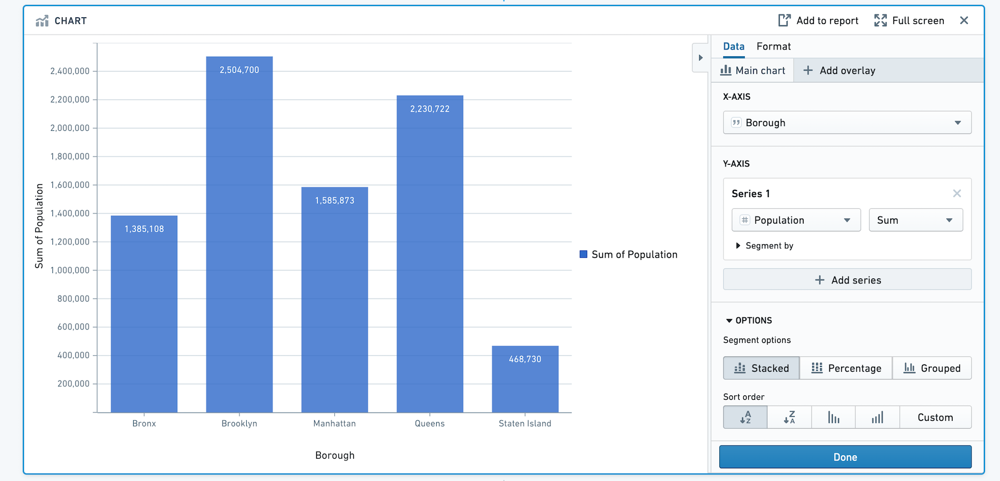
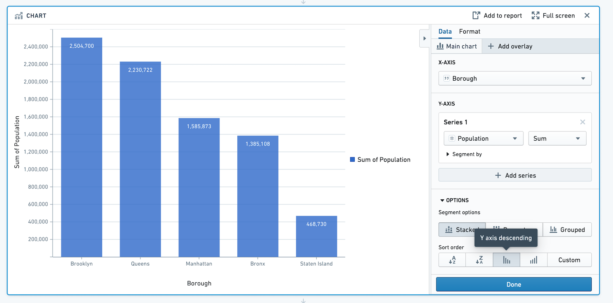
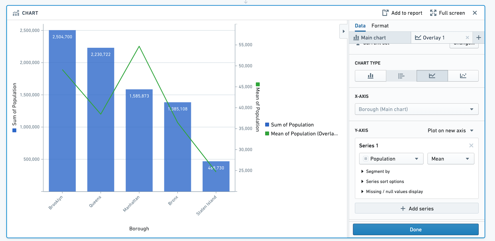
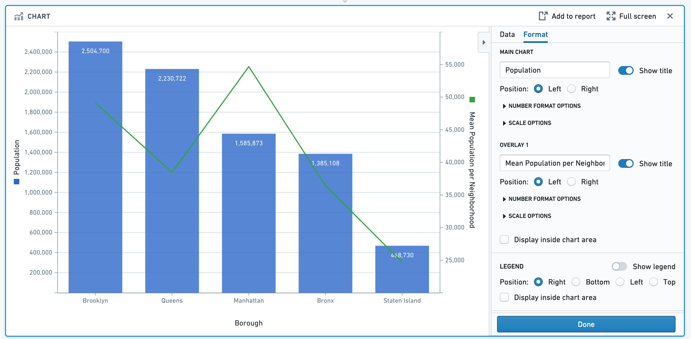
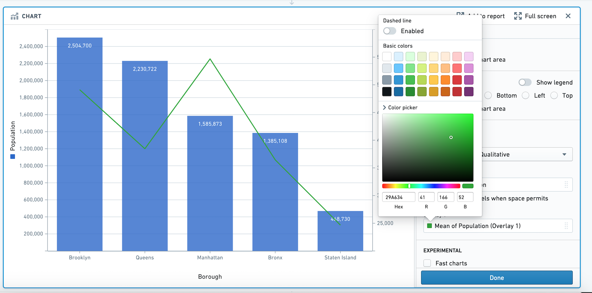
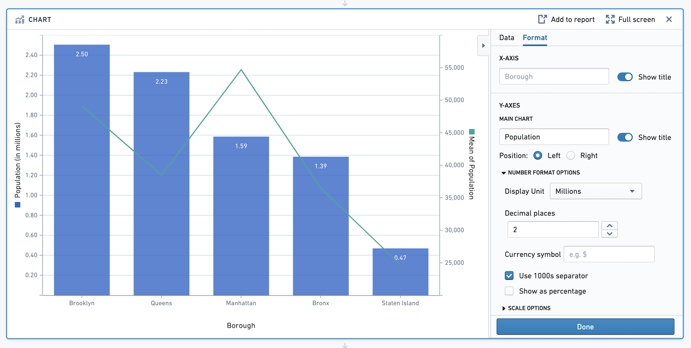
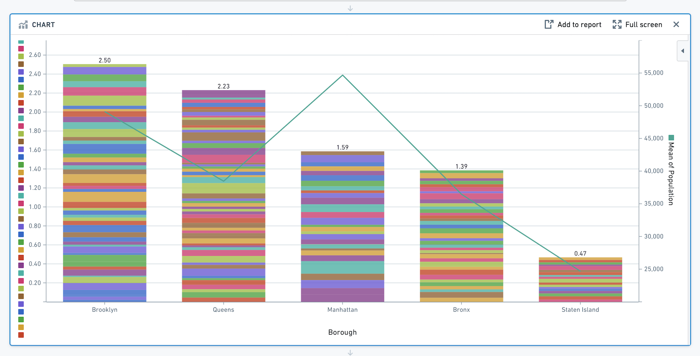
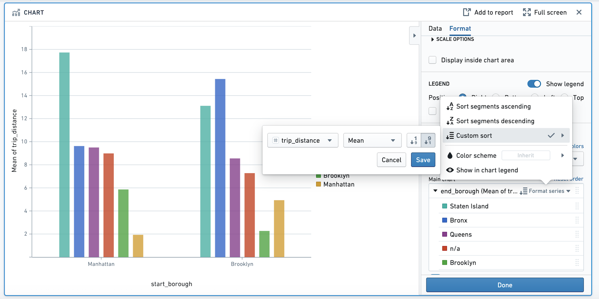
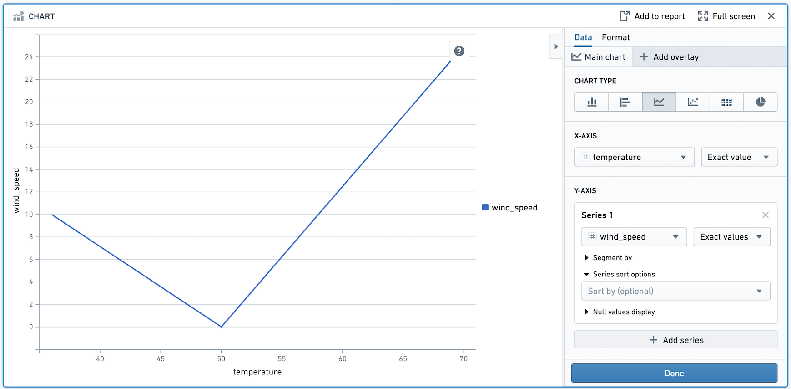
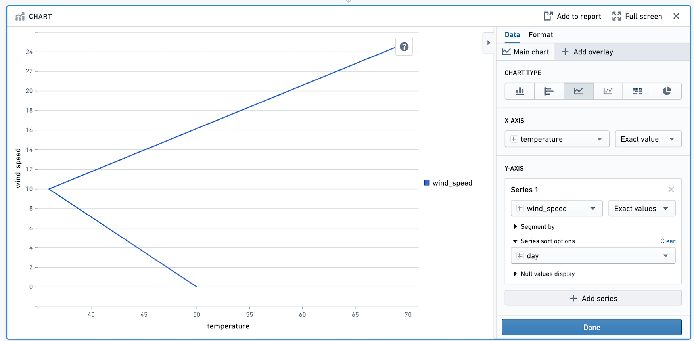

<!-- source: https://palantir.com/docs/foundry/contour/getting-started/ · mirrored 2026-08-26 from Palantir Foundry docs -->

# Getting started

This tutorial walks through how you can use Contour to go from a spreadsheet of raw data to charts that reveal insights into the data.

## About the dataset

This tutorial uses data about neighborhoods in New York City from the [2010 U.S. Census ↗](https://data.cityofnewyork.us). Follow along with this sample dataset: [`Download nyc_population_by_neighborhood dataset`](/docs/resources/foundry/contour/getting-started-nyc_population_by_neighborhood.csv)

Each row in the dataset is a neighborhood in New York City, with information about its Borough, Population, NTA\_Name (neighborhood name), and FIPS\_County\_Code (county code).

After downloading this dataset, drag and drop it into Foundry to create a dataset. Then, click **Analyze** to start a Contour analysis.

***

## Building a chart

First, we will visualize the population in each borough of New York City. We can do this by adding a bar chart with X-axis Borough, and Y-axis the sum of Population.

To sort the bars in descending order of population, scroll to **Options** and choose **Y axis descending** for Sort Order.

***

## Adding an overlay

In addition to information about total population of the borough, you can overlay the average population in each neighborhood as a line. This provides a sense of population density in the boroughs.

Add an overlay by clicking **+ Add overlay** and selecting a line chart. You can plot this line chart on a new axis.

Based on this chart we can see that although Manhattan has the third highest population out of the five boroughs, the mean population per neighborhood in Manhattan is about 55,000 people per neighborhood which is more than any other borough.

***

## Formatting the chart

Now that we have created the chart, we can change the titles, colors, and number formatting.

Click on the **Format** tab. Change the left Y-axis title from **Sum of Population** to **Population**, and the right Y-axis title from **Mean of Population** to **Mean of Population per Neighborhood**. Then, toggle off the legend. In this section, you can also choose Number Format options and Scale options.

Next, use the color picker to choose a different color for the overlay line. Click on the green square below the label **Overlay 1**, and expand the color picker section. In this popover, you can also choose to make the line dashed.

Next, change the Display Units on the Y-axis. The goal is to view the population per Borough in millions. In the format tab under **Number Format Options**, change the **Display Unit** to Millions and specify 2 decimal places. After recomputing, note that the Y-axis title is now "Population (in millions)". This is only a formatting change: all underlying data remains the same.

***

## Segmenting your data

We want to investigate the specific neighborhoods that make up each borough's population. To view the population for each neighborhood and see how it contributes toward the sum for its borough, add the neighborhood as a segment in the **Main Chart** tab. Your chart will now look like this:

Congratulations - you have successfully made a chart using Contour.

***

## Other tips for working with charts

### Overlays

Note that *only the main chart layer is part of the data path*. The other layers are solely for presentation purposes. In other words, making a selection or otherwise manipulating the data on an overlay layer will not affect the data downstream in your path.

### Sorting the segments in your series

When you have segmented your series, you can reorder the segments in the series in the **Format** tab. Scroll down and click on the **Format Series** popover. You can choose to sort the segments in ascending or descending order, or a custom sort based on another column. Or, use the drag handles next to each segment name to manually reorder them.

In the below image, we are visualizing the average trip distance for taxi trips between the `start_borough` of a taxi trip, and the `end_borough`. In the example, the segments (`end_borough`) are sorted by the average trip distance so that the `end_borough` with the highest average trip distance appears to the left.

### Advanced: Line chart series sort

You may want to control the order in which points in your line chart are plotted. For example, imagine we want to plot the temperature and wind speed at a location over time. Our data looks as below:

|day	|temperature	|wind\_speed	|
|---    |---	        |---	    |
|1	    |50	            |0	        |
|2	    |36	            |10	        |
|3      |70	            |25	        |

Make a line chart with temperature on the X-axis and wind speed on the Y-axis.

Above, the points are drawn from left to right. We want the points to be drawn in chronological order. To do that, add `day` in the **Series Sort Options**.

The points in this chart are now drawn in order of day.
