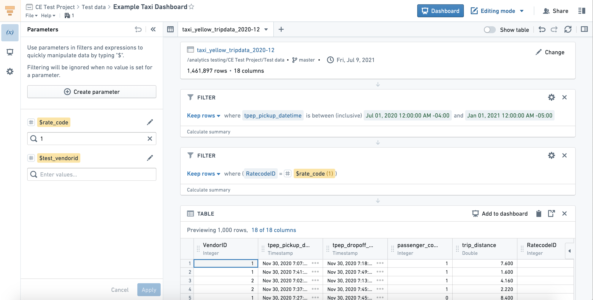

<!-- source: https://palantir.com/docs/foundry/contour/overview/ · mirrored 2026-08-26 from Palantir Foundry docs -->

# Contour

Contour provides a point-and-click user interface to perform data analysis on tables at scale. These analyses can be used to create interactive [dashboards](/docs/foundry/contour/dashboards-overview/) that allow others to explore and investigate the data in a guided, structured way.

## Key features

Contour enables you to:

* Visualize, filter, and transform data without code.
* Organize complex analyses into analytical paths.
* Parameterize analyses to easily switch between different views of the data and results.
* Create interactive dashboards to share findings.
* Save analysis results as a new dataset for use in other Foundry tools.
* Leverage Contour's [expression language](/docs/foundry/contour/expressions-overview/) for more advanced transformations and aggregations.

## When to use Contour

Contour is a good fit for analytical use cases where:

* **Some or all of the data you want to use is not mapped in the Ontology.** In general, we recommend using the [Ontology layer](/docs/foundry/ontology/overview/) whenever possible, but there are some cases where this may not be appropriate (such as a one-time upload that will not be cleaned or reused).
* **You need to operate on a very large dataset.** For instance, performing joins on over 100,000 objects or aggregations on over 50,000 rows.
* **You want to share your analysis results as a new dataset for use in other Foundry tools.** [Learn more about saving results as a dataset.](/docs/foundry/analytics/datasets-object-sets/)

[Learn more about other tools available for point-and-click analysis and when to use each.](/docs/foundry/analytics/types-of-analysis/)

:::callout{theme="success" title="Palantir Learning portal"}
For a deep dive into data analysis in Contour, visit [learn.palantir.com ↗](https://learn.palantir.com/deep-dive-data-analysis-in-contour).
:::
