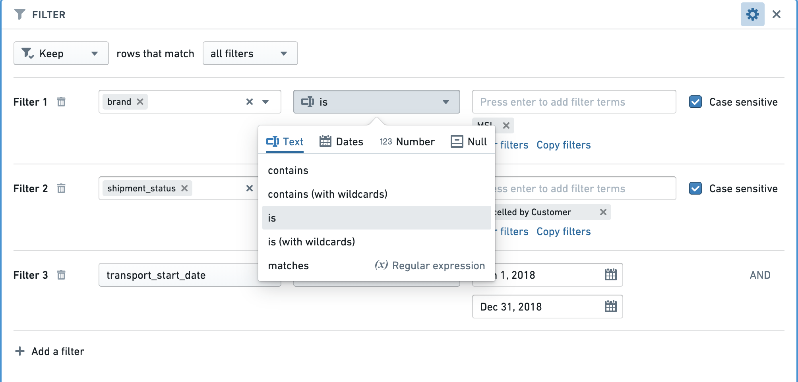
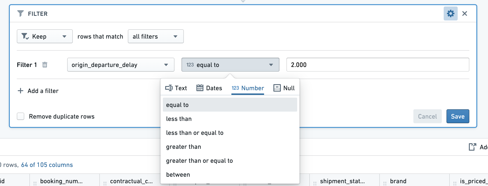
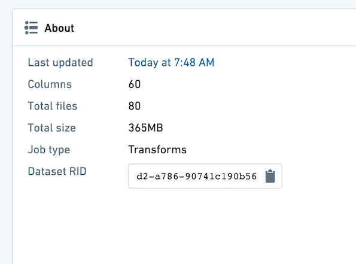
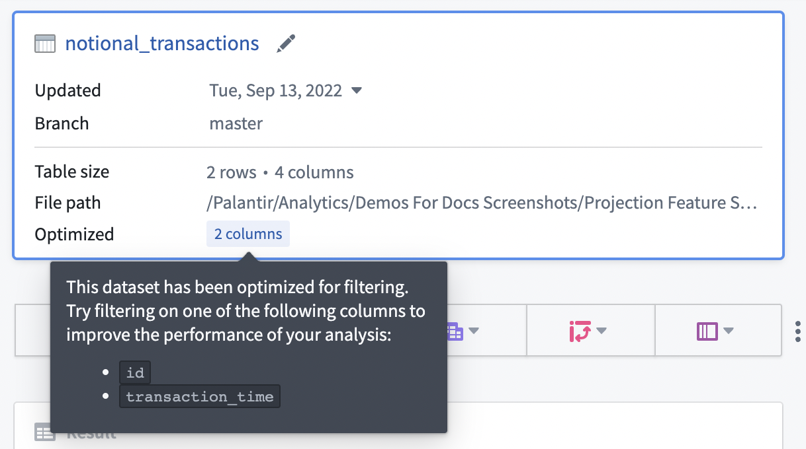

<!-- source: https://palantir.com/docs/foundry/contour/performance-optimize/ · mirrored 2026-08-26 from Palantir Foundry docs -->

# Optimizing your analysis

Follow the suggestions below to improve the performance of your Contour Analysis and Dashboard.

***

## Structuring your analysis

### Minimizing duplicated logic

Should your analysis contain multiple paths applying largely duplicated logic to compute multiple outputs (e.g. applying the same filtering criteria across multiple paths, with only the final few paths used to compute a new metric), minimize the duplication of these paths. Instead, use a **common input path** and use that path’s result as an input for other paths.

### Joining

**Filter datasets as much as possible prior to joining**. You can filter a dataset prior to joining by opening it in a new Contour path, adding filter conditions, and then joining to the result of that path instead of the dataset. This can lead to significant performance improvements.

### Joining on multiple conditions with "any match"

Multi-condition joins with "any match" are particularly resource-intensive in Spark because of the distributed fashion of the data. Make sure to reduce the scale as much as possible before the operation, such as by pushing filters upstream. A multi-condition join can often be avoided by designing the analysis differently, for example by applying multiple separate joins and unioning the results.

### Saving as a dataset

If the output of a board or series of boards is used by multiple downstream boards (in the same path or in different paths), then it can be very beneficial to **save the output as a Foundry dataset** and  start all downstream computations from this newly saved dataset. This is especially true if the output involves complicated calculations (e.g. join, pivot table, or regex filter).

### Using parameters

If a user changes the value of a parameter, all boards in your analysis will be recalculated. Imagine an analysis that has a starting dataset, many computations not using parameters, and then a filter using a parameter. If possible, save the output as a dataset after the computations not using parameters. This will ensure that recomputing charts and graphs in reports are quickly refreshed for new parameter entries.

### Frontend performance

To ensure loading your analysis is quick and responsive, we recommend no more than 15 - 20 paths per analysis. Break out your analysis into multiple analyses if you go beyond this limit.

***

## Using filters

### Use specific filters as much as possible

When applying filters, enable case sensitivity, bias towards "exact match" filters rather than "contains", or make the underlying data either all uppercase or all lowercase. In particular, use of regular expressions is computationally expensive.

For example, you might improve performance by ensuring that datasets are either all lowercase or all uppercase (to enable case sensitive filtering) and that the filtering criteria are as precise as possible and use an exact match (e.g. `is` instead of `contains` for text).



### Apply the correct filters for the column types

Make sure the right type of filter is used for the type of column.

For example, when applying a filter for an exact number in an `integer`, `long`, or `double` type column, using a “Number equal to” filter will be significantly faster than a “String exact match” filter.



***

## Input datasets

### Partitioning

Make sure the datasets used in your Contour analysis are well partitioned. The average file size of the files within a dataset should be at least 128 MB. You can see the number of files and size of your dataset by opening the dataset and choosing the "About" tab.

In the example below, there are 80 files, and the dataset is 365 MB. This is poorly partitioned, as there should be at most three files.



If you find your input dataset is poorly partitioned, you can partition it in an upstream transform.

To partition an upstream Python transform, add this line of code:

```
# Repartition – df.repartition(num_output_partitions)
df = df.repartition(3)
```

For more information on Partitioning and its effects in Spark, review the [Spark optimization concepts](/docs/foundry/optimizing-pipelines/spark-concepts/).

### Projections

Dataset owners can [configure projections](/docs/foundry/optimizing-pipelines/projections-overview/) on their datasets to improve the performance of various types of queries.

If your input dataset has projections configured, the projections will be listed under the **Optimized** section in the starting board, as shown below. You can take advantage of the projections by configuring an exact-match filter on one of the listed columns. Contour currently only exposes information about filter-optimized projections where the projection includes all columns of the input dataset.



In general, we recommend configuring projections on datasets with predictable query patterns to improve performance in Contour. As a means to reduce compute usage, we recommend setting up projections only when a dataset is used often (i.e. 10-100 reads of a specific pattern per write). Building and storing projections requires additional computation each time a dataset is written, so savings are realized only when that computation is consistently leveraged downstream.

***

## Maintaining and sharing your analysis

All optimizations mentioned above will be especially important if your Contour analysis is consumed by a large audience.

### Scheduling builds

When setting schedules for datasets built in Contour, plan adequately for the frequency. After setting the schedule, monitor builds to make sure that the schedules are surfacing data at the frequency you need without consuming resources by building unnecessarily. For example, if a dataset built in Contour takes in a dataset that is updated daily, it is unnecessary for the dataset to be built every hour.

### Limiting parameters

If your Contour analysis is consumed in a Report by a large audience, it is best to limit the number of parameters to the minimum amount.

An ideal report widget performs some filtering based on the parameter values that the user enters and then an aggregation to show a relevant visualization to the user. Ideally, all other complicated logic (joins and pivots) is precomputed in a dataset in Foundry so each parameter change does not require recomputation.
