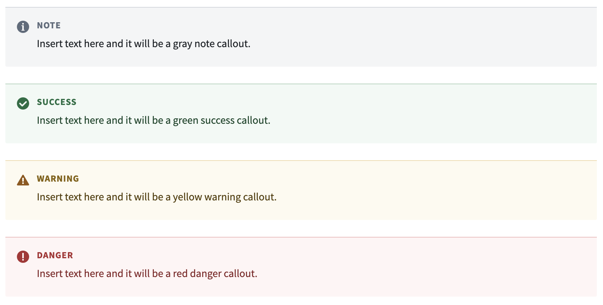
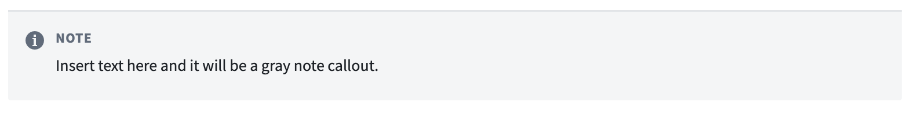
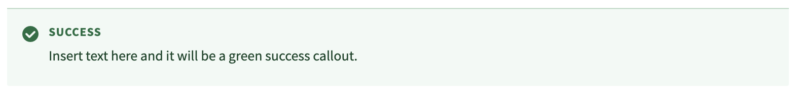
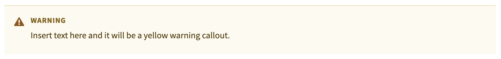
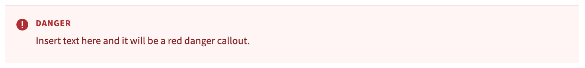

<!-- source: https://palantir.com/docs/foundry/custom-docs/add-callouts/ · mirrored 2026-08-14 from Palantir Foundry docs -->

# Callouts in custom documentation

The in-platform custom docs allow the use of HTML to create callouts. There are four available callouts that display information in gray, green, yellow, or red, respectively. Note that Markdown formatting is not available between the `<div>` and `</div>` in the callout; for example, to bold text within a callout you should use the HTML syntax `<strong>This is bold text.</strong>` rather than the Markdown syntax `**This is bold text.**`



## Gray note callout

This is the default callout style.

```
<div class="pt-callout">
    <h5 class="pt-callout-title">Note</h5>
    Insert text here and it will be a gray note callout.
</div>
```



## Green success callout

This callout is used to give tips, recommendations, and other positive information to the reader.

```
<div class="pt-callout pt-intent-success">
    <h5 class="pt-callout-title">Success</h5>
    Insert text here and it will be a green success callout.
</div>
```



## Yellow warning callout

This callout is used to draw the reader's attention to important information that could impact a workflow.

```
<div class="pt-callout pt-intent-warning">
    <h5 class="pt-callout-title">Warning</h5>
    Insert text here and it will be a yellow warning callout.
</div>
```



## Red danger callout

This callout is used to indicate an irreversible action or a breaking behavior (such as an action that could lead to data loss or workflow failure).

```
<div class="pt-callout pt-intent-danger">
    <h5 class="pt-callout-title">Danger</h5>
    Insert text here and it will be a red danger callout.
</div>
```


