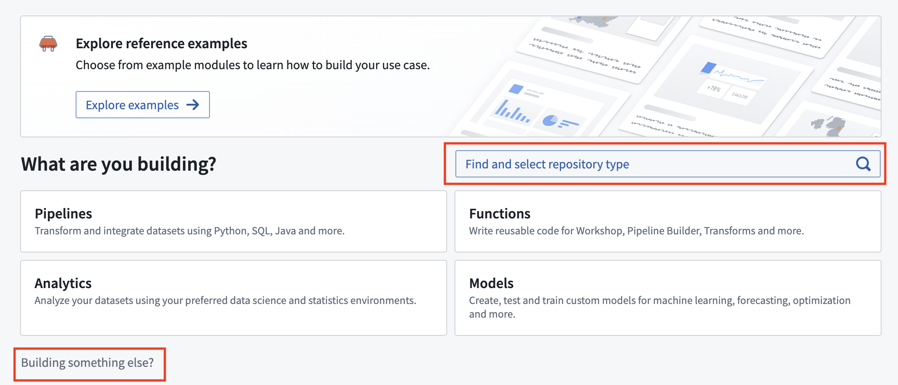

<!-- source: https://palantir.com/docs/foundry/custom-docs/create-custom-docs-repository/ · mirrored 2026-08-14 from Palantir Foundry docs -->

# Create custom documentation repository

There are two main steps in setting up a new custom documentation repository:

* [Create a new custom documentation repository](#create-a-new-custom-documentation-repository)
* [Allowlist a custom documentation repository](#allowlist-a-custom-documentation-repository)

### Create a new custom documentation repository

Custom documentation can be created and published from the [Code Repositories](/docs/foundry/code-repositories/overview/) application. First, you will need to create a repository using the **Documentation** template.

In the location where you would like to store your documentation repository, select **New** and choose **Code repository**. Then, use either the **Find and select repository type** search bar or the **Building something else?** wizard to initialize a new **Documentation** type code repository.

You will be able to specify the name of the documentation repository as well as its location. Note that since documentation repositories are Compass resources, the location in which you save the repository will [determine user access to the documentation](/docs/foundry/custom-docs/custom-docs-permissions/).

### Allowlist a custom documentation repository

For a custom documentation repository to be publishable, the repository must be allowlisted so that the documentation service can discover and publish the docs. To allowlist a documentation repository for publication, go to **Control Panel > Documentation > Custom documentation** and toggle on the **Configure which code repositories can publish documentation** setting for your repository.

Note that if you have just created a new documentation repository, the first commit will fail checks with a `PERMISSION_DENIED` error. This is because checks run automatically after creation and the repository must be allowlisted for checks to pass, but a repository cannot be allowlisted before it has been created. Once allowlisted, re-triggering the checks will publish the documentation successfully.
